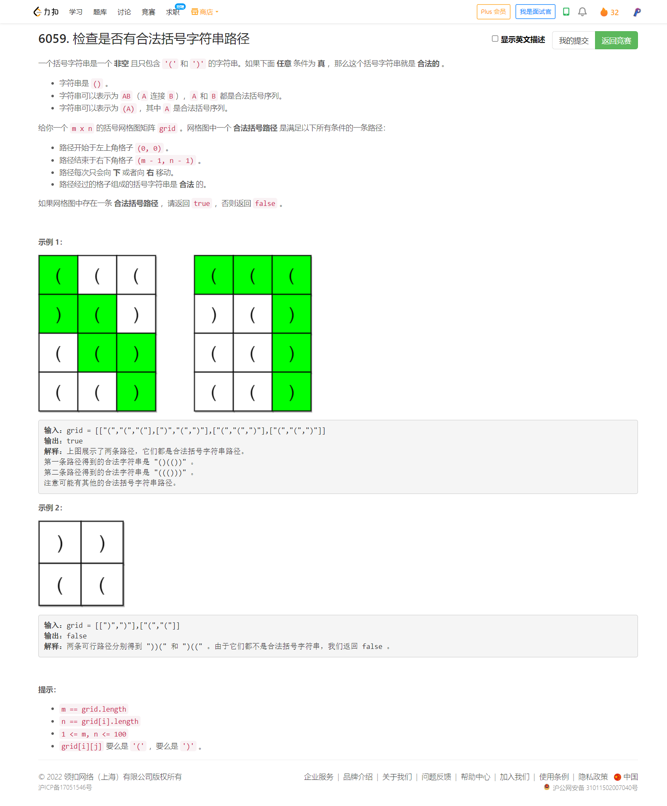

<!-- @import "[TOC]" {cmd="toc" depthFrom=1 depthTo=6 orderedList=false} -->

<!-- code_chunk_output -->

- [6059. 检查是否有合法括号字符串路径（dfs增加一个维度为了更好地剪枝）](#6059-检查是否有合法括号字符串路径dfs增加一个维度为了更好地剪枝)

<!-- /code_chunk_output -->

又是掉分之旅。 T3 线性 DP 实在不应该啊，做了好半天！ T4 写 dfs 超时了，但是我觉得不亏，因为确实还没有想到把状态也作为一个维度来剪枝。

### 6059. 检查是否有合法括号字符串路径（dfs增加一个维度为了更好地剪枝）



参考[灵佬](https://leetcode-cn.com/problems/check-if-there-is-a-valid-parentheses-string-path/solution/tian-jia-zhuang-tai-hou-dfscpythonjavago-f287/)。

把进入格子前的 $c$ 值当作格子的附加状态，那么一个格子至多有 $m+n$ 种不同的状态，整个网格图至多有 $mn(m+n)$ 个不同的状态。

```cpp
class Solution {
public:
    bool hasValidPath(vector<vector<char>> &grid) {
        int m = grid.size(), n = grid[0].size();
        if ((m + n) % 2 == 0 || grid[0][0] == ')' || grid[m - 1][n - 1] == '(') return false; // 剪枝
        bool vis[m][n][m + n]; memset(vis, 0, sizeof(vis));
        function<bool(int, int, int)> dfs = [&](int x, int y, int c) -> bool {
            if (c > m - x + n - y - 1) return false; // 剪枝：即使后面都是 ')' 也不能将 c 减为 0
            if (x == m - 1 && y == n - 1) return c == 1; // 终点一定是 ')'
            if (vis[x][y][c]) return false; // 重复访问
            vis[x][y][c] = true;
            c += grid[x][y] == '(' ? 1 : -1;
            return c >= 0 && (x < m - 1 && dfs(x + 1, y, c) || y < n - 1 && dfs(x, y + 1, c)); // 往下或者往右
        };
        return dfs(0, 0, 0);
    }
};
```
