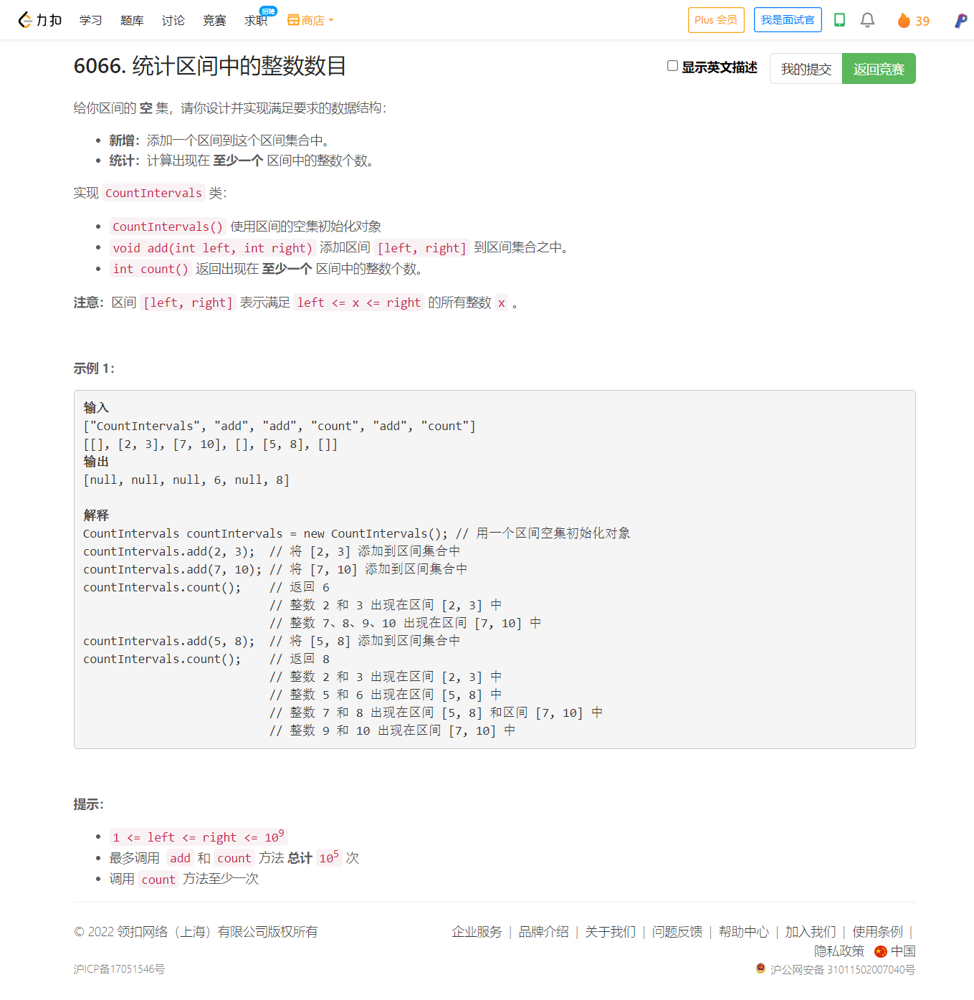

<!-- @import "[TOC]" {cmd="toc" depthFrom=1 depthTo=6 orderedList=false} -->

<!-- code_chunk_output -->

- [6066. 统计区间中的整数数目（动态开点线段树/set求区间并集/珂朵莉树/红黑树）](#6066-统计区间中的整数数目动态开点线段树set求区间并集珂朵莉树红黑树)

<!-- /code_chunk_output -->

T1 开始时想复杂了，实际上一分钟就能写完。最后犹豫了很久 T4 才来写的 T1 。不应该。这次掉大分。

T4 就算你告诉我是线段树我也不会写，因为没见过、想不到 1e9 的大长区间该如何处理。应该也可以用区间合并做。

前三题可以飞快做出来，进前 500 本来不是问题。都怪第一题非要写 struct 搞重载。看了高手的代码，第一题涨了不少经验， T2 T3 我的做法都是最优的。

### 6066. 统计区间中的整数数目（动态开点线段树/set求区间并集/珂朵莉树/红黑树）



这里用两种方法，先是 set 求区间并集（要点是 `pair<int, int>` 把右节点存在第一个 `int` 上）。

下面是我自己写的。

```cpp
#define fi first
#define se second
class CountIntervals {
    // 注意存的是 {右端点, 做端点}
    set<pair<int, int>> RL;
    int cnt;
public:
    CountIntervals() {
        cnt = 0;
    }
    
    void add(int left, int right) {
        // 找最左边的，第一个和 l, r （可能）有交集的区间
        auto it = RL.lower_bound({left, 0});
        // 有这么个区间，并且区间的左端点还是在 l, r 中的
        // 那么删除这个区间
        while (it != RL.end() && it->se <= right)
        {
            cnt -= it->fi - it->se + 1;
            left = min(left, it->se);
            right = max(right, it->fi);
            it = RL.erase(it);
        }
        // 把合并好的新区合并起来
        RL.insert({right, left});
        cnt += right - left + 1;
    }
    
    int count() {
        return cnt;
    }
};

/**
 * Your CountIntervals object will be instantiated and called as such:
 * CountIntervals* obj = new CountIntervals();
 * obj->add(left,right);
 * int param_2 = obj->count();
 */
```

灵佬管这种方法叫[珂朵莉树（实际上是对红黑树的应用）](https://leetcode.cn/problems/count-integers-in-intervals/solution/by-endlesscheng-clk2/)，代码如下。

```cpp
class CountIntervals {
    map<int, int> m;
    int cnt = 0;

public:
    CountIntervals() {}

    void add(int left, int right) {
        // 遍历所有被 [left,right] 覆盖到的区间（部分覆盖也算）
        for (auto it = m.lower_bound(left); it != m.end() && it->second <= right; m.erase(it++)) {
            int l = it->second, r = it->first;
            left = min(left, l);   // 合并后的新区间，其左端点为所有被覆盖的区间的左端点的最小值
            right = max(right, r); // 合并后的新区间，其右端点为所有被覆盖的区间的右端点的最大值
            cnt -= r - l + 1;
        }
        cnt += right - left + 1;
        m[right] = left; // 所有被覆盖到的区间与 [left,right] 合并成一个新区间
    }

    int count() { return cnt; }
};
```

```go
type CountIntervals struct {
	*redblacktree.Tree
	cnt int
}

func Constructor() CountIntervals {
	return CountIntervals{redblacktree.NewWithIntComparator(), 0}
}

func (t *CountIntervals) Add(left, right int) {
	// 遍历所有被 [left,right] 覆盖到的区间（部分覆盖也算）
	for node, _ := t.Ceiling(left); node != nil && node.Value.(int) <= right; node, _ = t.Ceiling(left) {
		l, r := node.Value.(int), node.Key.(int)
		if l < left { left = l }   // 合并后的新区间，其左端点为所有被覆盖的区间的左端点的最小值
		if r > right { right = r } // 合并后的新区间，其右端点为所有被覆盖的区间的右端点的最大值
		t.cnt -= r - l + 1
		t.Remove(r)
	}
	t.cnt += right - left + 1
	t.Put(right, left) // 所有被覆盖到的区间与 [left,right] 合并成一个新区间
}

func (t *CountIntervals) Count() int { return t.cnt }
```

```java
class CountIntervals {
    TreeMap<Integer, Integer> m = new TreeMap<>();
    int cnt;

    public CountIntervals() {}

    public void add(int left, int right) {
        // 遍历所有被 [left,right] 覆盖到的区间（部分覆盖也算）
        for (var e = m.ceilingEntry(left); e != null && e.getValue() <= right; e = m.ceilingEntry(left)) {
            int l = e.getValue(), r = e.getKey();
            left = Math.min(left, l);   // 合并后的新区间，其左端点为所有被覆盖的区间的左端点的最小值
            right = Math.max(right, r); // 合并后的新区间，其右端点为所有被覆盖的区间的右端点的最大值
            cnt -= r - l + 1;
            m.remove(r);
        }
        cnt += right - left + 1;
        m.put(right, left); // 所有被覆盖到的区间与 [left,right] 合并成一个新区间
    }

    public int count() { return cnt; }
}
```

```python
from sortedcontainers import SortedDict

class CountIntervals:
    def __init__(self):
        self.d = SortedDict()
        self.cnt = 0

    def add(self, left: int, right: int) -> None:
        # 遍历所有被 [left,right] 覆盖到的区间（部分覆盖也算）
        i = self.d.bisect_left(left)
        while i < len(self.d) and self.d.values()[i] <= right:
            r, l = self.d.items()[i]
            left = min(left, l)    # 合并后的新区间，其左端点为所有被覆盖的区间的左端点的最小值
            right = max(right, r)  # 合并后的新区间，其右端点为所有被覆盖的区间的右端点的最大值
            self.cnt -= r - l + 1
            self.d.popitem(i)
        self.cnt += right - left + 1
        self.d[right] = left  # 所有被覆盖到的区间与 [left,right] 合并成一个新区间

    def count(self) -> int:
        return self.cnt
```

关于动态开点线段树，我自己写得如下。

```cpp
class CountIntervals {
public:
    static const int MAX=1e6;
    int idx  = 0;
    int root = 0;  // 0 代表当前点不存在
    struct node {
        int lnode = 0;
        int rnode = 0;
        int cnt   = 0;
        int mark  = 0;  // 标记一下是否合法
    };
    vector<node> N;

    void update(int &root, int l, int r, int L, int R)
    {
        if (N[root].mark == 1) return ;  // 相关区间已经覆盖过（并没有明显提速）
        if (!root)
            root = ++ idx;
        if (l >= L && r <= R)
        {
            N[root].mark = 1;
            N[root].cnt = r - l + 1;
            return ;
        }
        int mid = l + r >> 1;
        if (mid >= L)
            update(N[root].lnode, l, mid, L, R);
        if (mid < R)
            update(N[root].rnode, mid + 1, r, L, R);
        // pushup
        if (N[root].mark == 0)
            N[root].cnt = N[N[root].lnode].cnt + N[N[root].rnode].cnt;
    }

    CountIntervals() {
        N = vector<node>(MAX);
    }

    void add(int left, int right) {
        update(root, 1, 1e9, left, right);
    }

    int count() {
        return N[root].cnt;
    }
};

/**
 * Your CountIntervals object will be instantiated and called as such:
 * CountIntervals* obj = new CountIntervals();
 * obj->add(left,right);
 * int param_2 = obj->count();
 */
```

灵佬代码如下。

```cpp
class CountIntervals {
    CountIntervals *left = nullptr, *right = nullptr;
    int l, r, cnt = 0;

public:
    CountIntervals() : l(1), r(1e9) {}

    CountIntervals(int l, int r) : l(l), r(r) {}

    void add(int L, int R) { // 为方便区分变量名，将递归中始终不变的入参改为大写（视作常量）
        if (cnt == r - l + 1) return; // 当前节点已被完整覆盖，无需执行任何操作
        if (L <= l && r <= R) { // 当前节点已被区间 [L,R] 完整覆盖，不再继续递归
            cnt = r - l + 1;
            return;
        }
        int mid = (l + r) / 2;
        if (left == nullptr) left = new CountIntervals(l, mid); // 动态开点
        if (right == nullptr) right = new CountIntervals(mid + 1, r); // 动态开点
        if (L <= mid) left->add(L, R);
        if (mid < R) right->add(L, R);
        cnt = left->cnt + right->cnt;
    }

    int count() { return cnt; }
};
```

Go 代码学习如下。

```go
type CountIntervals struct {
	left, right *CountIntervals
	l, r, cnt   int
}

func Constructor() CountIntervals { return CountIntervals{l: 1, r: 1e9} }

func (o *CountIntervals) Add(l, r int) {
	if o.cnt == o.r-o.l+1 { return } // o 已被完整覆盖，无需执行任何操作
	if l <= o.l && o.r <= r { // 当前节点已被区间 [l,r] 完整覆盖，不再继续递归
		o.cnt = o.r - o.l + 1
		return
	}
	mid := (o.l + o.r) >> 1
	if o.left == nil { o.left = &CountIntervals{l: o.l, r: mid} } // 动态开点
	if o.right == nil { o.right = &CountIntervals{l: mid + 1, r: o.r} } // 动态开点
	if l <= mid { o.left.Add(l, r)}
	if mid < r { o.right.Add(l, r) }
	o.cnt = o.left.cnt + o.right.cnt
}

func (o *CountIntervals) Count() int { return o.cnt }
```
