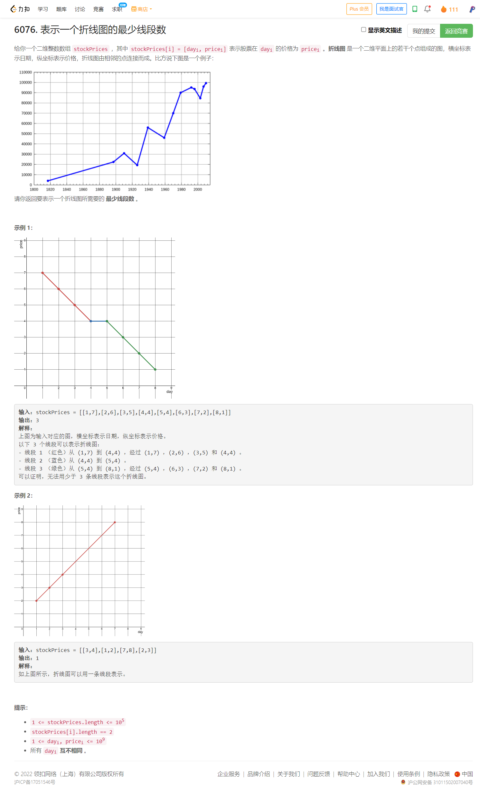
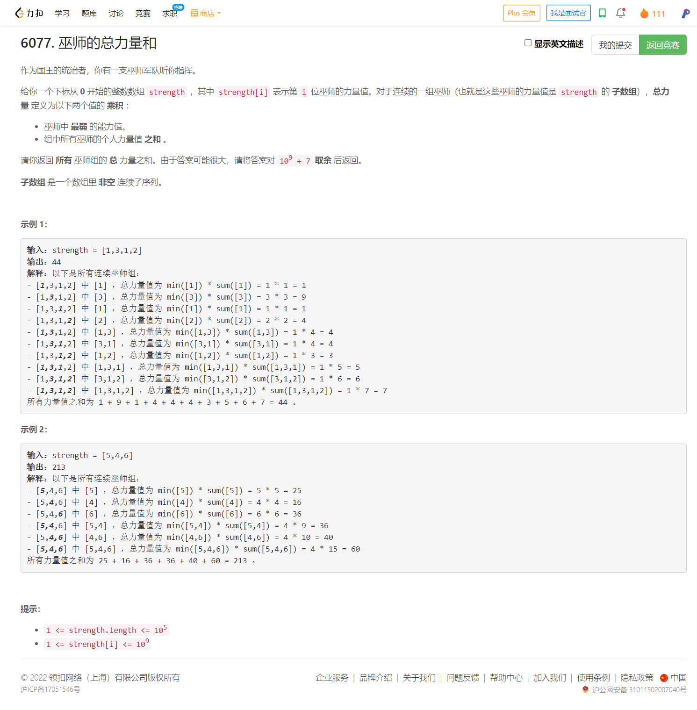

<!-- @import "[TOC]" {cmd="toc" depthFrom=1 depthTo=6 orderedList=false} -->

<!-- code_chunk_output -->

- [6076. 表示一个折线图的最少线段数（数学判断三点共线不要用除法，乘法dx1 × dy2 == dx2 × dy1）](#6076-表示一个折线图的最少线段数数学判断三点共线不要用除法乘法dx1-dy2-dx2-dy1)
- [6077. 巫师的总力量和（单调栈+子区间前缀和的前缀和+子区间的和）](#6077-巫师的总力量和单调栈子区间前缀和的前缀和子区间的和)

<!-- /code_chunk_output -->

没参加。第三题灵佬有一个好思路，判断三点共线不要用除法，而是乘法（`dx * predy == dy * predx`）。

### 6076. 表示一个折线图的最少线段数（数学判断三点共线不要用除法，乘法dx1 × dy2 == dx2 × dy1）



```cpp
class Solution {
public:
    int minimumLines(vector<vector<int>>& stockPrices) {
        sort(stockPrices.begin(), stockPrices.end());  // vector 自带 <
        int ans = 0;
        for (int i = 1, predx = 0, predy = 1; i < stockPrices.size(); ++ i)
        {
            long long dy = stockPrices[i][1] - stockPrices[i - 1][1];
            long long dx = stockPrices[i][0] - stockPrices[i - 1][0];
            if (dx * predy != dy * predx)
                ++ ans;
            predy = dy;
            predx = dx;
        }
        return ans;
    }
};
```

### 6077. 巫师的总力量和（单调栈+子区间前缀和的前缀和+子区间的和）



看灵佬的[B站](https://www.bilibili.com/video/BV1RY4y157nW)，分析的太狠了。

我先说说我为什么想不出来。

一个很直接的思路是，考察所有区间的最弱巫师是谁。但是这样的问题就是所有区间的数量级是 $O(n^2)$ ，更别提为每个区间找最弱巫师了。到这里，我就想不出来了。

实际上，可以逆向思考，考察每个巫师，发现这个巫师可以作为哪一段区间的最弱巫师。发现在某一段区间中的子区间都是属于这个巫师的。因此，对于每个巫师，我们需要找到他左右两边离他最近的弱于他的巫师位置。 **因此可以想到单调栈预处理。**

至于如何求出一段区间中包含的 `i` 子区间的和，思路概括一下就是：对于一段区间 `[L, R]` ， **我们计算其所有子区间的和，那么可以先定住一个点，然后移动另一个点，如下。**

```
[L x x x i x x x R]
 |<- l ->|       r
 |<- l ->|      r
 ...
 |<- l ->|r
```

参考[灵佬](https://leetcode.cn/problems/sum-of-total-strength-of-wizards/solution/dan-diao-zhan-qian-zhui-he-de-qian-zhui-d9nki/)：

设子数组右端点为 $r$ ，左端点为 $l$ ，当前枚举的元素下标为 $i$ ，那么有 $l\le i \le r$。

设 $\textit{strength}$ 数组的前缀和为 $s$ ，其中 $s[i]=\sum\limits_{j=0}^{i-1} \textit{strength}[j]$ ，因此子数组 $[l,r]$ 的元素和可以表示为

$$
s[r+1]−s[l]
$$

在范围 $[L,R]$ 内的所有子数组的元素和的和可以表示为

$$
\begin{aligned} &\sum_{r=i+1}^{R+1}\sum_{l=L}^{i} s[r]-s[l] \\ =&\sum_{r=i+1}^{R+1}\left((i-L+1)\cdot s[r] - \sum_{l=L}^{i} s[l]\right) \\ =&(i-L+1)\cdot \sum_{r=i+1}^{R+1}s[r] -(R-i+1)\cdot \sum_{l=L}^{i} s[l] \end{aligned}
$$

因此我们还需要计算出前缀和 $s$ 的前缀和 $\textit{ss}$ ，其中 $\textit{ss}[i]=\sum\limits_{j=0}^{i-1}s[j]$ ，上式即为

$$
(i-L+1)\cdot (\textit{ss}[R+2]-\textit{ss}[i+1]) - (R-i+1)\cdot (\textit{ss}[i+1]-\textit{ss}[L])
$$

再乘上 $v$ 即为当前巫师的贡献，累加所有贡献即为答案。

好了，这里还有个问题，会不会计算重复的子区间？如果左右单调栈都是严格小于，如下。

```
[ 1, 3, 1, 2 ]
L            R 对于左侧1
L            R 对于右侧1
  ----------   会发现有重复
```

因此可以定一个规则，通过单调栈，找左侧严格小于自己的，找右侧小于等于自己的。

```
[ 1, 3, 1, 2 ]
L <-->  R      对于左侧1
L <-----i--> R 对于右侧1
```

灵佬代码如下。

注意，两次单调栈被合并成了一个。另外在 go 中我们不初始化数组的长度，而是逐渐往里推入元素。

```cpp
class Solution {
public:
    int totalStrength(vector<int> &strength) {
        const int mod = 1e9 + 7;

        int n = strength.size();
        vector<int> left(n, -1); // left[i] 为左侧严格小于 strength[i] 的最近元素位置（不存在时为 -1）
        vector<int> right(n, n); // right[i] 为右侧小于等于 strength[i] 的最近元素位置（不存在时为 n）
        stack<int> st;
        for (int i = 0; i < n; ++i) {
            while (!st.empty() && strength[st.top()] >= strength[i]) {
                right[st.top()] = i;
                st.pop();
            }
            if (!st.empty()) left[i] = st.top();
            st.push(i);
        }

        long s = 0L; // 前缀和
        vector<int> ss(n + 2); // 前缀和的前缀和
        for (int i = 1; i <= n; ++i) {
            s += strength[i - 1];
            ss[i + 1] = (ss[i] + s) % mod;
        }

        int ans = 0;
        for (int i = 0; i < n; ++i) {
            long l = left[i] + 1, r = right[i] - 1; // [l,r] 左闭右闭
            long tot = ((i - l + 1) * (ss[r + 2] - ss[i + 1]) - (r - i + 1) * (ss[i + 1] - ss[l])) % mod;
            ans = (ans + strength[i] * tot) % mod; // 累加贡献
        }
        return (ans + mod) % mod; // 防止算出负数（因为上面算 tot 有个减法）
    }
};
```

```go
func totalStrength(strength []int) (ans int) {
	const mod int = 1e9 + 7

	n := len(strength)
	left := make([]int, n)  // left[i] 为左侧严格小于 strength[i] 的最近元素位置（不存在时为 -1）
	right := make([]int, n) // right[i] 为右侧小于等于 strength[i] 的最近元素位置（不存在时为 n）
	for i := range right {
		right[i] = n
	}
	st := []int{}
	for i, v := range strength {
		for len(st) > 0 && strength[st[len(st)-1]] >= v {
			right[st[len(st)-1]] = i
			st = st[:len(st)-1]
		}
		if len(st) > 0 {
			left[i] = st[len(st)-1]
		} else {
			left[i] = -1
		}
		st = append(st, i)
	}

	s := 0 // 前缀和
	ss := make([]int, n+2) // 前缀和的前缀和
	for i, v := range strength {
		s += v
		ss[i+2] = (ss[i+1] + s) % mod
	}
	for i, v := range strength {
		l, r := left[i]+1, right[i]-1 // [l,r] 左闭右闭
		tot := ((i-l+1)*(ss[r+2]-ss[i+1]) - (r-i+1)*(ss[i+1]-ss[l])) % mod
		ans = (ans + v*tot) % mod // 累加贡献
	}
	return (ans + mod) % mod // 防止算出负数（因为上面算 tot 有个减法）
}
```
