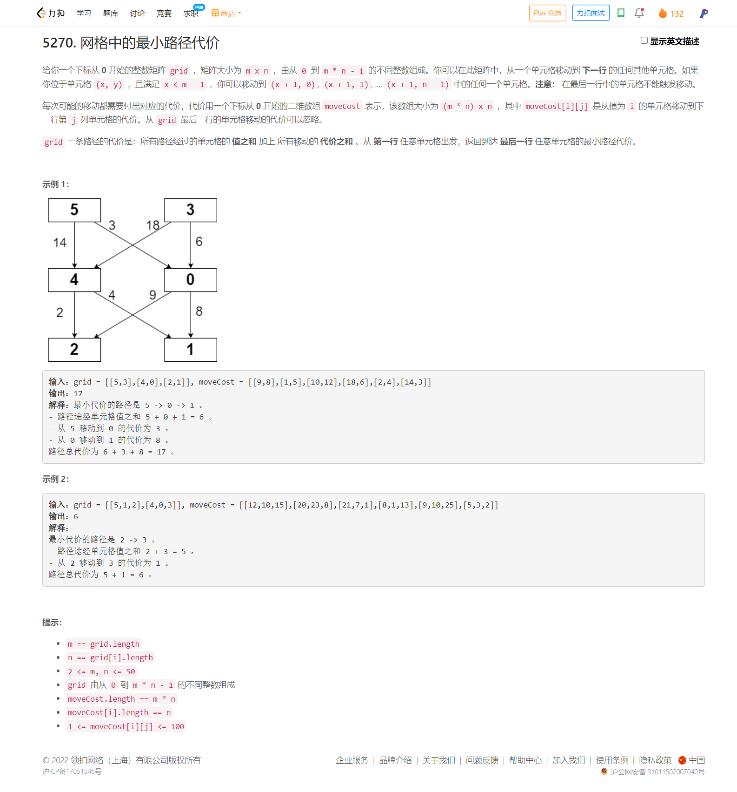
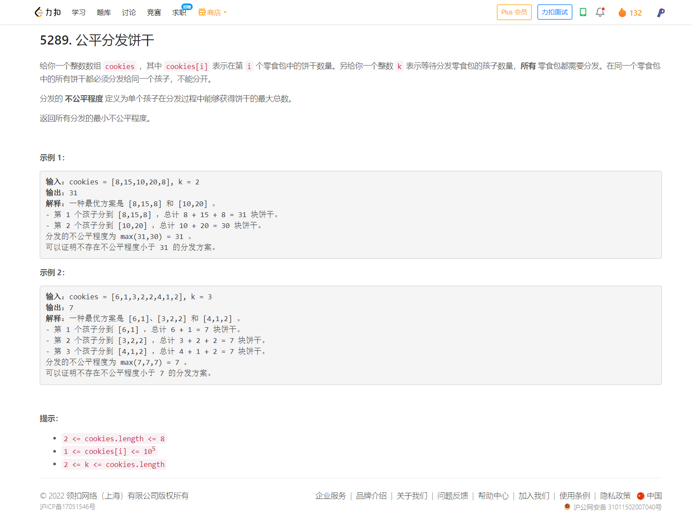
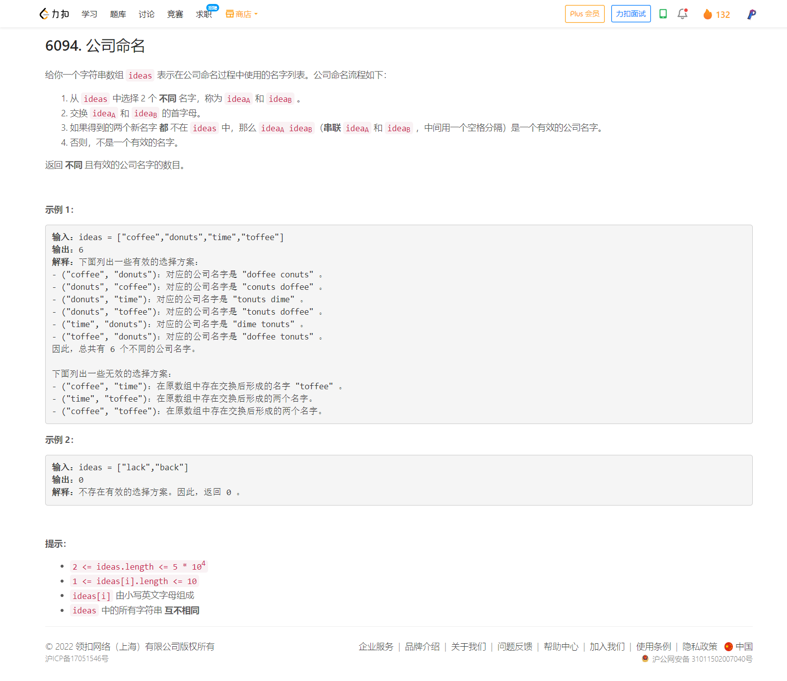

<!-- @import "[TOC]" {cmd="toc" depthFrom=1 depthTo=6 orderedList=false} -->

<!-- code_chunk_output -->

- [5270. 网格中的最小路径代价（动态规划）](#5270-网格中的最小路径代价动态规划)
- [5289. 公平分发饼干（状态压缩DP，很棒的题）](#5289-公平分发饼干状态压缩dp很棒的题)
- [6094. 公司命名（智力题）](#6094-公司命名智力题)

<!-- /code_chunk_output -->

昨晚睡了不到 5 个小时，早上急急忙忙起来家教。家教完了来打周赛。 T2 T3 看似简单但是自己也没做出来，当时也没心力去调了。 T4 想了一下试了一下无所谓了。

没什么，掉分就掉分吧。以后还会参加的。

### 5270. 网格中的最小路径代价（动态规划）



唉...以为 T2 不会涉及动态规划，暴搜怎么都能搜出来呢...

```cpp
class Solution {
public:
    int minPathCost(vector<vector<int>>& grid, vector<vector<int>>& moveCost) {
        int n = grid.size();
        int m = grid[0].size();
        vector<vector<int>> f(n, vector<int>(m, INT_MAX));
        f[0] = grid[0];
        for (int i = 1; i < n; ++ i)
        {
            for (int j = 0; j < m; ++ j)  // 下一层的 j
            {
                for (int k = 0; k < m; ++ k)  // 来自上一层的 k
                {
                    int v = grid[i - 1][k];
                    f[i][j] = min(f[i][j], f[i - 1][k] + moveCost[v][j]);
                }
                f[i][j] += grid[i][j];
            }
        }
        int ans = INT_MAX;
        for (int i = 0; i < m; ++ i) ans = min(ans, f[n - 1][i]);
        return ans;
    }
};
```

### 5289. 公平分发饼干（状态压缩DP，很棒的题）



```cpp
class Solution {
public:
    int distributeCookies(vector<int> &cookies, int k) {
        int n = cookies.size();
        vector<int> sum(1 << n);
        for (int i = 0; i < n; i++)
            for (int mask = 0, bit = 1 << i; mask < bit; ++mask)
                sum[bit | mask] = sum[mask] + cookies[i];

        vector<int> f(sum);  // f 是 sum 的拷贝
        for (int i = 1; i < k; i++) {  // f[i][j] 为 前i个孩子分配j饼干后不公平值最小值
            for (int j = (1 << n) - 1; j; j--) {  // i 在 f 中省略
                for (int s = j; s; s = (s - 1) & j) {  // s 是 j 的子集， j - s 是 i-1 孩子分配的
                    f[j] = min(f[j], max(f[j ^ s], sum[s]));
                }
            }
        }
        return f.back();
    }
};
```

### 6094. 公司命名（智力题）



```cpp
class Solution {
public:
    long long distinctNames(vector<string> &ideas) {
        unordered_map<string, int> group;
        for (auto &s : ideas)
            group[s.substr(1)] |= 1 << (s[0] - 'a');
        long ans = 0L;
        // cnt[i][j] 后缀对应的首字母没有 i 有 j 得个数
        int cnt[26][26] = {0};
        for (auto &[_, mask] : group)
            for (int i = 0; i < 26; i++)
                if ((mask >> i & 1) == 0) {
                    for (int j = 0; j < 26; j++)
                        if (mask >> j & 1) ++cnt[i][j];
                } else {
                    for (int j = 0; j < 26; j++)
                        if ((mask >> j & 1) == 0) ans += cnt[i][j];
                }
        return ans * 2;
    }
};
```

方法二如下。

```cpp
class Solution {
public:
    long long distinctNames(vector<string> &ideas) {
        unordered_set<string> group[26];
        for (auto &s : ideas)
            group[s[0] - 'a'].emplace(s.substr(1));
        long ans = 0L;
        for (int i = 1; i < 26; ++i)
            for (int j = 0; j < i; ++j) {
                int m = 0;
                for (auto &s : group[i])
                    // m 是以 i, j 交集数量
                    m += group[j].count(s);
                ans += (long) (group[i].size() - m) * (group[j].size() - m);
            }
        return ans * 2;
    }
};
```
