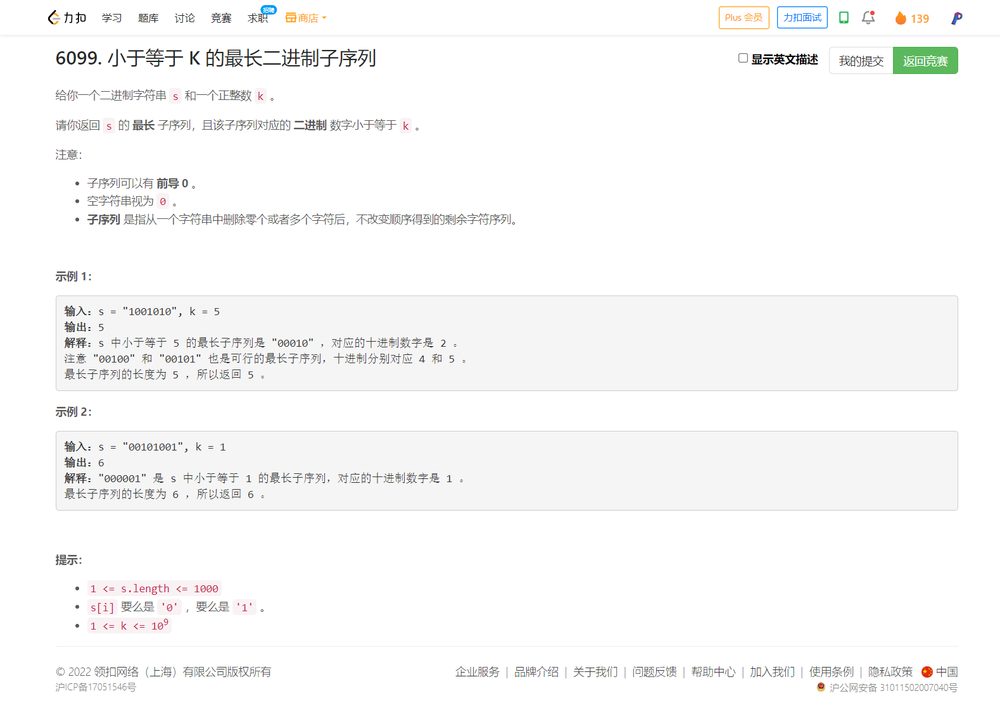

<!-- @import "[TOC]" {cmd="toc" depthFrom=1 depthTo=6 orderedList=false} -->

<!-- code_chunk_output -->

- [6099. 小于等于 K 的最长二进制子序列（贪心+分类讨论）](#6099-小于等于-k-的最长二进制子序列贪心分类讨论)

<!-- /code_chunk_output -->

昨晚也没睡好，今早状态一般。 AK 了成绩还可以， T4 很简单。 T1 T2 用时可以再短很多。 T3 觉得自己想的有点混乱， WA 了一次，少考虑了一种情况。看看灵佬怎么分析的。

### 6099. 小于等于 K 的最长二进制子序列（贪心+分类讨论）



```cpp
// 我的思路是尽可能多的把 1 放到右边
// 然后把左边的 0 拿到
class Solution {
public:
    int longestSubsequence(string s, int k) {
        int n = s.size();
        vector<int> sum(n + 1, 0);
        for (int i = 1; i <= n; ++ i) sum[i] = sum[i - 1] + (s[i - 1] == '0' ? 1 : 0);
        string nk;
        while (k)
        {
            if (k & 1) nk += '1';
            else nk += '0';
            k = k >> 1;
        }
        reverse(nk.begin(), nk.end());
        int m = nk.size();
        if (n < m) return n;
        int res = sum[n];
        for (int i = n - m + 1; i < n; ++ i)
            res = max(res, sum[i] + n - i);
        
        for (int i = n - m; i >= 0; -- i)
        {
            if (s.substr(i, m) <= nk)
                res = max(res, m + sum[i]);
        }
        return res;
    }
};
```

灵佬的思路也差不多。

```cpp
class Solution {
public:
    int longestSubsequence(string s, int k) {
        int n = s.length(), m = 32 - __builtin_clz(k);
        if (n < m) return n;
        // stoi(字符串, 起始位置, n进制)
        // 找后缀，最大程度利用左边的 0
        int ans = stoi(s.substr(n - m), nullptr, 2) <= k ? m : m - 1;
        return ans + count(s.begin(), s.end() - m, '0');
    }
};
```

**经验：**
- C++ 中 `stoi(字符串, 起始位置, n进制)` ，比如 `stoi("101", nullptr, 2)` 返回 `5`
