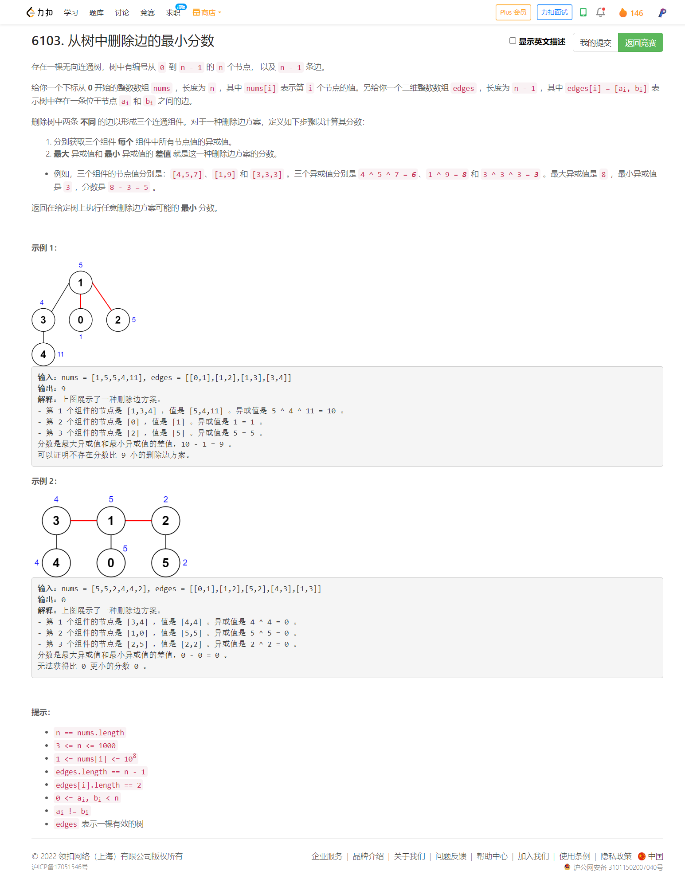

<!-- @import "[TOC]" {cmd="toc" depthFrom=1 depthTo=6 orderedList=false} -->

<!-- code_chunk_output -->

- [6103. 从树中删除边的最小分数（树dfs+异或运算性质）](#6103-从树中删除边的最小分数树dfs异或运算性质)

<!-- /code_chunk_output -->

T2 T3 我都用了动态规划。 T3 有处思想有点类似昨晚的 Acwing T3 。

T4 几乎从一开始就做对了，但是存在两处小小的笔误，让自己 WA 了一次，还 debug 好久（ `^` 写成 `|` ， 写成了 `sons[j].count[j]` ）。非常可惜！要是笔误少点进前 100 也不是梦！

### 6103. 从树中删除边的最小分数（树dfs+异或运算性质）



首先因为节点数量是 1000 ，所以我们这里可以枚举两条边，这也才 1000 的平方个时间复杂度。那接下来就是：怎么快速求出三个部分的异或值呢？

这就要分情况讨论，如果 i 节点对应的树是 j 节点的子树。那么 j 节点所在的连通块的“和”就是 j 节点的子树的“和”再异或上 i 节点的子树的“和”。

这里引用了异或运算的性质：
- 结合律 `a ^ b ^ c = a ^ (b ^ c)` 所以我们可以用 dfs 求出各个子树的异或值后，再来求父树的异或值
- 还有一个我也不知道怎么称呼，就是 `A = a ^ b ^ c` ，你想求 `a ^ b` 只需要 `A ^ c` 就行了

另外还有一点，我记得是在 Acwing 哪道题目中长的经验：我们可以选择树中的任何一个节点作为根节点。

```cpp
class Solution {
public:
    int minimumScore(vector<int>& nums, vector<vector<int>>& edges) {
        int n = nums.size();
        vector<vector<int>> g(n);
        for (auto&& edge: edges)
        {
            g[edge[0]].push_back(edge[1]);
            g[edge[1]].push_back(edge[0]);
        }
        int vis[n], sum[n];
        vector<set<int>> sons(n);
        memset(vis, 0, sizeof vis);
        function<int(int)> dfs = [&](int x) -> int {
            sum[x] = nums[x];
            vis[x] = 1;
            for (auto&& v: g[x])
            {
                if (vis[v]) continue;
                sons[x].insert(v);
                sum[x] ^= dfs(v);
                for (auto&& son: sons[v])
                    sons[x].insert(son);
            }
            return sum[x];
        };
        dfs(0);

        int res = INT_MAX;
        for (int i = 1; i < n; ++ i)
            for (int j = i + 1; j < n; ++ j)
            {
                int a, b, c;
                if (sons[i].count(j))
                {
                    a = sum[0] ^ sum[i];
                    b = sum[i] ^ sum[j];
                    c = sum[j];
                }
                else if (sons[j].count(i))
                {
                    a = sum[0] ^ sum[j];
                    b = sum[j] ^ sum[i];
                    c = sum[i];
                }
                else
                {
                    a = sum[0] ^ sum[i] ^ sum[j];
                    b = sum[i];
                    c = sum[j];
                }
                int maxv = max({a, b, c});
                int minv = min({a, b, c});
                res = min(res, maxv - minv);
                // cout << i << " " << sum[i] << " " << j << " " << sum[j] << " " << a << endl;
                // cout << maxv << " " << minv << endl;
                // cout << res << endl;
            }
        
        return res;
    }
};
/*
1 ^ 2 ^ 3 = 1 ^ 10 ^ 11 = 00
1 ^ 2 = 11
*/
```
