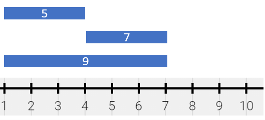
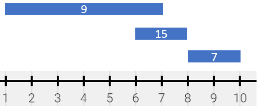
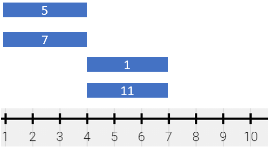

<!-- @import "[TOC]" {cmd="toc" depthFrom=1 depthTo=6 orderedList=false} -->

<!-- code_chunk_output -->

- [检查是否所有字符出现次数相同](#检查是否所有字符出现次数相同)
- [最小未被占据椅子的编号（仿真模拟，细心！）](#最小未被占据椅子的编号仿真模拟细心)
- [描述绘画结果（有序字典map）](#描述绘画结果有序字典map)
- [队列中可以看到的人数（单调栈）](#队列中可以看到的人数单调栈)

<!-- /code_chunk_output -->

### 检查是否所有字符出现次数相同

给你一个字符串 s ，如果 s 是一个 好 字符串，请你返回 true ，否则请返回 false 。

如果 s 中出现过的 所有 字符的出现次数 相同 ，那么我们称字符串 s 是 好 字符串。

示例 1：

```
输入：s = "abacbc"
输出：true
解释：s 中出现过的字符为 'a'，'b' 和 'c' 。s 中所有字符均出现 2 次。
```

示例 2：

```
输入：s = "aaabb"
输出：false
解释：s 中出现过的字符为 'a' 和 'b' 。
'a' 出现了 3 次，'b' 出现了 2 次，两者出现次数不同。
```

提示：
- 1 <= s.length <= 1000
- s 只包含小写英文字母。

```cpp
class Solution {
public:
    bool areOccurrencesEqual(string s) {
        unordered_map<int, int> S;
        for (auto c: s)
        {
            if (!S.count(c - 'a'))
                S[c - 'a'] = 0;
            else
                S[c - 'a'] += 1;
        }
        int a = 0;
        for (int i = 0; i < 26; ++ i)
        {
            if (S.count(i) && a != 0)
            {
                if (S[i] != a)
                    return false;
            }
            if (S.count(i) && a == 0)
                a = S[i];
        }
        return true;
    }
};
```

### 最小未被占据椅子的编号（仿真模拟，细心！）

有 n 个朋友在举办一个派对，这些朋友从 0 到 n - 1 编号。派对里有 无数 张椅子，编号为 0 到 infinity 。当一个朋友到达派对时，他会占据 编号最小 且未被占据的椅子。

比方说，当一个朋友到达时，如果椅子 0 ，1 和 5 被占据了，那么他会占据 2 号椅子。

当一个朋友离开派对时，他的椅子会立刻变成未占据状态。如果同一时刻有另一个朋友到达，可以立即占据这张椅子。

给你一个下标从 0 开始的二维整数数组 `times` ，其中 `times[i] = [arrivali, leavingi]` 表示第 i 个朋友到达和离开的时刻，同时给你一个整数 targetFriend 。所有到达时间 互不相同 。

请你返回编号为 targetFriend 的朋友占据的 椅子编号 。

示例 1：

```
输入：times = [[1,4],[2,3],[4,6]], targetFriend = 1
输出：1
解释：
- 朋友 0 时刻 1 到达，占据椅子 0 。
- 朋友 1 时刻 2 到达，占据椅子 1 。
- 朋友 1 时刻 3 离开，椅子 1 变成未占据。
- 朋友 0 时刻 4 离开，椅子 0 变成未占据。
- 朋友 2 时刻 4 到达，占据椅子 0 。
朋友 1 占据椅子 1 ，所以返回 1 。
```

示例 2：

```
输入：times = [[3,10],[1,5],[2,6]], targetFriend = 0
输出：2
解释：
- 朋友 1 时刻 1 到达，占据椅子 0 。
- 朋友 2 时刻 2 到达，占据椅子 1 。
- 朋友 0 时刻 3 到达，占据椅子 2 。
- 朋友 1 时刻 5 离开，椅子 0 变成未占据。
- 朋友 2 时刻 6 离开，椅子 1 变成未占据。
- 朋友 0 时刻 10 离开，椅子 2 变成未占据。
朋友 0 占据椅子 2 ，所以返回 2 。
```

提示：

- n == times.length
- $2 <= n <= 10^4$
- times[i].length == 2
- $1 <= arrival_i < leaving_i <= 10^5$
- 0 <= targetFriend <= n - 1
- 每个 $arrival_i$ 时刻 互不相同 。

```cpp
typedef pair<int, int> PII;

struct cmp
{
    template<typename T, typename U>
    bool operator()(T const& left, U const& right)
    {
        return (left.first > right.second);
    }
};

class Solution {
public:
    int smallestChair(vector<vector<int>>& times, int targetFriend) {
        int n = times.size();
        vector<int> index(n, 0);
        for (int i = 0; i != index.size(); ++ i)
        {
            index[i] = i;
        }
        sort(index.begin(), index.end(),
            [&](const int& a, const int& b)
             {
                 return (times[a][0] < times[b][0]);
             }
         );

        priority_queue<PII, vector<PII>, cmp > heap;   // {离开时间，椅子}
        priority_queue<int, vector<int>, greater<int> > chair;  // 可用的椅子
        for (int i = 0; i < index.size(); ++ i)
        {
            int t = index[i];
            int arri = times[t][0];
            int leav = times[t][1];
            int this_chair = 0;
            // 在这个时刻...
            // 这个时刻之前是否有人离开
            while (heap.size() > 0 && heap.top().first <= arri)
            {
                chair.push(heap.top().second);
                heap.pop();
            }
            // 是否有空凳子可用
            if (chair.size() > 0)
            {
                int c = chair.top();
                chair.pop();
                this_chair = c;
                heap.push({leav, c});
            }
            // 没有空凳子可用，再拿一把
            else
            {
                this_chair = i;
                heap.push({leav, i});
            }
            if (targetFriend == t)
                return this_chair;
        }
        return 0;
    }
};

// 输入：
// [[33889,98676],[80071,89737],[44118,52565],[52992,84310],[78492,88209],[21695,67063],[84622,95452],[98048,98856],[98411,99433],[55333,56548],[65375,88566],[55011,62821],[48548,48656],[87396,94825],[55273,81868],[75629,91467]]
// 6
// 输出：
// 12
// 预期：
// 2
```

上述代码， `cmp` 错了。下面是正确代码。

```cpp
typedef pair<int, int> PII;

struct cmp
{
    template<typename T, typename U>
    bool operator()(T const& left, U const& right)
    {
        return (left.first > right.first);
    }
};

class Solution {
public:
    int smallestChair(vector<vector<int>>& times, int targetFriend) {
        int n = times.size();
        vector<int> index(n, 0);
        for (int i = 0; i != index.size(); ++ i)
        {
            index[i] = i;
        }
        sort(index.begin(), index.end(),
            [&](const int& a, const int& b)
             {
                 return (times[a][0] < times[b][0]);
             }
         );

        priority_queue<PII, vector<PII>, cmp > heap;   // {离开时间，椅子}
        priority_queue<int, vector<int>, greater<int> > chair;  // 可用的椅子
        for (int i = 0; i < index.size(); ++ i)
        {
            // 这个时刻多了一把椅子可用
            chair.push(i);
            int t = index[i];
            int arri = times[t][0];
            int leav = times[t][1];
            int this_chair = 0;
            // 在这个时刻...
            // 这个时刻之前是否有人离开
            while (heap.size() > 0 && heap.top().first <= arri)
            {
                chair.push(heap.top().second);
                heap.pop();
            }
            int c = chair.top();
            chair.pop();
            this_chair = c;
            heap.push({leav, c});
            if (targetFriend == t)
                return this_chair;
        }
        return 0;
    }
};
```

### 描述绘画结果（有序字典map）

给你一个细长的画，用数轴表示。这幅画由若干有重叠的线段表示，每个线段有 独一无二 的颜色。给你二维整数数组 `segments` ，其中 `segments[i] = [starti, endi, colori]` 表示线段为 半开区间 `[starti, endi)` 且颜色为 `colori` 。

线段间重叠部分的颜色会被 混合 。如果有两种或者更多颜色混合时，它们会形成一种新的颜色，用一个 集合 表示这个混合颜色。

比方说，如果颜色 2 ，4 和 6 被混合，那么结果颜色为 `{2,4,6}` 。
为了简化题目，你不需要输出整个集合，只需要用集合中所有元素的 和 来表示颜色集合。

你想要用 最少数目 不重叠 半开区间 来 表示 这幅混合颜色的画。这些线段可以用二维数组 painting 表示，其中 `painting[j] = [left_j, right_j, mix_j]` 表示一个 半开区间 `[left_j, right_j)` 的颜色 和 为 `mix_j` 。

比方说，这幅画由 `segments = [[1,4,5],[1,7,7]]` 组成，那么它可以表示为 `painting = [[1,4,12],[4,7,7]]` ，因为：
- `[1,4)` 由颜色 `{5,7}` 组成（和为 12），分别来自第一个线段和第二个线段。
- `[4,7)` 由颜色 `{7}` 组成，来自第二个线段。

请你返回二维数组 painting ，它表示最终绘画的结果（没有 被涂色的部分不出现在结果中）。你可以按 任意顺序 返回最终数组的结果。

半开区间 `[a, b)` 是数轴上点 a 和点 b 之间的部分，包含 点 a 且 不包含 点 b 。

示例 1：



```
输入：segments = [[1,4,5],[4,7,7],[1,7,9]]
输出：[[1,4,14],[4,7,16]]
解释：绘画借故偶可以表示为：
- [1,4) 颜色为 {5,9} （和为 14），分别来自第一和第二个线段。
- [4,7) 颜色为 {7,9} （和为 16），分别来自第二和第三个线段。
```

示例 2：



```
输入：segments = [[1,7,9],[6,8,15],[8,10,7]]
输出：[[1,6,9],[6,7,24],[7,8,15],[8,10,7]]
解释：绘画结果可以以表示为：
- [1,6) 颜色为 9 ，来自第一个线段。
- [6,7) 颜色为 {9,15} （和为 24），来自第一和第二个线段。
- [7,8) 颜色为 15 ，来自第二个线段。
- [8,10) 颜色为 7 ，来自第三个线段。
```

示例 3：



```
输入：segments = [[1,4,5],[1,4,7],[4,7,1],[4,7,11]]
输出：[[1,4,12],[4,7,12]]
解释：绘画结果可以表示为：
- [1,4) 颜色为 {5,7} （和为 12），分别来自第一和第二个线段。
- [4,7) 颜色为 {1,11} （和为 12），分别来自第三和第四个线段。
注意，只返回一个单独的线段 [1,7) 是不正确的，因为混合颜色的集合不相同。
```

提示：
- 1 <= segments.length <= 2 * $10^4$
- segments[i].length == 3
- 1 <= start_i < end_i <= $10^5$
- 1 <= color_i <= $10^9$
- 每种颜色 color_i 互不相同。

```cpp
#define LL long long

class Solution 
{
public:
    vector<vector<long long>> splitPainting(vector<vector<int>>& segments) 
    {
        map<int, LL> i_diff;
        for (auto & v : segments)
        {
            int l = v[0],  r = v[1],  c = v[2];
            i_diff[l] += c;
            i_diff[r] -= c;
        }

        vector<vector<LL>> res;
        int last_i = 0;
        LL cur_color = 0;
        for (auto [i, diff] : i_diff)
        {
            if (cur_color != 0)
                res.push_back({last_i, i, cur_color});
            
            cur_color += diff;
            last_i = i;
        }

        return res;
    }
};

// 作者：Hanxin_Hanxin
// 链接：https://leetcode-cn.com/problems/describe-the-painting/solution/cpython3-chai-fen-you-xu-zi-dian-shi-xia-h27z/
```

**经验：**
- `map` 是有序数组

下面没有用到有序的特性，用的是 unordered_map 。

```cpp
class Solution {
public:
    vector<vector<long long>> splitPainting(vector<vector<int>>& segments) {
        // 计算每个位置对应的颜色和改变量并用哈希表存储
        unordered_map<int, long long> color;
        for (auto&& segment : segments){
            int l = segment[0];
            int r = segment[1];
            int c = segment[2];
            if (!color.count(l)){
                color[l] = 0;
            }
            color[l] += c;
            if (!color.count(r)){
                color[r] = 0;
            }
            color[r] -= c;
        }
        // 将哈希表转化为数组并按数轴坐标升序排序
        vector<pair<int, long long>> axis;
        for (auto&& [k, v] : color){
            axis.emplace_back(k, v);
        }
        sort(axis.begin(), axis.end());
        // 对数组求前缀和计算对应颜色和
        int n = axis.size();
        for (int i = 1; i < n; ++i){
            axis[i].second += axis[i-1].second;
        }
        // 遍历数组生成最终绘画结果
        vector<vector<long long>> res;
        for (int i = 0; i < n - 1; ++i){
            if (axis[i].second){
                res.emplace_back(vector<long long> {axis[i].first, axis[i+1].first, axis[i].second});
            }
        }
        return res;
    }
};

// 作者：LeetCode-Solution
// 链接：https://leetcode-cn.com/problems/describe-the-painting/solution/miao-shu-hui-hua-jie-guo-by-leetcode-sol-tnvy/
```

### 队列中可以看到的人数（单调栈）

有 n 个人排成一个队列，从左到右 编号为 0 到 n - 1 。给你以一个整数数组 `heights` ，每个整数 互不相同，`heights[i]` 表示第 i 个人的高度。

一个人能 看到 他右边另一个人的条件是这两人之间的所有人都比他们两人 矮 。更正式的，第 i 个人能看到第 j 个人的条件是 i < j 且 `min(heights[i], heights[j]) > max(heights[i+1], heights[i+2], ..., heights[j-1])` 。

请你返回一个长度为 n 的数组 answer ，其中 answer[i] 是第 i 个人在他右侧队列中能 看到 的 人数 。

示例 1：


```
输入：heights = [10,6,8,5,11,9]
输出：[3,1,2,1,1,0]
解释：
第 0 个人能看到编号为 1 ，2 和 4 的人。
第 1 个人能看到编号为 2 的人。
第 2 个人能看到编号为 3 和 4 的人。
第 3 个人能看到编号为 4 的人。
第 4 个人能看到编号为 5 的人。
第 5 个人谁也看不到因为他右边没人。
```

示例 2：

```
输入：heights = [5,1,2,3,10]
输出：[4,1,1,1,0]
```

提示：
- n == heights.length
- 1 <= n <= $10^5$
- 1 <= heights[i] <= $10^5$
- heights 中所有数 互不相同 

**分析：**
- 单调栈，对于 i 来说，其能看到右侧的递增序列

```cpp
class Solution {
public:
    vector<int> canSeePersonsCount(vector<int>& heights) {
        stack<int> s;
        vector<int> ans(heights.size());
        for(int i = heights.size() - 1; i >= 0; --i){
            while(s.size() && s.top() < heights[i]){
                ans[i]++;
                s.pop();
            }
            ans[i] += !s.empty();  // 看到右侧最高的人
            s.push(heights[i]);
        }
        return ans;
    }
};

// 作者：Monologue-S
// 链接：https://leetcode-cn.com/problems/number-of-visible-people-in-a-queue/solution/cdan-diao-zhan-by-monologue-s-ifj8/
```