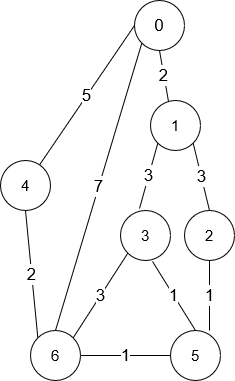

<!-- @import "[TOC]" {cmd="toc" depthFrom=1 depthTo=6 orderedList=false} -->

<!-- code_chunk_output -->

- [使用特殊打字机键入单词的最少时间](#使用特殊打字机键入单词的最少时间)
- [最大方阵和（发现规律+记得开LL）](#最大方阵和发现规律记得开ll)
- [到达目的地的方案数（dijkstra+DP）](#到达目的地的方案数dijkstradp)
- [划分数字的方案数（DP+优化+LCP，跳过）](#划分数字的方案数dp优化lcp跳过)

<!-- /code_chunk_output -->

没参加。

### 使用特殊打字机键入单词的最少时间

有一个特殊打字机，它由一个 圆盘 和一个 指针 组成， 圆盘上标有小写英文字母 'a' 到 'z'。只有 当指针指向某个字母时，它才能被键入。指针 初始时 指向字符 'a' 。


每一秒钟，你可以执行以下操作之一：
- 将指针 顺时针 或者 逆时针 移动一个字符。
- 键入指针 当前 指向的字符。

给你一个字符串 word ，请你返回键入 word 所表示单词的 最少 秒数 。

示例 1：
```
输入：word = "abc"
输出：5
解释：
单词按如下操作键入：
- 花 1 秒键入字符 'a' in 1 ，因为指针初始指向 'a' ，故不需移动指针。
- 花 1 秒将指针顺时针移到 'b' 。
- 花 1 秒键入字符 'b' 。
- 花 1 秒将指针顺时针移到 'c' 。
- 花 1 秒键入字符 'c' 。
```

示例 2：
```
输入：word = "bza"
输出：7
解释：
单词按如下操作键入：
- 花 1 秒将指针顺时针移到 'b' 。
- 花 1 秒键入字符 'b' 。
- 花 2 秒将指针逆时针移到 'z' 。
- 花 1 秒键入字符 'z' 。
- 花 1 秒将指针顺时针移到 'a' 。
- 花 1 秒键入字符 'a' 。
```

示例 3：
```
输入：word = "zjpc"
输出：34
解释：
单词按如下操作键入：
- 花 1 秒将指针逆时针移到 'z' 。
- 花 1 秒键入字符 'z' 。
- 花 10 秒将指针顺时针移到 'j' 。
- 花 1 秒键入字符 'j' 。
- 花 6 秒将指针顺时针移到 'p' 。
- 花 1 秒键入字符 'p' 。
- 花 13 秒将指针逆时针移到 'c' 。
- 花 1 秒键入字符 'c' 。
```

提示：
- 1 <= word.length <= 100
- word 只包含小写英文字母。

```cpp
class Solution {
public:
    int minTimeToType(string word) {
        int cur = 0;
        int ans = 0;
        for (auto w: word)
        {
            int c = w - 'a';
            ans += min((c - cur + 26) % 26, (cur + 26 - c) % 26);
            ans ++ ;
            cur = c;
        }
        return ans;
    }
};
```

### 最大方阵和（发现规律+记得开LL）

给你一个 n x n 的整数方阵 matrix 。你可以执行以下操作 任意次 ：

选择 matrix 中 相邻 两个元素，并将它们都 乘以 -1 。
如果两个元素有 公共边 ，那么它们就是 相邻 的。

你的目的是 最大化 方阵元素的和。请你在执行以上操作之后，返回方阵的 最大 和。

示例 1：


```
输入：matrix = [[1,-1],[-1,1]]
输出：4
解释：我们可以执行以下操作使和等于 4 ：
- 将第一行的 2 个元素乘以 -1 。
- 将第一列的 2 个元素乘以 -1 。
```

示例 2：


```
输入：matrix = [[1,2,3],[-1,-2,-3],[1,2,3]]
输出：16
解释：我们可以执行以下操作使和等于 16 ：
- 将第二行的最后 2 个元素乘以 -1 。
```

提示：
- n == matrix.length == matrix[i].length
- 2 <= n <= 250
- $-10^5 <= matrix[i][j] <= 10^5$

```cpp
class Solution {
public:
    long long maxMatrixSum(vector<vector<int>>& matrix) {
        // 如果负数数量是双数，我们总是能都翻成正数
        // 如果负数数量是单数，至少留下一个负数
        // 对于双数数量的负数 求绝对值和 否则再减去绝对值最小的数
        int n = matrix.size();
        int m = matrix[0].size();
        int cnt = 0, minv = 2e9;
        long long ans = 0;
        for (int i = 0; i < n; ++ i)
            for (int j = 0; j < m; ++ j)
            {
                if (matrix[i][j] < 0) cnt ++ ;
                if (abs(matrix[i][j]) < minv) minv = abs(matrix[i][j]);
                ans = ans + (long long) abs(matrix[i][j]);
            }
        
        if (cnt % 2) ans = ans - (long long) minv * 2;  // 首先和中不应包括 minv 其次, 把这个负的 minv 加到和里, 因此减两次
        return ans;
    }
};
```

### 到达目的地的方案数（dijkstra+DP）

你在一个城市里，城市由 n 个路口组成，路口编号为 0 到 n - 1 ，某些路口之间有 双向 道路。输入保证你可以从任意路口出发到达其他任意路口，且任意两个路口之间最多有一条路。

给你一个整数 n 和二维整数数组 roads ，其中 $roads[i] = [u_i, v_i, timei]$ 表示在路口 u_ 和 v_ 之间有一条需要花费 time_ 时间才能通过的道路。你想知道花费 最少时间 从路口 0 出发到达路口 n - 1 的方案数。

请返回花费 最少时间 到达目的地的 路径数目 。由于答案可能很大，将结果对 $10^9 + 7$ 取余 后返回。

示例 1：



```
输入：n = 7, roads = [[0,6,7],[0,1,2],[1,2,3],[1,3,3],[6,3,3],[3,5,1],[6,5,1],[2,5,1],[0,4,5],[4,6,2]]
输出：4
解释：从路口 0 出发到路口 6 花费的最少时间是 7 分钟。
四条花费 7 分钟的路径分别为：
- 0 ➝ 6
- 0 ➝ 4 ➝ 6
- 0 ➝ 1 ➝ 2 ➝ 5 ➝ 6
- 0 ➝ 1 ➝ 3 ➝ 5 ➝ 6
```

示例 2：
```
输入：n = 2, roads = [[1,0,10]]
输出：1
解释：只有一条从路口 0 到路口 1 的路，花费 10 分钟。
```

提示：
- 1 <= n <= 200
- n - 1 <= roads.length <= n * (n - 1) / 2
- roads[i].length == 3
- $0 <= u_i, v_i <= n - 1$
- $1 <= time_i <= 10^9$
- $u_i \neq v_i$
- 任意两个路口之间至多有一条路。
- 从任意路口出发，你能够到达其他任意路口。

```cpp
// dijkstra 求 dist 数组
// 根据 dist[i] - dist[j] == g[i][j] 为边建有向图
// 在这个有向图上用 DFS 找 0 点到 n-1 点的路线数量

class Solution {
private:
    static constexpr int mod = 1000000007;  // mod 只有内部调用,我觉得 leetcode 题解还挺精彩的

public:
    const int MOD = 1e9 + 7;
    int countPaths(int n, vector<vector<int>>& roads) {
        vector<vector<long long>> dist(n, vector<long long>(n, LLONG_MAX / 2));
        // 经验: `LLONG_MAX` 常数是在 `climits` 标头中定义的宏常数，用于获取 `long long int` 对象的最大值
        for (int i = 0; i < n; ++ i)
            dist[i][i] = 0;
        
        for (auto&& road: roads)
        {
            int x = road[0], y = road[1], z = road[2];
            dist[x][y] = z;
            dist[y][x] = z;
        }
        // 经验: C++ `auto &&` 知乎: https://zhuanlan.zhihu.com/p/25148592
        // 1. 当你想要拷贝range的元素时，使用for(auto x : range).
        // 2. 当你想要修改range的元素时，使用for(auto && x : range).
        // 3. 当你想要只读range的元素时，使用for(const auto & x : range).

        // dijkstra
        vector<int> used(n);  // 经验: C++ 中 vector<int> 可以当作 vector<bool> 用, 赋值时 `used[t] = true` 就行
        for (int _ = 0; _ < n; ++ _)  // 经验: C++ 中可以定义变量 `_`
        {
            int t = -1;
            for (int j = 0; j < n; ++ j)
                if (!used[j] && (t == -1 || dist[0][j] < dist[0][t])) t = j;
            used[t] = true;
            
            for (int j = 0; j < n; ++ j)
                dist[0][j] = min(dist[0][j], dist[0][t] + dist[t][j]);
        }

        // 建有向图
        vector<vector<int>> g(n);
        for (auto&& road: roads)
        {
            int x = road[0], y = road[1], z = road[2];
            if (dist[0][x] - dist[0][y] == z) g[y].push_back(x);
            if (dist[0][y] - dist[0][x] == z) g[x].push_back(y);
        }

        // dfs
        vector<int> f(n, -1);
        function<int(int)> dfs = [&] (int u)
        {
            if (u == n - 1) return 1;
            if (f[u] != -1) return f[u];

            f[u] = 0;
            for (auto v: g[u])
            {
                f[u] += dfs(v);
                while (f[u] >= MOD) f[u] -= MOD;
            }
            return f[u];
        };
        return dfs(0);
    }
};
```

**经验: **
- `LLONG_MAX` 常数是在 `climits` 标头中定义的宏常数，用于获取 `long long int` 对象的最大值
- C++ `auto &&` 知乎: https://zhuanlan.zhihu.com/p/25148592
  - 1. 当你想要拷贝range的元素时，使用`for(auto x : range)`.
  - 2. 当你想要修改range的元素时，使用`for(auto && x : range)`.
  - 3. 当你想要只读range的元素时，使用`for(const auto & x : range)`.
- C++ 中 `vector<int>` 可以当作 `vector<bool>` 用, 赋值时 `used[t] = true` 就行
- C++ 中可以定义变量 `_` ： `for (int _ = 0; _ < n; ++ _)`

### 划分数字的方案数（DP+优化+LCP，跳过）

你写下了若干 正整数 ，并将它们连接成了一个字符串 num 。但是你忘记给这些数字之间加逗号了。你只记得这一列数字是 非递减 的且 没有 任何数字有前导 0 。

请你返回有多少种可能的 正整数数组 可以得到字符串 num 。由于答案可能很大，将结果对 $10^9 + 7$ 取余 后返回。

示例 1：
```
输入：num = "327"
输出：2
解释：以下为可能的方案：
3, 27
327
```

示例 2：
```
输入：num = "094"
输出：0
解释：不能有数字有前导 0 ，且所有数字均为正数。
```

示例 3：
```
输入：num = "0"
输出：0
解释：不能有数字有前导 0 ，且所有数字均为正数。
```

示例 4：
```
输入：num = "9999999999999"
输出：101
```
 
提示：
- 1 <= num.length <= 3500
- num 只含有数字 '0' 到 '9' 。

很难，跳过。

```cpp
class Solution {
private:
    static constexpr int mod = 1000000007;

public:
    int numberOfCombinations(string num) {
        if (num[0] == '0') {
            return 0;
        }

        int n = num.size();

        // 预处理 lcp
        vector<vector<int>> lcp(n, vector<int>(n));
        for (int i = n - 1; i >= 0; --i) {
            lcp[i][n - 1] = (num[i] == num[n - 1]);
            for (int j = i + 1; j < n - 1; ++j) {
                lcp[i][j] = (num[i] == num[j] ? lcp[i + 1][j + 1] + 1 : 0);
            }
        }

        // 辅助函数，计算 x = (x + y) % mod
        auto update = [&](int& x, int y) {
            x += y;
            if (x >= mod) {
                x -= mod;
            }
        };

        // 动态规划
        vector<vector<int>> f(n, vector<int>(n));
        // 边界 f[0][..] = 1
        for (int i = 0; i < n; ++i) {
            f[0][i] = 1;
        }
        for (int i = 1; i < n; ++i) {
            // 有前导零，无需转移
            if (num[i] == '0') {
                continue;
            }
            // 前缀和
            int presum = 0;
            for (int j = i; j < n; ++j) {
                int length = j - i + 1;
                f[i][j] = presum;
                if (i - length >= 0) {
                    // 使用 lcp 比较 num(2i-j-1,i-1) 与 num(i,j) 的大小关系
                    if (lcp[i - length][i] >= length || num[i - length + lcp[i - length][i]] < num[i + lcp[i - length][i]]) {
                        update(f[i][j], f[i - length][i - 1]);
                    }
                    // 更新前缀和
                    update(presum, f[i - length][i - 1]);
                }
            }
        }

        // 最终答案即为所有 f[..][n-1] 的和
        int ans = 0;
        for (int i = 0; i < n; ++i) {
            update(ans, f[i][n - 1]);
        }
        return ans;
    }
};
```
