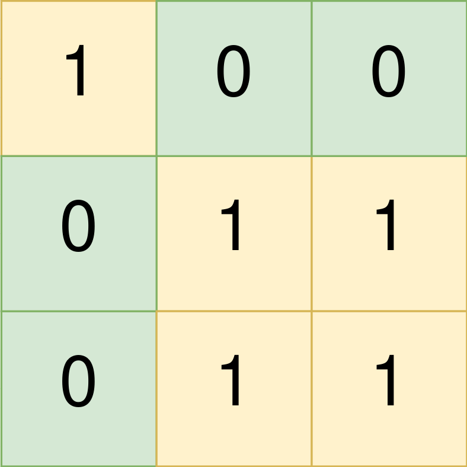

<!-- @import "[TOC]" {cmd="toc" depthFrom=1 depthTo=6 orderedList=false} -->

<!-- code_chunk_output -->

- [找到数组的中间位置](#找到数组的中间位置)
- [找到所有的农场组](#找到所有的农场组)
- [树上的操作](#树上的操作)
- [好子集的数目（分析+dfs）](#好子集的数目分析dfs)

<!-- /code_chunk_output -->

没参加。

### 找到数组的中间位置

给你一个下标从 0 开始的整数数组 nums ，请你找到 最左边 的中间位置 middleIndex （也就是所有可能中间位置下标最小的一个）。

中间位置 middleIndex 是满足 `nums[0] + nums[1] + ... + nums[middleIndex-1] == nums[middleIndex+1] + nums[middleIndex+2] + ... + nums[nums.length-1]` 的数组下标。

如果 middleIndex == 0 ，左边部分的和定义为 0 。类似的，如果 middleIndex == nums.length - 1 ，右边部分的和定义为 0 。

请你返回满足上述条件 最左边 的 middleIndex ，如果不存在这样的中间位置，请你返回 -1 。

示例 1：

```
输入：nums = [2,3,-1,8,4]
输出：3
解释：
下标 3 之前的数字和为：2 + 3 + -1 = 4
下标 3 之后的数字和为：4 = 4
```

示例 2：

```
输入：nums = [1,-1,4]
输出：2
解释：
下标 2 之前的数字和为：1 + -1 = 0
下标 2 之后的数字和为：0
```

示例 3：

```
输入：nums = [2,5]
输出：-1
解释：
不存在符合要求的 middleIndex 。
```

示例 4：

```
输入：nums = [1]
输出：0
解释：
下标 0 之前的数字和为：0
下标 0 之后的数字和为：0
```

提示：
- 1 <= nums.length <= 100
- -1000 <= nums[i] <= 1000

```cpp
class Solution {
public:
    int findMiddleIndex(vector<int>& nums) {
        // 前缀和后缀和
        int n = nums.size();
        int s[n+2], rs[n+2];
        memset(s, 0, sizeof s);
        memset(rs, 0, sizeof rs);
        for (int i = 1; i <= n; ++ i) s[i] = nums[i - 1], s[i] += s[i - 1];
        for (int i = n; i >= 1; -- i) rs[i] = nums[i - 1], rs[i] += rs[i + 1];

        int k = -1;
        for (int i = 0; i < n; ++ i)
        {
            if (s[i] == rs[i+2])
            {
                k = i;
                break;
            }
        }
        return k;
    }
};
```

下面是 y 总的代码，其实没必要用后缀和的。

```cpp
class Solution {
public:
    int findMiddleIndex(vector<int>& nums) {
        int n = nums.size();
        vector<int> s(n + 2);
        for (int i = 1; i <= n; i ++ ) s[i] = s[i - 1] + nums[i - 1];
        s[n + 1] = s[n];
        for (int i = 1; i <= n; i ++ )
            if (s[i - 1] == s[n] - s[i])
                return i - 1;
        return -1;
    }
};
```

### 找到所有的农场组

给你一个下标从 0 开始，大小为 m x n 的二进制矩阵 land ，其中 0 表示一单位的森林土地，1 表示一单位的农场土地。

为了让农场保持有序，农场土地之间以矩形的 农场组 的形式存在。每一个农场组都 仅 包含农场土地。且题目保证不会有两个农场组相邻，也就是说一个农场组中的任何一块土地都 不会 与另一个农场组的任何一块土地在四个方向上相邻。

land 可以用坐标系统表示，其中 land 左上角坐标为 (0, 0) ，右下角坐标为 (m-1, n-1) 。请你找到所有 农场组 最左上角和最右下角的坐标。一个左上角坐标为 (r1, c1) 且右下角坐标为 (r2, c2) 的 农场组 用长度为 4 的数组 `[r1, c1, r2, c2]` 表示。

请你返回一个二维数组，它包含若干个长度为 4 的子数组，每个子数组表示 land 中的一个 农场组 。如果没有任何农场组，请你返回一个空数组。可以以 任意顺序 返回所有农场组。

示例 1：



```
输入：land = [[1,0,0],[0,1,1],[0,1,1]]
输出：[[0,0,0,0],[1,1,2,2]]
解释：
第一个农场组的左上角为 land[0][0] ，右下角为 land[0][0] 。
第二个农场组的左上角为 land[1][1] ，右下角为 land[2][2] 。
```

示例 2：


```
输入：land = [[1,1],[1,1]]
输出：[[0,0,1,1]]
解释：
第一个农场组左上角为 land[0][0] ，右下角为 land[1][1] 。
```

示例 3：


```
输入：land = [[0]]
输出：[]
解释：
没有任何农场组。
```

提示：
- m == land.length
- n == land[i].length
- 1 <= m, n <= 300
- land 只包含 0 和 1 。
- 农场组都是 矩形 的形状。

```cpp
class Solution {
private:
    int n, m;
    bool st[310][310];
    int dx[4] = {0, 1, 0, -1};
    int dy[4] = {1, 0, -1, 0};

    vector<int> bfs(int sx, int sy, vector<vector<int>>& land)
    {
        int r1 = n, c1 = m, r2 = -1, c2 = -1;

        queue<pair<int, int>> q;
        q.push({sx, sy});
        st[sx][sy] = true;

        while (q.size())
        {
            auto t = q.front();
            q.pop();
            int x = t.first, y = t.second;

            if (x < r1) r1 = x;
            if (y < c1) c1 = y;
            if (x > r2) r2 = x;
            if (y > c2) c2 = y;

            for (int i = 0; i < 4; ++ i)
            {
                int a = x + dx[i], b = y + dy[i];
                if (0 <= a && a < n && 0 <= b && b < m && land[a][b] && !st[a][b])
                {
                    q.push({a, b});
                    st[a][b] = true;
                }
            }
        }

        return {r1, c1, r2, c2};
    }

public:
    vector<vector<int>> findFarmland(vector<vector<int>>& land) {
        n = land.size();
        m = land[0].size();

        memset(st, 0, sizeof st);

        vector<vector<int>> res;
        for (int i = 0; i < n; ++ i)
            for (int j = 0; j < m; ++ j)
            {
                if (land[i][j] && !st[i][j])
                {
                    auto f = bfs(i, j, land);
                    res.push_back(f);
                }
            }

        return res;
    }
};
```

来看 y 总的 flood fill 。

```cpp
class Solution {
public:
    vector<vector<int>> findFarmland(vector<vector<int>>& g) {
        int n = g.size(), m = g[0].size();
        vector<vector<int>> res;
        for (int i = 0; i < n; i ++ )
            for (int j = 0; j < m; j ++ )
                if (g[i][j]) {  // 如果是 1
                    int x = i, y = j;
                    int c = x, d = y;
                    for (int a = i; a < n && g[a][j]; a ++ )  // 开始往下 fill
                        for (int b = j; b < m && g[a][b]; b ++ ) {
                            g[a][b] = 0;  // 0 也表示遍历过
                            c = max(c, a), d = max(d, b);
                        }
                    res.push_back({x, y, c, d});
                }
        return res;
    }
};
```

### 树上的操作

给你一棵 n 个节点的树，编号从 0 到 n - 1 ，以父节点数组 parent 的形式给出，其中 `parent[i]` 是第 i 个节点的父节点。树的根节点为 0 号节点，所以 `parent[0] = -1` ，因为它没有父节点。你想要设计一个数据结构实现树里面对节点的加锁，解锁和升级操作。

数据结构需要支持如下函数：
- Lock：指定用户给指定节点 上锁 ，上锁后其他用户将无法给同一节点上锁。只有当节点处于未上锁的状态下，才能进行上锁操作。
- Unlock：指定用户给指定节点 解锁 ，只有当指定节点当前正被指定用户锁住时，才能执行该解锁操作。
- Upgrade：指定用户给指定节点 上锁 ，并且将该节点的所有子孙节点 解锁 。只有如下 3 个条件 全部 满足时才能执行升级操作：
  - 指定节点当前状态为未上锁。
  - 指定节点至少有一个上锁状态的子孙节点（可以是 任意 用户上锁的）。
  - 指定节点没有任何上锁的祖先节点。

请你实现 `LockingTree` 类：
- `LockingTree(int[] parent)` 用父节点数组初始化数据结构。
- `lock(int num, int user)` 如果 id 为 user 的用户可以给节点 num 上锁，那么返回 true ，否则返回 false 。如果可以执行此操作，节点 num 会被 id 为 user 的用户 上锁 。
- `unlock(int num, int user)` 如果 id 为 user 的用户可以给节点 num 解锁，那么返回 true ，否则返回 false 。如果可以执行此操作，节点 num 变为 未上锁 状态。
- `upgrade(int num, int user)` 如果 id 为 user 的用户可以给节点 num 升级，那么返回 true ，否则返回 false 。如果可以执行此操作，节点 num 会被 升级 。

示例 1：


```
输入：
["LockingTree", "lock", "unlock", "unlock", "lock", "upgrade", "lock"]
[[[-1, 0, 0, 1, 1, 2, 2]], [2, 2], [2, 3], [2, 2], [4, 5], [0, 1], [0, 1]]
输出：
[null, true, false, true, true, true, false]

解释：
LockingTree lockingTree = new LockingTree([-1, 0, 0, 1, 1, 2, 2]);
lockingTree.lock(2, 2);    // 返回 true ，因为节点 2 未上锁。
                           // 节点 2 被用户 2 上锁。
lockingTree.unlock(2, 3);  // 返回 false ，因为用户 3 无法解锁被用户 2 上锁的节点。
lockingTree.unlock(2, 2);  // 返回 true ，因为节点 2 之前被用户 2 上锁。
                           // 节点 2 现在变为未上锁状态。
lockingTree.lock(4, 5);    // 返回 true ，因为节点 4 未上锁。
                           // 节点 4 被用户 5 上锁。
lockingTree.upgrade(0, 1); // 返回 true ，因为节点 0 未上锁且至少有一个被上锁的子孙节点（节点 4）。
                           // 节点 0 被用户 1 上锁，节点 4 变为未上锁。
lockingTree.lock(0, 1);    // 返回 false ，因为节点 0 已经被上锁了。
```

提示：
- n == parent.length
- 2 <= n <= 2000
- 对于 i != 0 ，满足 0 <= parent[i] <= n - 1
- parent[0] == -1
- 0 <= num <= n - 1
- 1 <= user <= 104
- parent 表示一棵合法的树。
- lock ，unlock 和 upgrade 的调用 总共 不超过 2000 次。

```cpp
class LockingTree {
public:
    int n;
    vector<int> p;
    vector<int> user;  // 该点状态
    vector<vector<int>> g;  // 邻接表

    LockingTree(vector<int>& parent) {
        p = parent;
        n = p.size();
        user = vector<int>(n, -1);
        g.resize(n);  // **经验：** - C++ `vector.resize(n, v)`  调整容器的大小，使其包含n个元素，值v
        
        for (int i = 1; i < n; i ++ )
            g[p[i]].push_back(i);
    }

    bool lock(int k, int u) {
        if (user[k] == -1) {
            user[k] = u;
            return true;
        }
        return false;
    }
    
    bool unlock(int k, int u) {
        if (user[k] == u) {
            user[k] = -1;
            return true;
        }
        return false;
    }
    
    int dfs(int u) {  // 因为 upgrade 要求把子节点解锁，因此边 dfs 边清空
    // 具体解释一下，为什么 可以边 dfs 边清空？因为 dfs 时前面两个条件已经满足了，第三个条件有就可以清空
        int res = 0;
        if (user[u] != -1) {
            user[u] = -1;
            res ++ ;
        }
        
        for (auto son: g[u])
            res += dfs(son);
        return res;
    }
    
    bool upgrade(int k, int u) {
        if (user[k] != -1) return false;
        for (int i = p[k]; i != -1; i = p[i])
            if (user[i] != -1)  // 父节点需要全部 unlock
                return false;

        int cnt = dfs(k);  // 子节点需要至少一个 lock
        if (cnt) {
            user[k] = u;
            return true;
        }
        return false;
    }
};

/**
 * Your LockingTree object will be instantiated and called as such:
 * LockingTree* obj = new LockingTree(parent);
 * bool param_1 = obj->lock(num,user);
 * bool param_2 = obj->unlock(num,user);
 * bool param_3 = obj->upgrade(num,user);
 */
```

**经验：**
- C++ `vector.resize(n, v)`  调整容器的大小，使其包含n个元素，值v

### 好子集的数目（分析+dfs）

给你一个整数数组 nums 。如果 nums 的一个子集中，所有元素的乘积可以用若干个 互不相同的质数 相乘得到，那么我们称它为 好子集 。

比方说，如果 nums = [1, 2, 3, 4] ：
[2, 3] ，[1, 2, 3] 和 [1, 3] 是 好 子集，乘积分别为 `6 = 2*3` ，`6 = 2*3` 和 `3 = 3` 。
[1, 4] 和 [4] 不是 好 子集，因为乘积分别为 4 = 2*2 和 4 = 2*2 。
请你返回 nums 中不同的 好 子集的数目对 109 + 7 取余 的结果。

nums 中的 子集 是通过删除 nums 中一些（可能一个都不删除，也可能全部都删除）元素后剩余元素组成的数组。如果两个子集删除的下标不同，那么它们被视为不同的子集。

示例 1：

```
输入：nums = [1,2,3,4]
输出：6
解释：好子集为：
- [1,2]：乘积为 2 ，可以表示为质数 2 的乘积。
- [1,2,3]：乘积为 6 ，可以表示为互不相同的质数 2 和 3 的乘积。
- [1,3]：乘积为 3 ，可以表示为质数 3 的乘积。
- [2]：乘积为 2 ，可以表示为质数 2 的乘积。
- [2,3]：乘积为 6 ，可以表示为互不相同的质数 2 和 3 的乘积。
- [3]：乘积为 3 ，可以表示为质数 3 的乘积。
```

示例 2：

```
输入：nums = [4,2,3,15]
输出：5
解释：好子集为：
- [2]：乘积为 2 ，可以表示为质数 2 的乘积。
- [2,3]：乘积为 6 ，可以表示为互不相同质数 2 和 3 的乘积。
- [2,15]：乘积为 30 ，可以表示为互不相同质数 2，3 和 5 的乘积。
- [3]：乘积为 3 ，可以表示为质数 3 的乘积。
- [15]：乘积为 15 ，可以表示为互不相同质数 3 和 5 的乘积。
```

提示：
- 1 <= nums.length <= 105
- 1 <= nums[i] <= 30

```cpp
// 注意到 nums[i] <= 30
// 只有 1 能在集合里出现多次，此外其他数都只能出现 1 次
// 因此 1 特判，其他数用 dfs
// 结果为 2^{1出现次数} * 其他数组合方案 % MOD
typedef long long LL;

const int MOD = 1e9 + 7;

class Solution {
public:
    int g[31][31] = {0};  // 两个数之间有边：有最大公约数，有矛盾
    int st[31] = {0};
    int s[31] = {0};
    int C;
    vector<int> path;
    
    int gcd(int a, int b) {
        return b ? gcd(b, a % b) : a;
    }
    
    int dfs(int u, int sum) {
        if (!sum) return 0;  // 后面的方案都是在前面方案的基础上乘上一个系数，因此 sum 为 0 直接返回 0 ，这是一个剪枝
        if (u > 30) {  // 已经枚举完了所有情况
            if (path.empty()) return 0;
            return (LL)sum * C % MOD;
        }

        // 第一种情况：不选 u ，方案数不变，将 sum 传入下一层 dfs
        int res = dfs(u + 1, sum);
        
        // 第一种情况：选 u ，方案数增加
        if (!st[u]) {
            bool flag = true;
            for (auto x: path) {
                if (g[x][u]) {
                    flag = false;
                    break;
                }
            }
            
            if (flag) {  // 如果当前数 u 能被选
                path.push_back(u);
                
                res = (res + dfs(u + 1, (LL)sum * s[u] % MOD)) % MOD;
                
                path.pop_back();
            }
        }
        
        return res;
    }
    
    int numberOfGoodSubsets(vector<int>& nums) {
        for (auto x: nums) s[x] ++ ;  // 统计各个数出现次数
        
        C = 1;  // C 是 2^{s[1]}
        for (int i = 0; i < s[1]; i ++ ) C = C * 2 % MOD;
        
        for (int i = 2; i <= 30; i ++ )
            for (int j = 2; j <= 30; j ++ )
                if (gcd(i, j) > 1)
                    g[i][j] = 1;  // 最大公约数大于 1 的，两两建边
        
        for (int i = 2; i * i <= 30; i ++ )
            for (int j = 1; j * i * i <= 30; j ++ )
                st[j * i * i] = 1;  // 把每个数的平方的倍数都删掉，因为平方的倍数肯定不能选
        
        return dfs(2, 1);  // 从 2 开始枚举，当前方案数是 1
    }
};
```
