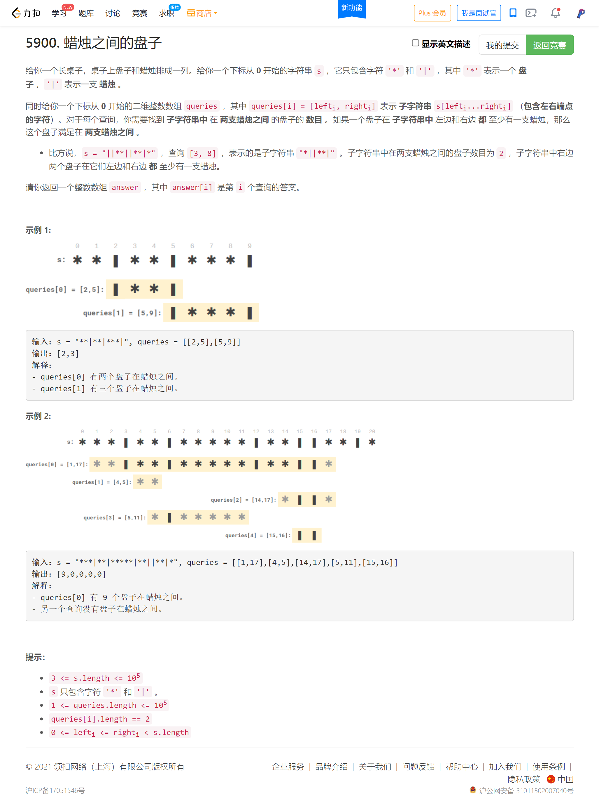

<!-- @import "[TOC]" {cmd="toc" depthFrom=1 depthTo=6 orderedList=false} -->

<!-- code_chunk_output -->

- [两个最好的不重叠活动（二分+前缀和预处理）](#两个最好的不重叠活动二分前缀和预处理)
- [蜡烛之间的盘子（字符串搜索）](#蜡烛之间的盘子字符串搜索)
- [棋盘上有效移动组合的数目（模拟+递归）](#棋盘上有效移动组合的数目模拟递归)

<!-- /code_chunk_output -->

迟到了10分钟。

T2 直接没思路。

T3 罚时两次，还是脑中模型不明晰所致。还应加强大脑的训练。

T4 总觉得能做出来，写起来又觉得太麻烦，很累了，遂放弃。

### 两个最好的不重叠活动（二分+前缀和预处理）


```cpp
// 1e5 时间复杂度
// nlogn 二分
// 枚举右侧区间，按照区间右端点排序
// 预处理好前 i 个区间的最大值 f[i]
// 二分的话，则是固定了右区间，找允许内的最右的左区间 i
class Solution {
public:
    int maxTwoEvents(vector<vector<int>>& q) {
        int n = q.size();
        vector<int> p(n);
        for (int i = 0; i < n; ++ i) p[i] = i;
        sort(p.begin(), p.end(), [&](int a, int b) {
            return q[a][1] < q[b][1];
        });
        vector<int> f(n);
        f[0] = q[p[0]][2];
        for (int i = 1; i < n; ++ i)
            f[i] = max(f[i - 1], q[p[i]][2]);
        
        int res = 0;
        for (auto& t: q)
        {
            int l = 0, r = n - 1;
            while (l < r)
            {
                int mid = l + r + 1 >> 1;
                if (q[p[mid]][1] < t[0]) l = mid;
                else r = mid - 1;
            }
            int s = t[2];
            if (q[p[r]][1] < t[0]) s += f[r];
            res = max(res, s);
        }
        return res;
    }
};
```

**经验：**
- 一般不要对 `vector<vector<T>>` 直接排序，会超时，可以对下标排序

### 蜡烛之间的盘子（字符串搜索）



```cpp
class Solution {
public:
    vector<int> platesBetweenCandles(string s, vector<vector<int>>& queries) {
        int n = s.size();
        vector<int> l(n, -1), r(n, n);
        vector<int> sum(n + 1, 0);

        int near = -1;
        for (int i = 0; i < n; ++ i)
        {
            auto c = s[i];
            l[i] = near;
            if (c == '|') near = i, l[i] = near;  // 这里要更新 l[i]
        }

        near = n;
        for (int i = n-1; i >=0; -- i)
        {
            auto c = s[i];
            r[i] = near;
            if (c == '|') near = i, r[i] = near;
        }
        
        for (int i = 1; i <= n; ++ i)
        {
            if (s[i - 1] == '*') sum[i] = sum[i - 1] + 1;
            else sum[i] = sum[i - 1];
        }

        vector<int> ans;
        for (auto&& q: queries)
        {
            int i = q[0], j = q[1];
            if (i < n && l[i] < q[0]) i = r[i] + 1;  // 直接跳到有栅栏的地方
            if (j >= 0 && r[j] > q[1]) j = l[j] - 1;
            if (i < n && j >= 0) ans.push_back(max(0, sum[j + 1] - sum[i]));
            else ans.push_back(0);
        }

        return ans;
    }
};
```

### 棋盘上有效移动组合的数目（模拟+递归）


```cpp
// 可以用暴搜
// 
class Solution {
public:
    int n;
    vector<string> pc;  // 各个棋子种类
    vector<vector<int>> pt;  // 各个棋子位置
    int dx[8] = {-1, -1, 0, 1, 1, 1, 0, -1};  // 👈开始，顺时针
    int dy[8] = {0, 1, 1, 1, 0, -1, -1, -1};
    vector<vector<int>> path;
    int ans = 0;
    int p[5][2];  // 在 check 中记录位置

    bool check() {  // 检查该方案组合中有没有冲突
        for (int i = 0; i < n; i ++ ) {
            p[i][0] = pt[i][0];
            p[i][1] = pt[i][1];
        }

        for (int i = 1; ; i ++ ) {  // 模拟每一时刻
            bool flag = false;
            for (int j = 0; j < n; j ++ ) {
                int d = path[j][0], t = path[j][1];
                if (i <= t) {
                    flag = true;
                    p[j][0] += dx[d];
                    p[j][1] += dy[d];
                }
            }
            if (!flag) break;  // 没有棋子移动

            for (int j = 0; j < n; j ++ )
                for (int k = j + 1; k < n; k ++ )
                    if (p[j][0] == p[k][0] && p[j][1] == p[k][1])
                        return false;
        }

        return true;
    }

    void dfs(int u) {
        if (u == n) {
            if (check()) ans ++ ;
            return;
        }

        // 棋子 u 可能不走
        path.push_back({0, 0});  // {方向, 长度}
        dfs(u + 1);
        path.pop_back();

        // 棋子 u 可能走其他方向其他步长
        for (int i = 0; i < 8; i ++ ) {  // 对于每个方向
            string& s = pc[u];
            if (s == "rook" && i % 2) continue;
            if (s == "bishop" && i % 2 == 0) continue;
            int x = pt[u][0], y = pt[u][1];
            for (int j = 1; ; j ++ ) {
                x += dx[i], y += dy[i];
                if (x < 1 || x > 8 || y < 1 || y > 8) break;
                path.push_back({i, j});
                dfs(u + 1);
                path.pop_back();
            }
        }
    }

    int countCombinations(vector<string>& pieces, vector<vector<int>>& positions) {
        pc = pieces, pt = positions;
        n = pc.size();
        dfs(0);  // 从第 0 个棋子开始递归
        return ans;
    }
};
```
