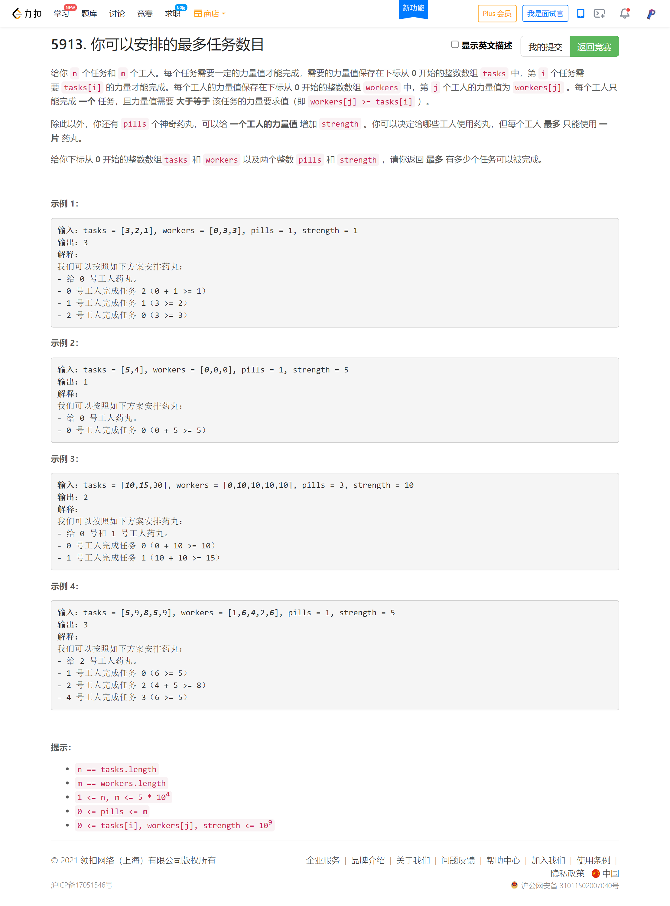

<!-- @import "[TOC]" {cmd="toc" depthFrom=1 depthTo=6 orderedList=false} -->

<!-- code_chunk_output -->

- [模拟行走机器人 II（严谨思维）](#模拟行走机器人-ii严谨思维)
- [每一个查询的最大美丽值（二分）](#每一个查询的最大美丽值二分)
- [你可以安排的最多任务数目（二分套二分+贪心）](#你可以安排的最多任务数目二分套二分贪心)

<!-- /code_chunk_output -->

T2 很考察严谨思维。

T3 二分但是还写了 20 分钟？基础差劲。

T4 乍一看题意很明确？我一下想到线性规划模型但这也不是编程的方法。思考很久不知道咋写。

T4 让我决定进一步深入 `C++ STL` ，`multiset.lower_bound` 有序集合实在太好用了。

### 模拟行走机器人 II（严谨思维）


首先，可能会走很多圈，因此对经过一圈的步数取余就行，否则超时。

**注意在起点特殊，除了初始时刻，任何时候在起点都是朝向南的，初始时刻朝向东。**

```cpp
const string directions[4] = {"East", "North", "West", "South"};
const int dx[4] = {1, 0, -1, 0};
const int dy[4] = {0, 1, 0, -1};

class Robot {
public:
    int x, y, dir;
    int w, h;
    Robot(int width, int height) {
        x = 0;
        y = 0;
        w = width;
        h = height;
        dir = 0;
    }
    
    void move(int num) {
        if (num > 0 && num % ((w + h) * 2 - 4) == 0 && x == 0 && y == 0) dir = 3;  // 起点朝向特殊
        num %= ((w + h) * 2 - 4);
        for (int i = 0; i < num; ++ i)
        {
            if (x + dx[dir] < w && x + dx[dir] >= 0 && y + dy[dir] < h && y + dy[dir] >= 0)
            {
                x = x + dx[dir];
                y = y + dy[dir];
                continue;
            }
            dir = (dir + 1) % 4;
            if (x + dx[dir] < w && x + dx[dir] >= 0 && y + dy[dir] < h && y + dy[dir] >= 0)
            {
                x = x + dx[dir];
                y = y + dy[dir];
                continue;
            }
        }
    }

    vector<int> getPos() {
        return {x, y};
    }
    
    string getDir() {
        return directions[dir];
    }
};

/**
 * Your Robot object will be instantiated and called as such:
 * Robot* obj = new Robot(width, height);
 * obj->move(num);
 * vector<int> param_2 = obj->getPos();
 * string param_3 = obj->getDir();
 */
```

### 每一个查询的最大美丽值（二分）


```cpp
class Solution {
public:
    vector<int> maximumBeauty(vector<vector<int>>& items, vector<int>& queries) {
        int n = items.size();
        vector<int> ids = vector(n, 0);
        for (int i = 0; i < n; ++ i) ids[i] = i;
        auto cmp1 = [&](int a, int b) -> bool
        {
            return items[a][0] < items[b][0];
        };
        sort(ids.begin(), ids.end(), cmp1);
        
        int maxv = 0;
        vector<int> max_value = vector(n, 0);
        for (int i = 0; i < n; ++ i)
        {
            if (maxv < items[ids[i]][1])
                maxv = items[ids[i]][1];
            max_value[i] = maxv;
        }
        
        vector<int> res;
        for (auto&& q: queries)
        {
            int l = -1, r = n - 1, mid;
            while (l < r)
            {
                mid = l + r + 1 >> 1;
                if (items[ids[mid]][0] <= q) l = mid;
                else r = mid - 1;
            }
            if (l == -1)
                res.push_back(0);
            else res.push_back(max_value[l]);
        }
        return res;
    }
};
```

### 你可以安排的最多任务数目（二分套二分+贪心）



```cpp
// 二分套二分+贪心
// 贪心在于：时刻用最强的 x 人匹配最弱的 x 个任务
//     如果 x = 5 成立，那么对于 x = 6 ，则一定只需要检查第 6 弱的任务
//     如果第 6 弱的任务不能被第 6 强的人胜任，那给第 6 强人吃药试试，因此具有单调性
// 但是程序实现并不会如上搜索，而是二分答案，再检查用二分给临界值吃药片

class Solution {
public:
    int maxTaskAssign(vector<int>& tasks, vector<int>& workers, int pills, int strength) {
        int n = tasks.size();
        int m = workers.size();
        sort(tasks.begin(), tasks.end());
        sort(workers.begin(), workers.end());
        auto check = [&](int x) -> bool
        {
            // 最强的 x 人能不能胜任最弱的 x 份工作
            int p = pills;
            multiset<int> s(workers.begin(), workers.end());
            for (int i = 0; i < x; ++ i)
            {
                // 首先检查第 x 强的工作能不能被胜任，不能的话 false
                if (tasks[x - i - 1] <= *s.rbegin()) s.erase(s.find(*s.rbegin()));  // 经验：用 rbegin() 取容器最后一个值而非 end() 因为 end() 是最后一个位置+1
                else if (p && tasks[x - i - 1] <= *s.rbegin() + strength)
                {
                    // 找最弱的满足要求的给他吃药，为了不浪费强者对于其他任务的匹配
                    auto it = s.lower_bound(tasks[x - i - 1] - strength);
                    s.erase(it);
                    p -- ;
                }
                else return false;
            }
            return true;
        };

        // 二分找答案
        int l = 0, r = min(n, m);
        while (l < r)
        {
            int mid = l + r + 1 >> 1;
            if (check(mid)) l = mid;
            else r = mid - 1;
        }

        return l;
    }
};
```

**经验：**
- 用 `rbegin()` 取容器最后一个值而非 `end()` 因为 `end()` 是最后一个位置`+1`
- `multiset` 是有序可重复集合
