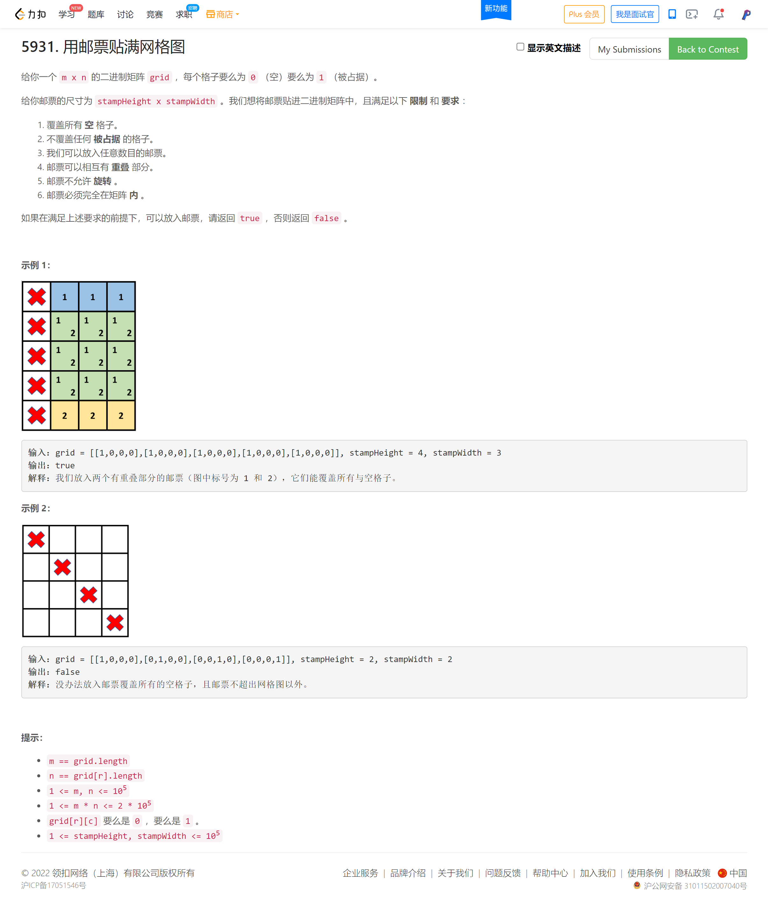

<!-- @import "[TOC]" {cmd="toc" depthFrom=1 depthTo=6 orderedList=false} -->

<!-- code_chunk_output -->

- [5931. 用邮票贴满网格图（妙用二维前缀和/二维差分/用前缀和和差分记录一块连续区间的状态）](#5931-用邮票贴满网格图妙用二维前缀和二维差分用前缀和和差分记录一块连续区间的状态)

<!-- /code_chunk_output -->

T1 为了 `split` 果断用 Python ，其实 C++ 也不费劲。

T4 应该是道简单题？没做出来，感觉就差一点。看大佬的题解发现思路不太对，还是没把基础课内容融会贯通。

### 5931. 用邮票贴满网格图（妙用二维前缀和/二维差分/用前缀和和差分记录一块连续区间的状态）



我的思路太笨了，不说了。

我想到了从左上开始，一个一个检查，是否可以以这个点为左上角贴邮票。

我的思路中一直有一个弊病：我不敢对每个各自都进行检查，因为这样时间复杂度就是：`格子数量 * 邮票面积`。

[大佬](https://leetcode-cn.com/problems/stamping-the-grid/solution/wu-nao-zuo-fa-er-wei-qian-zhui-he-er-wei-zwiu/)秒就妙在： **用二维前缀和优化是否可以贴邮票** ，让贴邮票的时间复杂度降低为 `格子数量 * 1` 。

然后还有更妙的，如何表示这个区域里贴了一张邮票呢？其时间复杂度是 `O(1)` 而非遍历邮票所有格子得到的 `O(邮票面积)` ：大佬用差分优化的。

**用差分记录一个区间的整体加减状态，这个是我要牢记于心的技巧。**

```cpp
class Solution {
public:
    bool possibleToStamp(vector<vector<int>> &grid, int stampHeight, int stampWidth) {
        int m = grid.size(), n = grid[0].size();
        vector<vector<int>> sum(m + 1, vector<int>(n + 1)), diff(m + 1, vector<int>(n + 1));
        for (int i = 0; i < m; ++i) {
            for (int j = 0; j < n; ++j) { // grid 的二维前缀和
                sum[i + 1][j + 1] = sum[i + 1][j] + sum[i][j + 1] - sum[i][j] + grid[i][j];
            }
        }

        for (int i = 0; i < m; ++i) {
            for (int j = 0; j < n; ++j) {
                int x = i + stampHeight, y = j + stampWidth; // 注意这是矩形右下角横纵坐标都 +1 后的位置
                // 用前缀和检查是否可以贴邮票！！！
                if (x <= m && y <= n && sum[x][y] - sum[x][j] - sum[i][y] + sum[i][j] == 0) {
                    ++diff[i][j];
                    --diff[i][y];
                    --diff[x][j];
                    ++diff[x][y]; // 更新二维差分
                }
            }
        }

        // 还原二维差分矩阵对应的计数矩阵，这里用滚动数组实现
        vector<int> cnt(n + 1), pre(n + 1);
        for (int i = 0; i < m; ++i) {
            for (int j = 0; j < n; ++j) {
                cnt[j + 1] = cnt[j] + pre[j + 1] - pre[j] + diff[i][j];
                // 有 0 则代表该区域从未加过 1
                if (cnt[j + 1] == 0 && grid[i][j] == 0) {
                    return false;
                }
            }
            swap(cnt, pre);
        }
        return true;
    }
};
```

**请记住：用前缀和和差分记录一块连续区间的状态，别傻乎乎地对每个数计算。**
