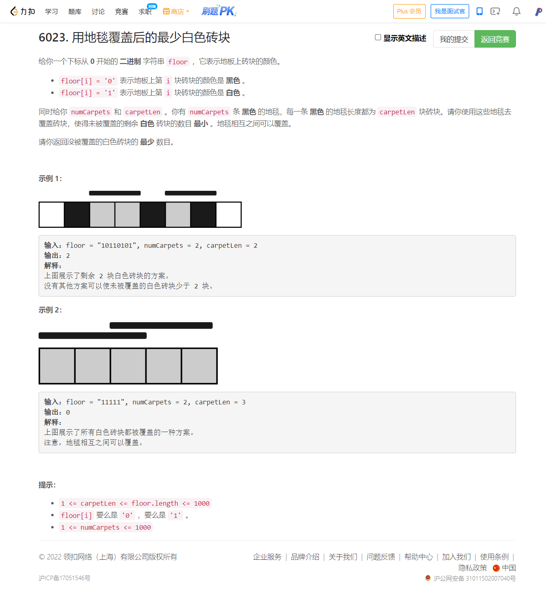

<!-- @import "[TOC]" {cmd="toc" depthFrom=1 depthTo=6 orderedList=false} -->

<!-- code_chunk_output -->

- [6023. 用地毯覆盖后的最少白色砖块（优秀的DP思路）](#6023-用地毯覆盖后的最少白色砖块优秀的dp思路)

<!-- /code_chunk_output -->

### 6023. 用地毯覆盖后的最少白色砖块（优秀的DP思路）



参考 [灵佬](https://leetcode-cn.com/problems/minimum-white-tiles-after-covering-with-carpets/solution/by-endlesscheng-pa3v/) ：

提示 1：思考方向？

看到题目给的数据范围，先想想能否用 DP 做出来。（DP 可以认为是一种更高级的暴力）

提示 2：如何定义 DP 的状态？

一般来说，题目给了什么就用什么定义：地板长度和地毯个数。而地毯长度更适合去划分状态。

只用地板长度一个维度够吗？

不够，状态定义没有体现出所使用的地毯的个数。因此需要两个维度。

提示 3：状态的值及其转移如何设计？

一般来说，题目求什么就定义什么：定义 `f[i][j]` 表示用 i 条地毯覆盖前 j 块板砖时，没被覆盖的白色砖块的最少数目。

转移时可以考虑是否用第 i 条地毯的末尾覆盖第 j 块板砖：

- 不覆盖：$f[i][j] = f[i][j-1] + [\textit{floor}[j]=\text{`1'}]$
- 覆盖：$f[i][j] = f[i-1][j-\textit{carpetLen}]$ 取二者最小值。

注意 i=0 的时候只能不覆盖，需要单独计算。

最后答案为 $f[\textit{numCarpets}][\textit{floor.length}-1]$

```cpp
class Solution {
public:
    int minimumWhiteTiles(string floor, int n, int carpetLen) {
        int m = floor.size();
        vector<vector<int>> f(n + 1);  // 0 条到 n 条
        f[0] = vector<int>(m);
        f[0][0] = floor[0] - '0';
        for (int i = 1; i < m; ++ i)
            f[0][i] = f[0][i - 1] + floor[i] - '0';
        for (int i = 1; i <= n; ++ i)
        {
            f[i] = vector<int>(m, 0);
            for (int j = carpetLen; j < m; ++ j)  // 从 carpetLen 才能开始转移（第一条毯子铺上之后）
                f[i][j] = min(f[i][j - 1] + floor[j] - '0', f[i - 1][j - carpetLen]);
        }
        return f[n][m - 1];
    }
};
```
