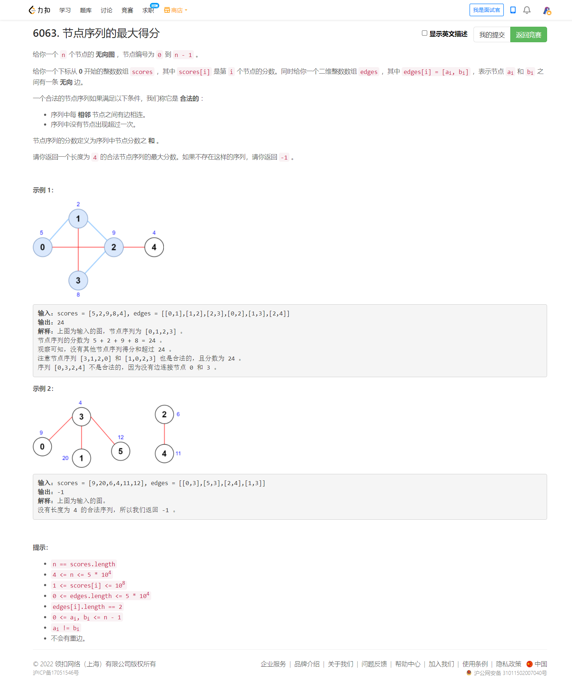

<!-- @import "[TOC]" {cmd="toc" depthFrom=1 depthTo=6 orderedList=false} -->

<!-- code_chunk_output -->

- [6063. 节点序列的最大得分（思维题，枚举边， nth_element 应用）](#6063-节点序列的最大得分思维题枚举边-nth_element-应用)

<!-- /code_chunk_output -->

没参加。幸好没参加，第三题疯狂 WA 。

### 6063. 节点序列的最大得分（思维题，枚举边， nth_element 应用）



提示 1-1
试试枚举可不可以。（做题时优先考虑最简单的算法）

提示 1-2
枚举谁呢？可以枚举点，也可以枚举边。

提示 2-1
简化问题可以帮助我们找到思路。

如果序列只要求 33 个点，要如何枚举？

提示 2-2
只要求 33 个点的话，可以枚举端点，也可以枚举中间的点。

提示 2-3
枚举中间的点是最方便的，算出与其相邻的分数最大的两个点即可。

这意味着枚举中间的东西是个可行的思路。

用这个启发去想想怎么解决原问题。

提示 3-1
设序列为 a−x−y−b（- 表示边），枚举 edges 中的每条边，作为序列最中间的那条边，即 x−y。

提示 3-2
我们需要把与 x 相邻的点中，分数最大且不同于 y 和 b 的点作为 a；把与 y 相邻的点中，分数最大且不同于 x 和 a 的点作为 b。

提示 3-3
与 x 相邻的点中，由于只需要与 y 和 b 不一样，我们仅需要保留分数最大的三个点，a 必定在这三个点中。

提示 3-4
剩下要做的，就是在枚举 edges 前，预处理出这三个点。

代码实现时，可以用排序、堆、分治（nth_element）或者手动维护求前三大。最优的时间复杂度为 O(n+m)。

作者：endlesscheng
链接：https://leetcode-cn.com/problems/maximum-score-of-a-node-sequence/solution/by-endlesscheng-dt8h/

```cpp
class Solution {
public:
    int maximumScore(vector<int> &scores, vector<vector<int>> &edges) {
        int n = scores.size();
        vector<vector<pair<int, int>>> g(n);
        for (auto &e : edges) {
            int x = e[0], y = e[1];
            g[x].emplace_back(-scores[y], y);  // 取负数，为了 nth_element
            g[y].emplace_back(-scores[x], x);
        }
        for (auto &vs : g)
            if (vs.size() > 3) {  // 找出最大的前 3 个数， nth_element 是排最小的
                nth_element(vs.begin(), vs.begin() + 3, vs.end());
                vs.resize(3);  // resize 结合 nth_element 妙用 
            }

        int ans = -1;
        for (auto &e : edges) {
            int x = e[0], y = e[1];
            for (auto &[score_a, a] : g[x])
                for (auto &[score_b, b] : g[y])
                    if (a != y && b != x && a != b)
                        ans = max(ans, -score_a + scores[x] + scores[y] - score_b);
        }
        return ans;
    }
};
```

**经验：**
- C++ 中可以用 `nth_element(a, a + k, a + n)` 来求前 k 个最大的数，这个函数的时间复杂度是 O(n)。注意前 k 个数不保证是从大到小的。
