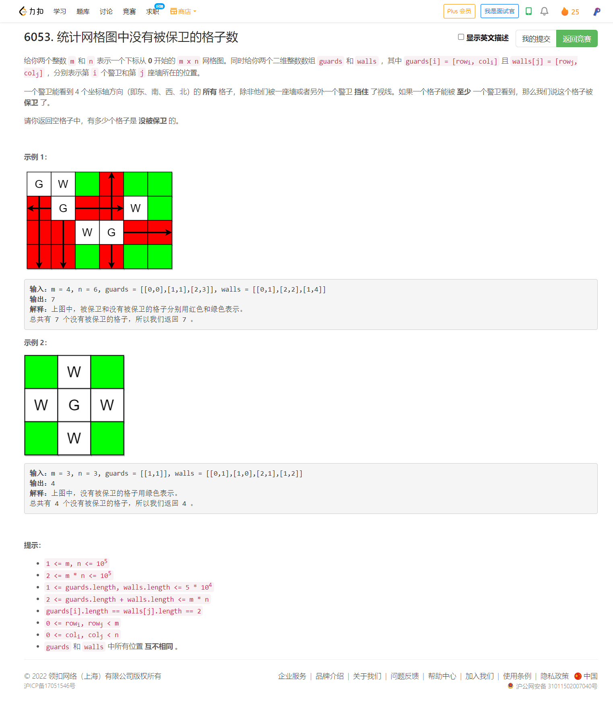
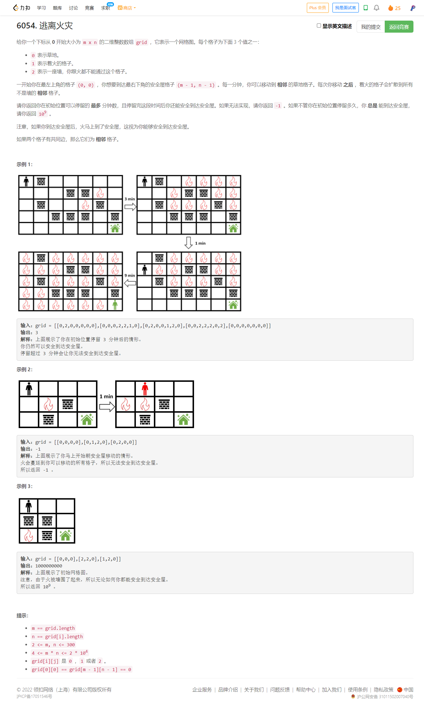

<!-- @import "[TOC]" {cmd="toc" depthFrom=1 depthTo=6 orderedList=false} -->

<!-- code_chunk_output -->

- [6053. 统计网格图中没有被保卫的格子数（模拟+分组循环）](#6053-统计网格图中没有被保卫的格子数模拟分组循环)
- [6054. 逃离火灾（bfs+二分）](#6054-逃离火灾bfs二分)

<!-- /code_chunk_output -->

T3很蠢。无 bug 过了，但是很慢。明明遍历一下就可以搞定的事，非得用二分找左右边界然后差分。是这样的，我明明可以根据墙进行遍历，然后判断两个墙之间有没有警察。可惜，可惜，做得太慢了。

T4 做的时候还剩半个小时，思路上又出现不完善的地方。没做出来，可惜，可惜。其实不难的。

### 6053. 统计网格图中没有被保卫的格子数（模拟+分组循环）



如下是我的笨方法。

```cpp
class Solution {
public:
    int countUnguarded(int m, int n, vector<vector<int>>& guards, vector<vector<int>>& walls) {
        int st[m][n];
        memset(st, 1, sizeof st);
        // walls 保存到 g 中 sort 起来
        vector<vector<int>> grow(m), gcol(n);
        for (auto&& gu: walls)
        {
            grow[gu[0]].push_back(gu[1]);
            gcol[gu[1]].push_back(gu[0]);
            st[gu[0]][gu[1]] = 0;
        }
        for (auto&& g: grow) sort(g.begin(), g.end());
        for (auto&& g: gcol) sort(g.begin(), g.end());
        // 做差分
        int drow[m][n + 1], dcol[n][m + 1];
        memset(drow, 0, sizeof drow);
        memset(dcol, 0, sizeof dcol);
        // 二分找边界
        for (auto&& gu: guards)
        {
            st[gu[0]][gu[1]] = 0;
            // 对于 gu[0] 行
            int l, r;
            int pos = lower_bound(grow[gu[0]].begin(), grow[gu[0]].end(), gu[1]) - grow[gu[0]].begin();
            if (pos == grow[gu[0]].size())
                l = pos == 0 ? 0 : (grow[gu[0]].back() + 1), r = n - 1;
            else if (pos == 0)
                l = 0, r = grow[gu[0]][0] - 1;
            else
                l = grow[gu[0]][pos - 1] + 1, r = grow[gu[0]][pos] - 1;
            // cout << "drow: " << l << " " << r << endl;
            if (l < gu[1]) drow[gu[0]][l] += 1, drow[gu[0]][gu[1]] -= 1;
            if (gu[1] < r) drow[gu[0]][gu[1] + 1] += 1, drow[gu[0]][r + 1] -= 1;
            // 对于 gu[1] 列
            pos = lower_bound(gcol[gu[1]].begin(), gcol[gu[1]].end(), gu[0]) - gcol[gu[1]].begin();
            if (pos == gcol[gu[1]].size())
                l = pos == 0 ? 0 : (gcol[gu[1]].back() + 1), r = m - 1;
            else if (pos == 0)
                l = 0, r = gcol[gu[1]][0] - 1;
            else
                l = gcol[gu[1]][pos - 1] + 1, r = gcol[gu[1]][pos] - 1;
            // cout << "dcol: " << l << " " << r << endl;
            if (l < gu[0]) dcol[gu[1]][l] += 1, dcol[gu[1]][gu[0]] -= 1;
            if (gu[0] < r) dcol[gu[1]][gu[0] + 1] += 1, dcol[gu[1]][r + 1] -= 1;
        }
        // 积分
        for (int i = 0; i < m; ++ i){
            for (int j = 1; j <= n; ++ j){
                drow[i][j] += drow[i][j - 1];
                // cout << drow[i][j] << " ";
            }
            // cout << endl;
        }
        for (int i = 0; i < n; ++ i)
            for (int j = 1; j <= m; ++ j)
                dcol[i][j] += dcol[i][j - 1];
        // 答案
        int cnt = 0;
        for (int i = 0; i < m; ++ i)
            for (int j = 0; j < n; ++ j)
                if (drow[i][j] <= 0 && dcol[j][i] <= 0 && st[i][j])
                    ++ cnt;
        return cnt;
    }
};
```

笨就笨在以 guard 为统计的单位，来看看聪明地以每行每列为扫描单位的方法。

```cpp
class Solution {
public:
    int countUnguarded(int m, int n, vector<vector<int>>& guards, vector<vector<int>>& walls) {
        int a[m][n];
        memset(a, 0, sizeof a);
        for (auto&& g: guards)
            a[g[0]][g[1]] = 1;
        for (auto&& w: walls)
            a[w[0]][w[1]] = 2;
        for (int i = 0; i < m; ++ i)
            for (int j = 0; j < n; ++ j)
            {
                if (a[i][j] == 2) continue;
                int st = j, has1 = 0;
                while (j < n && a[i][j] != 2)
                {
                    if (a[i][j] == 1) has1 = 1;
                    ++ j;
                }
                if (has1)
                    for (; st < j; ++ st)
                        if (a[i][st] == 0)
                            a[i][st] = -1;
            }
        for (int i = 0; i < n; ++ i)
            for (int j = 0; j < m; ++ j)
            {
                if (a[j][i] == 2) continue;
                int st = j, has1 = 0;
                while (j < m && a[j][i] != 2)
                {
                    if (a[j][i] == 1) has1 = 1;
                    ++ j;
                }
                if (has1)
                    for (; st < j; ++ st)
                        if (a[st][i] == 0)
                            a[st][i] = -1;
            }
        
        int res = 0;
        for (int i = 0; i < m; ++ i)
            for (int j = 0; j < n; ++ j)
                if (a[i][j] == 0) ++ res;
        return res;
    }
};
```

### 6054. 逃离火灾（bfs+二分）



```cpp
const int dirs[4][2] = {{-1, 0}, {1, 0}, {0, -1}, {0, 1}};

class Solution {
    bool check(vector<vector<int>> &grid, int t) {
        int m = grid.size(), n = grid[0].size();
        bool fire[m][n]; memset(fire, 0, sizeof(fire));
        vector<pair<int, int>> f, q;
        for (int i = 0; i < m; ++i)
            for (int j = 0; j < n; ++j)
                if (grid[i][j] == 1) {
                    fire[i][j] = true;
                    f.emplace_back(i, j);
                }
        auto spread_fire = [&]() {
            vector<pair<int, int>> nf;
            for (auto &[i, j] : f)
                for (auto [dx, dy] : dirs) {
                    int x = i + dx, y = j + dy;
                    if (0 <= x && x < m && 0 <= y && y < n && !fire[x][y] && grid[x][y] != 2) {
                        fire[x][y] = true;
                        nf.emplace_back(x, y);
                    }
                }
            f = move(nf);
        };
        while (t-- && !f.empty()) spread_fire(); // 蔓延至多 t 分钟的火势
        if (fire[0][0]) return false; // 起点着火

        bool vis[m][n]; memset(vis, 0, sizeof(vis));
        vis[0][0] = true;
        q.emplace_back(0, 0);
        while (!q.empty()) {
            vector<pair<int, int>> nq;
            for (auto &[i, j] : q)
                if (!fire[i][j])
                    for (auto [dx, dy] : dirs) {
                        int x = i + dx, y = j + dy;
                        if (0 <= x && x < m && 0 <= y && y < n && !fire[x][y] && !vis[x][y] && grid[x][y] != 2) {
                            if (x == m - 1 && y == n - 1) return true; // 我们安全了…暂时。
                            vis[x][y] = true;
                            nq.emplace_back(x, y);
                        }
                    }
            q = move(nq);
            spread_fire(); // 蔓延 1 分钟的火势
        }
        return false;
    }

public:
    int maximumMinutes(vector<vector<int>> &grid) {
        int m = grid.size(), n = grid[0].size();
        int left = -1, right = m * n;
        while (left < right) {
            int mid = (left + right + 1) / 2;
            if (check(grid, mid)) left = mid;
            else right = mid - 1;
        }
        return left < m * n ? left : 1e9;
    }
};
```
