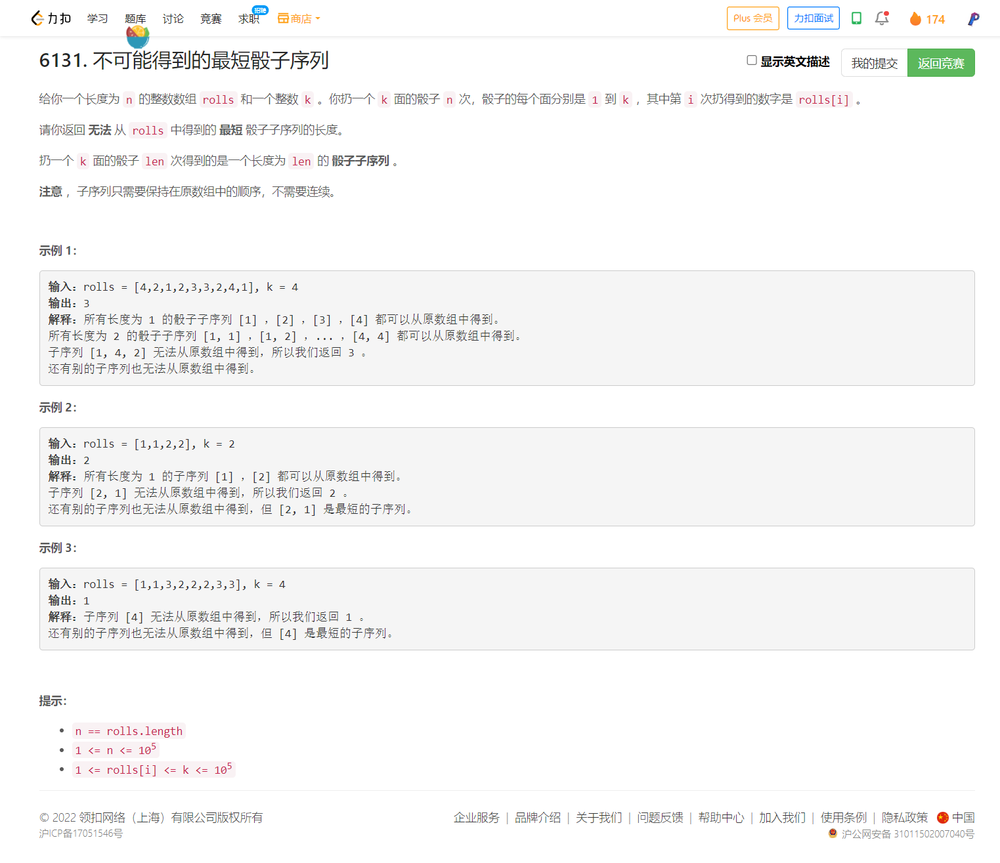

<!-- @import "[TOC]" {cmd="toc" depthFrom=1 depthTo=6 orderedList=false} -->

<!-- code_chunk_output -->

- [6131. 不可能得到的最短骰子序列（脑筋急转弯/贪心）](#6131-不可能得到的最短骰子序列脑筋急转弯贪心)

<!-- /code_chunk_output -->

T4 很简单，真的属于不敢想了。脑中题型还不够。

### 6131. 不可能得到的最短骰子序列（脑筋急转弯/贪心）



```cpp
class Solution {
public:
    int shortestSequence(vector<int>& rolls, int k) {
        set<int> s;
        int ans = 1;
        for (auto&& x: rolls)
        {
            s.insert(x);
            if (s.size() == k)
            {
                ++ ans;
                s = set<int>();
            }
        }
        return ans;
    }
};
```
