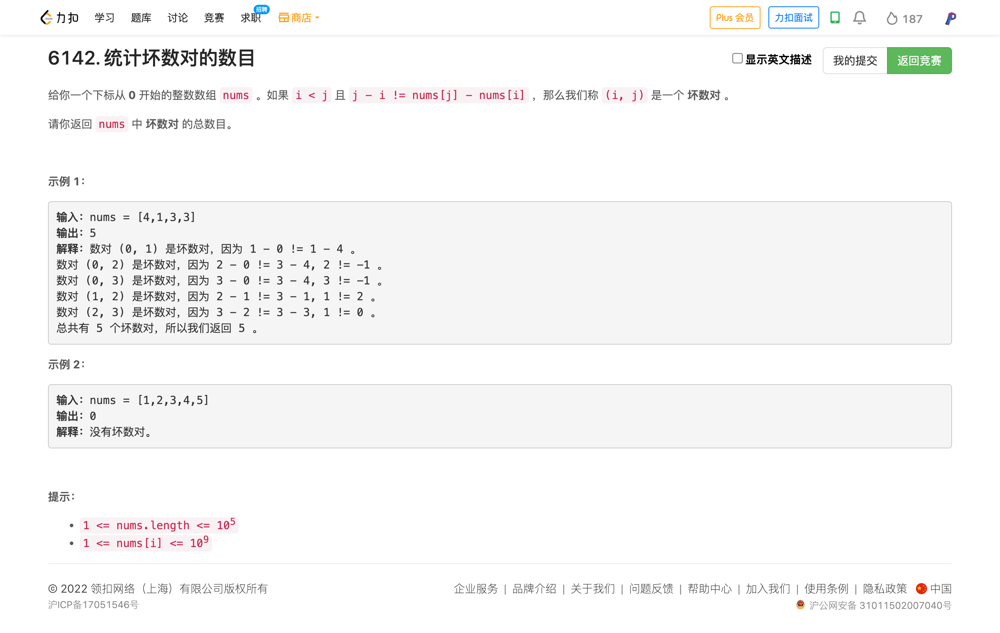
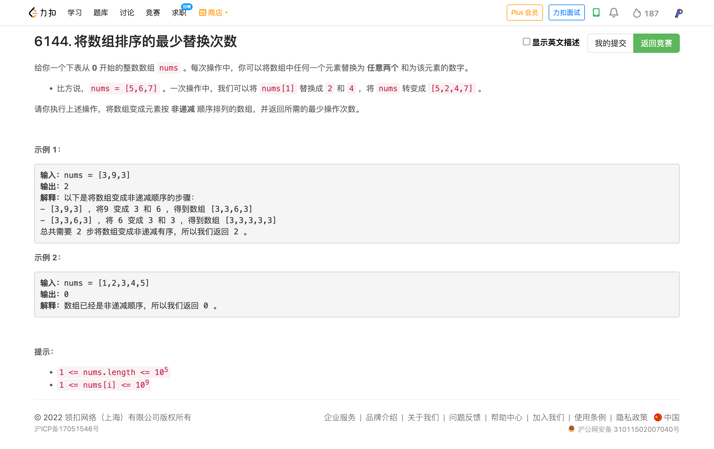

<!-- @import "[TOC]" {cmd="toc" depthFrom=1 depthTo=6 orderedList=false} -->

<!-- code_chunk_output -->

- [6142. 统计坏数对的数目（逆向思维）](#6142-统计坏数对的数目逆向思维)
- [6144. 将数组排序的最少替换次数（贪心+数学证明/二分）](#6144-将数组排序的最少替换次数贪心数学证明二分)

<!-- /code_chunk_output -->

T2 让我卡了一下，逆向思维想到了。许久没做题忘了把 int * int 先转为 long 了。

T4 大佬的代码好短，唉，我的思路差不多，但是我讨论了好多，反而不对了。唉。明早好好想想。

### 6142. 统计坏数对的数目（逆向思维）



```cpp
class Solution {
public:
    long long countBadPairs(vector<int>& nums) {
        long long n = nums.size();
        if (n == 1) return 0;
        long long bad = (1 + n - 1) * (n - 1) / 2;
        map<int, long long> m;
        for (int i = 0; i < n; ++ i)
            m[i - nums[i]] ++ ;
        for (auto&& [_, v]: m)
            bad -= (1 + v - 1) * (v - 1) / 2;
        return bad;
    }
};
```

### 6144. 将数组排序的最少替换次数（贪心+数学证明/二分）



我写了一大堆，讨论了一堆情况，大体思路是对的；但是数感不好没有严谨的数学讨论。我只想到了把最后一个数拆得尽量大，没有想到可以把一堆数拆得尽量大。还得看灵佬的证明。

倒着遍历 $\textit{nums}$ 。设当前操作出的最小值为 $m$ ，如果 $\textit{nums}[i]>m$ ，那么需要拆分 $\textit{nums}[i]$ ，使得拆分出的数字的最大值不超过 $m$ 。

设拆分出了 x 个数字，由于这 x 个数字都不超过 m ，即

$$
\textit{nums}[i] = v_1+v_2+\cdots+v_x \le m+m+\cdots+m = mx
$$

得

$$
x\ge\left\lceil\dfrac{\textit{nums}[i]}{m}\right\rceil
$$

为了使操作次数尽量小，应取等号，即

$$
x=\left\lceil\dfrac{\textit{nums}[i]}{m}\right\rceil
$$

操作次数为 $k=x-1$ 。

为了使拆分出的数字的最小值尽可能地大，拆分出的最小数字应为 $\left\lfloor\dfrac{\textit{nums}[i]}{x}\right\rfloor$ ，证明如下：

若这 x 个数均为 $\left\lfloor\dfrac{\textit{nums}[i]}{x}\right\rfloor$ ，那么有 $x\left\lfloor\dfrac{\textit{nums}[i]}{x}\right\rfloor\le \textit{nums}[i]$

若这 x 个数均为 $\left\lfloor\dfrac{\textit{nums}[i]}{x}\right\rfloor+1$ ，那么有

$$
x\left(\left\lfloor\dfrac{\textit{nums}[i]}{x}\right\rfloor+1\right)\ge x\left\lceil\dfrac{\textit{nums}[i]}{x}\right\rceil \ge \textit{nums}[i]
$$

联合得到

$$
x\left\lfloor\dfrac{\textit{nums}[i]}{x}\right\rfloor\le \textit{nums}[i]\le x\left(\left\lfloor\dfrac{\textit{nums}[i]}{x}\right\rfloor+1\right)

据此，我们可以给出一个拆分方案：将这 x 个数均初始化为 $\left\lfloor\dfrac{\textit{nums}[i]}{x}\right\rfloor$ ，然后给其中的 $\textit{nums}[i]-x\left\lfloor\dfrac{\textit{nums}[i]}{x}\right\rfloor$ 个数字加一，这样可以使这 x 数的和恰好为 $\textit{nums}[i]$ 。上面的不等式说明这样的方案是存在的。

代码实现时，无需判断 $\textit{nums}[i]$ 与 m 的大小关系。

复杂度分析
- 时间复杂度： $O(n)$ ，其中 n 为 $\textit{nums}$ 的长度。
- 空间复杂度： $O(1)$ ，仅用到若干额外变量。

```cpp
class Solution {
public:
    long long minimumReplacement(vector<int> &nums) {
        long ans = 0L;
        int m = nums.back();
        for (int i = int(nums.size()) - 2; i >= 0; --i) {
            int k = (nums[i] - 1) / m;  // 简化版本的上取整后减一
            ans += k;
            m = nums[i] / (k + 1);  // 除以 x （对 x 下取整）
        }
        return ans;
    }
};
```

此外还有一种二分的写法，明显较为复杂，但是数学负担较小（不用担心数学上的正确性）。

对下面代码做一些解释：

```cpp
int f(int a, int b)
```

将 $a$拆分成若干整数 $\{x[0], x[1], ..., x[m-1]\}$ ，在满足 $x[0]\le x[1]\le ... \le x[m-1]\le b$ 时， $x[0]$ 的最大值（贪心）。

`check(mid)` 为判断 x[0] 能否满足 x[0]>=mid ，这是满足单调性的。

```cpp
int g(a, b, c)
```

将 $a$ 拆分成若干整数 $\{x[0], x[1], ..., x[m-1]\}$ ，在满足 $b=x[0]\le x[1]\le ... \le x[m-1]\le c$ 时， $m$ 的最小值（这会使得拆分的次数最少，在1的判断中我们已经知道这样的数组一定存在）。

`check(mid)` 为判断数组中满足 x[i]=c 的个数能否满足 >=mid ，当 x[i]=c 的值越多时， m 会更小（贪心）。

```cpp
class Solution {
public:
    int f(int a, int b) {
        int l = 1, r = b;
        while(l < r) {
            int mid = (l + r + 1) / 2;
            int x = a % mid;
            int y = a / mid;
            if(y * (b - mid) >= x) {
                l = mid;
            } else {
                r = mid - 1;
            }
        }
        return l;
    }

    int g(int a, int b, int c) {
        int l = 0, r = a / c;
        while(l < r) {
            int mid = (l + r + 1) / 2;
            int x = (a - mid * c) % b;
            int y = (a - mid * c) / b;
            if(y * (c - b) >= x) {
                l = mid;
            } else {
                r = mid - 1;
            }
        }
        int res = r;
        res += (a - r * c) / b;
        return res;
    }
    
    long long minimumReplacement(vector<int>& nums) {
        long long res = 0;
        for(int i = nums.size() - 2; i >= 0; i--) {
            if(nums[i] > nums[i + 1]) {
                int x = f(nums[i], nums[i + 1]);
                res += g(nums[i], x, nums[i + 1]) - 1;
                nums[i] = x;
            }
        }
        return res;
    }
};

// 作者：moyan1082
// 链接：https://leetcode.cn/problems/minimum-replacements-to-sort-the-array/solution/by-moyan1082-vhhp/
// 来源：力扣（LeetCode）
// 著作权归作者所有。商业转载请联系作者获得授权，非商业转载请注明出处。
```
