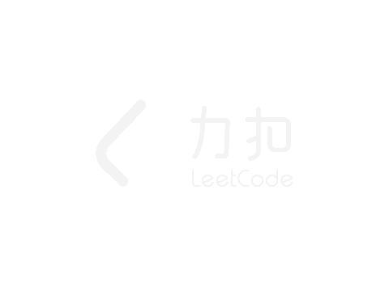
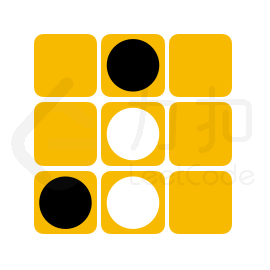
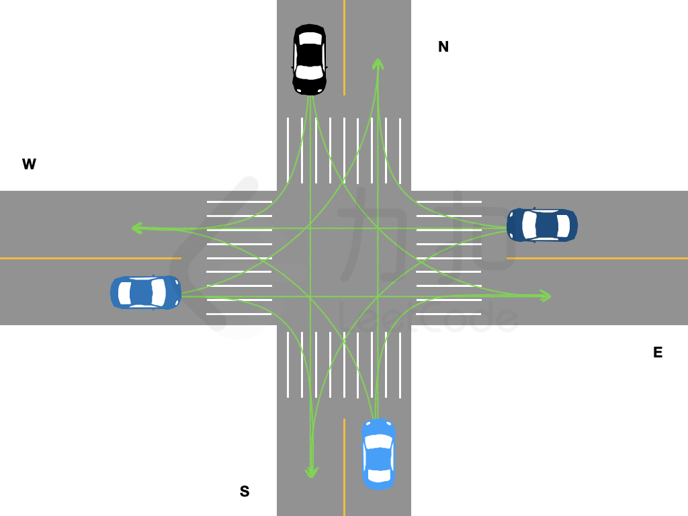

<!-- @import "[TOC]" {cmd="toc" depthFrom=1 depthTo=6 orderedList=false} -->

<!-- code_chunk_output -->

- [无人机方阵](#无人机方阵)
- [心算挑战](#心算挑战)
- [黑白翻转棋（经典bfs）](#黑白翻转棋经典bfs)
- [玩具套圈（智力题分析）](#玩具套圈智力题分析)
- [十字路口的交通（暴力dp+预处理动作组合）](#十字路口的交通暴力dp预处理动作组合)

<!-- /code_chunk_output -->

没参加。

### 无人机方阵

在 「力扣挑战赛」 开幕式的压轴节目 「无人机方阵」中，每一架无人机展示一种灯光颜色。 无人机方阵通过两种操作进行颜色图案变换：
- 调整无人机的位置布局
- 切换无人机展示的灯光颜色

给定两个大小均为 N*M 的二维数组 source 和 target 表示无人机方阵表演的两种颜色图案，由于无人机切换灯光颜色的耗能很大，请返回从 source 到 target 最少需要多少架无人机切换灯光颜色。

注意： 调整无人机的位置布局时无人机的位置可以随意变动。

示例 1：



```
输入：source = [[1,3],[5,4]], target = [[3,1],[6,5]]

输出：1

解释：
最佳方案为
将 [0,1] 处的无人机移动至 [0,0] 处；
将 [0,0] 处的无人机移动至 [0,1] 处；
将 [1,0] 处的无人机移动至 [1,1] 处；
将 [1,1] 处的无人机移动至 [1,0] 处，其灯光颜色切换为颜色编号为 6 的灯光；
因此从source 到 target 所需要的最少灯光切换次数为 1。
8819ccdd664e91c78cde3bba3c701986.gif
```

示例 2：
```
输入：source = [[1,2,3],[3,4,5]], target = [[1,3,5],[2,3,4]]

输出：0
解释：
仅需调整无人机的位置布局，便可完成图案切换。因此不需要无人机切换颜色
```

提示：
- n == source.length == target.length
- m == source[i].length == target[i].length
- 1 <= n, m <=100
- 1 <= source[i][j], target[i][j] <=$10^4$

```cpp
class Solution {
public:
    int minimumSwitchingTimes(vector<vector<int>>& source, vector<vector<int>>& target) {
        unordered_map<int, int> hash;
        int n = source.size(), m = source[0].size();
        for (int i = 0; i < n; ++ i)
            for (int j = 0; j < m; ++ j)
                hash[target[i][j]] ++ ;
        for (int i = 0; i < n; ++ i)
            for (int j = 0; j < m; ++ j)
                hash[source[i][j]] -- ;
        int res = 0;
        for (auto item : hash)
        {
            if (item.second < 0) res -= item.second;
        }
        return res;
    }
};
```

### 心算挑战

「力扣挑战赛」心算项目的挑战比赛中，要求选手从 `N` 张卡牌中选出 `cnt` 张卡牌，若这 `cnt` 张卡牌数字总和为偶数，则选手成绩「有效」且得分为 `cnt` 张卡牌数字总和。
给定数组 `cards` 和 `cnt，其中` `cards[i]` 表示第 `i` 张卡牌上的数字。 请帮参赛选手计算最大的有效得分。若不存在获取有效得分的卡牌方案，则返回 `0`。

示例 1：
```
输入：cards = [1,2,8,9], cnt = 3

输出：18

解释：选择数字为 1、8、9 的这三张卡牌，此时可获得最大的有效得分 1+8+9=18。
```

示例 2：
```
输入：cards = [3,3,1], cnt = 1

输出：0

解释：不存在获取有效得分的卡牌方案。
```

提示：
- 1 <= cnt <= cards.length <= $10^5$
- 1 <= cards[i] <= 1000

```cpp
// sort + 前缀和 奇数卡牌只能有偶数个张
// 枚举奇数出现次数： 0 2 4 6 ...
class Solution {
public:
    const static int N = 1e5 + 10;
    int sumA[N], sumB[N];
    int maxmiumScore(vector<int>& cards, int cnt) {
        memset(sumA, 0, sizeof sumA);
        memset(sumB, 0, sizeof sumB);
        sort(cards.begin(), cards.end(), greater<int>());
        int cntA = 0;
        for (int i = 0; i < cards.size(); ++ i)
            if (cards[i] % 2) sumA[++ cntA] = cards[i] + sumA[cntA];
        int cntB = 0;
        for (int i = 0; i < cards.size(); ++ i)
            if (!(cards[i] % 2)) sumB[++ cntB] += cards[i] + sumB[cntB];

        int res = 0;
        for (int i = 0; i <= min(cntA, cnt); i += 2)
            if (cnt - i <= cntB)
                res = max(res, sumA[i] + sumB[cnt - i]);
        return res;
    }
};
```

### 黑白翻转棋（经典bfs）

在 n*m 大小的棋盘中，有黑白两种棋子，黑棋记作字母 "X", 白棋记作字母 "O"，空余位置记作 "."。当落下的棋子与其他相同颜色的棋子在行、列或对角线完全包围（中间不存在空白位置）另一种颜色的棋子，则可以翻转这些棋子的颜色。

  

「力扣挑战赛」黑白翻转棋项目中，将提供给选手一个未形成可翻转棋子的棋盘残局，其状态记作 chessboard。若下一步可放置一枚黑棋，请问选手最多能翻转多少枚白棋。

注意：
- 若翻转白棋成黑棋后，棋盘上仍存在可以翻转的白棋，将可以 继续 翻转白棋
- 输入数据保证初始棋盘状态无可以翻转的棋子且存在空余位置

示例 1：
```
输入：chessboard = ["....X.","....X.","XOOO..","......","......"]

输出：3

解释：
可以选择下在 [2,4] 处，能够翻转白方三枚棋子。
```

示例 2：



```
输入：chessboard = [".X.",".O.","XO."]

输出：2

解释：
可以选择下在 [2,2] 处，能够翻转白方两枚棋子。
2126c1d21b1b9a9924c639d449cc6e65.gif
```

示例 3：


```
输入：chessboard = [".......",".......",".......","X......",".O.....","..O....","....OOX"]

输出：4

解释：
可以选择下在 [6,3] 处，能够翻转白方四枚棋子。
803f2f04098b6174397d6c696f54d709.gif
```

提示：
- 1 <= chessboard.length, chessboard[i].length <= 8
- chessboard[i] 仅包含 "."、"O" 和 "X"

```cpp
// 暴搜起点，然后 bfs 看八个方向哪个方向白字被包围了
#define PII pair<int, int>
#define MP(x, y) make_pair(x, y)

vector<string> current;
queue<PII> que;
int dx[8] = {-1, -1, 0, 1, 1,  1,  0, -1};
int dy[8] = {0,   1, 1, 1, 0, -1, -1, -1};

int solve(int n, int m, int x, int y){
    while(!que.empty()) que.pop();
    que.push(MP(x, y)); current[x][y] = 'X';
    //for (int i = 0; i < n; i++) cout<<current[i]<<endl;

    int ret = 0;
    while(!que.empty()){
        int x = que.front().first, y = que.front().second; que.pop();
        for (int k = 0; k < 8; k++){
            int tx = x + dx[k], ty = y + dy[k];
            while(0 <= tx && tx < n && 0 <= ty && ty < m && current[tx][ty] == 'O'){ 
                tx += dx[k];  ty += dy[k]; 
            }
            if (0 <= tx && tx < n && 0 <= ty && ty < m && current[tx][ty] == 'X'){
                int sx = x + dx[k], sy = y + dy[k];
                //cout<<x<<" "<<y<<" - "<<tx<<" "<<ty<<endl;
                //cout<<sx<<endl;
                while(sx != tx || sy != ty){
                    //cout<<sx<<" "<<sy<<endl;
                    current[sx][sy] = 'X';
                    ret += 1;
                    que.push(MP(sx, sy));
                    sx += dx[k]; sy += dy[k];
                    
                }
            }
        }
    }
    //cout<<ret<<endl;
    return ret;
}

class Solution {
public:
    int flipChess(vector<string>& chessboard) {
        int n = chessboard.size(), m = chessboard[0].size();
        int ans = 0;
        for (int i = 0; i < n; i++){
            for (int j = 0; j < m; j++){
                if (chessboard[i][j] == '.'){
                    current = chessboard;
                    ans = max(ans, solve(n, m, i, j));
                }
            }
        }
        return ans;
    }
};
```

### 玩具套圈（智力题分析）

「力扣挑战赛」场地外，小力组织了一个套玩具的游戏。所有的玩具摆在平地上，`toys[i]` 以 `[xi,yi,ri]` 的形式记录了第 i 个玩具的坐标 `(xi,yi)` 和半径 ri。小扣试玩了一下，他扔了若干个半径均为 r 的圈，`circles[j]` 记录了第 j 个圈的坐标 `(xj,yj)`。套圈的规则如下：
- 若一个玩具被某个圈完整覆盖了（即玩具的任意部分均在圈内或者圈上），则该玩具被套中。
- 若一个玩具被多个圈同时套中，最终仅计算为套中一个玩具

请帮助小扣计算，他成功套中了多少玩具。

注意：
- 输入数据保证任意两个玩具的圆心不会重合，但玩具之间可能存在重叠。

示例 1：


```
输入：toys = [[3,3,1],[3,2,1]], circles = [[4,3]], r = 2

输出：1

解释： 如图所示，仅套中一个玩具
```

示例 2：


```
输入：toys = [[1,3,2],[4,3,1],[7,1,2]], circles = [[1,0],[3,3]], r = 4

输出：2

解释： 如图所示，套中两个玩具
```

提示：
- 1 <= toys.length <= $10^4$
- 0 <= toys[i][0], toys[i][1] <= $10^9$
- 1 <= circles.length <= $10^4$
- 0 <= circles[i][0], circles[i][1] <= $10^9$
- 1 <= toys[i][2], r <= 10

暴搜肯定超时。参考：[坑神](https://www.bilibili.com/video/BV1Qg411F7ix?p=5)

玩具是 $(x_i, y_i, r_i)$ ，圈是 $(x_j, y_j)$ ，半径是 $r$ ，则如果“套中”，必满足：

$$\sqrt{(x_i - x_j)^2 + (y_i - y_j)^2} \le r - r_i$$

注意到 $r, r_i$ 取值范围为 $[1, 10]$ ，则必有 $r - r_i \le 9$ ，因此必有：
- $|| x_i - x_j || \le 9$
- $|| y_i - y_j || \le 9$


因此，对于每一个套圈，我们向其上下左右搜索共 400 次就可以搜索到有可能被套到的全部玩具。


```cpp
// toys 和 circles 都很大，暴搜 1e4 * 1e4 *根号运算 不可取
// 而 r 很小，可以进行如上推导
#define PII pair<int, int>
#define MP(x, y) make_pair(x, y)
#define LL long long
#define sqr(x) (1LL * (x) * 1LL * (x))

const int MAXN = 1e4 + 50;
bool okay[MAXN];
set<PII> cur;

class Solution {
public:
    int circleGame(vector<vector<int>>& toys, vector<vector<int>>& circles, int r) {
        int n = toys.size(), m = circles.size();
        
        sort(toys.begin(), toys.end(), [&](const vector<int>& a, const vector<int>& b){
            if (a[0] != b[0]) return a[0] < b[0];
            return a[1] < b[1];
        });
        
        sort(circles.begin(), circles.end(), [&](const vector<int>& a, const vector<int>& b){
            if (a[0] != b[0]) return a[0] < b[0];
            return a[1] < b[1];
        });
        
        for (int i = 0; i < n; i++) okay[i] = false;  // 玩具 i 是否被套住

        cur.clear();
        for (int i = 0, j = 0, dj = 0; i < m; i++){  // 对于第 i 个套圈，找到其 [x - 10, x + 10] 内的玩具指针 [i, dj] （玩具是根据 x 排好序了的）
            int x0 = circles[i][0], y0 = circles[i][1];
            while(j < n && toys[j][0] <= x0 + 10){
                cur.insert(MP(toys[j][1], j));  // set 里存的是 <y坐标, 对应编号>
                j += 1;
            }
            while(dj < j && toys[dj][0] < x0 - 10){
                cur.erase(MP(toys[dj][1], dj));
                dj += 1;
            }
            
            set<PII>::iterator it = cur.lower_bound(MP(y0 - 10, 0));  // 二分，找到 [y - 10, y + 10] 中 [y - 10] 的 toy
            while(it != cur.end()){
                // cout<<it->first<<" "<<it->second<<endl;
                if (it->first > y0 + 10) break;  // set<PII>::iterator it 用 it->first it->second
                int x = it->second;
                if (r >=  toys[x][2] && sqr(x0 - toys[x][0]) + sqr(y0 - toys[x][1]) <= sqr(r - toys[x][2])) okay[x] = true;
                it++;
            }
            // cout<<"#"<<endl;
        }
        
        int ans = 0;
        for (int i = 0; i < n; i++) if (okay[i]) ans += 1;
        
        
        return ans;
    }
};
```

**经验：**
- `set<PII>::iterator it` 用 `it->first it->second`

### 十字路口的交通（暴力dp+预处理动作组合）

前往「力扣挑战赛」场馆的道路上，有一个拥堵的十字路口，该十字路口由两条双向两车道的路交叉构成。由于信号灯故障，交警需要手动指挥拥堵车辆。假定路口没有新的来车且一辆车从一个车道驶入另一个车道所需的时间恰好为一秒钟，长度为 4 的一维字符串数组 `directions` 中按照 东、南、西、北 顺序记录了四个方向从最靠近路口到最远离路口的车辆计划开往的方向。其中：
- "E" 表示向东行驶；
- "S" 表示向南行驶；
- "W" 表示向西行驶；
- "N" 表示向北行驶。

交警每秒钟只能指挥各个车道距离路口最近的一辆车，且每次指挥需要满足如下规则：
- 同一秒钟内，一个方向的车道只允许驶出一辆车；
- 同一秒钟内，一个方向的车道只允许驶入一辆车；
- 同一秒钟内，车辆的行驶路线不可相交。

请返回最少需要几秒钟，该十字路口等候的车辆才能全部走完。

各个车道驶出的车辆可能的行驶路线如图所示：



注意：
- 测试数据保证不会出现掉头行驶指令，即某一方向的行驶车辆计划开往的方向不会是当前车辆所在的车道的方向;
- 表示堵塞车辆行驶方向的字符串仅用大写字母 "E"，"N"，"W"，"S" 表示。

示例 1：
```
输入：directions = ["W","N","ES","W"]

输出：2

解释：
第 1 秒：东西方向排在最前的车先行，剩余车辆状态 ["","N","S","W"]；
第 2 秒：南、西、北方向的车行驶，路口无等待车辆；
因此最少需要 2 秒，返回 2。
```

示例 2：
```
输入：directions = ["NS","WE","SE","EW"]

输出：3

解释：
第 1 秒：四个方向排在最前的车均可驶出；
第 2 秒：东南方向的车驶出，剩余车辆状态 ["","","E","W"]；
第 3 秒：西北方向的车驶出。
```

提示：
- directions.length = 4
- 0 <= directions[i].length <= 20

```cpp
// 数据范围 20 因此暴力 dp (20 * 4)^4 <= 1e8

const int MAXN = 25;
// OPBAN[op][k] 表示当前人执行 op 操作时，其顺时针 k 方向的路口的人不能执行什么操作
// op ： 0 右转 1 直行 2 左转
// k  ： 0 顺时针1个路口 1 顺时针2个路口 2 顺时针3个路口
// 取值： 0 都可以走 1 直行不行 2 左转不行 3 直行和左转都不行
const int OPBAN[3][3] = {
    {0, 0, 0},
    {1, 2, 3},
    {3, 1, 2},
};

int dp[MAXN][MAXN][MAXN][MAXN];
// dp[i][j][p][q] 表示 ESWN 四个方向的车道分别走到了第几量车的最小时间消耗
vector<int> aOP;

class Solution {
public:
    int trafficCommand(vector<string>& directions) {
        map<char, int> c2i; c2i['E'] = 0; c2i['S'] = 1; c2i['W'] = 2; c2i['N'] = 3; 
        
        vector<vector<int> > ops;  // 原有的表达方法不好
        for (int i = 0; i < 4; i++){  // 对于每条车道，用 0 代表右转， 1 代表直行， 2 左， 3 不动
            vector<int> row;
            for (char c: directions[i]){
                int nx = c2i[c];
                int dx = (nx - i + 4) % 4;
                if (dx == 1) row.push_back(2);
                if (dx == 2) row.push_back(1);
                if (dx == 3) row.push_back(0);
            }
            ops.push_back(row);
        }
        // for (int i = 0; i < 4; i++){
        //     for (int k = 0; k < ops[i].size(); k++) printf("%d ", ops[i][k]);
        //     printf("\n");
        // }
        // cout<<"###"<<endl;
        
        int cop[4], cnt[4]; aOP.clear();  // aOP 是有效动作，枚举 4 * 4 * 4 * 4 种情况，记录其中合法的
        for (int i = 0; i <= 3; i++) for (int j = 0; j <= 3; j++) for (int p = 0; p <= 3; p++) for (int q = 0; q <= 3; q++){
            cop[0] = i; cop[1] = j; cop[2] = p; cop[3] = q;  // 各个方向上，各个车的动作
            cnt[0] = cnt[1] = cnt[2] = cnt[3] = 0;  // 同一秒内，一个方向车道只允许驶入一辆车
            bool flag = true;
            for (int k = 0; k < 4; k++){
                if (cop[k] == 0) cnt[(k + 3) % 4] += 1;
                if (cop[k] == 1) cnt[(k + 2) % 4] += 1;
                if (cop[k] == 2) cnt[(k + 1) % 4] += 1;
                if (cop[k] == 3) continue;
                for (int nk = 0; nk < 3; nk++){
                    int nkop = cop[(k + nk + 1) % 4];  // 车道 k + nk + 1 % 4 的动作时 nkop
                    if (nkop != 3 && (OPBAN[cop[k]][nk] & nkop)) flag = false;  // 如果不是不动，且他执行操作nkop和我执行的cop[k]有冲突
                }
            }
            for (int k = 0; k < 4; k++) if (cnt[k] > 1) flag = false;  // 同一秒内，一个方向车道只允许驶入一辆车
            if (flag) aOP.push_back(i * 1000 + j * 100 + p * 10 + q);  // 记录有效的动作组合 {i, j, p, q}
        }
        
        // 开始 dp
        memset(dp, -1, sizeof(dp));
        dp[0][0][0][0] = 0;
        int a = ops[0].size(), b = ops[1].size(), c = ops[2].size(), d = ops[3].size();
        
        for (int i = 0; i <= a; i++) for (int j = 0; j <= b; j++) for (int p = 0; p <= c; p++) for (int q = 0; q <= d; q++){
            if (dp[i][j][p][q] == -1) continue;
            for (int v: aOP){  // 是否是有效动作
                int c0 = v / 1000; v %= 1000;
                int c1 = v / 100; v %= 100; 
                int c2 = v / 10; v %= 10;
                int c3 = v;
                int ni = i, nj = j, np = p, nq = q;  // ni 表示 i 的同车道后一辆车（或者 i 本身）
                if (ni < a && ops[0][ni] == c0) ni += 1;  // 如果是有效动作，则 ni 是 i 的同车道后一辆车
                if (nj < b && ops[1][nj] == c1) nj += 1;  // 否则 i 车道车不动
                if (np < c && ops[2][np] == c2) np += 1;
                if (nq < d && ops[3][nq] == c3) nq += 1;
                if (dp[ni][nj][np][nq] == -1 || dp[ni][nj][np][nq] > dp[i][j][p][q] + 1) {
                    dp[ni][nj][np][nq] = dp[i][j][p][q] + 1;  // dp 是 min 任务
                    // cout<<">"<<ni<<" "<<nj<<" "<<np<<" "<<nq<<endl;
                }
            }
        }
        
        return dp[a][b][c][d];
    }
};
```
