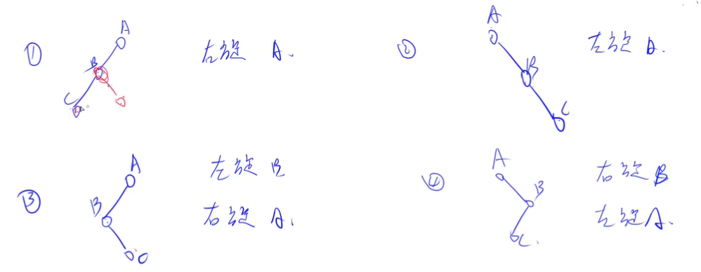
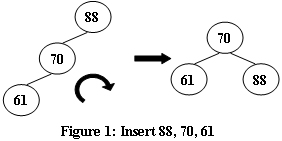
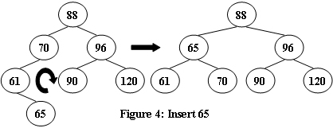
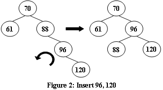
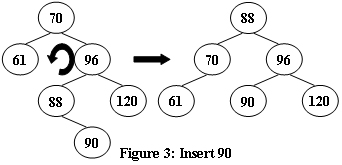

# AVL树

AVL 树的意义：是二分查找树 BST 。二分查找树查找某个值时，时间复杂度是 `O(h)` ，因此，我们让树的尽可能平衡，即最大高度尽可能的小。因此有了 AVL 。

<!-- @import "[TOC]" {cmd="toc" depthFrom=3 depthTo=6 orderedList=false} -->

<!-- code_chunk_output -->

- [左旋和右旋](#左旋和右旋)
- [插入的四种情况](#插入的四种情况)
  - [（一）新数字插到了左子树，导致左子树比右子树高2；左孩子的左子树比其右子树高1](#一新数字插到了左子树导致左子树比右子树高2左孩子的左子树比其右子树高1)
  - [（二）新数字插到了左子树，导致左子树比右子树高2；左孩子的右子树比其左子树高1](#二新数字插到了左子树导致左子树比右子树高2左孩子的右子树比其左子树高1)
  - [（三）新数字插到了右子树，导致右子树比左子树高2；右孩子的右子树比其左子树高1](#三新数字插到了右子树导致右子树比左子树高2右孩子的右子树比其左子树高1)
  - [（四）新数字插到了右子树，导致右子树比左子树高2；右孩子的左子树比其右子树高1](#四新数字插到了右子树导致右子树比左子树高2右孩子的左子树比其右子树高1)
- [插入的代码](#插入的代码)
- [例题](#例题)

<!-- /code_chunk_output -->


[百度百科](https://baike.baidu.com/item/AVL%E6%A0%91/10986648)：在计算机科学中，AVL树是最先发明的自平衡二叉查找树。在AVL树中任何节点的两个子树的高度最大差别为1，所以它也被称为高度平衡树。增加和删除可能需要通过一次或多次树旋转来重新平衡这个树。AVL树得名于它的发明者G. M. Adelson-Velsky和E. M. Landis，他们在1962年的论文《An algorithm for the organization of information》中发表了它。

BST 本质上是维护一个有序序列，AVL 树中的左旋右旋操作，并不会改变树的中序遍历结果。


上图中把 A 右旋是怎么做的呢？把 B 旋转到根节点，然后把 A 变成 B 的右孩子，把 E 补偿给 A 作为 A 的左孩子。

### 左旋和右旋


**对节点 u 右旋：**
- 根 u 的左儿子变成新的根 p
- 根的左儿子变成新的根 p 原本的右儿子
- 新的根 p 的右儿子变成了原本的根 u
- u 和 p 的高度都需要更新

```cpp
void R(int& u)
{
    int p = l[u];
    l[u] = r[p], r[p] = u;
    update(u), update(p);
    u = p;
}
```

**对节点 u 右旋：**
- 根 u 的右儿子变成新的根 p
- 根的右儿子变成新的根 p 原本的左儿子
- 新的根 p 的左儿子变成了原本的根 u
- u 和 p 的高度都需要更新

```cpp
void L(int& u)
{
    int p = r[u];
    r[u] = l[p], l[p] = u;
    update(u), update(p);
    u = p;
}
```

高度更新由左右儿子决定，因为求高度时，默认其两个儿子已经更新完高度了：
```cpp
void update(int u)
{
    h[u] = max(h[l[u]], h[r[u]]) + 1;
}
```

### 插入的四种情况



#### （一）新数字插到了左子树，导致左子树比右子树高2；左孩子的左子树比其右子树高1

对于四种情况中的①。应该右旋 A 。



实例如上图，右旋 88 即可。

#### （二）新数字插到了左子树，导致左子树比右子树高2；左孩子的右子树比其左子树高1

对于四种情况中的③。应该左旋 B 再右旋 A 。



对应的情况如如下：
```cpp
  70
61
  65
// 左旋 61
    70
  65
61
// 右旋 70
  65
61  70
```

#### （三）新数字插到了右子树，导致右子树比左子树高2；右孩子的右子树比其左子树高1

对于四种情况中的②。应该左旋 A 。



对应的情况如 `88 96 120` ，左旋 88 即可。

#### （四）新数字插到了右子树，导致右子树比左子树高2；右孩子的左子树比其右子树高1

对于四种情况中的④。应该右旋 B 再左旋 A 。



对应的情况如如下：
```cpp
  70
96
  88
// 右旋 96
70
  88
    96
// 左旋 70
  96
70  88
```

### 插入的代码

```cpp
void insert(int& u, int w)
{
    if (!u) u = ++ idx, v[u] = w;
    else if (w < v[u])
    {
        insert(l[u], w);
        if (get_balance(u) == 2)
        {
            if (get_balance(l[u]) == 1) R(u);
            else L(l[u]), R(u);
        }
    }
    else
    {
        insert(r[u], w);
        if (get_balance(u) == -2)
        {
            if (get_balance(r[u]) == -1) L(u);
            else R(r[u]), L(u);
        }
    }

    update(u);
}
```

### 例题

- [AVL树的根 1066 Root of AVL Tree (25 point(s))](./pat.5.2.md#avl树的根-1066-root-of-avl-tree-25-points)
- [判断完全 AVL 树 1123 Is It a Complete AVL Tree (30 point(s))](./pat.5.2.md#判断完全-avl-树-1123-is-it-a-complete-avl-tree-30-points)