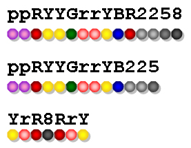

<!-- @import "[TOC]" {cmd="toc" depthFrom=3 depthTo=3 orderedList=false} -->

<!-- code_chunk_output -->

- [老鼠和大米 1056 Mice and Rice (25 point(s))](#老鼠和大米-1056-mice-and-rice-25-points)
- [才华与德行 1062 Talent and Virtue (25 point(s))](#才华与德行-1062-talent-and-virtue-25-points)
- [A + B 和 C 1065 A+B and C (64bit) (20 point(s))](#a-b-和-c-1065-ab-and-c-64bit-20-points)
- [数字黑洞 1069 The Black Hole of Numbers (20 point(s))](#数字黑洞-1069-the-black-hole-of-numbers-20-points)
- [研究生入学 1080 Graduate Admission (30 point(s))](#研究生入学-1080-graduate-admission-30-points)
- [成绩单 1083 List Grades (25 point(s))](#成绩单-1083-list-grades-25-points)
- [买还是不买 1092 To Buy or Not to Buy (20 point(s))](#买还是不买-1092-to-buy-or-not-to-buy-20-points)
- [校园内的汽车 1095 Cars on Campus (30 point(s))](#校园内的汽车-1095-cars-on-campus-30-points)
- [螺旋矩阵 1105 Spiral Matrix (25 point(s))](#螺旋矩阵-1105-spiral-matrix-25-points)

<!-- /code_chunk_output -->

### 老鼠和大米 1056 Mice and Rice (25 point(s))

<p>老鼠和大米是一个编程竞赛的主题，程序员们需要编写代码控制老鼠在给定的地图上移动，每只老鼠的目标都是吃掉尽可能多的大米，从而变成肥老鼠。</p>

共有 $N_P$ 个程序员参赛，入场顺序随机，每 $N_G$ 个程序员被分为一组。

<p>组中最胖的老鼠获胜，并进入下一轮。</p>

<p>所有在本回合中失败的老鼠排名都相同。</p>

获胜者继续每 $N_G$ 个一组，进行比赛，直到决出唯一胜者为止。

<p>为了简单起见，当程序员们提交了代码后，他们的老鼠的最终重量就已经确定了。</p>

<p>给定所有老鼠的重量和程序员们的参赛顺序，请你为程序员们排名。</p>

<h4>输入格式</h4>

第一行包含两个整数 $N_P$ 和 $N_G$，分别表示总参赛人数以及每组最多人数。

如果分组到最后，剩下不足 $N_G$ 个人，则剩下的所有人分为一组。

所有 $N_P$ 只老鼠的编号为 $0 \sim N_P-1$。

第二行包含 $N_P$ 个不同的非负整数 $W_i(i = 0,1,...,N_P-1)$，其中 $W_i$ 表示编号为 $i$ 的老鼠的重量。

第三行包含一个 $0 \sim N_P-1$ 的排列，表示老鼠的具体参赛顺序，以样例为例，$6$ 号老鼠排在第一个，$0$ 号老鼠排在第二个，以此类推。

<h4>输出格式</h4>

输出一行 $N_P$ 个整数，其中第 $i$ 个整数表示编号为 $i$ 的老鼠的最终排名。

<h4>数据范围</h4>

- $1 \le N_P \le 1000$，
- $2 \le N_G \le 1000$,
- $0 \le W_i \le 1000$。

<h4>输入样例：</h4>

<pre><code>
11 3
25 18 0 46 37 3 19 22 57 56 10
6 0 8 7 10 5 9 1 4 2 3
</code></pre>

<h4>输出样例：</h4>

<pre><code>
5 5 5 2 5 5 5 3 1 3 5
</code></pre>

#### 1056 Mice and Rice (25 point(s))
Mice and Rice is the name of a programming contest in which each programmer must write a piece of code to control the movements of a mouse in a given map. The goal of each mouse is to eat as much rice as possible in order to become a FatMouse.

First the playing order is randomly decided for $N_P$​ programmers. Then every $N_G$  programmers are grouped in a match. The fattest mouse in a group wins and enters the next turn. All the losers in this turn are ranked the same. Every $N_G$ ​winners are then grouped in the next match until a final winner is determined.

For the sake of simplicity, assume that the weight of each mouse is fixed once the programmer submits his/her code. Given the weights of all the mice and the initial playing order, you are supposed to output the ranks for the programmers.

#### Input Specification:
Each input file contains one test case. For each case, the first line contains 2 positive integers: $N_P$ and $N_G$ ​(≤1000), the number of programmers and the maximum number of mice in a group, respectively. If there are less than $N_G$ ​mice at the end of the player's list, then all the mice left will be put into the last group. The second line contains $N_P$ ​distinct non-negative numbers $W_i (i=0,⋯,N_P −1)$ where each $W_i$ ​is the weight of the i-th mouse respectively. The third line gives the initial playing order which is a permutation of $0,⋯,N_P ​−1$ (assume that the programmers are numbered from 0 to $N_P−1$). All the numbers in a line are separated by a space.

#### Output Specification:
For each test case, print the final ranks in a line. The i-th number is the rank of the i-th programmer, and all the numbers must be separated by a space, with no extra space at the end of the line.

```cpp
```

### 才华与德行 1062 Talent and Virtue (25 point(s))

大约 $900$ 年前，中国哲学家司马光写了一本历史书，其中谈到了人们的才华和德行。

<p>按照他的理论，才华和德行都杰出的人是圣人。</p>

<p>才华一般，德行过人的人是君子。</p>

<p>才华，德行都一般，但是德行胜过才华的人是愚人。</p>

<p>以上都不满足的是小人。</p>

<p>现在，给定每个人的才华和德行，请你根据司马光的理论对他们排名。</p>

<h4>输入格式</h4>

第一行包含三个整数，$N$，表示总人数，$L$，表示合格分数线，仅对才华和德行均不低于此线的那些人进行排名，$H$，表示优秀分数线。

<p>下面对四种人进行分类：</p>

- 才华和德行均不低于 $H$ 的是圣人，圣人们按德才总分不升序排序。
- 才华低于 $H$，德行不低于 $H$ 的是君子，君子们按德才总分不升序排序，他们都低于圣人。
- 才华和德行均低于 $H$，但是德行不低于才华的是愚人，愚人们按德才总分不升序排序，他们都低于君子。
- 能够参与排名的，不属于以上三类人的均是小人，小人们按德才总分不升序排序，他们都低于愚人。

接下来 $N$ 行，每行包含一个人的信息，包括一个人的ID，德行，才华。（注意顺序）

ID 是唯一 $8$ 位数字，德行和才华是 $[0,100]$ 之间的整数。

<h4>输出格式</h4>

第一行包含整数 $M$，表示总参与排名的人数。

接下来 $M$ 行，按照排名规则，从前到后输出每个人的信息，每个人占一行。

<p>依次输出所有圣人、君子、愚人和小人。</p>

<p>同一类人之中，如果出现总分相同的情况，则按德行分不升序排名，如果得分完全相同，则按 ID 升序排名。</p>

<h4>数据范围</h4>

- $1 \le N \le 10^5$,
- $60 \le L < H < 100$

<h4>输入样例：</h4>

<pre><code>
14 60 80
10000001 64 90
10000002 90 60
10000011 85 80
10000003 85 80
10000004 80 85
10000005 82 77
10000006 83 76
10000007 90 78
10000008 75 79
10000009 59 90
10000010 88 45
10000012 80 100
10000013 90 99
10000014 66 60
</code></pre>

<h4>输出样例：</h4>

<pre><code>
12
10000013 90 99
10000012 80 100
10000003 85 80
10000011 85 80
10000004 80 85
10000007 90 78
10000006 83 76
10000005 82 77
10000002 90 60
10000014 66 60
10000008 75 79
10000001 64 90
</code></pre>

#### 1062 Talent and Virtue (25 point(s))
About 900 years ago, a Chinese philosopher Sima Guang wrote a history book in which he talked about people's talent and virtue. According to his theory, a man being outstanding in both talent and virtue must be a "sage（圣人）"; being less excellent but with one's virtue outweighs talent can be called a "nobleman（君子）"; being good in neither is a "fool man（愚人）"; yet a fool man is better than a "small man（小人）" who prefers talent than virtue.

Now given the grades of talent and virtue of a group of people, you are supposed to rank them according to Sima Guang's theory.

#### Input Specification:
Each input file contains one test case. Each case first gives 3 positive integers in a line: $N (≤10^5)$, the total number of people to be ranked; L (≥60), the lower bound of the qualified grades -- that is, only the ones whose grades of talent and virtue are both not below this line will be ranked; and H (<100), the higher line of qualification -- that is, those with both grades not below this line are considered as the "sages", and will be ranked in non-increasing order according to their total grades. Those with talent grades below H but virtue grades not are cosidered as the "noblemen", and are also ranked in non-increasing order according to their total grades, but they are listed after the "sages". Those with both grades below H, but with virtue not lower than talent are considered as the "fool men". They are ranked in the same way but after the "noblemen". The rest of people whose grades both pass the L line are ranked after the "fool men".

Then N lines follow, each gives the information of a person in the format:
```
ID_Number Virtue_Grade Talent_Grade
```
where ID_Number is an 8-digit number, and both grades are integers in [0, 100]. All the numbers are separated by a space.

#### Output Specification:
The first line of output must give M (≤N), the total number of people that are actually ranked. Then M lines follow, each gives the information of a person in the same format as the input, according to the ranking rules. If there is a tie of the total grade, they must be ranked with respect to their virtue grades in non-increasing order. If there is still a tie, then output in increasing order of their ID's.

```cpp

```

### A + B 和 C 1065 A+B and C (64bit) (20 point(s))

给定三个整数 $A,B,C$，请你判断 $A+B>C$ 是否成立。

<h4>输入格式</h4>

第一行包含整数 $T$，表示共有 $T$ 组测试数据。

接下来 $T$ 行，每行包含一组数据，即三个整数 $A,B,C$。

<h4>输出格式</h4>

每行输出一个结果，如果不等式成立，输出 <code>Case #X: true</code>，否则输出 <code>Case #X: false</code>，其中 $X$ 表示数据编号（从 $1$ 开始）。

<h4>数据范围</h4>

$-2^{63} \le A,B,C \le 2^{63}-1$

<h4>输入样例：</h4>

<pre><code>
3
1 2 3
2 3 4
9223372036854775807 -9223372036854775808 0
</code></pre>

<h4>输出样例：</h4>

<pre><code>
Case #1: false
Case #2: true
Case #3: false
</code></pre>

#### 1065 A+B and C (64bit) (20 point(s))
Given three integers A, B and C in $(−2^{63},2^{63})$, you are supposed to tell whether A+B>C.

#### Input Specification:
The first line of the input gives the positive number of test cases, T (≤10). Then T test cases follow, each consists of a single line containing three integers A, B and C, separated by single spaces.

#### Output Specification:
For each test case, output in one line `Case #X: true` if A+B>C, or `Case #X: false` otherwise, where X is the case number (starting from 1).

```cpp

```

### 数字黑洞 1069 The Black Hole of Numbers (20 point(s))

<p>对于任何各位数字不完全相同的四位整数，我们将该数字的四个数位按非升序排列，得到一个数字，再按非降序排列，得到另一个数字，将两个数字相减就能得到一个新的数字。</p>

<p>不断重复这个过程，我们就能得到数字<code>6174</code> ---- 这是四位数字的黑洞。</p>

<p>例如，给定数字 <code>6767</code>，过程如下：</p>

<pre><code>
7766 - 6677 = 1089
9810 - 0189 = 9621
9621 - 1269 = 8352
8532 - 2358 = 6174
7641 - 1467 = 6174
... ...
</code></pre>

<p>给定任意一个四位数字，请你输出它进入黑洞的过程。</p>

<h4>输入格式</h4>

包含一个正整数 $N$。

注意，给定数字 $N$ 如果不足四位，则补充前导 $0$ 至四位为止。

<h4>输出格式</h4>

如果 $N$ 的四位数字都相同，则输出一行 <code>N - N = 0000</code>。

否则，每行输出一个操作步骤，直到出现 $6174$ 作为差值产生为止。

<p>所有数字都必须输出为四位数字。</p>

<h4>数据范围</h4>

$0 < N < 10000$

<h4>输入样例1：</h4>

<pre><code>
6767
</code></pre>

<h4>输出样例1：</h4>

<pre><code>
7766 - 6677 = 1089
9810 - 0189 = 9621
9621 - 1269 = 8352
8532 - 2358 = 6174
</code></pre>

<h4>输入样例2：</h4>

<pre><code>
2222
</code></pre>

<h4>输出样例2：</h4>

<pre><code>
2222 - 2222 = 0000
</code></pre>

#### 1069 The Black Hole of Numbers (20 point(s))
For any 4-digit integer except the ones with all the digits being the same, if we sort the digits in non-increasing order first, and then in non-decreasing order, a new number can be obtained by taking the second number from the first one. Repeat in this manner we will soon end up at the number 6174 -- the black hole of 4-digit numbers. This number is named Kaprekar Constant.

For example, start from 6767, we'll get:
```
7766 - 6677 = 1089
9810 - 0189 = 9621
9621 - 1269 = 8352
8532 - 2358 = 6174
7641 - 1467 = 6174
... ...
```
Given any 4-digit number, you are supposed to illustrate the way it gets into the black hole.

#### Input Specification:
Each input file contains one test case which gives a positive integer N in the range $(0,10^4)$.

#### Output Specification:
If all the 4 digits of N are the same, print in one line the equation N - N = 0000. Else print each step of calculation in a line until 6174 comes out as the difference. All the numbers must be printed as 4-digit numbers.

```cpp

```

### 研究生入学 1080 Graduate Admission (30 point(s))

据说，$2011$ 年，浙江省约有 $100$ 所研究生院准备着手处理 $40,000$ 多份入学申请。 

<p>如果你可以编写一个程序来自动执行录取流程，那将会很有帮助。</p>

每个申请人都必须提供两个成绩：全国入学考试成绩 $G_E$ 和面试成绩 $G_I$，申请人的最终成绩是 $(G_E+G_I)/2$。

<p>录取规则如下：</p>

- 申请者将根据其最终成绩由高到低进行排名，并且将从排名列表的顶部开始逐一录取。
- 如果申请者的最终成绩并列，则按照 $G_E$ 成绩由高到低进行排名，如果成绩仍然并列，则并列者的排名必须相同。
- 每个申请人可以填报 $K$ 个志愿，并且将根据他/她的志愿进行录取：如果按照排名列表，轮到某位学生被录取了，并且其第一志愿学校还未招满人，则他成功被该学校录取。如果名额已满，则按顺序考虑其他志愿，直至成功被录取为止。如果所有报名学校都无法录取该名学生，则该名学生录取失败。
- 如果出现并列排名，并且并列申请人正在申请同一所学校，那么该学校<strong>不得</strong>只录取其中一部分申请人，即使超过招生限额，也必须全部录取。


<h4>输入格式</h4>

第一行包含三个整数，$N$ 表示总申请人数量，$M$ 表示学校数量，$K$ 表示可填报志愿数量。

第二行包含 $M$ 个整数，表示每所学校的计划招生人数。

接下来 $N$ 行，每行包含 $2+K$ 个整数，前两个整数表示一名申请人的 $G_E$ 和 $G_I$，接下来 $K$ 个整数，表示该申请人的志愿学校编号。

所有学校编号 $0 \sim M-1$，所有申请人编号 $0 \sim N-1$。

<h4>输出格式</h4>

<p>输出所有研究生院的录取结果。</p>

<p>每所学校的录取结果占据一行，其中包含所有学校录取的申请人的编号。编号必须按升序排列，并用空格分隔。</p>

<p>每行的末尾必须没有多余的空格。</p>

<p>如果某学校没有录取任何学生，则必须相应地输出空白行。</p>

<h4>数据范围</h4>

- $1 \le N \le 40000$,
- $1 \le M \le 100$,
- $1 \le K \le 5$,
- $0 \le G_E,G_I \le 100$,
- 每所学校的计划招生人数不会超过 $2000$。

<h4>输入样例：</h4>

<pre><code>
11 6 3
2 1 2 2 2 3
100 100 0 1 2
60 60 2 3 5
100 90 0 3 4
90 100 1 2 0
90 90 5 1 3
80 90 1 0 2
80 80 0 1 2
80 80 0 1 2
80 70 1 3 2
70 80 1 2 3
100 100 0 2 4
</code></pre>

<h4>输出样例：</h4>

<pre><code>
0 10
3
5 6 7
2 8

1 4
</code></pre>

#### 1080 Graduate Admission (30 point(s))
It is said that in 2011, there are about 100 graduate schools ready to proceed over 40,000 applications in Zhejiang Province. It would help a lot if you could write a program to automate the admission procedure.

Each applicant will have to provide two grades: the national entrance exam grade $G_E$, and the interview grade $G_I$. The final grade of an applicant is $(G_E +G_I)/2$. The admission rules are:

- The applicants are ranked according to their final grades, and will be admitted one by one from the top of the rank list.
- If there is a tied final grade, the applicants will be ranked according to their national entrance exam grade $G_E$. If still tied, their ranks must be the same.
- Each applicant may have K choices and the admission will be done according to his/her choices: if according to the rank list, it is one's turn to be admitted; and if the quota of one's most preferred shcool is not exceeded, then one will be admitted to this school, or one's other choices will be considered one by one in order. If one gets rejected by all of preferred schools, then this unfortunate applicant will be rejected.
- If there is a tied rank, and if the corresponding applicants are applying to the same school, then that school must admit all the applicants with the same rank, even if its quota will be exceeded.

#### Input Specification:
Each input file contains one test case.

Each case starts with a line containing three positive integers: N (≤40,000), the total number of applicants; M (≤100), the total number of graduate schools; and K (≤5), the number of choices an applicant may have.

In the next line, separated by a space, there are M positive integers. The i-th integer is the quota of the i-th graduate school respectively.

Then N lines follow, each contains 2+K integers separated by a space. The first 2 integers are the applicant's $G_E$ and $G_I$ , respectively. The next K integers represent the preferred schools. For the sake of simplicity, we assume that the schools are numbered from 0 to M−1, and the applicants are numbered from 0 to N−1.

#### Output Specification:
For each test case you should output the admission results for all the graduate schools. The results of each school must occupy a line, which contains the applicants' numbers that school admits. The numbers must be in increasing order and be separated by a space. There must be no extra space at the end of each line. If no applicant is admitted by a school, you must output an empty line correspondingly.

```cpp

```

### 成绩单 1083 List Grades (25 point(s))

给定一个包含 $N$ 名学生的姓名，ID，成绩的列表。

<p>请你将表单按照学生成绩由高到低进行排序，并输出成绩在给定间隔内的所有学生信息。</p>

<h4>输入格式</h4>

<p>输入格式如下：</p>

<pre><code>
N
name[1] ID[1] grade[1]
name[2] ID[2] grade[2]
... ...
name[N] ID[N] grade[N]
grade1 grade2
</code></pre>

其中 <code>name[i]</code> 和 <code>ID[i]</code> 是长度不超过 $10$ 的不含空格的字符串，<code>grade[i]</code> 是在 $[0,100]$ 范围内的整数。

<code>grade1</code> 和 <code>grade2</code> 是查询成绩区间的左右边界。

<p>保证所有学生的成绩互不相同。</p>

<h4>输出格式</h4>

按成绩由高到低的顺序，输出所有成绩在 [grade1,grade2] 之间的学生信息。

<p>输出信息包括学生姓名和ID。</p>

<p>如果区间内不存在任何学生，则输出 <code>NONE</code>。</p>

<h4>数据范围</h4>

$1 \le N \le 101$

<h4>输入样例1：</h4>

<pre><code>
4
Tom CS000001 59
Joe Math990112 89
Mike CS991301 100
Mary EE990830 95
60 100
</code></pre>

<h4>输出样例1：</h4>

<pre><code>
Mike CS991301
Mary EE990830
Joe Math990112
</code></pre>

<h4>输入样例2：</h4>

<pre><code>
2
Jean AA980920 60
Ann CS01 80
90 95
</code></pre>

<h4>输出样例2：</h4>

<pre><code>
NONE
</code></pre>

#### 1083 List Grades (25 point(s))
Given a list of N student records with name, ID and grade. You are supposed to sort the records with respect to the grade in non-increasing order, and output those student records of which the grades are in a given interval.

#### Input Specification:
Each input file contains one test case. Each case is given in the following format:
```
N
name[1] ID[1] grade[1]
name[2] ID[2] grade[2]
... ...
name[N] ID[N] grade[N]
grade1 grade2
```
where name[i] and ID[i] are strings of no more than 10 characters with no space, grade[i] is an integer in [0, 100], grade1 and grade2 are the boundaries of the grade's interval. It is guaranteed that all the grades are distinct.

#### Output Specification:
For each test case you should output the student records of which the grades are in the given interval [grade1, grade2] and are in non-increasing order. Each student record occupies a line with the student's name and ID, separated by one space. If there is no student's grade in that interval, output NONE instead.

### 买还是不买 1092 To Buy or Not to Buy (20 point(s))

<p>伊娃需要若干颜色的若干珠子来制作一条她喜欢的手链。</p>

<p>因此，她去往一家小商店购买珠子。</p>

<p>商店里的珠子都是一整串串起的，里面包含各种颜色的珠子。</p>

<p>已知，商店每串珠子都不拆开售卖，只能整串购买。</p>

<p>伊娃想知道如果她购买一串商店的珠子，里面能否包含她需要的所有珠子。</p>

<p>如果能包含她需要的所有珠子，则回答 <code>Yes</code>，并输出她购买的<strong>多余</strong>的珠子的数量。</p>

<p>如果不能包含她需要的所有珠子，则回答 <code>No</code>，并输出她还缺少的珠子的数量。</p>

为了简单起见，我们用数字 $0 \sim 9$，以及大小写字母 $A \sim Z,a \sim z$ 来表示珠子的颜色。

<p>例如，下图中的第三串珠子就是伊娃想要串成的成品。 </p>

那么购买第一串珠子就可以达成目的，因为它包含了所有必要的珠子以及 $8$ 个多余的珠子。

<p>但是购买第二串珠子就不行，因为里面没有黑色珠子，并且少了一个红色珠子。</p>



<h4>输入格式</h4>

<p>共两行，第一行包含一个字符串表示商店的珠子串。</p>

<p>第二行包含一个字符串表示伊娃想要串成的珠子串。</p>

<h4>输出格式</h4>

<p>输出共一行。</p>

<p>如果能包含她需要的所有珠子，则回答 <code>Yes</code>，并输出她购买的<strong>多余</strong>的珠子的数量。</p>

<p>如果不能包含她需要的所有珠子，则回答 <code>No</code>，并输出她还缺少的珠子的数量。</p>

<p>回答和数量之间用一个空格隔开。</p>

<h4>数据范围</h4>

两个字符串的长度都不超过 $1000$。

<h4>输入样例1：</h4>

<pre><code>
ppRYYGrrYBR2258
YrR8RrY
</code></pre>

<h4>输出样例1：</h4>

<pre><code>
Yes 8
</code></pre>

<h4>输入样例2：</h4>

<pre><code>
ppRYYGrrYB225
YrR8RrY
</code></pre>

<h4>输出样例2：</h4>

<pre><code>
No 2
</code></pre>

#### 1092 To Buy or Not to Buy (20 point(s))
Eva would like to make a string of beads with her favorite colors so she went to a small shop to buy some beads. There were many colorful strings of beads. However the owner of the shop would only sell the strings in whole pieces. Hence Eva must check whether a string in the shop contains all the beads she needs. She now comes to you for help: if the answer is Yes, please tell her the number of extra beads she has to buy; or if the answer is No, please tell her the number of beads missing from the string.

For the sake of simplicity, let's use the characters in the ranges [0-9], [a-z], and [A-Z] to represent the colors. For example, the 3rd string in Figure 1 is the one that Eva would like to make. Then the 1st string is okay since it contains all the necessary beads with 8 extra ones; yet the 2nd one is not since there is no black bead and one less red bead.


#### Input Specification:
Each input file contains one test case. Each case gives in two lines the strings of no more than 1000 beads which belong to the shop owner and Eva, respectively.

#### Output Specification:
For each test case, print your answer in one line. If the answer is Yes, then also output the number of extra beads Eva has to buy; or if the answer is No, then also output the number of beads missing from the string. There must be exactly 1 space between the answer and the number.

```cpp
```

### 校园内的汽车 1095 Cars on Campus (30 point(s))

浙江大学有 $8$ 个校区和许多大门。

<p>从每个大门处我们都可以收集到进出这个大门的汽车的车牌号以及具体进出时间。</p>

<p>现在，给定你所有的有用信息，你需要做的是：</p>

- 对于一些查询，计算出查询时刻校园内的汽车数量。
- 在一天结束时，找到在校园内停放时间最长的汽车。

<h4>输入格式</h4>

第一行包含两个整数，$N$ 表示记录数量，$K$ 表示查询时刻数量。

接下来 $N$ 行，每行包含一条记录信息，格式如下：

<pre><code>
plate_number hh:mm:ss status
</code></pre>

<code>plate_number</code>（车牌号）是一个长度为 $7$ 的只包含大写字母和数字的字符串，<code>hh:mm:ss</code>以 <code>小时:分钟:秒</code> 表示一天中的时间点，最早的时间为 <code>00:00:00</code>，最晚的时间为 <code>23:59:59</code>，<code>status</code>（状态）为 <code>in</code> 或 <code>out</code>。

<p>注意，所有记录都在一天内产生。</p>

<p>每个 <code>in</code> 记录都与<strong>按时间顺序排列</strong>的同一辆车的下一条记录配对，但前提是这条记录是 <code>out</code>。</p>

<p>所有未与 <code>out</code> 记录配对的 <code>in</code> 记录以及未与 <code>in</code> 记录配对的 <code>out</code> 记录都必须忽略。</p>

<p>确保至少有一辆汽车能够成功配对，不会出现一辆车在同一时刻又进又出的情况。</p>

<p>使用24小时制记录时间。</p>

接下来 $K$ 行，每行包含一个查询时刻，形如 <code>hh:mm:ss</code>。

<p>注意，查询时刻是按时间升序给出的。</p>

<h4>输出格式</h4>

<p>对于每个查询，请在一行中输出校园内停车的汽车总数。</p>

<p><strong>注意</strong>：对于每个查询的时刻，先处理在该时刻所有的车辆进出事件，处理完之后再统计停在校园内的汽车数量。</p>

<p>输出的最后一行应给出停车时间最长的汽车的车牌号，以及相应的时间长度。</p>

<p>如果这样的汽车不唯一，则按照字典序依次输出所有车牌号，然后输出相应的时间长度，车牌号以及时间之间用空格隔开。</p>

<h4>数据范围</h4>

- $1 \le N \le 10^4$,
- $1 \le K \le 8 \times 10^4$

<h4>输入样例：</h4>

<pre><code>
16 7
JH007BD 18:00:01 in
ZD00001 11:30:08 out
DB8888A 13:00:00 out
ZA3Q625 23:59:50 out
ZA133CH 10:23:00 in
ZD00001 04:09:59 in
JH007BD 05:09:59 in
ZA3Q625 11:42:01 out
JH007BD 05:10:33 in
ZA3Q625 06:30:50 in
JH007BD 12:23:42 out
ZA3Q625 23:55:00 in
JH007BD 12:24:23 out
ZA133CH 17:11:22 out
JH007BD 18:07:01 out
DB8888A 06:30:50 in
05:10:00
06:30:50
11:00:00
12:23:42
14:00:00
18:00:00
23:59:00
</code></pre>

<h4>输出样例：</h4>

<pre><code>
1
4
5
2
1
0
1
JH007BD ZD00001 07:20:09
</code></pre>

#### 1095 Cars on Campus (30 point(s))
Zhejiang University has 8 campuses and a lot of gates. From each gate we can collect the in/out times and the plate numbers of the cars crossing the gate. Now with all the information available, you are supposed to tell, at any specific time point, the number of cars parking on campus, and at the end of the day find the cars that have parked for the longest time period.

#### Input Specification:
Each input file contains one test case. Each case starts with two positive integers $N (≤10^4)$, the number of records, and $K (≤8×10^4)$ the number of queries. Then N lines follow, each gives a record in the format:
```
plate_number hh:mm:ss status
```
where plate_number is a string of 7 English capital letters or 1-digit numbers; hh:mm:ss represents the time point in a day by hour:minute:second, with the earliest time being 00:00:00 and the latest 23:59:59; and status is either in or out.

Note that all times will be within a single day. Each in record is paired with the chronologically next record for the same car provided it is an out record. Any in records that are not paired with an out record are ignored, as are out records not paired with an in record. It is guaranteed that at least one car is well paired in the input, and no car is both in and out at the same moment. Times are recorded using a 24-hour clock.

Then K lines of queries follow, each gives a time point in the format hh:mm:ss. Note: the queries are given in ascending order of the times.

#### Output Specification:
For each query, output in a line the total number of cars parking on campus. The last line of output is supposed to give the plate number of the car that has parked for the longest time period, and the corresponding time length. If such a car is not unique, then output all of their plate numbers in a line in alphabetical order, separated by a space.

```cpp

```

### 螺旋矩阵 1105 Spiral Matrix (25 point(s))

给定一个包含 $N$ 个正整数的序列，请你将序列中的元素以非递增顺序填充到螺旋矩阵中。

<p>从左上角的第一个元素开始填充，并按照顺时针方向旋转。</p>

要求矩阵有 $m$ 行 $n$ 列，并且 $m,n$ 满足：

- $m \times n = N$
- $m \ge n$
- $m - n$ 尽可能小
<h4>输入格式</h4>

第一行包含整数 $N$。

第二行包含 $N$ 个整数。

<h4>输出格式</h4>

输出填充好的 $m \times n$ 的矩阵。

<p>数字之间用一个空格隔开，结尾不得有多余空格。</p>

<h4>数据范围</h4>

- $1 \le N \le 10000$,
- $1 \le$ 序列中元素 $\le 10000$

<h4>输入样例：</h4>

<pre><code>
12
37 76 20 98 76 42 53 95 60 81 58 93
</code></pre>

<h4>输出样例：</h4>

<pre><code>
98 95 93
42 37 81
53 20 76
58 60 76
</code></pre>

#### 1105 Spiral Matrix (25 point(s))
This time your job is to fill a sequence of N positive integers into a spiral matrix in non-increasing order. A spiral matrix is filled in from the first element at the upper-left corner, then move in a clockwise spiral. The matrix has m rows and n columns, where m and n satisfy the following: m×n must be equal to N; m≥n; and m−n is the minimum of all the possible values.

#### Input Specification:
Each input file contains one test case. For each case, the first line gives a positive integer N. Then the next line contains N positive integers to be filled into the spiral matrix. All the numbers are no more than $10^4$. The numbers in a line are separated by spaces.

#### Output Specification:
For each test case, output the resulting matrix in m lines, each contains n numbers. There must be exactly 1 space between two adjacent numbers, and no extra space at the end of each line.

```cpp

```
