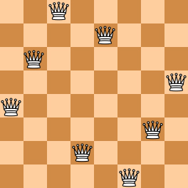
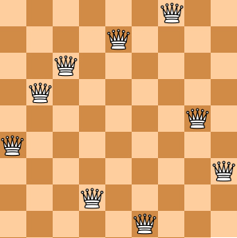

<!-- @import "[TOC]" {cmd="toc" depthFrom=3 depthTo=3 orderedList=false} -->

<!-- code_chunk_output -->

- [合影 1109 Group Photo (25 point(s))](#合影-1109-group-photo-25-points)
- [单身狗 1121 Damn Single (25 point(s))](#单身狗-1121-damn-single-25-points)
- [N 皇后问题 1128 N Queens Puzzle (20 point(s))](#n-皇后问题-1128-n-queens-puzzle-20-points)
- [推荐系统 1129 Recommendation System (25 point(s))](#推荐系统-1129-recommendation-system-25-points)
- [切整数 1132 Cut Integer (20 point(s))](#切整数-1132-cut-integer-20-points)
- [外观数列 1140 Look-and-say Sequence (20 point(s))](#外观数列-1140-look-and-say-sequence-20-points)
- [堆 1147 Heaps (30 point(s))](#堆-1147-heaps-30-points)

<!-- /code_chunk_output -->

### 合影 1109 Group Photo (25 point(s))

合影时队形非常重要，给出 $N$ 个人排成 $K$ 行的规则，如下所示：

- 每行的人数必须为 $N / K$（向下取整），所有多余的人（如果有）都放到最后一行；
- 位于后排的所有人都不得矮于位于前排的任何人；
- 在每一行中，最高的人站在该行的中心位置（定义为位置 $(m / 2 + 1)$，位置从1开始编号，其中 $m$ 是该行的总人数，除法结果向下取整）；
- 在每一行中，其他人必须按照其身高非递增顺序依次排入该行，交替地将他们的位置先安排到最高人的右侧，然后再安排到最高人的左侧（例如，假设五个人的身高为 $190、188， 186、175、170$，最终阵型将是 $175、188、190、186、170$。在这里，我们假设你面对着合影人员，因此你的左手边位置其实是最高人的右手边位置。）;
- 当许多人的身高相同时，必须按姓名的字典序升序进行排序，保证所有人的姓名不重复。

<p>现在，给定一群人的相关信息，请你将他们的合照队形排好。</p>

<h4>输入格式</h4>

第一行包含两个整数，$N$ 表示总人数，$K$ 表示排成的行数。

接下来 $N$ 行，每行包含一个人的姓名和身高。

姓名是长度不超过 $8$ 的由大小写字母构成的字符串，身高是范围在 $[30,300]$ 的整数。

<h4>输出格式</h4>

输出排好的合影队形，即在 $K$ 行输出人员姓名。

<p>名字之间用空格隔开，行尾不得由多余空格。</p>

<p>注意，由于你面对着合影人员，因此，后排的人在上方输出，前排的人在下方输出。</p>

<h4>数据范围</h4>

- $1 \le N \le 10^4$,
- $1 \le K \le 10$

<h4>输入样例：</h4>

<pre><code>
10 3
Tom 188
Mike 170
Eva 168
Tim 160
Joe 190
Ann 168
Bob 175
Nick 186
Amy 160
John 159
</code></pre>

<h4>输出样例：</h4>

<pre><code>
Bob Tom Joe Nick
Ann Mike Eva
Tim Amy John
</code></pre>

#### 1109 Group Photo (25 point(s))
Formation is very important when taking a group photo. Given the rules of forming K rows with N people as the following:

The number of people in each row must be N/K (round down to the nearest integer), with all the extra people (if any) standing in the last row;

All the people in the rear row must be no shorter than anyone standing in the front rows;

In each row, the tallest one stands at the central position (which is defined to be the position (m/2+1), where m is the total number of people in that row, and the division result must be rounded down to the nearest integer);

In each row, other people must enter the row in non-increasing order of their heights, alternately taking their positions first to the right and then to the left of the tallest one (For example, given five people with their heights 190, 188, 186, 175, and 170, the final formation would be 175, 188, 190, 186, and 170. Here we assume that you are facing the group so your left-hand side is the right-hand side of the one at the central position.);

When there are many people having the same height, they must be ordered in alphabetical (increasing) order of their names, and it is guaranteed that there is no duplication of names.

Now given the information of a group of people, you are supposed to write a program to output their formation.

#### Input Specification:
Each input file contains one test case. For each test case, the first line contains two positive integers $N (≤10^4)$, the total number of people, and K (≤10), the total number of rows. Then N lines follow, each gives the name of a person (no more than 8 English letters without space) and his/her height (an integer in [30, 300]).

#### Output Specification:
For each case, print the formation -- that is, print the names of people in K lines. The names must be separated by exactly one space, but there must be no extra space at the end of each line. Note: since you are facing the group, people in the rear rows must be printed above the people in the front rows.

```cpp

```

### 单身狗 1121 Damn Single (25 point(s))

<p>“单身狗”是中文对于单身人士的一种爱称。</p>

<p>本题请你从上万人的大型派对中找出落单的客人，以便给予特殊关爱。</p>

<h4>输入格式</h4>

输入第一行给出一个正整数 $N$，是已知夫妻/伴侣的对数；

随后 $N$ 行，每行给出一对夫妻/伴侣——为方便起见，每人对应一个 $ID$ 号，为 $5$ 位数字（从 $00000$ 到 $99999$），ID 间以空格分隔；

之后给出一个正整数 $M$，为参加派对的总人数；

随后一行给出这 $M$ 位客人的 $ID$，以空格分隔。

<p>题目保证无人重婚或脚踩两条船。</p>

<h4>输出格式</h4>

<p>首先第一行输出落单客人的总人数；</p>

随后第二行按 $ID$ 递增顺序列出落单的客人。

$ID$ 间用 $1$ 个空格分隔，行的首尾不得有多余空格。

<h4>数据范围</h4>

- $1 \le N \le 50000$,
- $1 \le M \le 10000$

<h4>输入样例：</h4>

<pre><code>
3
11111 22222
33333 44444
55555 66666
7
55555 44444 10000 88888 22222 11111 23333
</code></pre>

<h4>输出样例：</h4>

<pre><code>
5
10000 23333 44444 55555 88888
</code></pre>

#### 1121 Damn Single (25 point(s))
"Damn Single (单身狗)" is the Chinese nickname for someone who is being single. You are supposed to find those who are alone in a big party, so they can be taken care of.

#### Input Specification:
Each input file contains one test case. For each case, the first line gives a positive integer N (≤ 50,000), the total number of couples. Then N lines of the couples follow, each gives a couple of ID's which are 5-digit numbers (i.e. from 00000 to 99999). After the list of couples, there is a positive integer M (≤ 10,000) followed by M ID's of the party guests. The numbers are separated by spaces. It is guaranteed that nobody is having bigamous marriage (重婚) or dangling with more than one companion.

#### Output Specification:
First print in a line the total number of lonely guests. Then in the next line, print their ID's in increasing order. The numbers must be separated by exactly 1 space, and there must be no extra space at the end of the line.

```cpp
```

### N 皇后问题 1128 N Queens Puzzle (20 point(s))

$N$ 皇后问题是指将 $N$ 个皇后放置在 $N \times N$ 棋盘上，使得皇后不能相互攻击到，即任意两个皇后都不能处于同一行、同一列或同一斜线上。

<p>在本题中，你无需解决这一难题。</p>

<p>你需要做的是判断我们给出的棋子摆放是否是一种合理的摆放方案，即是否能够满足皇后之间不能相互攻击到。</p>

<p>为了简化棋盘的表示，让我们假设在同一列中不会放置两个皇后。</p>

这样我们就可以用一个整数序列 $Q_1,Q_2,...,Q_N$ 来表示一种棋盘摆放，其中 $Q_i$ 表示第 $i$ 列的皇后所在的行号。

<p>例如，下方左图的棋盘摆放可以用 <code>(4, 6, 8, 2, 7, 1, 3, 5)</code> 来表示，它是解决八皇后问题的一种合理摆放方案。</p>

<p>下方右图的棋盘摆放可以用 <code>(4, 6, 7, 2, 8, 1, 9, 5, 3)</code> 来表示，它<strong>并不是</strong>解决九皇后问题的一种合理摆放方案。</p>

 

<h4>输入格式</h4>

第一行包含整数 $K$，表示共有 $K$ 组测试数据。

每组测试数据占一行，首先包含整数 $N$，然后包含 $N$ 个整数 $Q_1,Q_2,...,Q_N$。

<h4>输出格式</h4>

<p>对于每组数据，如果是合理摆放方案，则输出 <code>YES</code>，否则输出 <code>NO</code>。</p>

<p>每个答案占一行。</p>

<h4>数据范围</h4>

- $1 < K \le 200$,
- $4 \le N \le 1000$
- $1 \le Q_i \le N$

<h4>输入样例：</h4>

<pre><code>
4
8 4 6 8 2 7 1 3 5
9 4 6 7 2 8 1 9 5 3
6 1 5 2 6 4 3
5 1 3 5 2 4
</code></pre>

<h4>输出样例：</h4>

<pre><code>
YES
NO
NO
YES
</code></pre>

#### 1128 N Queens Puzzle (20 point(s))
The "eight queens puzzle" is the problem of placing eight chess queens on an 8×8 chessboard so that no two queens threaten each other. Thus, a solution requires that no two queens share the same row, column, or diagonal. The eight queens puzzle is an example of the more general N queens problem of placing N non-attacking queens on an N×N chessboard. (From Wikipedia - "Eight queens puzzle".)

Here you are NOT asked to solve the puzzles. Instead, you are supposed to judge whether or not a given configuration of the chessboard is a solution. To simplify the representation of a chessboard, let us assume that no two queens will be placed in the same column. Then a configuration can be represented by a simple integer sequence ($Q_1,Q_2,...,Q_N$), where $Q_i$ is the row number of the queen in the i-th column. For example, Figure 1 can be represented by (4, 6, 8, 2, 7, 1, 3, 5) and it is indeed a solution to the 8 queens puzzle; while Figure 2 can be represented by (4, 6, 7, 2, 8, 1, 9, 5, 3) and is NOT a 9 queens' solution.

 

#### Input Specification:
Each input file contains several test cases. The first line gives an integer K (1<K≤200). Then K lines follow, each gives a configuration in the format "$N\;Q_1\;Q_2\;...\;Q_N$", where 4≤N≤1000 and it is guaranteed that $1≤Q_i ≤N$ for all $i=1,⋯,N$. The numbers are separated by spaces.

#### Output Specification:
For each configuration, if it is a solution to the N queens problem, print YES in a line; or NO if not.

```cpp
```

### 推荐系统 1129 Recommendation System (25 point(s))

<p>推荐系统可以预测用户对某项商品的偏好。 </p>

<p>现在，请你编写一个非常简单的推荐系统，该系统通过分析用户对各种商品的访问次数来预测用户的偏好。</p>

<h4>补充</h4>

用户会进行 $N$ 次商品访问，每次访问某件商品之前，系统需要给用户推荐最多不超过 $K$ 件商品。

而推荐的这 $K$ 件商品，应该是在本次访问之前的所有访问中，被访问次数最多的 $K$ 件商品。

当然，用户在进行第一次访问时，无法给出任何推荐，因为此时所有商品的被访问次数都为 $0$。

<h4>输入格式</h4>

第一行包含两个正整数： $N$，表示用户访问商品次数，$K$ 表示系统提供给用户的最大推荐数。

<p>第二行给出用户正在访问的商品编号。</p>

所有商品编号 $1 \sim N$。

<h4>输出格式</h4>

<p>对于每次访问，以如下格式，输出一行建议：</p>

<pre><code>
query: rec[1] rec[2] ... rec[K]
</code></pre>

其中，<code>query</code> 表示用户正在访问的商品，<code>rec[i]</code> 是推荐系统推荐给用户的第 $i$ 个商品。

应当以频率从高到低的顺序推荐访问频率最高的前 $K$ 个商品。

<p>对于访问频率相同的商品，优先推荐商品编号小的。</p>

<p>注意：对于第一次访问没有任何输出，因为无法给出建议。</p>

<h4>数据范围</h4>

- $1 \le N \le 50000$
- $1 \le K \le 10$

<h4>输入样例：</h4>

<pre><code>
12 3
3 5 7 5 5 3 2 1 8 3 8 12
</code></pre>

<h4>输出样例：</h4>

<pre><code>
5: 3
7: 3 5
5: 3 5 7
5: 5 3 7
3: 5 3 7
2: 5 3 7
1: 5 3 2
8: 5 3 1
3: 5 3 1
8: 3 5 1
12: 3 5 8
</code></pre>

#### 1129 Recommendation System (25 point(s))
Recommendation system predicts the preference that a user would give to an item. Now you are asked to program a very simple recommendation system that rates the user's preference by the number of times that an item has been accessed by this user.

#### Input Specification:
Each input file contains one test case. For each test case, the first line contains two positive integers: N (≤ 50,000), the total number of queries, and K (≤ 10), the maximum number of recommendations the system must show to the user. Then given in the second line are the indices of items that the user is accessing -- for the sake of simplicity, all the items are indexed from 1 to N. All the numbers in a line are separated by a space.

#### Output Specification:
For each case, process the queries one by one. Output the recommendations for each query in a line in the format:
```
query: rec[1] rec[2] ... rec[K]
```

where query is the item that the user is accessing, and `rec[i] (i=1, ... K)` is the i-th item that the system recommends to the user. The first K items that have been accessed most frequently are supposed to be recommended in non-increasing order of their frequencies. If there is a tie, the items will be ordered by their indices in increasing order.

Note: there is no output for the first item since it is impossible to give any recommendation at the time. It is guaranteed to have the output for at least one query.

### 切整数 1132 Cut Integer (20 point(s))

切整数就是将一个有 $K$ 位数字的整数 $Z$ 从中间切成两个 $K/2$ 位的整数 $A$ 和 $B$。

例如，将 $Z = 167334$ 切掉，我们可以得到 $A = 167$ 和 $B = 334$。

如果 $Z$ 能被 $A$ 和 $B$ 的乘积整除，那么将非常的有趣，就像 $167334 / (167 × 334) = 3$ 这样。

现在给定整数 $Z$，请你判断它是否能满足被 $A$ 和 $B$ 的乘积整除。
<h4>输入格式</h4>

第一行包含整数 $N$，表示共有 $N$ 组测试数据。

接下来 $N$ 行，每行包含一个 $Z$。

保证 $Z$ 有偶数位。

<h4>输出格式</h4>

对于每个 $Z$，输出一行结论，如果能被 $A$ 和 $B$ 的乘积整除，则输出 <code>Yes</code>，否则输出 <code>No</code>。

<h4>数据范围</h4>

- $1 \le N \le 20$
- $10 \le Z < 2^{31}$

<h4>输入样例：</h4>

<pre><code>
3
167334
2333
12345678
</code></pre>

<h4>输出样例：</h4>

<pre><code>
Yes
No
No
</code></pre>

#### 1132 Cut Integer (20 point(s))
Cutting an integer means to cut a K digits lone integer Z into two integers of (K/2) digits long integers A and B. For example, after cutting Z = 167334, we have A = 167 and B = 334. It is interesting to see that Z can be devided by the product of A and B, as 167334 / (167 × 334) = 3. Given an integer Z, you are supposed to test if it is such an integer.

#### Input Specification:
Each input file contains one test case. For each case, the first line gives a positive integer N (≤ 20). Then N lines follow, each gives an integer $Z (10 ≤ Z <2^{31})$. It is guaranteed that the number of digits of Z is an even number.

#### Output Specification:
For each case, print a single line Yes if it is such a number, or No if not.

```cpp

```

### 外观数列 1140 Look-and-say Sequence (20 point(s))

<p>外观数列是指具有以下特点的整数序列：</p>

<pre><code>
D, D1, D111, D113, D11231, D112213111, ...
</code></pre>

其中 <code>D</code> 是一个 $[0,9]$ 范围内的不等于 $1$ 的整数。

序列的第 $n+1$ 项是对第 $n$ 项的描述。

比如第 $2$ 项表示第 $1$ 项有 $1$ 个 <code>D</code>，所以就是 <code>D1</code>；

第 $2$ 项是 $1$ 个 <code>D</code>（对应 <code>D1</code>）和 $1$ 个 $1$（对应 $11$），所以第 $3$ 项就是 <code>D111</code>。

又比如第 $4$ 项是 <code>D113</code>，其描述就是 $1$ 个 <code>D</code>，$2$ 个 $1$，$1$ 个 $3$，所以下一项就是 <code>D11231</code>。

当然这个定义对 $D = 1$ 也成立。

本题要求你推算任意给定数字 <code>D</code> 的外观数列的第 $N$ 项。

<h4>输入格式</h4>

共一行包含两个整数 $D$ 和 $N$。

<h4>输出格式</h4>

在一行中给出数字 $D$ 的外观数列的第 $N$ 项。

<h4>数据范围</h4>

- $0 \le D \le 9$,
- $1 \le N \le 40$

<h4>输入样例：</h4>

<pre><code>
1 8
</code></pre>

<h4>输出样例：</h4>

<pre><code>
1123123111
</code></pre>

#### 1140 Look-and-say Sequence (20 point(s))
Look-and-say sequence is a sequence of integers as the following:
```
D, D1, D111, D113, D11231, D112213111, ...
```
where D is in [0, 9] except 1. The (n+1)st number is a kind of description of the nth number. For example, the 2nd number means that there is one D in the 1st number, and hence it is D1; the 2nd number consists of one D (corresponding to D1) and one 1 (corresponding to 11), therefore the 3rd number is D111; or since the 4th number is D113, it consists of one D, two 1's, and one 3, so the next number must be D11231. This definition works for D = 1 as well. Now you are supposed to calculate the Nth number in a look-and-say sequence of a given digit D.

#### Input Specification:
Each input file contains one test case, which gives D (in [0, 9]) and a positive integer N (≤ 40), separated by a space.

#### Output Specification:
Print in a line the Nth number in a look-and-say sequence of D.

```cpp

```

### 堆 1147 Heaps (30 point(s))

<p>在计算机科学中，堆是一种的基于树的专用数据结构，它具有堆属性：</p>

如果 $P$ 是 $C$ 的父结点，则在大顶堆中 $P$ 结点的权值大于或等于 $C$ 结点的权值，在小顶堆中 $P$ 结点的权值小于或等于 $C$ 结点的权值。

<p>一种堆的常见实现是二叉堆，它是由完全二叉树来实现的。</p>

<p>你的任务是判断给定的完全二叉树是否是堆。</p>

<h4>输入格式</h4>

第一行包含两个整数 $M$ 和 $N$，分别表示给定完全二叉树的数量以及每个完全二叉树包含的结点数量。

接下来 $M$ 行，每行包含 $N$ 个不同的整数（都在 <strong>int</strong> 范围内），表示一个完全二叉树的层序遍历序列。

<h4>输出格式</h4>

<p>对于每个给定的二叉树，首先输出一行对它是否是堆的判断结论。</p>

<p>如果是大顶堆，则输出 <code>Max Heap</code>，如果是小顶堆，则输出 <code>Min Heap</code>，如果不是堆，则输出 <code>Not Heap</code>。</p>

<p>然后，再输出一行它的后序遍历序列。</p>

<p>同行数字用空格隔开，行首行尾不得有多余空格。</p>

<h4>数据范围</h4>

- $1 \le M \le 100$,
- $1 < N \le 1000$

<h4>输入样例：</h4>

<pre><code>
3 8
98 72 86 60 65 12 23 50
8 38 25 58 52 82 70 60
10 28 15 12 34 9 8 56
</code></pre>

<h4>输出样例：</h4>

<pre><code>
Max Heap
50 60 65 72 12 23 86 98
Min Heap
60 58 52 38 82 70 25 8
Not Heap
56 12 34 28 9 8 15 10
</code></pre>

#### 1147 Heaps (30 point(s))
In computer science, a heap is a specialized tree-based data structure that satisfies the heap property: if P is a parent node of C, then the key (the value) of P is either greater than or equal to (in a max heap) or less than or equal to (in a min heap) the key of C. A common implementation of a heap is the binary heap, in which the tree is a complete binary tree. (Quoted from Wikipedia at https://en.wikipedia.org/wiki/Heap_(data_structure))

Your job is to tell if a given complete binary tree is a heap.

#### Input Specification:
Each input file contains one test case. For each case, the first line gives two positive integers: M (≤ 100), the number of trees to be tested; and N (1 < N ≤ 1,000), the number of keys in each tree, respectively. Then M lines follow, each contains N distinct integer keys (all in the range of int), which gives the level order traversal sequence of a complete binary tree.

#### Output Specification:
For each given tree, print in a line Max Heap if it is a max heap, or Min Heap for a min heap, or Not Heap if it is not a heap at all. Then in the next line print the tree's postorder traversal sequence. All the numbers are separated by a space, and there must no extra space at the beginning or the end of the line.

```cpp

```