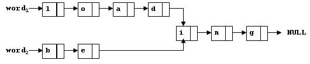

<!-- @import "[TOC]" {cmd="toc" depthFrom=3 depthTo=3 orderedList=false} -->

<!-- code_chunk_output -->

- [共享 1032 Sharing (25 point(s))](#共享-1032-sharing-25-points)
- [反转链表 1074 Reversing Linked List (25 point(s))](#反转链表-1074-reversing-linked-list-25-points)
- [链表重复数据删除 1097 Deduplication on a Linked List (25 point(s))](#链表重复数据删除-1097-deduplication-on-a-linked-list-25-points)
- [链表元素分类 1133 Splitting A Linked List (25 point(s))](#链表元素分类-1133-splitting-a-linked-list-25-points)

<!-- /code_chunk_output -->

### 共享 1032 Sharing (25 point(s))

<p>在储存单词时，我们可以使用链表逐个字母进行储存。</p>

<p>为了节约空间，如果两个单词拥有共同的后缀，那么可以让它们共享一个相同的子链表。</p>

<p>例如，<code>loading</code> 和 <code>being</code> 可以如下图所示储存：</p>



你需要找到共同后缀的起始位置。（对于上图，即为 $i$ 的位置）

<h4>补充</h4>

<p>本题中可能包含不在链表中的节点，这些节点无需考虑。</p>

<h4>输入格式</h4>

第一行包含两个节点地址和一个正整数 $N$，两个地址分别是两个单词的首字母节点地址，$N$ 是总节点数量。

节点地址是一个 $5$ 位数字，各位都是正整数。

NULL 的地址为 $-1$。

接下来 $N$ 行，每行包含一个节点信息，如下所示：

<pre><code>
Address Data Next
</code></pre>

其中 <code>Address</code> 是当前节点的地址，<code>Data</code> 是节点储存的字母（$a \sim z,A \sim Z$），<code>Next</code> 是下一个节点的地址。

<h4>输出格式</h4>

<p>如果存在共同后缀，则输出共同后缀的起始位置节点地址。</p>

<p>如果不存在共同后缀，则输出 -1。</p>

<h4>数据范围</h4>

$2 \le N \le 10^5$

<h4>输入样例1：</h4>

<pre><code>
11111 22222 9
67890 i 00002
00010 a 12345
00003 g -1
12345 D 67890
00002 n 00003
22222 B 23456
11111 L 00001
23456 e 67890
00001 o 00010
</code></pre>

<h4>输出样例1：</h4>

<pre><code>
67890
</code></pre>

<h4>输入样例2：</h4>

<pre><code>
00001 00002 4
00001 a 10001
10001 s -1
00002 a 10002
10002 t -1
</code></pre>

<h4>输出样例2：</h4>

<pre><code>
-1
</code></pre>

#### 1032 Sharing (25 point(s))
To store English words, one method is to use linked lists and store a word letter by letter. To save some space, we may let the words share the same sublist if they share the same suffix. For example, loading and being are stored as showed in Figure 1.


You are supposed to find the starting position of the common suffix (e.g. the position of i in Figure 1).

#### Input Specification:
Each input file contains one test case. For each case, the first line contains two addresses of nodes and a positive $N (≤10^5)$, where the two addresses are the addresses of the first nodes of the two words, and N is the total number of nodes. The address of a node is a 5-digit positive integer, and NULL is represented by −1.

Then N lines follow, each describes a node in the format:
```
Address Data Next
```
whereAddress is the position of the node, Data is the letter contained by this node which is an English letter chosen from `{ a-z, A-Z }`, and Next is the position of the next node.

#### Output Specification:
For each case, simply output the 5-digit starting position of the common suffix. If the two words have no common suffix, output -1 instead.

```cpp

```

### 反转链表 1074 Reversing Linked List (25 point(s))

给定一个常数 $K$ 和一个单链表 $L$，请你在单链表上每 $K$ 个元素做一次反转，并输出反转完成后的链表。

如果链表最后一部分不足 $K$ 个元素，则最后一部分不翻转。

例如，假设 $L$ 为 $1→2→3→4→5→6$，如果 $K = 3$，则你应该输出 $3→2→1→6→5→4$；如果 $K = 4$，则你应该输出 $4→3→2→1→5→6$。

<h4>补充</h4>

<p>1、本题中可能包含不在链表中的节点，这些节点无需考虑。</p>

<h4>输入格式</h4>

第一行包含头节点地址，总节点数量 $N$ 以及常数 $K$。

节点地址用一个 $5$ 位非负整数表示（可能有前导 $0$），NULL 用 $-1$ 表示。

接下来 $N$ 行，每行描述一个节点的信息，格式如下：

<pre><code>
Address Data Next
</code></pre>

<p>其中 <code>Address</code> 是节点地址，<code>Data</code> 是一个整数，<code>Next</code> 是下一个节点的地址。</p>

<h4>输出格式</h4>

<p>将重新排好序的链表，从头节点点开始，依次输出每个节点的信息，格式与输入相同。</p>

<h4>数据范围</h4>

- $1 \le N \le 10^5$,
- $1 \le K \le N$

<h4>输入样例：</h4>

<pre><code>
00100 6 4
00000 4 99999
00100 1 12309
68237 6 -1
33218 3 00000
99999 5 68237
12309 2 33218
</code></pre>

<h4>输出样例：</h4>

<pre><code>
00000 4 33218
33218 3 12309
12309 2 00100
00100 1 99999
99999 5 68237
68237 6 -1
</code></pre>

#### 1074 Reversing Linked List (25 point(s))
Given a constant K and a singly linked list L, you are supposed to reverse the links of every K elements on L. For example, given L being `1→2→3→4→5→6`, if K=3, then you must output `3→2→1→6→5→4`; if K=4, you must output `4→3→2→1→5→6`.

#### Input Specification:
Each input file contains one test case. For each case, the first line contains the address of the first node, a positive $N (≤10^5)$ which is the total number of nodes, and a positive K (≤N) which is the length of the sublist to be reversed. The address of a node is a 5-digit nonnegative integer, and NULL is represented by -1.

Then N lines follow, each describes a node in the format:
```
Address Data Next
```
where Address is the position of the node, Data is an integer, and Next is the position of the next node.

#### Output Specification:
For each case, output the resulting ordered linked list. Each node occupies a line, and is printed in the same format as in the input.

```cpp
```

### 链表重复数据删除 1097 Deduplication on a Linked List (25 point(s))

给定一个单链表 $L$，链表上的每个节点都存有一个键值，你应该删掉其中拥有重复键值绝对值的节点。

也就是说，对于每个值 $K$，只保留键值或键值绝对值为 $K$ 的第一个节点。

<p>同时，被删掉的节点也应保存在一个单独的链表中。</p>

例如，给定 $L$ 为 <code>21→-15→-15→-7→15</code>，则删除重复数据后的链表为 <code>21→-15→-7</code>，已删除链表为 <code>-15→15</code>。

<h4>输入格式</h4>

第一行首先包含头节点地址，然后包含节点总数 $N$。

节点地址用一个 $5$ 位非负整数表示（可能有前导 $0$），NULL 用 $−1$ 表示。

接下来 $N$ 行，每行描述一个节点的信息，格式如下：

<pre><code>
Address Key Next
</code></pre>

<p>其中 <code>Address</code> 是节点地址，<code>Key</code> 是一个整数表示键值，<code>Next</code> 是下一个节点的地址。</p>

<h4>输出格式</h4>

<p>首先按顺序输出结果链表，然后按顺序输出删除链表。</p>

<p>每个节点占一行，格式与输入相同。</p>

<h4>数据范围</h4>

- $1 \le N \le 10^5$,
- 节点键值的绝对值不会超过 $10^4$。

<h4>输入样例：</h4>

<pre><code>
00100 5
99999 -7 87654
23854 -15 00000
87654 15 -1
00000 -15 99999
00100 21 23854
</code></pre>

<h4>输出样例：</h4>

<pre><code>
00100 21 23854
23854 -15 99999
99999 -7 -1
00000 -15 87654
87654 15 -1
</code></pre>

#### 1097 Deduplication on a Linked List (25 point(s))
Given a singly linked list L with integer keys, you are supposed to remove the nodes with duplicated absolute values of the keys. That is, for each value K, only the first node of which the value or absolute value of its key equals K will be kept. At the mean time, all the removed nodes must be kept in a separate list. For example, given L being 21→-15→-15→-7→15, you must output 21→-15→-7, and the removed list -15→15.

#### Input Specification:
Each input file contains one test case. For each case, the first line contains the address of the first node, and a positive $N (≤10^5)$ which is the total number of nodes. The address of a node is a 5-digit nonnegative integer, and NULL is represented by −1.

Then N lines follow, each describes a node in the format:
```
Address Key Next
```
where Address is the position of the node, Key is an integer of which absolute value is no more than $10^4$, and Next is the position of the next node.

#### Output Specification:
For each case, output the resulting linked list first, then the removed list. Each node occupies a line, and is printed in the same format as in the input.

```cpp

```

### 链表元素分类 1133 Splitting A Linked List (25 point(s))

给定一个单链表，请编写程序将链表元素进行分类排列，使得所有负值元素都排在非负值元素的前面，而 $[0, K]$ 区间内的元素都排在大于 $K$ 的元素前面。

<p>但每一类内部元素的顺序是不能改变的。</p>

例如：给定链表为 <code>18→7→-4→0→5→-6→10→11→-2</code>，$K$ 为 $10$，则输出应该为 <code>-4→-6→-2→7→0→5→10→18→11</code>。

<h4>输入格式</h4>

第一行包含第 $1$ 个结点的地址；结点总个数，即正整数 $N$；以及正整数 $K$。

结点的地址是 $5$ 位非负整数，NULL 地址用 −1 表示。

<p>接下来有 N 行，每行格式为：</p>

<pre><code>
Address Data Next
</code></pre>

其中 <code>Address</code> 是结点地址；<code>Data</code> 是该结点保存的数据，为 $[-10^5,10^5]$ 区间内的整数；<code>Next</code> 是下一结点的地址。

<p>题目保证给出的链表不为空。</p>

<h4>输出格式</h4>

<p>按链表从头到尾的顺序输出重排后的结果链表，其上每个结点占一行，格式与输入相同。</p>

<h4>数据范围</h4>

- $1 \le N \le 10^5$,
- $1 \le K \le 1000$

<h4>输入样例：</h4>

<pre><code>
00100 9 10
23333 10 27777
00000 0 99999
00100 18 12309
68237 -6 23333
33218 -4 00000
48652 -2 -1
99999 5 68237
27777 11 48652
12309 7 33218
</code></pre>

<h4>输出样例：</h4>

<pre><code>
33218 -4 68237
68237 -6 48652
48652 -2 12309
12309 7 00000
00000 0 99999
99999 5 23333
23333 10 00100
00100 18 27777
27777 11 -1
</code></pre>

#### 1133 Splitting A Linked List (25 point(s))
Given a singly linked list, you are supposed to rearrange its elements so that all the negative values appear before all of the non-negatives, and all the values in [0, K] appear before all those greater than K. The order of the elements inside each class must not be changed. For example, given the list being 18→7→-4→0→5→-6→10→11→-2 and K being 10, you must output -4→-6→-2→7→0→5→10→18→11.

#### Input Specification:
Each input file contains one test case. For each case, the first line contains the address of the first node, a positive $N (≤10^5)$ which is the total number of nodes, and a positive $K (≤10^3)$. The address of a node is a 5-digit nonnegative integer, and NULL is represented by −1.

Then N lines follow, each describes a node in the format:
```
Address Data Next
```
where Address is the position of the node, Data is an integer in $[−10^5,10^5]$, and Next is the position of the next node. It is guaranteed that the list is not empty.

#### Output Specification:
For each case, output in order (from beginning to the end of the list) the resulting linked list. Each node occupies a line, and is printed in the same format as in the input.

```cpp

```
