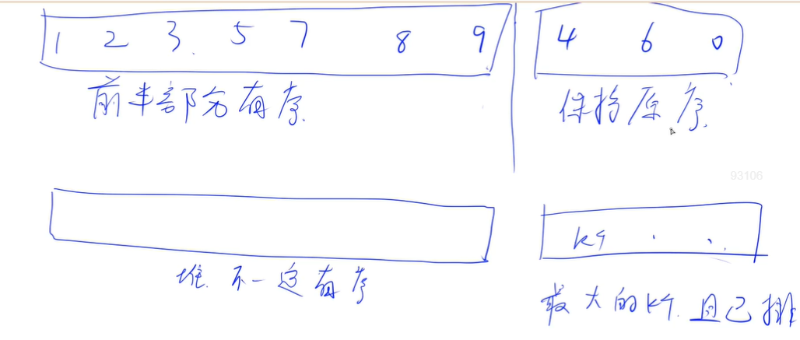

<!-- @import "[TOC]" {cmd="toc" depthFrom=3 depthTo=3 orderedList=false} -->

<!-- code_chunk_output -->

- [最佳排名 1012 The Best Rank (25 point(s))](#最佳排名-1012-the-best-rank-25-points)
- [数字图书馆 1022 Digital Library (30 point(s))](#数字图书馆-1022-digital-library-30-points)
- [PAT 排名 1025 PAT Ranking (25 point(s))](#pat-排名-1025-pat-ranking-25-points)
- [列表排序 1028 List Sorting (25 point(s))](#列表排序-1028-list-sorting-25-points)
- [学生课程列表 1039 Course List for Student (25 point(s))](#学生课程列表-1039-course-list-for-student-25-points)
- [链表排序 1052 Linked List Sorting (25 point(s))](#链表排序-1052-linked-list-sorting-25-points)
- [PAT 评测 1075 PAT Judge (25 point(s))](#pat-评测-1075-pat-judge-25-points)
- [插入还是堆排序 1098 Insertion or Heap Sort (25 point(s))](#插入还是堆排序-1098-insertion-or-heap-sort-25-points)

<!-- /code_chunk_output -->

### 最佳排名 1012 The Best Rank (25 point(s))

现在，要给 CS 专业一年级的学生进行成绩评估。

我们只考虑他们的三门成绩：<code>C</code>&ndash;c语言，<code>M</code>&ndash;数学，<code>E</code>&ndash;英语，除此之外，我们还会考虑 <code>A</code> &ndash;三门成绩平均值。</p>
<p><strong>注意</strong>：平均成绩为三科成绩平均值四舍五入取整的结果。

<p>例如，四个学生的成绩单如下：</p>

<pre><code>
StudentID  C  M  E  A
310101     98 85 88 90
310102     70 95 88 84
310103     82 87 94 88
310104     91 91 91 91
</code></pre>

<p>每个学生都会有各科排名以及平均成绩排名，我们通过强调学生的最佳成绩来鼓励学生。</p>

因此，每个学生的成绩单上只会有四个成绩中排名最高的那个成绩的<strong>排名</strong>，以及具体是哪项成绩($C、M、E、A$ 中的一项)。

例如，第一个学生的成绩单上会显示 <code>1 C</code>，因为他的C语言排名第 $1$，这是他的最佳名次。

而第四个学生的成绩单上会显示 <code>1 A</code>，因为他的平均成绩排名第 $1$，这是他的最佳名次。

<h4>输入格式</h4>

第一行包含两个整数 $N,M$，分别表示学生总数和查询成绩单次数。

接下来 $N$ 行，每行首先包含一个由六位数字组成的学生 ID，然后包含三个整数分别表示该学生的 $C,M,E$ 三科成绩。

接下来 $M$ 行，每行包含一个学生 ID，表示要查询该学生的成绩单。

<h4>输出格式</h4>

<p>对于每个学生，输出他的最佳排名以及该排名对应的是哪项成绩。</p>

当多项排名相同，且都为最佳时，按照 $A < C < M < E$ 的优先级，选择输出哪项成绩。

如果无法查询到该学生的成绩，则输出 <code>N/A</code>。

<h4>数据范围</h4>

- $1 \le N,M \le 2000$，
- 每科成绩均在 $[0,100]$ 之间。

<h4>输入样例：</h4>

<pre><code>
5 6
310101 98 85 88
310102 70 95 88
310103 82 87 94
310104 91 91 91
310105 85 90 90
310101
310102
310103
310104
310105
999999
</code></pre>

<h4>输出样例：</h4>

<pre><code>
1 C
1 M
1 E
1 A
3 A
N/A
</code></pre>

#### 1012 The Best Rank (25 point(s))
To evaluate the performance of our first year CS majored students, we consider their grades of three courses only: C - C Programming Language, M - Mathematics (Calculus or Linear Algrbra), and E - English. At the mean time, we encourage students by emphasizing on their best ranks -- that is, among the four ranks with respect to the three courses and the average grade, we print the best rank for each student.

For example, The grades of C, M, E and A - Average of 4 students are given as the following:
```
StudentID  C  M  E  A
310101     98 85 88 90
310102     70 95 88 84
310103     82 87 94 88
310104     91 91 91 91
```

Then the best ranks for all the students are No.1 since the 1st one has done the best in C Programming Language, while the 2nd one in Mathematics, the 3rd one in English, and the last one in average.

#### Input Specification:
Each input file contains one test case. Each case starts with a line containing 2 numbers N and M (≤2000), which are the total number of students, and the number of students who would check their ranks, respectively. Then N lines follow, each contains a student ID which is a string of 6 digits, followed by the three integer grades (in the range of [0, 100]) of that student in the order of C, M and E. Then there are M lines, each containing a student ID.

#### Output Specification:
For each of the M students, print in one line the best rank for him/her, and the symbol of the corresponding rank, separated by a space.

The priorities of the ranking methods are ordered as A > C > M > E. Hence if there are two or more ways for a student to obtain the same best rank, output the one with the highest priority.

If a student is not on the grading list, simply output N/A.

以下是错误的代码：

```cpp
#include <iostream>
#include <cstring>
#include <algorithm>
#include <unordered_set>
#include <unordered_map>
#include <vector>
#include <cmath>

using namespace std;

vector<int> q[4];
vector<int> idx[4];
unordered_map<string, int> ranks[4];  // ACME
unordered_map<int, string> idx2id;  // index to id
unordered_set<string> ids;

int main()
{
    int n, m;
    cin >> n >> m;
    
    for (int i = 0; i < n; i ++ )
    {
        string id;
        cin >> id;
        ids.insert(id);
        idx2id[i] = id;
        int t[4] = {0};
        for (int i = 1; i < 4; i ++ )
        {
            cin >> t[i];
            t[0] += t[i];
        }
        t[0] = round(t[0] / 3.0);
        for (int j = 0; j < 4; ++ j)
        {
            idx[j].push_back((int) q[j].size());
            q[j].push_back(t[j]);
        }
    }

    for (int i = 0; i < 4; i ++ )
    {
        sort(idx[i].begin(), idx[i].end(),
             [&](const int& a, const int& b){
                return q[i][a] < q[i][b];
        });
    }
    
    
    // for (auto i: idx[0]) cout << i << ' ';

    for (int i = 0; i < 4; ++ i)
    {
        for (int j = 0; j < n; ++ j)
        {
            int index = idx[i][j];
            string id = idx2id[index];
            ranks[i][id] = j;
            // printf("ranks[%d][%s] = %d\n", i, id.c_str(), j);
        }
    }

    char names[] = "ACME";
    while (m -- )
    {
        string id;
        cin >> id;
        if (!ids.count(id)) puts("N/A");
        else
        {
            int res = -1;
            char c;
            for (int i = 0; i < 4; ++ i)
            {
                int rank = ranks[i][id];
                // printf("%d = ranks[%d][%s]\n", rank, i, id.c_str());
                if (rank > res)
                {
                    res = rank;
                    c = names[i];
                }
            }
            cout << n - res << ' ' << c << endl;
        }
    }
}
```

错在哪里？看下面的样例。

```
输入
5 6
310101 100 100 100
310102 100 100 88
310103 100 87 100
310104 91 100 100
310105 60 90 60
310101
310102
310103
310104
310105
999999

输出
1 A
2 C
1 C
1 M
4 M
N/A

预期
1 A
1 C
1 C
1 M
4 M
N/A
```

没法处理排名相同的情况。

所以还得是 y 总的思路：查到谁，就二分查找谁的排名。

```cpp
#include <iostream>
#include <algorithm>
#include <unordered_map>
#include <vector>
#include <cmath>

using namespace std;

unordered_map<string, vector<int>> grades;
vector<int> q[4];  // A: q[0], C: q[1], M: q[2], E: q[3]

int get_rank(vector<int>& a, int x)
{
    int l = 0, r = a.size() - 1;
    while (l < r)
    {
        int mid = l + r + 1 >> 1;
        if (a[mid] <= x) l = mid;
        else r = mid - 1;
    }
    return a.size() - r;
}

int main()
{
    int n, m;
    cin >> n >> m;

    for (int i = 0; i < n; i ++ )
    {
        string id;
        int t[4] = {0};
        cin >> id;
        for (int j = 1; j < 4; j ++ )
        {
            cin >> t[j];
            t[0] += t[j];
        }
        t[0] = round(t[0] / 3.0);
        for (int j = 0; j < 4; j ++ )
        {
            q[j].push_back(t[j]);
            grades[id].push_back(t[j]);
        }
    }

    for (int i = 0; i < 4; i ++ ) sort(q[i].begin(), q[i].end());

    char names[] = "ACME";
    while (m -- )
    {
        string id;
        cin >> id;
        if (grades.count(id) == 0) puts("N/A");
        else
        {
            int res = n + 1;
            char c;
            for (int i = 0; i < 4; i ++ )
            {
                int rank = get_rank(q[i], grades[id][i]);
                if (rank < res)
                {
                    res = rank;
                    c = names[i];
                }
            }
            cout << res << ' ' << c << endl;
        }
    }

    return 0;
}
```

### 数字图书馆 1022 Digital Library (30 point(s))

<p>数字图书馆包含数以百万计的书籍。</p>

<p>每本书的书名，作者，摘要关键词，出版商和出版年限这五类关键信息都在数据库中有所记录。 </p>

每本书被分配一个唯一的 $7$ 位数字作为其 <code>ID</code>。 

<p>当读者查询某一关键信息时，你应该找到所有与查询相关的书籍，并将它们按 <code>ID</code> 的升序排序输出。</p>

<h4>输入格式</h4>

第一行包含整数 $N$，表示共有 $N$ 本书。

接下来包含这 $N$ 本书的具体信息，每本书的相关信息占 $6$ 行：

- 第一行：书的 <code>ID</code>，一个 $7$ 位数字。
- 第二行：书名，一个长度不超过 $80$ 的字符串。
- 第三行：作者，一个长度不超过 $80$ 的字符串。
- 第四行：关键词，每个关键词的长度均不超过 $10$，且关键词中不包含空格，关键词之间用空格隔开。
- 第五行：出版商，一个长度不超过 $80$ 的字符串。
- 第六行：出版年限，一个在 $[1000,3000]$ 范围内的 $4$ 位数字。

一本书，只有一位作者，包含的关键词不超过 $5$ 个。

总共不超过 $1000$ 个不同的关键词，不超过 $1000$ 个不同的出版商。

图书信息介绍完毕后，有一行包含一个整数 $M$，表示查询次数。

接下来 $M$ 行，每行包含一个查询，具体格式如下：

- <code>1: a book title</code>，查询书名。
- <code>2: name of an author</code>，查询作者名。</li>
- <code>3: a key word</code>，查询关键词。</li>
- <code>4: name of a publisher</code>，查询出版商。
- <code>5: a 4-digit number representing the year</code>，查询出版年限。注意，这个年限可能包含前导 $0$。

<h4>输出格式</h4>

<p>对于每个查询，首先将查询信息输出在一行中。</p>

<p>接下来若干行，每行输出一个查询到的相关书籍的 <code>ID</code>，按升序顺序排列。</p>

<p>如果查询不到相关书籍，则输出 <code>Not Found</code>。</p>

<h4>数据范围</h4>

- $1 \le N \le 10^4$,
- $1 \le M \le 1000$

<h4>输入样例：</h4>

<pre><code>
3
1111111
The Testing Book
Yue Chen
test code debug sort keywords
ZUCS Print
2011
3333333
Another Testing Book
Yue Chen
test code sort keywords
ZUCS Print2
2012
2222222
The Testing Book
CYLL
keywords debug book
ZUCS Print2
2011
6
1: The Testing Book
2: Yue Chen
3: keywords
4: ZUCS Print
5: 2011
3: blablabla
</code></pre>

<h4>输出样例：</h4>

<pre><code>
1: The Testing Book
1111111
2222222
2: Yue Chen
1111111
3333333
3: keywords
1111111
2222222
3333333
4: ZUCS Print
1111111
5: 2011
1111111
2222222
3: blablabla
Not Found
</code></pre>

#### 1022 Digital Library (30 point(s))
A Digital Library contains millions of books, stored according to their titles, authors, key words of their abstracts, publishers, and published years. Each book is assigned an unique 7-digit number as its ID. Given any query from a reader, you are supposed to output the resulting books, sorted in increasing order of their ID's.

#### Input Specification:
Each input file contains one test case. For each case, the first line contains a positive integer $N (≤10^4)$ which is the total number of books. Then N blocks follow, each contains the information of a book in 6 lines:

- Line #1: the 7-digit ID number;
- Line #2: the book title -- a string of no more than 80 characters;
- Line #3: the author -- a string of no more than 80 characters;
- Line #4: the key words -- each word is a string of no more than 10 characters without any white space, and the keywords are separated by exactly one space;
- Line #5: the publisher -- a string of no more than 80 characters;
- Line #6: the published year -- a 4-digit number which is in the range [1000, 3000].

It is assumed that each book belongs to one author only, and contains no more than 5 key words; there are no more than 1000 distinct key words in total; and there are no more than 1000 distinct publishers.

After the book information, there is a line containing a positive integer M (≤1000) which is the number of user's search queries. Then M lines follow, each in one of the formats shown below:

- 1: a book title
- 2: name of an author
- 3: a key word
- 4: name of a publisher
- 5: a 4-digit number representing the year

#### Output Specification:
For each query, first print the original query in a line, then output the resulting book ID's in increasing order, each occupying a line. If no book is found, print Not Found instead.

```cpp
#include <iostream>
#include <algorithm>
#include <set>
#include <vector>
#include <sstream>

using namespace std;

struct Book
{
    string id, name, author;
    set<string> keywords;
    string publisher, year;
};

int main()
{
    int n, m;
    cin >> n;

    vector<Book> books;
    while (n -- )
    {
        string id, name, author;
        cin >> id;
        getchar();
        getline(cin, name), getline(cin, author);
        string line;
        getline(cin, line);
        stringstream ssin(line);
        string keyword;
        set<string> keywords;
        while (ssin >> keyword) keywords.insert(keyword);
        string publisher, year;
        getline(cin, publisher);
        cin >> year;
        books.push_back({id, name, author, keywords, publisher, year});
    }

    cin >> m;
    getchar();
    string line;
    while (m -- )
    {
        getline(cin, line);
        cout << line << endl;
        string info = line.substr(3);
        char t = line[0];
        vector<string> res;
        if (t == '1')
        {
            for (auto& book : books)
                if (book.name == info)
                    res.push_back(book.id);
        }
        else if (t == '2')
        {
            for (auto& book : books)
                if (book.author == info)
                    res.push_back(book.id);
        }
        else if (t == '3')
        {
            for (auto& book : books)
                if (book.keywords.count(info))
                    res.push_back(book.id);
        }
        else if (t == '4')
        {
            for (auto& book : books)
                if (book.publisher == info)
                    res.push_back(book.id);
        }
        else
        {
            for (auto& book : books)
                if (book.year == info)
                    res.push_back(book.id);
        }

        if (res.empty()) puts("Not Found");
        else
        {
            sort(res.begin(), res.end());
            for (auto id : res) cout << id << endl;
        }
    }

    return 0;
}
```

### PAT 排名 1025 PAT Ranking (25 point(s))

<p>编程能力测试（PAT）由浙江大学计算机科学与技术学院组织。</p>

<p>每次测试都会在多个地区同时进行，测试完成后，将会对成绩进行统计与合并，生成总排名。</p>

<p>你的任务就是编写一个程序，将各地区人员的成绩合并汇总，生成最终排名。</p>

<h4>输入格式</h4>

第一行包含整数 $N$，表示测试将会在 $N$ 个地区同时进行。

接下来是 $N$ 个地区的成绩列表。

每个地区的成绩列表，第一行包含整数 $K$，表示该地区的测试人数。

接下来 $K$ 行，每行包含一个学生的考号（$13$ 位数字）以及该学生的成绩。

<h4>输出格式</h4>

<p>第一行输出总考生人数。</p>

<p>然后用以下格式输出最终成绩排名列表：</p>

<pre><code>
registration_number final_rank location_number local_rank
</code></pre>

<p>也就是输出考号，最终排名，地区编号，地区排名。</p>

地区编号按输入顺序依次为 $1 \sim N$。

<p>按照最终排名从前到后的顺序输出每个人的信息。</p>

<p>具有相同分数的人的排名也要相同，相同分数的人，考号较小的先输出。</p>

<h4>数据范围</h4>

- $1 \le N \le 100$,
- $1 \le K \le 300$,
- 分数在 $[0,100]$ 范围内。

<h4>输入样例：</h4>

<pre><code>
2
5
1234567890001 95
1234567890005 100
1234567890003 95
1234567890002 77
1234567890004 85
4
1234567890013 65
1234567890011 25
1234567890014 100
1234567890012 85
</code></pre>

<h4>输出样例：</h4>

<pre><code>
9
1234567890005 1 1 1
1234567890014 1 2 1
1234567890001 3 1 2
1234567890003 3 1 2
1234567890004 5 1 4
1234567890012 5 2 2
1234567890002 7 1 5
1234567890013 8 2 3
1234567890011 9 2 4
</code></pre>

#### 1025 PAT Ranking (25 point(s))
Programming Ability Test (PAT) is organized by the College of Computer Science and Technology of Zhejiang University. Each test is supposed to run simultaneously in several places, and the ranklists will be merged immediately after the test. Now it is your job to write a program to correctly merge all the ranklists and generate the final rank.

#### Input Specification:
Each input file contains one test case. For each case, the first line contains a positive number N (≤100), the number of test locations. Then N ranklists follow, each starts with a line containing a positive integer K (≤300), the number of testees, and then K lines containing the registration number (a 13-digit number) and the total score of each testee. All the numbers in a line are separated by a space.

#### Output Specification:
For each test case, first print in one line the total number of testees. Then print the final ranklist in the following format:

```
registration_number final_rank location_number local_rank
```

The locations are numbered from 1 to N. The output must be sorted in nondecreasing order of the final ranks. The testees with the same score must have the same rank, and the output must be sorted in nondecreasing order of their registration numbers.

```cpp
#include <iostream>
#include <algorithm>
#include <vector>

using namespace std;

const int N = 110;

struct Student
{
    string id;
    int grade;
    int location_number, local_rank, final_rank;

    // 用于重载 sort
    // 分数高的在前， id 字典序非降
    bool operator< (const Student& t) const
    {
        if (grade != t.grade) return grade > t.grade;
        return id < t.id;
    }
};

vector<Student> grades[N];
vector<Student> all;

int main()
{
    int n;
    cin >> n;
    for (int i = 1; i <= n; i ++ )
    {
        int k;
        cin >> k;
        for (int j = 0; j < k; j ++ )
        {
            string id;
            int grade;
            cin >> id >> grade;
            grades[i].push_back({id, grade, i});
        }

        auto& g = grades[i];
        sort(g.begin(), g.end());
        // 注意分数相同如何处理
        for (int i = 0; i < g.size(); i ++ )
        {
            if (!i || g[i].grade != g[i - 1].grade)
                g[i].local_rank = i + 1;
            else
                g[i].local_rank = g[i - 1].local_rank;
            all.push_back(g[i]);
        }
    }

    sort(all.begin(), all.end());
    for (int i = 0; i < all.size(); i ++ )
        if (!i || all[i].grade != all[i - 1].grade)
            all[i].final_rank = i + 1;
        else
            all[i].final_rank = all[i - 1].final_rank;

    cout << all.size() << endl;
    for (auto& s : all)
        cout << s.id << ' ' << s.final_rank << ' ' << s.location_number << ' ' << s.local_rank << endl;

    return 0;
}
```

### 列表排序 1028 List Sorting (25 point(s))

<p>Excel可以根据任何列对记录进行排序。 </p>

<p>现在，你需要模仿此功能。</p>

<h4>输入格式</h4>

第一行包含两个整数 $N$ 和 $C$，分别表示记录条数以及用来排序的列的编号。

接下来 $N$ 行，每行包含一条学生记录。

记录包括学生 <code>ID</code>，一个唯一的 $6$ 位数字，名称，一个长度不超过 $8$ 的不含空格的字符串，成绩，一个范围在 $[0,100]$ 的整数。

<h4>输出格式</h4>

输出共 $N$ 行，表示排序后的记录。

如果 $C = 1$，则按照 <code>ID</code> 升序的顺序排序。

如果 $C = 2$，则按照名称以不降序的顺序排序。

如果 $C = 3$，则按照成绩以不降序的顺序排序。

<p>当出现学生名字相同或是成绩相同的情况时，按照 <code>ID</code> 升序的顺序，对他们进行排序。</p>

<h4>数据范围</h4>

$1 \le N \le 10^5$

<h4>输入样例1：</h4>

<pre><code>
3 1
000007 James 85
000010 Amy 90
000001 Zoe 60
</code></pre>

<h4>输出样例1：</h4>

<pre><code>
000001 Zoe 60
000007 James 85
000010 Amy 90
</code></pre>

<h4>输入样例2：</h4>

<pre><code>
4 2
000007 James 85
000010 Amy 90
000001 Zoe 60
000002 James 98
</code></pre>

<h4>输出样例2：</h4>

<pre><code>
000010 Amy 90
000002 James 98
000007 James 85
000001 Zoe 60
</code></pre>

<h4>输入样例3：</h4>

<pre><code>
4 3
000007 James 85
000010 Amy 90
000001 Zoe 60
000002 James 90
</code></pre>

<h4>输出样例3：</h4>

<pre><code>
000001 Zoe 60
000007 James 85
000002 James 90
000010 Amy 90
</code></pre>

#### 1028 List Sorting (25 point(s))
Excel can sort records according to any column. Now you are supposed to imitate this function.

#### Input Specification:
Each input file contains one test case. For each case, the first line contains two integers $N (≤10^5)$ and C, where N is the number of records and C is the column that you are supposed to sort the records with. Then N lines follow, each contains a record of a student. A student's record consists of his or her distinct ID (a 6-digit number), name (a string with no more than 8 characters without space), and grade (an integer between 0 and 100, inclusive).

#### Output Specification:
For each test case, output the sorting result in N lines. That is, if C = 1 then the records must be sorted in increasing order according to ID's; if C = 2 then the records must be sorted in non-decreasing order according to names; and if C = 3 then the records must be sorted in non-decreasing order according to grades. If there are several students who have the same name or grade, they must be sorted according to their ID's in increasing order.

```cpp
#include <iostream>
#include <algorithm>

using namespace std;

const int N = 100010;

int n;

struct Row
{
    string id, name;
    int grade;
}rows[N];

bool cmp1(Row a, Row b)
{
    return a.id < b.id;
}

bool cmp2(Row a, Row b)
{
    if (a.name != b.name) return a.name < b.name;
    return a.id < b.id;
}

bool cmp3(Row a, Row b)
{
    if (a.grade != b.grade) return a.grade < b.grade;
    return a.id < b.id;
}

int main()
{
    int c;
    scanf("%d%d", &n, &c);
    char id[10], name[10];
    for (int i = 0; i < n; i ++ )
    {
        int grade;
        scanf("%s%s%d", id, name, &grade);
        rows[i] = {id, name, grade};
    }

    if (c == 1) sort(rows, rows + n, cmp1);
    else if (c == 2) sort(rows, rows + n, cmp2);
    else sort(rows, rows + n, cmp3);

    for (int i = 0; i < n; i ++ )
        // printf("%s", s.c_str()); 想要 printf string 对象，需要 s.c_str() 返回字符串，否则 s 的首地址是对象的地址而非字符串的地址，乱码
        printf("%s %s %d\n", rows[i].id.c_str(), rows[i].name.c_str(), rows[i].grade);

    return 0;
}
```

**经验：**
- C++ `printf("%s", s.c_str());` 想要 `printf string` 对象，需要 `s.c_str()` 返回字符串，否则 s 的首地址是对象的地址而非字符串的地址，乱码

### 学生课程列表 1039 Course List for Student (25 point(s))

浙江大学有 $40000$ 名学生，提供 $2500$ 门课程。

<p>现在给定所有课程的报名学生姓名列表。</p>
<p>给定你一个学生名单，请你查询名单中的学生的具体选课情况。</p>

<h4>输入格式</h4>

第一行包含两个整数 $N$ 和 $K$，分别表示需要查询的学生数量以及课程数量。

接下来包含 $K$ 个课程的具体报名信息。

每个课程信息的第一行包含两个整数 $i$ 和 $N_i$，分别表示该课程的编号（所有课程编号从 $1$ 到 $K$）以及报课人数。

第二行包含 $N_i$ 个学生姓名，学生姓名由三个大写字母和一个数字组成。

最后一行包含 $N$ 个学生姓名，表示要查询的学生名单。

<h4>输出格式</h4>

共 $N$ 行，每行输出一个学生的姓名，报课总数，以及所有报名的课程的编号（按照升序排列）。

<p>学生信息的输出顺序应与查询名单中的顺序一致。</p>

<h4>数据范围</h4>

- $1 \le N \le 40000$,
- $1 \le K \le 2500$
- $1 \le N_i \le 200$

<h4>输入样例：</h4>

<pre><code>
11 5
4 7
BOB5 DON2 FRA8 JAY9 KAT3 LOR6 ZOE1
1 4
ANN0 BOB5 JAY9 LOR6
2 7
ANN0 BOB5 FRA8 JAY9 JOE4 KAT3 LOR6
3 1
BOB5
5 9
AMY7 ANN0 BOB5 DON2 FRA8 JAY9 KAT3 LOR6 ZOE1
ZOE1 ANN0 BOB5 JOE4 JAY9 FRA8 DON2 AMY7 KAT3 LOR6 NON9
</code></pre>

<h4>输出样例：</h4>

<pre><code>
ZOE1 2 4 5
ANN0 3 1 2 5
BOB5 5 1 2 3 4 5
JOE4 1 2
JAY9 4 1 2 4 5
FRA8 3 2 4 5
DON2 2 4 5
AMY7 1 5
KAT3 3 2 4 5
LOR6 4 1 2 4 5
NON9 0
</code></pre>

#### 1039 Course List for Student (25 point(s))
Zhejiang University has 40000 students and provides 2500 courses. Now given the student name lists of all the courses, you are supposed to output the registered course list for each student who comes for a query.

#### Input Specification:
Each input file contains one test case. For each case, the first line contains 2 positive integers: N (≤40,000), the number of students who look for their course lists, and K (≤2,500), the total number of courses. Then the student name lists are given for the courses (numbered from 1 to K) in the following format: for each course i, first the course index i and the number of registered students $N_i (≤200)$ are given in a line. Then in the next line, $N_i$ student names are given. A student name consists of 3 capital English letters plus a one-digit number. Finally the last line contains the N names of students who come for a query. All the names and numbers in a line are separated by a space.

#### Output Specification:
For each test case, print your results in N lines. Each line corresponds to one student, in the following format: first print the student's name, then the total number of registered courses of that student, and finally the indices of the courses in increasing order. The query results must be printed in the same order as input. All the data in a line must be separated by a space, with no extra space at the end of the line.

```cpp
#include <iostream>
#include <algorithm>
#include <unordered_map>
#include <vector>

using namespace std;

unordered_map<string, vector<int>> students;

int main()
{
    ios::sync_with_stdio(false);
    cin.tie(0);

    int n, k;
    cin >> n >> k;

    while (k -- )
    {
        int id, m;
        cin >> id >> m;
        while (m -- )
        {
            string name;
            cin >> name;
            students[name].push_back(id);
        }
    }

    while (n -- )
    {
        string name;
        cin >> name;

        auto& ls = students[name];
        cout << name << ' ' << ls.size();
        sort(ls.begin(), ls.end());

        for (auto l : ls) cout << ' ' << l;
        cout << endl;
    }

    return 0;
}
```

### 链表排序 1052 Linked List Sorting (25 point(s))

<p>链表由一系列的结构体组成，每个结构体中包含一个 <code>Key</code> 值和一个指向下一个结构体的 <code>Next</code> 指针。</p>

<p>现在，给出一个链表，请你按照 <code>Key</code> 值升序的顺序将链表重新排序。</p>

<h4>补充</h4>

- 1、本题中可能包含不在链表中的节点，这些节点无需统计，无需排序，无需输出。
- 2、链表可能为空。（头节点地址为 $-1$）。

<h4>输入格式</h4>

第一行首先包含一个整数 $N$，表示总节点数量，然后包含链表头节点的地址。

接下来 $N$ 行，每行描述一个节点的信息，格式如下：

<pre><code>
Address Key Next
</code></pre>

<p>其中 <code>Address</code> 是节点地址，<code>Key</code> 值是一个整数，<code>Next</code> 是下一个节点的地址。</p>

地址都是 $5$ 位正整数，可能有前导 $0$。

<p>保证各节点的 <code>Key</code> 值互不相同，且链表中不存在环形结构。</p>

<h4>输出格式</h4>

<p>第一行首先输出一个整数表示<strong>链表的总节点数量</strong>，然后输出排序后的链表头节点地址。</p>
<p>接下来若干行，从头节点开始，依次输出每个节点的信息，格式与输入相同。</p>

<h4>数据范围</h4>

- $1 \le N \le 10^5$,
- $-10^5 \le Key \le 10^5$

<h4>输入样例：</h4>

<pre><code>
5 00001
11111 100 -1
00001 0 22222
33333 100000 11111
12345 -1 33333
22222 1000 12345
</code></pre>

<h4>输出样例：</h4>

<pre><code>
5 12345
12345 -1 00001
00001 0 11111
11111 100 22222
22222 1000 33333
33333 100000 -1
</code></pre>

#### 1052 Linked List Sorting (25 point(s))
A linked list consists of a series of structures, which are not necessarily adjacent in memory. We assume that each structure contains an integer key and a Next pointer to the next structure. Now given a linked list, you are supposed to sort the structures according to their key values in increasing order.

Input Specification:
Each input file contains one test case. For each case, the first line contains a positive $N (<10^5)$ and an address of the head node, where N is the total number of nodes in memory and the address of a node is a 5-digit positive integer. NULL is represented by −1.

Then N lines follow, each describes a node in the format:

#### Address Key Next
where Address is the address of the node in memory, Key is an integer in $[−10^5,10^5]$, and Next is the address of the next node. It is guaranteed that all the keys are distinct and there is no cycle in the linked list starting from the head node.

#### Output Specification:
For each test case, the output format is the same as that of the input, where N is the total number of nodes in the list and all the nodes must be sorted order.

这题，未必要用链表排序。

```cpp
#include <iostream>
#include <algorithm>
#include <unordered_map>
#include <vector>

using namespace std;

struct Node
{
    string address;
    int key;
    string next;

    bool operator< (const Node& t) const
    {
        return key < t.key;
    }
};

int main()
{
    int n;
    char head[10];
    scanf("%d%s", &n, head);

    unordered_map<string, Node> map;
    char address[10], next[10];
    while (n -- )
    {
        int key;
        scanf("%s%d%s", address, &key, next);
        map[address] = {address, key, next};
    }

    vector<Node> nodes;
    for (string i = head; i != "-1"; i = map[i].next) nodes.push_back(map[i]);

    printf("%d ", nodes.size());
    if (nodes.empty()) puts("-1");
    else
    {
        sort(nodes.begin(), nodes.end());
        printf("%s\n", nodes[0].address.c_str());
        for (int i = 0; i < nodes.size(); i ++ )
        {
            if (i + 1 == nodes.size())
                printf("%s %d -1\n", nodes[i].address.c_str(), nodes[i].key);
            else
                printf("%s %d %s\n", nodes[i].address.c_str(), nodes[i].key, nodes[i + 1].address.c_str());
        }
    }

    return 0;
}
```

### PAT 评测 1075 PAT Judge (25 point(s))

<p>PAT 的排名列表是根据状态列表产生的，状态列表中显示了所有提交记录的分数。</p>

<p>现在，请你为 PAT 生成排名列表。</p>

<h4>输入格式</h4>

第一行包含三个整数 $N,K,M$，分别表示总用户数量，题目数量，以及提交数量。

用户编号是从 $00001$ 到 $N$ 的 $5$ 位数字。

问题编号从 $1$ 到 $K$。

第二行包含 $K$ 个整数 $p_1,p_2,...,p_K$，其中 $p_i$ 表示第 $i$ 题的满分。

接下来 $M$ 行，每行包含一个提交信息，包括用户编号，题目编号，以及得分。

当提交无法正确编译时，得分显示 $-1$，否则是一个 $[0,该题满分]$ 范围内的整数。

注意，无法编译的情况虽然显示 $-1$，但得分上算作 $0$ 分。

<h4>输出格式</h4>

<p>以下列格式输出排名列表：</p>

<pre><code>
rank user_id total_score s[1] ... s[K]
</code></pre>

<p>其中，<code>rank</code> 是根据 <code>total_score</code> 计算的，所以拥有相同 <code>total_score</code> 的用户的 <code>rank</code> 也相同。</p>

<code>s[i]</code> 是第 $i$ 个问题获得的分数。

<p>如果某个问题，用户从未提交过代码，则用 <code>-</code> 来表示这道题的分数。</p>

<p>如果某个问题，用户多次提交过代码，则取最高分为这道题的分数。</p>

<p>列表必须根据排名从前到后输出，对于排名相同的用户，根据满分题目的数量以降序对用户排序，如果仍有排名相同的情况，则按 ID 升序的顺序排序。</p>

<p>对于从未提交过任何代码，或者从未提交过任何编译通过的代码的用户，输出时不予考虑。</p>

<h4>数据范围</h4>

- $1 \le N \le 10^4$，
- $1 \le K \le 5$,
- $1 \le M \le 10^5$
- 每道题的满分为不超过 $30$。

<h4>输入样例：</h4>

<pre><code>
7 4 20
20 25 25 30
00002 2 12
00007 4 17
00005 1 19
00007 2 25
00005 1 20
00002 2 2
00005 1 15
00001 1 18
00004 3 25
00002 2 25
00005 3 22
00006 4 -1
00001 2 18
00002 1 20
00004 1 15
00002 4 18
00001 3 4
00001 4 2
00005 2 -1
00004 2 0
</code></pre>

<h4>输出样例：</h4>

<pre><code>
1 00002 63 20 25 - 18
2 00005 42 20 0 22 -
2 00007 42 - 25 - 17
2 00001 42 18 18 4 2
5 00004 40 15 0 25 -
</code></pre>

#### 1075 PAT Judge (25 point(s))
The ranklist of PAT is generated from the status list, which shows the scores of the submissions. This time you are supposed to generate the ranklist for PAT.

#### Input Specification:
Each input file contains one test case. For each case, the first line contains 3 positive integers, $N (≤10^4)$, the total number of users, $K (≤5)$, the total number of problems, and $M (≤10^5)$, the total number of submissions. It is then assumed that the user id's are 5-digit numbers from 00001 to N, and the problem id's are from 1 to K. The next line contains K positive integers $p[i] (i=1, ..., K)$, where $p[i]$ corresponds to the full mark of the i-th problem. Then M lines follow, each gives the information of a submission in the following format:

user_id problem_id partial_score_obtained
where partial_score_obtained is either −1 if the submission cannot even pass the compiler, or is an integer in the range `[0, p[problem_id]]`. All the numbers in a line are separated by a space.

#### Output Specification:
For each test case, you are supposed to output the ranklist in the following format:

rank user_id total_score `s[1] ... s[K]`
where rank is calculated according to the total_score, and all the users with the same total_score obtain the same rank; and `s[i]` is the partial score obtained for the i-th problem. If a user has never submitted a solution for a problem, then "-" must be printed at the corresponding position. If a user has submitted several solutions to solve one problem, then the highest score will be counted.

The ranklist must be printed in non-decreasing order of the ranks. For those who have the same rank, users must be sorted in nonincreasing order according to the number of perfectly solved problems. And if there is still a tie, then they must be printed in increasing order of their id's. For those who has never submitted any solution that can pass the compiler, or has never submitted any solution, they must NOT be shown on the ranklist. It is guaranteed that at least one user can be shown on the ranklist.

```cpp
#include <iostream>
#include <algorithm>
#include <unordered_map>
#include <vector>

using namespace std;

const int K = 6;

int n, k, m;
int p_score[K];

struct Student
{
    string id;
    int grade[K];
    int total, cnt;  // 总分 与 完美完成题目数量

    Student(){}
    Student(string _id) : id(_id)
    {
        // 初始化， -2 代表从来没有提交过
        for (int i = 1; i <= k; i ++ ) grade[i] = -2;
        total = cnt = 0;
    }

    void calc()
    {
        for (int i = 1; i <= k; i ++ )
        {
            total += max(0, grade[i]);
            if (grade[i] == p_score[i]) cnt ++ ;
        }
    }

    bool has_submit()
    {
        for (int i = 1; i <= k; i ++ )
            if (grade[i] >= 0)
                return true;
        return false;
    }

    // 重载 < 为数值的 > 用于从大到小排
    bool operator< (const Student& t) const
    {
        if (total != t.total) return total > t.total;
        if (cnt != t.cnt) return cnt > t.cnt;
        return id < t.id;  // 注意 id 是字典序升序
    }
};

int main()
{
    unordered_map<string, Student> students;

    scanf("%d%d%d", &n, &k, &m);
    for (int i = 1; i <= k; i ++ ) scanf("%d", &p_score[i]);

    while (m -- )
    {
        string u_id;
        char u_id_s[6];
        int p_id, grade;
        scanf("%s%d%d", u_id_s, &p_id, &grade);
        u_id = u_id_s;

        if (students.count(u_id) == 0) students[u_id] = Student(u_id);
        students[u_id].grade[p_id] = max(students[u_id].grade[p_id], grade);
    }

    vector<Student> res;
    for (auto& item: students)
    {
        auto& s = item.second;
        if (s.has_submit())
        {
            s.calc();
            res.push_back(s);
        }
    }

    sort(res.begin(), res.end());

    // total 相同则 rank 相同
    for (int i = 0, rank = 1; i < res.size(); i ++ )
    {
        if (i && res[i].total != res[i - 1].total) rank = i + 1;
        printf("%d %s %d", rank, res[i].id.c_str(), res[i].total);
        for (int j = 1; j <= k; j ++ )
            if (res[i].grade[j] == -2) printf(" -");
            else printf(" %d", max(0, res[i].grade[j]));
        puts("");
    }

    return 0;
}
```

### 插入还是堆排序 1098 Insertion or Heap Sort (25 point(s))

<p>根据维基百科：</p>

<p>插入排序迭代，每次将一个插入元素插入到排好序的输出序列中，每次迭代插入排序都会从输入数据中移除一个元素，并在已排好序的序列中找到它所属的位置，然后将其插入。直到没有输入元素剩余为止。</p>

<p>堆排序将其输入分为已排序和未排序两个区域，并通过提取未排序区域中的最大元素并将其移至已排序的区域来迭代地缩小未排序的区域。它通过使用堆数据结构而非线性时间搜索来找到最大值。</p>

<p>现在，给定初始序列，以及经过某种排序方法多次迭代后的序列，请你判断我们使用的哪一种排序方法。</p>

<h4>注意</h4>

<p>本题题目描述中曾提到保证答案唯一。</p>

<p>不应该出现诸如下列的样例情况：</p>

<pre><code>
9
3 1 2 8 7 9 4 6 0
1 2 3 7 8 9 4 6 0
</code></pre>

<p>这种样例情况，无法确定插入排序进行到了第五项还是第六项。</p>

<p>在本网站提供的数据中，并不涉及这种情况。</p>

<p>但是 PAT 官网给出了类似样例，因而可能会出现一些代码在本网站能够 AC，但在 PAT 官网 WA 的情况，特此加以声明。</p>

<h4>输入格式</h4>

第一行包含整数 $N$，表示序列中整数个数。

第二行包含 $N$ 个整数表示初始序列。

第三行包含 $N$ 个整数表示经过若干次迭代后的序列。

<p>假定排序的目标序列总是递增的。</p>

<h4>输出格式</h4>

<p>第一行输出 <code>Insertion Sort</code> 或 <code>Heap Sort</code>，以指明所采用的具体排序方法。</p>

<p>运用此方法再进行一次迭代，并在第二行输出本次迭代后的序列。</p>

<p>数据保证答案唯一。</p>

<h4>数据范围</h4>

$1 \le N \le 100$

<h4>输入样例1：</h4>

<pre><code>
10
3 1 2 8 7 5 9 4 6 0
1 2 3 7 8 5 9 4 6 0
</code></pre>

<h4>输出样例1：</h4>

<pre><code>
Insertion Sort
1 2 3 5 7 8 9 4 6 0
</code></pre>

<h4>输入样例2：</h4>

<pre><code>
10
3 1 2 8 7 5 9 4 6 0
6 4 5 1 0 3 2 7 8 9
</code></pre>

<h4>输出样例2：</h4>

<pre><code>
Heap Sort
5 4 3 1 0 2 6 7 8 9
</code></pre>

#### 1098 Insertion or Heap Sort (25 point(s))
According to Wikipedia:

Insertion sort iterates, consuming one input element each repetition, and growing a sorted output list. Each iteration, insertion sort removes one element from the input data, finds the location it belongs within the sorted list, and inserts it there. It repeats until no input elements remain.

Heap sort divides its input into a sorted and an unsorted region, and it iteratively shrinks the unsorted region by extracting the largest element and moving that to the sorted region. it involves the use of a heap data structure rather than a linear-time search to find the maximum.

Now given the initial sequence of integers, together with a sequence which is a result of several iterations of some sorting method, can you tell which sorting method we are using?

#### Input Specification:
Each input file contains one test case. For each case, the first line gives a positive integer N (≤100). Then in the next line, N integers are given as the initial sequence. The last line contains the partially sorted sequence of the N numbers. It is assumed that the target sequence is always ascending. All the numbers in a line are separated by a space.

#### Output Specification:
For each test case, print in the first line either "Insertion Sort" or "Heap Sort" to indicate the method used to obtain the partial result. Then run this method for one more iteration and output in the second line the resulting sequence. It is guaranteed that the answer is unique for each test case. All the numbers in a line must be separated by a space, and there must be no extra space at the end of the line.



- 前半部分有序，后半部分保持原序，一定是插排；否则是堆排序
- 堆排序后半部分是最大的k个，且已经拍好

```cpp
#include <iostream>

using namespace std;

const int N = 110;

int n;
int a[N], b[N];

// 堆排序内容
void down(int u, int size)
{
    int t = u;
    if (u * 2 <= size && b[t] < b[u * 2]) t = u * 2;
    if (u * 2 + 1 <= size && b[t] < b[u * 2 + 1]) t = u * 2 + 1;
    if (t != u)
    {
        swap(b[t], b[u]);
        down(t, size);
    }
}

int main()
{
    cin >> n;
    for (int i = 1; i <= n; i ++ ) cin >> a[i];
    for (int i = 1; i <= n; i ++ ) cin >> b[i];

    int p = 2;
    while (p <= n && b[p] >= b[p - 1]) p ++ ;
    int k = p;
    while (p <= n && a[p] == b[p]) p ++ ;
    if (p == n + 1)  // 说明是插入排序
    {
        puts("Insertion Sort");
        while (k > 1 && b[k] < b[k - 1]) swap(b[k], b[k - 1]), k -- ;
    }
    else  // 否则说明一定是堆排序
    {
        puts("Heap Sort");
        p = n;
        while (b[1] <= b[p]) p -- ;
        swap(b[1], b[p]);
        down(1, p - 1);
    }

    cout << b[1];
    for (int i = 2; i <= n; i ++ ) cout << ' ' << b[i];
    cout << endl;

    return 0;
}
```
