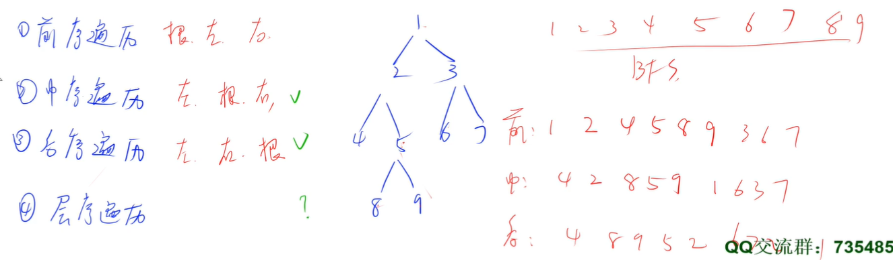
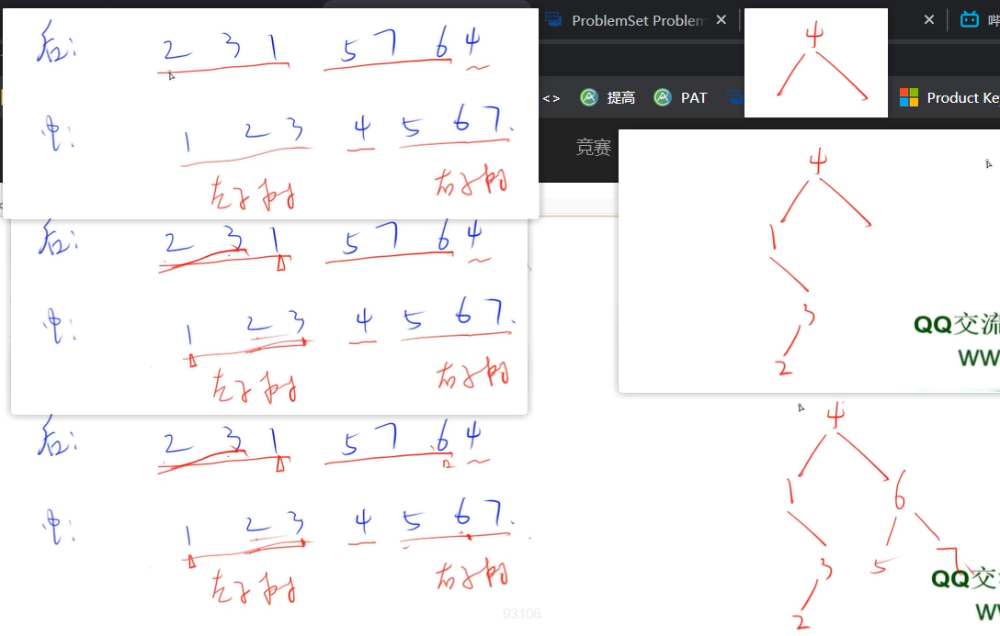
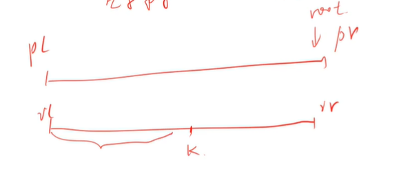
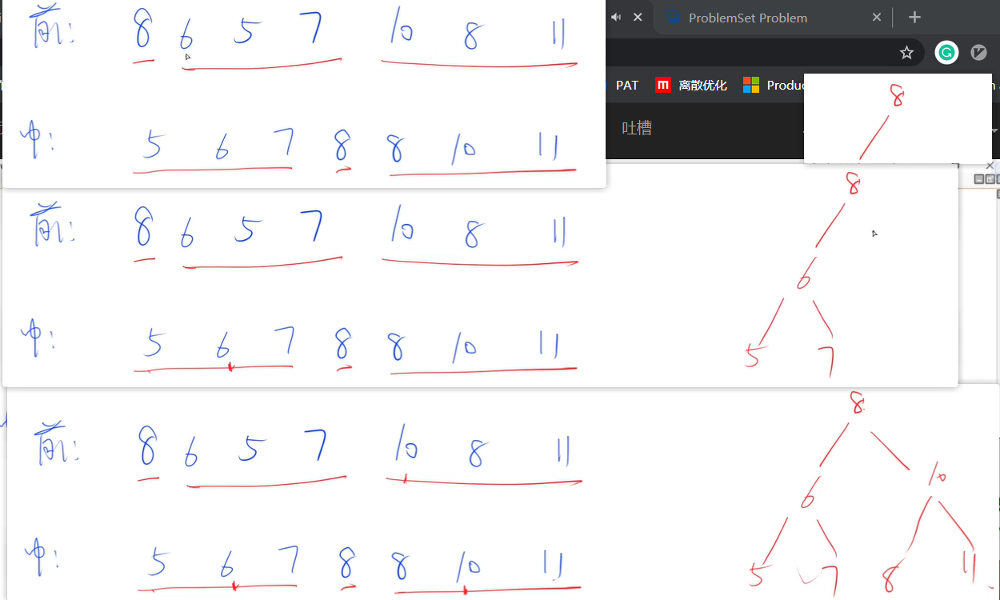
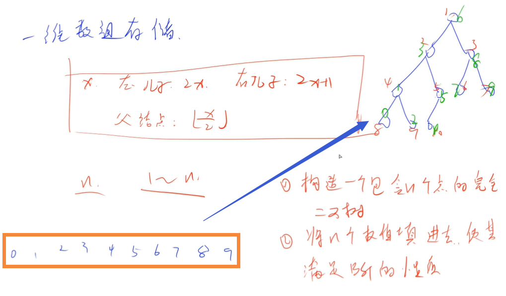
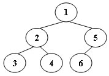
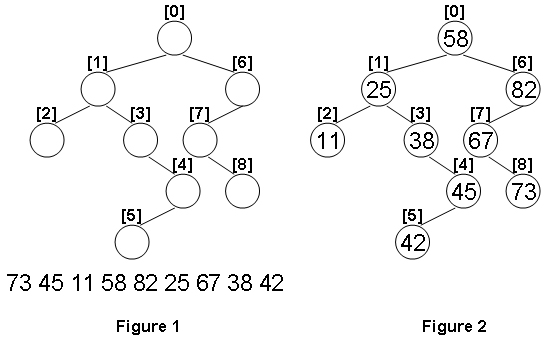

<!-- @import "[TOC]" {cmd="toc" depthFrom=3 depthTo=3 orderedList=false} -->

<!-- code_chunk_output -->

- [数叶子结点 1004 Counting Leaves (30 point(s))](#数叶子结点-1004-counting-leaves-30-points)
- [树的遍历 1020 Tree Traversals (25 point(s))](#树的遍历-1020-tree-traversals-25-points)
- [最深的根 1021 Deepest Root (25 point(s))](#最深的根-1021-deepest-root-25-points)
- [判断二叉搜索树 1043 Is It a Binary Search Tree (25 point(s))](#判断二叉搜索树-1043-is-it-a-binary-search-tree-25-points)
- [完全二叉搜索树 1064 Complete Binary Search Tree (30 point(s))](#完全二叉搜索树-1064-complete-binary-search-tree-30-points)
- [再次树遍历 1086 Tree Traversals Again (25 point(s))](#再次树遍历-1086-tree-traversals-again-25-points)
- [构建二叉搜索树 1099 Build A Binary Search Tree (30 point(s))](#构建二叉搜索树-1099-build-a-binary-search-tree-30-points)
- [反转二叉树 1102 Invert a Binary Tree (25 point(s))](#反转二叉树-1102-invert-a-binary-tree-25-points)

<!-- /code_chunk_output -->

### 数叶子结点 1004 Counting Leaves (30 point(s))

<p>家庭关系可以用家谱树来表示，给定一个家谱树，你的任务是找出其中没有孩子的成员。</p>

<h4>输入格式</h4>

第一行包含一个整数 $N$ 表示树中结点总数以及一个整数 $M$ 表示非叶子结点数。

接下来 $M$ 行，每行的格式为：

<pre><code>
ID K ID[1] ID[2] ... ID[K]
</code></pre>

$ID$ 是一个两位数字，表示一个非叶子结点编号，$K$ 是一个整数，表示它的子结点数，接下来的 $K$ 个 $ID[i]$ 也是两位数字，表示一个子结点的编号。

为了简单起见，我们将根结点固定设为 $01$。

所有结点的编号即为 $01,02,03,...,31,32,33,...,N$。

<h4>输出格式</h4>

<p>输出从根结点开始，自上到下，树的<strong>每一层级</strong>分别包含多少个叶子节点。</p>

<p>输出占一行，整数之间用空格隔开。</p>

<h4>数据范围</h4>

$0 < N < 100$

<h4>输入样例：</h4>

<pre><code>
2 1
01 1 02
</code></pre>

<h4>输出样例：</h4>

<pre><code>
0 1
</code></pre>

<h4>样例解释</h4>

该样例表示一棵只有 $2$ 个结点的树，其中 $01$ 结点是根，而 $02$ 结点是其唯一的子节点。

因此，在根这一层级上，存在 $0$ 个叶结点；在下一个级别上，有 $1$ 个叶结点。

<p>所以，我们应该在一行中输出0 1。</p>

#### 1004 Counting Leaves (30 point(s))
A family hierarchy is usually presented by a pedigree tree. Your job is to count those family members who have no child.

#### Input Specification:
Each input file contains one test case. Each case starts with a line containing $0<N<100$, the number of nodes in a tree, and M (<N), the number of non-leaf nodes. Then M lines follow, each in the format:

```
ID K ID[1] ID[2] ... ID[K]
```

where ID is a two-digit number representing a given non-leaf node, K is the number of its children, followed by a sequence of two-digit ID's of its children. For the sake of simplicity, let us fix the root ID to be 01.

The input ends with N being 0. That case must NOT be processed.

#### Output Specification:
For each test case, you are supposed to count those family members who have no child for every seniority level starting from the root. The numbers must be printed in a line, separated by a space, and there must be no extra space at the end of each line.

The sample case represents a tree with only 2 nodes, where 01 is the root and 02 is its only child. Hence on the root 01 level, there is 0 leaf node; and on the next level, there is 1 leaf node. Then we should output 0 1 in a line.

```cpp
#include <cstring>
#include <iostream>
#include <algorithm>

using namespace std;

const int N = 110;

int n, m;
int h[N], e[N], ne[N], idx;
int cnt[N], max_depth;

void add(int a, int b)
{
    e[idx] = b, ne[idx] = h[a], h[a] = idx ++ ;
}

void dfs(int u, int depth)
{
    if (h[u] == -1)  // 说明u是叶子节点
    {
        cnt[depth] ++ ;
        max_depth = max(max_depth, depth);
        return;
    }

    for (int i = h[u]; ~i; i = ne[i])
        dfs(e[i], depth + 1);
}

int main()
{
    cin >> n >> m;

    memset(h, -1, sizeof h);
    for (int i = 0; i < m; i ++ )
    {
        int id, k;
        cin >> id >> k;
        while (k -- )
        {
            int son;
            cin >> son;
            add(id, son);
        }
    }

    dfs(1, 0);

    cout << cnt[0];
    for (int i = 1; i <= max_depth; i ++ ) cout << ' ' << cnt[i];
    cout << endl;

    return 0;
}
```

### 树的遍历 1020 Tree Traversals (25 point(s))

<p>一个二叉树，树中每个节点的权值互不相同。</p>

<p>现在给出它的后序遍历和中序遍历，请你输出它的层序遍历。</p>

<h4>输入格式</h4>

第一行包含整数 $N$，表示二叉树的节点数。

第二行包含 $N$ 个整数，表示二叉树的后序遍历。

第三行包含 $N$ 个整数，表示二叉树的中序遍历。

<h4>输出格式</h4>

输出一行 $N$ 个整数，表示二叉树的层序遍历。

<h4>数据范围</h4>

$1 \le N \le 30$

<h4>输入样例：</h4>

<pre><code>
7
2 3 1 5 7 6 4
1 2 3 4 5 6 7
</code></pre>

<h4>输出样例：</h4>

<pre><code>
4 1 6 3 5 7 2
</code></pre>

#### 1020 Tree Traversals (25 point(s))
Suppose that all the keys in a binary tree are distinct positive integers. Given the postorder and inorder traversal sequences, you are supposed to output the level order traversal sequence of the corresponding binary tree.

#### Input Specification:
Each input file contains one test case. For each case, the first line gives a positive integer N (≤30), the total number of nodes in the binary tree. The second line gives the postorder sequence and the third line gives the inorder sequence. All the numbers in a line are separated by a space.

#### Output Specification:
For each test case, print in one line the level order traversal sequence of the corresponding binary tree. All the numbers in a line must be separated by exactly one space, and there must be no extra space at the end of the line.



知道后序和中序，一定能确定一棵树。



```cpp
#include <cstring>
#include <iostream>
#include <algorithm>
#include <unordered_map>

using namespace std;

const int N = 40;

int n;
int postorder[N], inorder[N];  // 后序遍历、中序遍历
unordered_map<int, int> l, r, pos;  // 因为是二叉树，所以可以不用链表存
// pos 数字在中序遍历中的索引
int q[N];  // 用于 bfs 队列，层序遍历用 bfs

// 中序遍历左右端点，后续遍历左右端点
int build(int il, int ir, int pl, int pr)
{
    int root = postorder[pr];  // 后续遍历的最后一个是 root
    int k = pos[root];
    if (il < k) l[root] = build(il, k - 1, pl, pl + (k - 1 - il));  // 中序与后序对应的序列长度是相同的
    if (k < ir) r[root] = build(k + 1, ir, pl + (k - 1 - il) + 1, pr - 1);
    return root;
}

void bfs(int root)
{
    int hh = 0, tt = 0;
    q[0] = root;

    while (hh <= tt)
    {
        int t = q[hh ++ ];
        if (l.count(t)) q[ ++ tt] = l[t];
        if (r.count(t)) q[ ++ tt] = r[t];
    }

    cout << q[0];
    for (int i = 1; i < n; i ++ ) cout << ' ' << q[i];
    cout << endl;
}

int main()
{
    cin >> n;
    for (int i = 0; i < n; i ++ ) cin >> postorder[i];
    for (int i = 0; i < n; i ++ )
    {
        cin >> inorder[i];
        pos[inorder[i]] = i;
    }

    int root = build(0, n - 1, 0, n - 1);

    bfs(root);

    return 0;
}
```

上面的 build 见下图辅助理解。



**经验：**
- 前序遍历 Preorder Traversal 、中序遍历 Inorder Traversal 、后序遍历 Postorder Traversal 用递归，层序遍历 Levelorder Traversal 用 BFS

### 最深的根 1021 Deepest Root (25 point(s))

<p>一个无环连通图可以被视作一个树。</p>

<p>树的高度取决于所选取的根节点。</p>

<p>现在，你要找到可以使得树的高度最大的根节点。</p>

<p>它被称为最深的根。</p>

<h4>输入格式</h4>

第一行包含整数 $N$，表示节点数量。

节点编号为 $1 \sim N$。

接下来 $N-1$ 行，每行包含两个整数，表示两个节点之间存在一条边。

<h4>输出格式</h4>

<p>输出最深的根的节点编号。</p>

<p>如果最深的根不唯一，则按照从小到大的顺序，将它们依次输出，每个占一行。</p>

如果给定的图不是树，输出 <code>Error: K components</code>，其中 $K$ 是图中连通分量的数量。

<h4>数据范围</h4>

$1 \le N \le 10^4$

<h4>输入样例1：</h4>

<pre><code>
5
1 2
1 3
1 4
2 5
</code></pre>

<h4>输出样例1：</h4>

<pre><code>
3
4
5
</code></pre>

<h4>输入样例2：</h4>

<pre><code>
5
1 3
1 4
2 5
3 4
</code></pre>

<h4>输出样例2：</h4>

<pre><code>
Error: 2 components
</code></pre>

#### 1021 Deepest Root (25 point(s))
A graph which is connected and acyclic can be considered a tree. The height of the tree depends on the selected root. Now you are supposed to find the root that results in a highest tree. Such a root is called the deepest root.

#### Input Specification:
Each input file contains one test case. For each case, the first line contains a positive integer $N (≤10^4)$ which is the number of nodes, and hence the nodes are numbered from 1 to N. Then N−1 lines follow, each describes an edge by given the two adjacent nodes' numbers.

#### Output Specification:
For each test case, print each of the deepest roots in a line. If such a root is not unique, print them in increasing order of their numbers. In case that the given graph is not a tree, print Error: K components where K is the number of connected components in the graph.

```cpp
// 首先通过并查集判断几个连通块
// 然后对各个点 bfs ，看谁的最大深度大

#include <cstring>
#include <iostream>
#include <algorithm>
#include <vector>

using namespace std;

const int N = 10010, M = N * 2;

int n;
int h[N], e[M], ne[M], idx;
int p[N];

int find(int x)
{
    if (p[x] != x) p[x] = find(p[x]);
    return p[x];
}

void add(int a, int b)
{
    e[idx] = b, ne[idx] = h[a], h[a] = idx ++ ;
}

int dfs(int u, int father)
{
    int depth = 0;
    for (int i = h[u]; ~i; i = ne[i])
    {
        int j = e[i];
        if (j == father) continue;
        depth = max(depth, dfs(j, u) + 1);
    }
    return depth;
}

int main()
{
    cin >> n;

    memset(h, -1, sizeof h);
    for (int i = 1; i <= n; i ++ ) p[i] = i;

    int k = n;
    for (int i = 0; i < n - 1; i ++ )
    {
        int a, b;
        cin >> a >> b;
        if (find(a) != find(b))
        {
            k -- ;
            p[find(a)] = find(b);
        }
        add(a, b), add(b, a);
    }

    if (k > 1) printf("Error: %d components", k);
    else
    {
        vector<int> nodes;
        int max_depth = -1;

        for (int i = 1; i <= n; i ++ )
        {
            int depth = dfs(i, -1);
            if (depth > max_depth)
            {
                max_depth = depth;
                nodes.clear();
                nodes.push_back(i);
            }
            else if (depth == max_depth)
                nodes.push_back(i);
        }

        for (auto v : nodes) cout << v << endl;
    }

    return 0;
}
```

**经验：**
- 包含 $N$ 个点 $N-1$ 条边的一个连通块一定是一棵树

### 判断二叉搜索树 1043 Is It a Binary Search Tree (25 point(s))

<p>二叉搜索树 (BST) 递归定义为具有以下属性的二叉树：</p>

- 若它的左子树不空，则左子树上所有结点的值均小于它的根结点的值
- 若它的右子树不空，则右子树上所有结点的值均大于或等于它的根结点的值
- 它的左、右子树也分别为二叉搜索树

<p>我们将二叉搜索树镜面翻转得到的树称为二叉搜索树的镜像。</p>

<p>现在，给定一个整数序列，请你判断它是否可能是某个二叉搜索树或其镜像进行前序遍历的结果。</p>

<h4>输入格式</h4>

第一行包含整数 $N$，表示节点数量。

第二行包含 $N$ 个整数。

<h4>输出格式</h4>

<p>如果给定整数序列是某个二叉搜索树或其镜像的前序遍历序列，则在第一行输出 <code>YES</code>，否则输出 <code>NO</code>。</p>

<p>如果你的答案是 <code>YES</code>，则还需要在第二行输出这棵树的后序遍历序列。</p>

<h4>数据范围</h4>

$1 \le N \le 1000$

<h4>输入样例1：</h4>

<pre><code>
7
8 6 5 7 10 8 11
</code></pre>

<h4>输出样例1：</h4>

<pre><code>
YES
5 7 6 8 11 10 8
</code></pre>

<h4>输入样例2：</h4>

<pre><code>
7
8 10 11 8 6 7 5
</code></pre>

<h4>输出样例2：</h4>

<pre><code>
YES
11 8 10 7 5 6 8
</code></pre>

<h4>输入样例3：</h4>

<pre><code>
7
8 6 8 5 10 9 11
</code></pre>

<h4>输出样例3：</h4>

<pre><code>
NO
</code></pre>

#### 1043 Is It a Binary Search Tree (25 point(s))
A Binary Search Tree (BST) is recursively defined as a binary tree which has the following properties:
- The left subtree of a node contains only nodes with keys less than the node's key.
The right subtree of a node contains only nodes with keys greater than or equal to the node's key.
- Both the left and right subtrees must also be binary search trees.
- If we swap the left and right subtrees of every node, then the resulting tree is called the Mirror Image of a BST.

Now given a sequence of integer keys, you are supposed to tell if it is the preorder traversal sequence of a BST or the mirror image of a BST.

#### Input Specification:
Each input file contains one test case. For each case, the first line contains a positive integer N (≤1000). Then N integer keys are given in the next line. All the numbers in a line are separated by a space.

#### Output Specification:
For each test case, first print in a line YES if the sequence is the preorder traversal sequence of a BST or the mirror image of a BST, or NO if not. Then if the answer is YES, print in the next line the postorder traversal sequence of that tree. All the numbers in a line must be separated by a space, and there must be no extra space at the end of the line.



上图：由前序遍历与中序遍历生成树；在中序遍历中，存在两个相同的 8 该怎么办呢？因为我们的二叉搜索树要求左子树数值严格小于本节点，因此一定是取左边的 8 ，这样右边的 8 才能落在右子树。

还有很重要一点：
- **对于二叉搜索树来讲，中序遍历得到的就是非降序列**
- 因此这道题还相当于把中序遍历给出了

```cpp
#include <cstring>
#include <iostream>
#include <algorithm>

using namespace std;

const int N = 1010;

int n;
int preorder[N], inorder[N];
int postorder[N], cnt;

bool build(int il, int ir, int pl, int pr, int type)
{
    if (il > ir) return true;

    int root = preorder[pl];
    int k;
    // 如果不是翻转的 BST ，找最左边的对应的中序遍位置
    if (type == 0)
    {
        for (k = il; k <= ir; k ++ )
            if (inorder[k] == root)
                break;
        if (k > ir) return false;
    }
    else
    // 如果是翻转的 BST ，找最右边的对应的中序遍位置
    {
        for (k = ir; k >= il; k -- )
            if (inorder[k] == root)
                break;
        if (k < il) return false;
    }

    bool res = true;
    if (!build(il, k - 1, pl + 1, pl + 1 + (k - 1 - il), type)) res = false;
    if (!build(k + 1, ir, pl + 1 + (k - 1 - il) + 1, pr, type)) res = false;

    // 同时构造后序遍历
    postorder[cnt ++ ] = root;
    return res;
}

int main()
{
    cin >> n;
    for (int i = 0; i < n; i ++ )
    {
        cin >> preorder[i];
        inorder[i] = preorder[i];
    }

    // BST 中序遍历就是非降序列
    sort(inorder, inorder + n);

    // 看看没有翻转，是否是 BST
    if (build(0, n - 1, 0, n - 1, 0))
    {
        puts("YES");
        cout << postorder[0];
        for (int i = 1; i < n; i ++ ) cout << ' ' << postorder[i];
        cout << endl;
    }
    else
    {
        // 如果上面不是，那就翻转一下中序遍历，看看是不是 BST
        reverse(inorder, inorder + n);
        cnt = 0;
        // 注意需要把翻转信息传入 build
        if (build(0, n - 1, 0, n - 1, 1))
        {
            puts("YES");
            cout << postorder[0];
            for (int i = 1; i < n; i ++ ) cout << ' ' << postorder[i];
            cout << endl;
        }
        else puts("NO");
    }

    return 0;
}
```

**经验：**
- 对于二叉搜索树 BST 来讲，中序遍历得到的就是非降序列

### 完全二叉搜索树 1064 Complete Binary Search Tree (30 point(s))

<p>二叉搜索树 (BST) 递归定义为具有以下属性的二叉树：</p>

- 若它的左子树不空，则左子树上所有结点的值均小于它的根结点的值
- 若它的右子树不空，则右子树上所有结点的值均大于或等于它的根结点的值
- 它的左、右子树也分别为二叉搜索树

<p>完全二叉树 (CBT) 定义为除最深层外的其他层的结点数都达到最大个数，最深层的所有结点都连续集中在最左边的二叉树。</p>

现在，给定 $N$ 个不同非负整数，表示 $N$ 个结点的权值，用这 $N$ 个结点可以构成唯一的完全二叉搜索树。

<p>请你输出该完全二叉搜索树的层序遍历。</p>

<h4>输入格式</h4>

第一行包含整数 $N$，表示结点个数。
第二行包含 $N$ 个不同非负整数，表示每个结点的权值。

<h4>输出格式</h4>

<p>共一行，输出给定完全二叉搜索树的层序遍历序列。</p>

<h4>数据范围</h4>

- $1 \le N \le 1000$,
- 结点权值不超过 $2000$。

<h4>输入样例：</h4>

<pre><code>
10
1 2 3 4 5 6 7 8 9 0
</code></pre>

<h4>输出样例：</h4>

<pre><code>
6 3 8 1 5 7 9 0 2 4
</code></pre>

#### 1064 Complete Binary Search Tree (30 point(s))
A Binary Search Tree (BST) is recursively defined as a binary tree which has the following properties:

- The left subtree of a node contains only nodes with keys less than the node's key.
- The right subtree of a node contains only nodes with keys greater than or equal to the node's key.
- Both the left and right subtrees must also be binary search trees.

A Complete Binary Tree (CBT) is a tree that is completely filled, with the possible exception of the bottom level, which is filled from left to right.

Now given a sequence of distinct non-negative integer keys, a unique BST can be constructed if it is required that the tree must also be a CBT. You are supposed to output the level order traversal sequence of this BST.

#### Input Specification:
Each input file contains one test case. For each case, the first line contains a positive integer N (≤1000). Then N distinct non-negative integer keys are given in the next line. All the numbers in a line are separated by a space and are no greater than 2000.

#### Output Specification:
For each test case, print in one line the level order traversal sequence of the corresponding complete binary search tree. All the numbers in a line must be separated by a space, and there must be no extra space at the end of the line.

完全二叉树常作为堆的数据结构，注意完全二叉树不是满二叉树。



对于本题，就是讲N个节点的二叉树建出来；为了满足 BST 性质，则中序遍历二叉树的节点，将数值从小到大填入。如上图。

```cpp
#include <iostream>
#include <algorithm>

using namespace std;

const int N = 1010;

int n;
int w[N], tr[N];

void dfs(int u, int& k)  // 中序遍历
{
    // 注意这个 k 是全局的
    if (u * 2 <= n) dfs(u * 2, k);
    tr[u] = w[k ++ ];
    if (u * 2 + 1 <= n) dfs(u * 2 + 1, k);
}

int main()
{
    cin >> n;
    for (int i = 0; i < n; i ++ ) cin >> w[i];

    sort(w, w + n);

    int k = 0;
    dfs(1, k);  // 用 dfs 进行中序遍历递归

    cout << tr[1];
    for (int i = 2; i <= n; i ++ ) cout << ' ' << tr[i];
    cout << endl;

    return 0;
}
```

### 再次树遍历 1086 Tree Traversals Again (25 point(s))

<p>通过使用栈可以以非递归方式实现二叉树的中序遍历。</p>

例如，假设遍历一个如下图所示的 $6$ 节点的二叉树（节点编号从 $1$ 到 $6$）。

<p>则堆栈操作为：push(1); push(2); push(3); pop(); pop(); push(4); pop(); pop(); push(5); push(6); pop(); pop()。</p>

<p>我们可以从此操作序列中生成唯一的二叉树。</p>

<p>你的任务是给出这棵树的后序遍历。</p>



<h4>输入格式</h4>

第一行包含整数 $N$，表示树中节点个数。

树中节点编号从 $1$ 到 $N$。

接下来 $2N$ 行，每行包含一个栈操作，格式为：

- <code>Push X</code>，将编号为 $X$ 的节点压入栈中。
- <code>Pop</code>，弹出栈顶元素。

<h4>输出格式</h4>

<p>输出这个二叉树的后序遍历序列。</p>

<p>数据保证有解，数和数之间用空格隔开，末尾不能有多余空格。</p>

<h4>数据范围</h4>

$1 \le N \le 30$

<h4>输入样例：</h4>

<pre><code>
6
Push 1
Push 2
Push 3
Pop
Pop
Push 4
Pop
Pop
Push 5
Push 6
Pop
Pop
</code></pre>

<h4>输出样例：</h4>

<pre><code>
3 4 2 6 5 1
</code></pre>

#### 1086 Tree Traversals Again (25 point(s))
An inorder binary tree traversal can be implemented in a non-recursive way with a stack. For example, suppose that when a 6-node binary tree (with the keys numbered from 1 to 6) is traversed, the stack operations are: `push(1); push(2); push(3); pop(); pop(); push(4); pop(); pop(); push(5); push(6); pop(); pop()`. Then a unique binary tree (shown in Figure 1) can be generated from this sequence of operations. Your task is to give the postorder traversal sequence of this tree.


#### Input Specification:
Each input file contains one test case. For each case, the first line contains a positive integer N (≤30) which is the total number of nodes in a tree (and hence the nodes are numbered from 1 to N). Then 2N lines follow, each describes a stack operation in the format: "Push X" where X is the index of the node being pushed onto the stack; or "Pop" meaning to pop one node from the stack.

#### Output Specification:
For each test case, print the postorder traversal sequence of the corresponding tree in one line. A solution is guaranteed to exist. All the numbers must be separated by exactly one space, and there must be no extra space at the end of the line.

```cpp
// 如果该节点是 push 出来的，则下一个 push 的节点是该节点的左节点
// 如果该节点是 pop 出来的，则下一个 push 的节点是该节点的右节点
#include <iostream>
#include <stack>

using namespace std;

const int N = 40;

int n;
int l[N], r[N];

void dfs(int u, int root)
{
    if (!u) return;

    dfs(l[u], root);
    dfs(r[u], root);

    cout << u;
    if (u != root) cout << ' ';
}

int main()
{
    cin >> n;

    int root;
    int last = 0, type;  // last=0 表示上一个节点还没有
    stack<int> stk;
    for (int i = 0; i < n * 2; i ++ )
    {
        string op;
        cin >> op;
        if (op == "Push")
        {
            int x;
            cin >> x;
            if (!last) root = x;
            else
            {
                if (type == 0) l[last] = x;
                else r[last] = x;
            }
            stk.push(x);
            last = x;
            type = 0;  // 表示push
        }
        else
        {
            last = stk.top();
            stk.pop();
            type = 1;  // 表示pop
        }
    }

    dfs(root, root);  // 第二个 root 是帮助后序遍历输出用的

    return 0;
}
```

### 构建二叉搜索树 1099 Build A Binary Search Tree (30 point(s))

<p>二叉搜索树 (BST) 递归定义为具有以下属性的二叉树：</p>

- 若它的左子树不空，则左子树上所有结点的值均小于它的根结点的值
- 若它的右子树不空，则右子树上所有结点的值均大于或等于它的根结点的值
- 它的左、右子树也分别为二叉搜索树

<p>给定二叉树的具体结构以及一系列不同的整数，只有一种方法可以将这些数填充到树中，以使结果树满足 BST 的定义。</p>

<p>请你输出结果树的层序遍历。</p>

示例如图 $1$ 和图 $2$ 所示。



<h4>输入格式</h4>

第一行包含一个正整数 $N$，表示树的结点个数。

所有结点的编号为 $0 \sim N-1$，并且编号为 $0$ 的结点是根结点。

接下来 $N$ 行，第 $i$ 行（从 $0$ 计数）包含结点 $i$ 的左右子结点编号。如果该结点的某个子结点不存在，则用 $-1$ 表示。

最后一行，包含 $N$ 个不同的整数，表示要插入树中的数值。

<h4>输出格式</h4>

<p>输出结果树的层序遍历序列。</p>

<h4>数据范围</h4>

$1 \le N \le 100$

<h4>输入样例：</h4>

<pre><code>
9
1 6
2 3
-1 -1
-1 4
5 -1
-1 -1
7 -1
-1 8
-1 -1
73 45 11 58 82 25 67 38 42
</code></pre>

<h4>输出样例：</h4>

<pre><code>
58 25 82 11 38 67 45 73 42
</code></pre>

#### 1099 Build A Binary Search Tree (30 point(s))
A Binary Search Tree (BST) is recursively defined as a binary tree which has the following properties:

- The left subtree of a node contains only nodes with keys less than the node's key.
- The right subtree of a node contains only nodes with keys greater than or equal to the node's key.
- Both the left and right subtrees must also be binary search trees.

Given the structure of a binary tree and a sequence of distinct integer keys, there is only one way to fill these keys into the tree so that the resulting tree satisfies the definition of a BST. You are supposed to output the level order traversal sequence of that tree. The sample is illustrated by Figure 1 and 2.


#### Input Specification:
Each input file contains one test case. For each case, the first line gives a positive integer N (≤100) which is the total number of nodes in the tree. The next N lines each contains the left and the right children of a node in the format left_index right_index, provided that the nodes are numbered from 0 to N−1, and 0 is always the root. If one child is missing, then −1 will represent the NULL child pointer. Finally N distinct integer keys are given in the last line.

#### Output Specification:
For each test case, print in one line the level order traversal sequence of that tree. All the numbers must be separated by a space, with no extra space at the end of the line.

```cpp
#include <cstring>
#include <iostream>
#include <algorithm>

using namespace std;

const int N = 110;

int n;
int l[N], r[N];
int a[N], w[N];
int q[N];

void dfs(int u, int& k)  // BST 中序遍历正好是非降序列
{
    if (u == -1) return;

    dfs(l[u], k);
    w[u] = a[k ++ ];
    dfs(r[u], k);
}

void bfs()  // bfs 来层序遍历
{
    int hh = 0, tt = 0;
    q[0] = 0;

    while (hh <= tt)
    {
        int t = q[hh ++ ];
        if (l[t] != -1) q[ ++ tt] = l[t];
        if (r[t] != -1) q[ ++ tt] = r[t];
    }

    cout << w[q[0]];
    for (int i = 1; i < n; i ++ ) cout << ' ' << w[q[i]];
}

int main()
{
    cin >> n;
    for (int i = 0; i < n; i ++ ) cin >> l[i] >> r[i];
    for (int i = 0; i < n; i ++ ) cin >> a[i];
    sort(a, a + n);  // 把数排好，按照中序遍历放入 BST 中

    int k = 0;
    dfs(0, k);
    bfs();

    return 0;
}
```

### 反转二叉树 1102 Invert a Binary Tree (25 point(s))

<p>以下是来自 <code>Max Howell @twitter</code> 的内容：</p>

<pre><code>
谷歌：我们的百分之九十的工程师都使用你编写的软件，但是你连在白板上反转二叉树都做不到，还是滚吧。
</code></pre>

<p>现在，请你证明你会反转二叉树。</p>

<h4>输入格式</h4>

第一行包含一个整数 $N$，表示树的结点数量。

所有结点编号从 $0$ 到 $N-1$。

接下来 $N$ 行，每行对应一个 $0 \sim N-1$ 的结点，给出该结点的左右子结点的编号，如果该结点的某个子结点不存在，则用 <code>−</code> 表示。

<h4>输出格式</h4>

<p>输出反转后二叉树的层序遍历序列和中序遍历序列，每个序列占一行。</p>

<p>相邻数字之间用空格隔开，末尾不得有多余空格。</p>

<h4>数据范围</h4>

$1 \le N \le 10$

<h4>输入样例：</h4>

<pre><code>
8
1 -
- -
0 -
2 7
- -
- -
5 -
4 6
</code></pre>

<h4>输出样例：</h4>

<pre><code>
3 7 2 6 4 0 5 1
6 5 7 4 3 2 0 1
</code></pre>

#### 1102 Invert a Binary Tree (25 point(s))
The following is from Max Howell @twitter:

```
Google: 90% of our engineers use the software you wrote (Homebrew), but you can't invert a binary tree on a whiteboard so fuck off.
```

Now it's your turn to prove that YOU CAN invert a binary tree!

#### Input Specification:
Each input file contains one test case. For each case, the first line gives a positive integer $N (≤10)$ which is the total number of nodes in the tree -- and hence the nodes are numbered from 0 to N−1. Then N lines follow, each corresponds to a node from 0 to N−1, and gives the indices of the left and right children of the node. If the child does not exist, a `-` will be put at the position. Any pair of children are separated by a space.

#### Output Specification:
For each test case, print in the first line the level-order, and then in the second line the in-order traversal sequences of the inverted tree. There must be exactly one space between any adjacent numbers, and no extra space at the end of the line.

```cpp
#include <iostream>
#include <cstring>
#include <algorithm>
using namespace std;

const int N = 20;

int n;
int l[N], r[N];
bool has_father[N];
int q[N];

void dfs_reverse(int u)
{
    if (l[u] != -1) dfs_reverse(l[u]);
    if (r[u] != -1) dfs_reverse(r[u]);
    swap(l[u], r[u]);
}

void bfs(int root)
{
    int tt = 0, hh = 0;
    q[0] = root;
    
    while (hh <= tt)
    {
        int t = q[hh ++];
        if (l[t] != -1) q[++ tt] = l[t];
        if (r[t] != -1) q[++ tt] = r[t];
    }
    
    cout << q[0];
    for (int i = 1; i < n; ++ i) cout << ' ' << q[i];
    cout << endl;
}

void dfs(int u, int& k)
{
    if (l[u] != -1) dfs(l[u], k);
    cout << u;
    if (++ k != n) cout << ' ';
    if (r[u] != -1) dfs(r[u], k);
}

int main()
{
    cin >> n;
    
    memset(l, -1, sizeof l);
    memset(r, -1, sizeof r);
    for (int i = 0; i < n; i ++ )
    {
        char s1, s2;
        cin >> s1 >> s2;
        if (s1 != '-') l[i] = s1 - '0', has_father[l[i]] = true;
        if (s2 != '-') r[i] = s2 - '0', has_father[r[i]] = true;
    }

    int root = 0;
    while (has_father[root]) root ++ ;

    dfs_reverse(root);
    
    bfs(root);  // 层序遍历
    int k = 0;  // k 用来在 dfs 中判断输出
    dfs(root, k);  // 中序遍历
}
```
