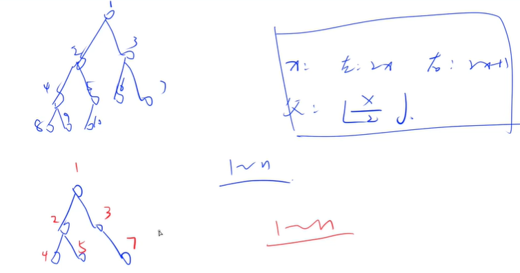
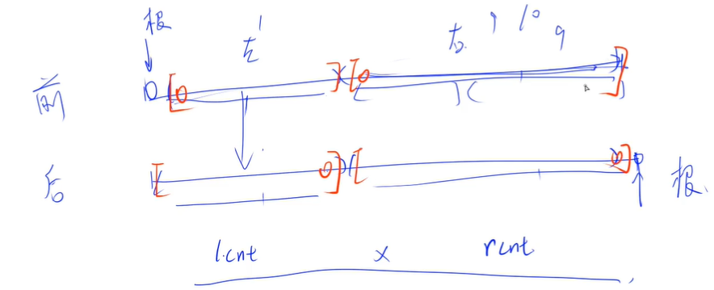
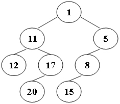
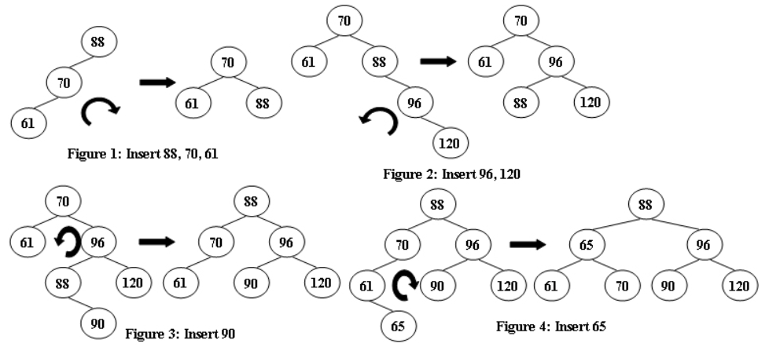
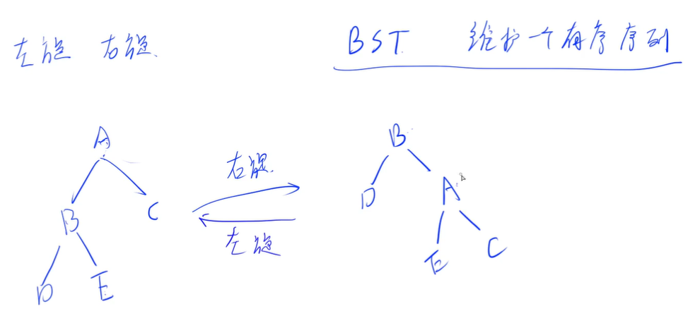
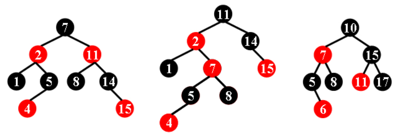

<!-- @import "[TOC]" {cmd="toc" depthFrom=3 depthTo=3 orderedList=false} -->

<!-- code_chunk_output -->

- [完全二叉树 1110 Complete Binary Tree (25 point(s))](#完全二叉树-1110-complete-binary-tree-25-points)
- [二叉搜索树最后两层结点数量 1115 Counting Nodes in a BST (30 point(s))](#二叉搜索树最后两层结点数量-1115-counting-nodes-in-a-bst-30-points)
- [前序和后序遍历 1119 Pre- and Post-order Traversals (30 point(s))](#前序和后序遍历-1119-pre-and-post-order-traversals-30-points)
- [Z 字形遍历二叉树 1127 ZigZagging on a Tree (30 point(s))](#z-字形遍历二叉树-1127-zigzagging-on-a-tree-30-points)
- [后序遍历 1138 Postorder Traversal (25 point(s))](#后序遍历-1138-postorder-traversal-25-points)
- [AVL树的根 1066 Root of AVL Tree (25 point(s))](#avl树的根-1066-root-of-avl-tree-25-points)
- [判断完全 AVL 树 1123 Is It a Complete AVL Tree (30 point(s))](#判断完全-avl-树-1123-is-it-a-complete-avl-tree-30-points)
- [判断红黑树 1135 Is It A Red-Black Tree (30 point(s))](#判断红黑树-1135-is-it-a-red-black-tree-30-points)

<!-- /code_chunk_output -->

### 完全二叉树 1110 Complete Binary Tree (25 point(s))

<p>给定一个树，请你判断它是否是完全二叉树。</p>

<h4>输入格式</h4>

第一行包含整数 $N$，表示树的结点个数。

树的结点编号为 $0 \sim N-1$。

接下来 $N$ 行，每行对应一个结点，并给出该结点的左右子结点的编号，如果某个子结点不存在，则用 <code>-</code> 代替。

<h4>输出格式</h4>

<p>如果是完全二叉树，则输出 <code>YES</code> 以及最后一个结点的编号。</p>

<p>如果不是，则输出 <code>NO</code> 以及根结点的编号。</p>

<h4>数据范围</h4>

$1 \le N \le 20$

<h4>输入样例1：</h4>

<pre><code>
9
7 8
- -
- -
- -
0 1
2 3
4 5
- -
- -
</code></pre>

<h4>输出样例1：</h4>

<pre><code>
YES 8
</code></pre>

<h4>输入样例2：</h4>

<pre><code>
8
- -
4 5
0 6
- -
2 3
- 7
- -
- -
</code></pre>

<h4>输出样例2：</h4>

<pre><code>
NO 1
</code></pre>

#### 1110 Complete Binary Tree (25 point(s))
Given a tree, you are supposed to tell if it is a complete binary tree.

#### Input Specification:
Each input file contains one test case. For each case, the first line gives a positive integer N (≤20) which is the total number of nodes in the tree -- and hence the nodes are numbered from 0 to N−1. Then N lines follow, each corresponds to a node, and gives the indices of the left and right children of the node. If the child does not exist, a - will be put at the position. Any pair of children are separated by a space.

#### Output Specification:
For each case, print in one line YES and the index of the last node if the tree is a complete binary tree, or NO and the index of the root if not. There must be exactly one space separating the word and the number.



完全二叉树性质：按照层序遍历，父节点是 `x` 时，其子节点一定是 `x * 2` 和 `x * 2 + 1` 。因此，如果按照该规则把节点存下来，而 `1~n` 中有空缺，则一定不是完全二叉树。

```cpp
#include <cstring>
#include <iostream>

using namespace std;

const int N = 25;

int n;
int l[N], r[N];
bool has_father[N];
int maxk, maxid;

void dfs(int u, int k)
{
    if (u == -1) return;

    if (k > maxk)
    {
        maxk = k;
        maxid = u;
    }

    // 假设是完全二叉树，然后赋给其符合完全二叉树规则的索引
    dfs(l[u], k * 2);
    dfs(r[u], k * 2 + 1);
}

int main()
{
    memset(l, -1, sizeof l);
    memset(r, -1, sizeof r);

    cin >> n;
    for (int i = 0; i < n; i ++ )
    {
        string a, b;
        cin >> a >> b;
        if (a != "-") l[i] = stoi(a), has_father[l[i]] = true;
        if (b != "-") r[i] = stoi(b), has_father[r[i]] = true;
    }

    int root = 0;
    while (has_father[root]) root ++ ;

    dfs(root, 1);

    if (maxk == n) printf("YES %d\n", maxid);
    else printf("NO %d\n", root);

    return 0;
}
```

**经验：**
- C++ 中 `stoi(s)` 把 `string` 转为 `int`
- C++ 中 `stof(s)` 把 `string` 转为 `float`
- C++ 中 `stod(s)` 把 `string` 转为 `double`
- C++ 中 `stold(s)` 把 `string` 转为 `long double`

### 二叉搜索树最后两层结点数量 1115 Counting Nodes in a BST (30 point(s))

<p>二叉搜索树 (BST) 递归定义为具有以下属性的二叉树：</p>

- 若它的左子树不空，则左子树上所有结点的值均小于或等于它的根结点的值
- 若它的右子树不空，则右子树上所有结点的值均大于它的根结点的值
- 它的左、右子树也分别为二叉搜索树

<p>将一系列数字按顺序插入到一个空的二叉搜索树中，然后，请你计算结果树的最低两层的结点个数。</p>

<h4>输入格式</h4>

第一行包含整数 $N$，表示插入数字序列包含的数字个数。

第二行包含 $N$ 个整数，表示插入数字序列。

<h4>输出格式</h4>

<p>以如下格式，在一行中，输出结果树的最后两层的结点数：</p>

<pre><code>
n1 + n2 = n
</code></pre>

<p><code>n1</code> 是最底层结点数量，<code>n2</code> 是倒数第二层结点数量，<code>n</code> 是它们的和。</p>

<h4>数据范围</h4>

- $1 \le N \le 1000$,
- $-1000 \le$ 插入数字 $\le 1000$。

<h4>输入样例：</h4>

<pre><code>
9
25 30 42 16 20 20 35 -5 28
</code></pre>

<h4>输出样例：</h4>

<pre><code>
2 + 4 = 6
</code></pre>

#### 1115 Counting Nodes in a BST (30 point(s))
A Binary Search Tree (BST) is recursively defined as a binary tree which has the following properties:

- The left subtree of a node contains only nodes with keys less than or equal to the node's key.
- The right subtree of a node contains only nodes with keys greater than the node's key.
- Both the left and right subtrees must also be binary search trees.

Insert a sequence of numbers into an initially empty binary search tree. Then you are supposed to count the total number of nodes in the lowest 2 levels of the resulting tree.

#### Input Specification:
Each input file contains one test case. For each case, the first line gives a positive integer N (≤1000) which is the size of the input sequence. Then given in the next line are the N integers in [−1000,1000] which are supposed to be inserted into an initially empty binary search tree.

#### Output Specification:
For each case, print in one line the numbers of nodes in the lowest 2 levels of the resulting tree in the format:

```
n1 + n2 = n
```

where n1 is the number of nodes in the lowest level, n2 is that of the level above, and n is the sum.

```cpp
// 本题难点在于插入
#include <iostream>

using namespace std;

const int N = 1010;

int n;
int l[N], r[N], v[N], idx;  // l r 保存的是索引（地址），默认值是 0 代表不存在该节点  v 保存的是值
int cnt[N], max_depth;

// 因为插入操作会令 root 变化，因此是 int& u 注意
void insert(int& u, int w)
{
    // 如果不存在该节点
    if (!u)
    {
        u = ++ idx;
        v[u] = w;
    }
    else if (w <= v[u]) insert(l[u], w);
    else insert(r[u], w);
}

void dfs(int u, int depth)
{
    if (!u) return;
    cnt[depth] ++ ;
    max_depth = max(max_depth, depth);
    dfs(l[u], depth + 1);
    dfs(r[u], depth + 1);
}

int main()
{
    cin >> n;

    // 0 代表空值，没有节点
    int root = 0;
    for (int i = 0; i < n; i ++ )
    {
        int w;
        cin >> w;
        insert(root, w);
    }

    dfs(root, 0);

    int n1 = cnt[max_depth], n2 = cnt[max_depth - 1];
    printf("%d + %d = %d\n", n1, n2, n1 + n2);

    return 0;
}
```

### 前序和后序遍历 1119 Pre- and Post-order Traversals (30 point(s))

<p>假设一个二叉树上所有结点的权值都互不相同。</p>

<p>我们可以通过后序遍历和中序遍历来确定唯一二叉树。</p>

<p>也可以通过前序遍历和中序遍历来确定唯一二叉树。</p>

<p>但是，如果只通过前序遍历和后序遍历，则有可能无法确定唯一二叉树。</p>

<p>现在，给定一组前序遍历和后序遍历，请你输出对应二叉树的中序遍历。</p>

<p>如果树不是唯一的，则输出任意一种可能树的中序遍历即可。</p>

<h4>输入格式</h4>

第一行包含整数 $N$，表示结点数量。

<p>第二行给出前序遍历序列。</p>

<p>第三行给出后序遍历序列。</p>

<p>一行中的数字都用空格隔开。</p>

<h4>输出格式</h4>

<p>首先第一行，如果树唯一，则输出 <code>Yes</code>，如果不唯一，则输出 <code>No</code>。</p>

<p>然后在第二行，输出树的中序遍历。</p>

<p>注意，如果树不唯一，则输出任意一种可能的情况均可。</p>

<h4>数据范围</h4>

$1 \le N \le 30$

<h4>输入样例1：</h4>

<pre><code>
7
1 2 3 4 6 7 5
2 6 7 4 5 3 1
</code></pre>

<h4>输出样例1：</h4>

<pre><code>
Yes
2 1 6 4 7 3 5
</code></pre>

<h4>输入样例2：</h4>

<pre><code>
4
1 2 3 4
2 4 3 1
</code></pre>

<h4>输出样例2：</h4>

<pre><code>
No
2 1 3 4
</code></pre>

#### 1119 Pre- and Post-order Traversals (30 point(s))
Suppose that all the keys in a binary tree are distinct positive integers. A unique binary tree can be determined by a given pair of postorder and inorder traversal sequences, or preorder and inorder traversal sequences. However, if only the postorder and preorder traversal sequences are given, the corresponding tree may no longer be unique.

Now given a pair of postorder and preorder traversal sequences, you are supposed to output the corresponding inorder traversal sequence of the tree. If the tree is not unique, simply output any one of them.

#### Input Specification:
Each input file contains one test case. For each case, the first line gives a positive integer N (≤ 30), the total number of nodes in the binary tree. The second line gives the preorder sequence and the third line gives the postorder sequence. All the numbers in a line are separated by a space.

#### Output Specification:
For each test case, first printf in a line Yes if the tree is unique, or No if not. Then print in the next line the inorder traversal sequence of the corresponding binary tree. If the solution is not unique, any answer would do. It is guaranteed that at least one solution exists. All the numbers in a line must be separated by exactly one space, and there must be no extra space at the end of the line.



```cpp
#include <iostream>

using namespace std;

const int N = 40;

int n;
int pre[N], post[N];

// 本质上还是暴搜；枚举左右子树间断点
// 如果发现了两种方案以上，则没必要再枚举
int dfs(int l1, int r1, int l2, int r2, string& in)
{
    if (l1 > r1) return 1;  // 空树肯定对应一种方案
    if (pre[l1] != post[r2]) return 0;  // 返回 0 代表该方案不可行

    int cnt = 0;
    for (int i = l1; i <= r1; i ++ )  // 枚举前序遍历中左子树右端点
    {
        string lin, rin;
        int lcnt = dfs(l1 + 1, i, l2, l2 + i - l1 - 1, lin);  // 前序/后序遍历左子树位置
        int rcnt = dfs(i + 1, r1, l2 + i - l1 - 1 + 1, r2 - 1, rin);  // 前序/后序遍历右子树位置

        if (lcnt && rcnt)  // 如此分割可行时
        {
            // in 记录中序遍历 左子树 + 根节点 + 右子树
            in = lin + to_string(pre[l1]) + ' ' + rin;
            cnt += lcnt * rcnt;
            if (cnt > 1) break;
        }
    }

    return cnt;
}

int main()
{
    cin >> n;
    for (int i = 0; i < n; i ++ ) cin >> pre[i];
    for (int i = 0; i < n; i ++ ) cin >> post[i];

    string in;    
    int cnt = dfs(0, n - 1, 0, n - 1, in);

    if (cnt > 1) puts("No");
    else puts("Yes");

    in.pop_back();  // 把 string 的最后一个字符 pop
    cout << in << endl;

    return 0;
}
```

### Z 字形遍历二叉树 1127 ZigZagging on a Tree (30 point(s))

<p>假设一个二叉树上各结点的权值互不相同。</p>

<p>我们就可以通过其后序遍历和中序遍历来确定唯一二叉树。</p>

请你输出该二叉树的 $Z$ 字形遍历序列----也就是说，从根结点开始，逐层遍历，第一层从右到左遍历，第二层从左到右遍历，第三层从右到左遍历，以此类推。

例如，下图所示二叉树，其 $Z$ 字形遍历序列应该为：<code>1 11 5 8 17 12 20 15</code>。




<h4>输入格式</h4>

第一行包含整数 $N$，表示二叉树结点数量。

第二行包含 $N$ 个整数，表示二叉树的中序遍历序列。

第三行包含 $N$ 个整数，表示二叉树的后序遍历序列。

<h4>输出格式</h4>

输出二叉树的 $Z$ 字形遍历序列。

<h4>数据范围</h4>

$1 \le N \le 30$

<h4>输入样例：</h4>

<pre><code>
8
12 11 20 17 1 15 8 5
12 20 17 11 15 8 5 1
</code></pre>

<h4>输出样例：</h4>

<pre><code>
1 11 5 8 17 12 20 15
</code></pre>

#### 1127 ZigZagging on a Tree (30 point(s))
Suppose that all the keys in a binary tree are distinct positive integers. A unique binary tree can be determined by a given pair of postorder and inorder traversal sequences. And it is a simple standard routine to print the numbers in level-order. However, if you think the problem is too simple, then you are too naive. This time you are supposed to print the numbers in "zigzagging order" -- that is, starting from the root, print the numbers level-by-level, alternating between left to right and right to left. For example, for the following tree you must output: `1 11 5 8 17 12 20 15`.


#### Input Specification:
Each input file contains one test case. For each case, the first line gives a positive integer N (≤30), the total number of nodes in the binary tree. The second line gives the inorder sequence and the third line gives the postorder sequence. All the numbers in a line are separated by a space.

#### Output Specification:
For each test case, print the zigzagging sequence of the tree in a line. All the numbers in a line must be separated by exactly one space, and there must be no extra space at the end of the line.

```cpp
#include <iostream>
#include <algorithm>
#include <unordered_map>

using namespace std;

using namespace std;

const int N = 40;

int n;
unordered_map<int, int> l, r, pos;
int in[N], post[N];
int q[N];

int build(int il, int ir, int pl, int pr)
{
    int root = post[pr];
    int k = pos[root];

    if (il < k) l[root] = build(il, k - 1, pl, pl + k - 1 - il);
    if (k < ir) r[root] = build(k + 1, ir, pl + k - 1 - il + 1, pr - 1);

    return root;
}

void bfs(int root)
{
    int hh = 0, tt = 0;
    q[0] = root;

    int step = 0;  // 记录层数
    while (hh <= tt)
    {
        int head = hh, tail = tt;
        while (hh <= tail)
        {
            int t = q[hh ++ ];
            if (l.count(t)) q[ ++ tt] = l[t];
            if (r.count(t)) q[ ++ tt] = r[t];
        }

        // 如果层数是奇数，那就翻转，该思路很牛逼
        if ( ++ step % 2) reverse(q + head, q + tail + 1);
    }
}

int main()
{
    cin >> n;
    for (int i = 0; i < n; i ++ )
    {
        cin >> in[i];
        pos[in[i]] = i;
    }
    for (int i = 0; i < n; i ++ ) cin >> post[i];

    int root = build(0, n - 1, 0, n - 1);

    bfs(root);

    cout << q[0];
    for (int i = 1; i < n; i ++ ) cout << ' ' << q[i];
    cout << endl;

    return 0;
}
```

### 后序遍历 1138 Postorder Traversal (25 point(s))

<p>假设二叉树上各结点的权值互不相同且都为正整数。</p>

<p>给定二叉树的前序遍历和中序遍历，请你输出二叉树的后序遍历的第一个数字。</p>

<h4>输入格式</h4>

第一行包含整数 $N$，表示二叉树结点总数。

<p>第二行给出二叉树的前序遍历序列。</p>

<p>第三行给出二叉树的中序遍历序列。</p>

<h4>输出格式</h4>

<p>输出二叉树的后序遍历的第一个数字。</p>

<h4>数据范围</h4>

$1 \le N \le 50000$

<h4>输入样例：</h4>

<pre><code>
7
1 2 3 4 5 6 7
2 3 1 5 4 7 6
</code></pre>

<h4>输出样例：</h4>

<pre><code>
3
</code></pre>

#### 1138 Postorder Traversal (25 point(s))
Suppose that all the keys in a binary tree are distinct positive integers. Given the preorder and inorder traversal sequences, you are supposed to output the first number of the postorder traversal sequence of the corresponding binary tree.

#### Input Specification:
Each input file contains one test case. For each case, the first line gives a positive integer N (≤ 50,000), the total number of nodes in the binary tree. The second line gives the preorder sequence and the third line gives the inorder sequence. All the numbers in a line are separated by a space.

#### Output Specification:
For each test case, print in one line the first number of the postorder traversal sequence of the corresponding binary tree.

```cpp
#include <iostream>
#include <cstring>
#include <algorithm>
#include <unordered_map>
using namespace std;

const int N = 1e5 + 10;

int n;
unordered_map<int, int> pos;
int in[N], pre[N];
int post;

void build(int il, int ir, int pl, int pr)
{
    int root = pre[pl];
    int k = pos[root];
    
    if (il < k) build(il, k - 1, pl + 1, pl + 1 + (k - 1 - il));
    if (ir > k) build(k + 1, ir, pl + 1 + (k - 1 - il) + 1, pr);
    
    // 上述递归过程，最终讲让整个树中左儿子的左儿子的左儿子...第一个左儿子得到赋值
    // 即后序遍历的第一个数
    if (!post) post = root;
}

int main()
{
    scanf("%d", &n);
    
    for (int i = 0; i < n; i ++ )
    {
        scanf("%d", &pre[i]);
    }
    
    for (int i = 0; i < n; i ++ )
    {
        scanf("%d", &in[i]);
        pos[in[i]] = i;
    }
    
    build(0, n-1, 0, n-1);
    
    printf("%d\n", post);
}
```

### AVL树的根 1066 Root of AVL Tree (25 point(s))

<p>AVL树是一种自平衡二叉搜索树。 </p>

在AVL树中，任何节点的两个子树的高度最多相差 $1$ 个。

如果某个时间，某节点的两个子树之间的高度差超过 $1$，则将通过树旋转进行重新平衡以恢复此属性。

图 $1-4$ 说明了旋转规则。



<p>现在，给定插入序列，请你求出 AVL 树的根是多少。</p>

<h4>输入格式</h4>

第一行包含整数 $N$，表示总插入值数量。

第二行包含 $N$ 个不同的整数，表示每个插入值。

<h4>输出格式</h4>

<p>输出得到的 AVL 树的根是多少。</p>

<h4>数据范围</h4>

$1 \le N \le 20$

<h4>输入样例1：</h4>

<pre><code>
5
88 70 61 96 120
</code></pre>

<h4>输出样例1：</h4>

<pre><code>
70
</code></pre>

<h4>输入样例2：</h4>

<pre><code>
7
88 70 61 96 120 90 65
</code></pre>

<h4>输出样例2：</h4>

<pre><code>
88
</code></pre>

#### 1066 Root of AVL Tree (25 point(s))
An AVL tree is a self-balancing binary search tree. In an AVL tree, the heights of the two child subtrees of any node differ by at most one; if at any time they differ by more than one, rebalancing is done to restore this property. Figures 1-4 illustrate the rotation rules.


Now given a sequence of insertions, you are supposed to tell the root of the resulting AVL tree.

#### Input Specification:
Each input file contains one test case. For each case, the first line contains a positive integer N (≤20) which is the total number of keys to be inserted. Then N distinct integer keys are given in the next line. All the numbers in a line are separated by a space.

#### Output Specification:
For each test case, print the root of the resulting AVL tree in one line.



BST 本质上是维护一个有序序列，AVL 树中的左旋右旋操作，并不会改变树的中序遍历结果。

上图中右旋是怎么做的呢？把 B 旋转到根节点，然后把 A 变成 B 的右孩子，把 E 补偿给 A 作为 A 的左孩子。

```cpp
#include <iostream>
#include <algorithm>

using namespace std;

const int N = 30;

int l[N], r[N], v[N], h[N], idx;

void update(int u)
{
    h[u] = max(h[l[u]], h[r[u]]) + 1;
}

void R(int& u)
{
    int p = l[u];
    l[u] = r[p], r[p] = u;
    update(u), update(p);
    u = p;
}

void L(int& u)
{
    int p = r[u];
    r[u] = l[p], l[p] = u;
    update(u), update(p);
    u = p;
}

int get_balance(int u)
{
    return h[l[u]] - h[r[u]];
}

void insert(int& u, int w)
{
    if (!u) u = ++ idx, v[u] = w;
    else if (w < v[u])
    {
        insert(l[u], w);
        if (get_balance(u) == 2)
        {
            if (get_balance(l[u]) == 1) R(u);  // （一）
            else L(l[u]), R(u);  // （二）
        }
    }
    else
    {
        insert(r[u], w);
        if (get_balance(u) == -2)
        {
            if (get_balance(r[u]) == -1) L(u);  // （三）
            else R(r[u]), L(u);  // （四）
        }
    }

    update(u);
}

int main()
{
    int n, root = 0;
    cin >> n;

    while (n -- )
    {
        int w;
        cin >> w;
        insert(root, w);
    }

    cout << v[root] << endl;

    return 0;
}
```

### 判断完全 AVL 树 1123 Is It a Complete AVL Tree (30 point(s))

<p>AVL树是一种自平衡二叉搜索树。</p>

在AVL树中，任何节点的两个子树的高度最多相差 $1$ 个。

如果某个时间，某节点的两个子树之间的高度差超过 $1$，则将通过树旋转进行重新平衡以恢复此属性。

图 $1−4$ 说明了旋转规则。


<p>现在，给定插入序列，请你输出得到的AVL树的层序遍历，并判断它是否是完全二叉树。</p>

<h4>输入格式</h4>

第一行包含整数 $N$，表示插入序列中元素个数。

第二行包含 $N$ 个不同的整数表示插入序列。

<h4>输出格式</h4>

<p>第一行输出得到的AVL树的层序遍历序列。</p>

<p>第二行，如果该AVL树是完全二叉树，则输出 <code>YES</code>，否则输出 <code>NO</code>。</p>

<h4>数据范围</h4>

$1 \le N \le 20$

<h4>输入样例1：</h4>

<pre><code>
5
88 70 61 63 65
</code></pre>

<h4>输出样例1：</h4>

<pre><code>
70 63 88 61 65
YES
</code></pre>

<h4>输入样例2：</h4>

<pre><code>
8
88 70 61 96 120 90 65 68
</code></pre>

<h4>输出样例2：</h4>

<pre><code>
88 65 96 61 70 90 120 68
NO
</code></pre>

#### 1123 Is It a Complete AVL Tree (30 point(s))
An AVL tree is a self-balancing binary search tree. In an AVL tree, the heights of the two child subtrees of any node differ by at most one; if at any time they differ by more than one, rebalancing is done to restore this property. Figures 1-4 illustrate the rotation rules.


Now given a sequence of insertions, you are supposed to output the level-order traversal sequence of the resulting AVL tree, and to tell if it is a complete binary tree.

#### Input Specification:
Each input file contains one test case. For each case, the first line contains a positive integer N (≤ 20). Then N distinct integer keys are given in the next line. All the numbers in a line are separated by a space.

#### Output Specification:
For each test case, insert the keys one by one into an initially empty AVL tree. Then first print in a line the level-order traversal sequence of the resulting AVL tree. All the numbers in a line must be separated by a space, and there must be no extra space at the end of the line. Then in the next line, print `YES` if the tree is complete, or `NO` if not.

```cpp
#include <iostream>

using namespace std;

const int N = 30;

int n;
int l[N], r[N], v[N], h[N], idx;
int q[N], pos[N];

void update(int u)
{
    h[u] = max(h[l[u]], h[r[u]]) + 1;
}

void R(int& u)
{
    int p = l[u];
    l[u] = r[p], r[p] = u;
    update(u), update(p);
    u = p;
}

void L(int& u)
{
    int p = r[u];
    r[u] = l[p], l[p] = u;
    update(u), update(p);
    u = p;
}

int get_balance(int u)
{
    return h[l[u]] - h[r[u]];
}

void insert(int& u, int w)
{
    if (!u) u = ++ idx, v[u] = w;
    else if (w < v[u])
    {
        insert(l[u], w);
        if (get_balance(u) == 2)
        {
            if (get_balance(l[u]) == 1) R(u);
            else L(l[u]), R(u);
        }
    }
    else
    {
        insert(r[u], w);
        if (get_balance(u) == -2)
        {
            if (get_balance(r[u]) == -1) L(u);
            else R(r[u]), L(u);
        }
    }

    update(u);
}

bool bfs(int root)
{
    int hh = 0, tt = 0;
    q[0] = root;
    pos[root] = 1;

    bool res = true;
    while (hh <= tt)
    {
        int t = q[hh ++ ];
        if (pos[t] > n) res = false;

        if (l[t]) q[ ++ tt] = l[t], pos[l[t]] = pos[t] * 2;
        if (r[t]) q[ ++ tt] = r[t], pos[r[t]] = pos[t] * 2 + 1;
    }

    return res;
}

int main()
{
    int root = 0;
    cin >> n;
    for (int i = 0; i < n; i ++ )
    {
        int w;
        cin >> w;
        insert(root, w);
    }

    bool res = bfs(root);

    cout << v[q[0]];
    for (int i = 1; i < n; i ++ ) cout << ' ' << v[q[i]];
    cout << endl;

    if (res) puts("YES");
    else puts("NO");

    return 0;
}
```

### 判断红黑树 1135 Is It A Red-Black Tree (30 point(s))

<p>数据结构中有一类平衡的二叉搜索树，称为红黑树。 </p>

它具有以下 $5$ 个属性：

节点是红色或黑色。
- 根节点是黑色。
- 所有叶子都是黑色。（叶子是 NULL节点）
- 每个红色节点的两个子节点都是黑色。
- 从任一节点到其每个叶子的所有路径都包含相同数目的黑色节点。

<p>例如，下列三张图中，左图中的二叉树是红黑树，其余两图中的二叉树不是红黑树。</p>



<p>现在，对于每个给定的二叉搜索树，请你判断它是否是合法的红黑树。</p>

<h4>注意</h4>

<p>给定的前序遍历序列可能不合法，即无法构建出合法二叉搜索树。</p>

<h4>输入格式</h4>

第一行包含整数 $K$，表示共有 $K$ 组测试数据。

每组测试数据，第一行包含整数 $N$，表示二叉搜索树的节点数量。

<p>第二行给出了这个二叉搜索树的前序遍历。</p>

<p>注意，虽然所有节点的权值都为正，但是我们使用负号表示红色节点。</p>

<p>各节点权值互不相同。</p>

<p>输入样例与题目中三个图例相对应。</p>

<h4>输出格式</h4>

<p>对于每组数据，如果是合法红黑树则输出一行 <code>Yes</code>，否则输出一行 <code>No</code>。</p>

<h4>数据范围</h4>

- $1 \le K \le 30$,
- $1 \le N \le 30$

<h4>输入样例：</h4>

<pre><code>
3
9
7 -2 1 5 -4 -11 8 14 -15
9
11 -2 1 -7 5 -4 8 14 -15
8
10 -7 5 -6 8 15 -11 17
</code></pre>

<h4>输出样例：</h4>

<pre><code>
Yes
No
No
</code></pre>

#### 1135 Is It A Red-Black Tree (30 point(s))
There is a kind of balanced binary search tree named red-black tree in the data structure. It has the following 5 properties:

- (1) Every node is either red or black.
- (2) The root is black.
- (3) Every leaf (NULL) is black.
- (4) If a node is red, then both its children are black.
- (5) For each node, all simple paths from the node to descendant leaves contain the same number of black nodes.

For example, the tree in Figure 1 is a red-black tree, while the ones in Figure 2 and 3 are not.


For each given binary search tree, you are supposed to tell if it is a legal red-black tree.

#### Input Specification:
Each input file contains several test cases. The first line gives a positive integer K (≤30) which is the total number of cases. For each case, the first line gives a positive integer N (≤30), the total number of nodes in the binary tree. The second line gives the preorder traversal sequence of the tree. While all the keys in a tree are positive integers, we use negative signs to represent red nodes. All the numbers in a line are separated by a space. The sample input cases correspond to the trees shown in Figure 1, 2 and 3.

#### Output Specification:
For each test case, print in a line "Yes" if the given tree is a red-black tree, or "No" if not.

```cpp

```
