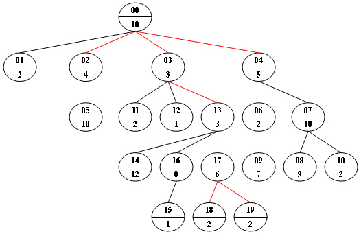

<!-- @import "[TOC]" {cmd="toc" depthFrom=3 depthTo=3 orderedList=false} -->

<!-- code_chunk_output -->

- [等重路径 1053 Path of Equal Weight (30 point(s))](#等重路径-1053-path-of-equal-weight-30-points)
- [最大的一代 1094 The Largest Generation (25 point(s))](#最大的一代-1094-the-largest-generation-25-points)
- [供应链总销售额 1079 Total Sales of Supply Chain (25 point(s))](#供应链总销售额-1079-total-sales-of-supply-chain-25-points)
- [供应链最高价格 1090 Highest Price in Supply Chain (25 point(s))](#供应链最高价格-1090-highest-price-in-supply-chain-25-points)
- [供应链最低价格 1106 Lowest Price in Supply Chain (25 point(s))](#供应链最低价格-1106-lowest-price-in-supply-chain-25-points)
- [堆路径 1155 Heap Paths (30 point(s))](#堆路径-1155-heap-paths-30-points)

<!-- /code_chunk_output -->

### 等重路径 1053 Path of Equal Weight (30 point(s))

给定一个非空的树，树根为 $R$。

树中每个节点 $T_i$ 的权重为 $W_i$。

从 $R$ 到 $L$ 的路径权重定义为从<strong>根节点</strong> $R$ 到任何<strong>叶节点</strong> $L$ 的路径中包含的所有节点的权重之和。

<p>现在给定一个加权树以及一个给定权重数字，请你找出树中所有的权重等于该数字的路径（必须从根节点到叶节点）。</p>

<p>例如，我们考虑下图的树，对于每个节点，上方的数字是节点 <code>ID</code>，它是两位数字，而下方的数字是该节点的权重。 </p>

假设给定数为 $24$，则存在 $4$ 个具有相同给定权重的不同路径：<code>{10 5 2 7}，{10 4 10}，{10 3 3 6 2}，{10 3 3 6 2}</code>， 已经在图中用红色标出。



<h4>输入格式</h4>

第一行包含三个整数 $N,M,S$，分别表示树的总节点数量，非叶子节点数量，给定权重数字。

第二行包含 $N$ 个整数 $W_i$，表示每个节点的权重。

接下来 $M$ 行，每行的格式为：

<pre><code>
ID K ID[1] ID[2] ... ID[K]
</code></pre>

$ID$ 是一个两位数字，表示一个非叶子结点编号，$K$ 是一个整数，表示它的子结点数，接下来的 $K$ 个 $ID[i]$ 也是两位数字，表示一个子结点的编号。

出于方便考虑，根节点固定为 $00$，且树中所有节点的编号为 $00 \sim N - 1$。

<h4>输出格式</h4>

<p>以<strong>单调递减</strong>的顺序输出所有权重为S的路径。</p>

<p>每个路径占一行，从根节点到叶节点按顺序输出每个节点的权重。</p>

注意：我们称 $A$ 序列 $\lbrace A_1,A_2,...,A_n \rbrace$ 大于 $B$ 序列 $\lbrace B_1,B_2,...,B_m \rbrace$，当且仅当存在一个整数 $k$，$1 \le k < min(n,m)$，对于所有 $1 \le i \le k$，$A_i = B_i$ 成立，并且 $A_{k+1} > B_{k+1}$。

<h4>数据范围</h4>

- $1 \le N \le 100$,
- $0 \le M < N$,
- $0 < S < 2^{30}$,
- $0 < W_i < 1000$

<h4>输入样例：</h4>

<pre><code>
20 9 24
10 2 4 3 5 10 2 18 9 7 2 2 1 3 12 1 8 6 2 2
00 4 01 02 03 04
02 1 05
04 2 06 07
03 3 11 12 13
06 1 09
07 2 08 10
16 1 15
13 3 14 16 17
17 2 18 19
</code></pre>

<h4>输出样例：</h4>

<pre><code>
10 5 2 7
10 4 10
10 3 3 6 2
10 3 3 6 2
</code></pre>

#### 1053 Path of Equal Weight (30 point(s))
Given a non-empty tree with root R, and with weight $W_i$ assigned to each tree node $T_i$. The weight of a path from R to L is defined to be the sum of the weights of all the nodes along the path from R to any leaf node L.

Now given any weighted tree, you are supposed to find all the paths with their weights equal to a given number. For example, let's consider the tree showed in the following figure: for each node, the upper number is the node ID which is a two-digit number, and the lower number is the weight of that node. Suppose that the given number is 24, then there exists 4 different paths which have the same given weight: `{10 5 2 7}`, `{10 4 10}`, `{10 3 3 6 2}` and `{10 3 3 6 2}`, which correspond to the red edges in the figure.

#### Input Specification:
Each input file contains one test case. Each case starts with a line containing $0<N≤100$, the number of nodes in a tree, $M (<N)$, the number of non-leaf nodes, and $0<S<2^{30}$, the given weight number. The next line contains N positive numbers where $W_i (<1000)$ corresponds to the tree node $T_i$. Then M lines follow, each in the format:
```
ID K ID[1] ID[2] ... ID[K]
```

where ID is a two-digit number representing a given non-leaf node, K is the number of its children, followed by a sequence of two-digit ID's of its children. For the sake of simplicity, let us fix the root ID to be `00`.


#### Output Specification:
For each test case, print all the paths with weight S in non-increasing order. Each path occupies a line with printed weights from the root to the leaf in order. All the numbers must be separated by a space with no extra space at the end of the line.

Note: sequence $\lbrace A_1,A_2,...,A_n \rbrace$ is said to be greater than sequence $\lbrace B_1,B_2,...,B_m \rbrace$ if there exists $1 \le k < min(n,m)$ such that $A_i = B_i$ for $1 \le i \le k$, and $A_{k+1} > B_{k+1}$ 。

```cpp

```

### 最大的一代 1094 The Largest Generation (25 point(s))

<p>家庭关系可以用家谱树来表示，同一层上的所有结点都属于同一代人。</p>

<p>请你找出人数最多的一代。</p>

<h4>输入格式</h4>

第一行包含一个整数 $N$ 表示树中结点总数以及一个整数 $M$ 表示非叶子结点数。

接下来 $M$ 行，每行的格式为：

<pre><code>
ID K ID[1] ID[2] ... ID[K]
</code></pre>

$ID$ 是一个两位数字，表示一个非叶子结点编号，$K$ 是一个整数，表示它的子结点数，接下来的 $K$ 个 $ID[i]$ 也是两位数字，表示一个子结点的编号。

为了简单起见，我们将根结点固定设为 $01$。

所有结点的编号即为 $01,02,03,…,31,32,33,…,N$。

<h4>输出格式</h4>

<p>输出结点数量最多的一层的结点数量以及层级。</p>

<p>保证答案唯一。</p>

<p>根结点定义为第一层。</p>

<h4>数据范围</h4>

$0 < N < 100$

<h4>输入样例：</h4>

<pre><code>
23 13
21 1 23
01 4 03 02 04 05
03 3 06 07 08
06 2 12 13
13 1 21
08 2 15 16
02 2 09 10
11 2 19 20
17 1 22
05 1 11
07 1 14
09 1 17
10 1 18
</code></pre>

<h4>输出样例：</h4>

<pre><code>
9 4
</code></pre>

#### 1094 The Largest Generation (25 point(s))
A family hierarchy is usually presented by a pedigree tree where all the nodes on the same level belong to the same generation. Your task is to find the generation with the largest population.

#### Input Specification:
Each input file contains one test case. Each case starts with two positive integers $N (<100)$ which is the total number of family members in the tree (and hence assume that all the members are numbered from `01` to N), and $M (<N)$ which is the number of family members who have children. Then M lines follow, each contains the information of a family member in the following format:

```
ID K ID[1] ID[2] ... ID[K]
```

where ID is a two-digit number representing a family member, $K (>0)$ is the number of his/her children, followed by a sequence of two-digit ID's of his/her children. For the sake of simplicity, let us fix the root ID to be `01`. All the numbers in a line are separated by a space.

#### Output Specification:
For each test case, print in one line the largest population number and the level of the corresponding generation. It is assumed that such a generation is unique, and the root level is defined to be 1.

```cpp

```

### 供应链总销售额 1079 Total Sales of Supply Chain (25 point(s))

<p>供应链是由零售商，经销商和供应商构成的销售网络，每个人都参与将产品从供应商转移到客户的过程。</p>

整个销售网络可以看作一个树形结构，从根部的供应商往下，每个人从上一级供应商中买入商品后，假定买入价格为 $P$，则会以高出买入价 $r\%$ 的价格向下出售。

<p>只有零售商（即叶节点）可以直接将产品销售给顾客。</p>

<p>现在，给定整个销售网络，请你计算所有零售商的总销售额。</p>

<h4>输入格式</h4>

第一行包含三个数，$N$ 表示供应链总成员数（所有成员编号从 $0$ 到 $N-1$，根部供应商编号为 $0$），$P$ 表示根部供应商的<strong>每件产品</strong>的售卖价格，$r$，溢价百分比。

接下来 $N$ 行，每行包含一个成员的信息，格式如下：

$K_i$ $ID[1]$ $ID[2]$ ... $ID[K_i]$

其中第 $i$ 行，$K_i$ 表示从供应商 $i$ 直接进货的成员数，接下来 $K_i$ 个整数是每个进货成员的编号。

如果某一行的 $K_j$ 为 $0$，则表示这是零售商，那么后面只会跟一个数字，表示卖给客户的产品总件数。

<h4>输出格式</h4>

<p>输出总销售额，保留一位小数。</p>

<h4>数据范围</h4>

- $1 \le N \le 10^5$,
- $0 < P \le 1000$,
- $0 < r \le 50$
- 每个零售商手中的产品不超过 $100$ 件。
- 最终答案保证不超过 $10^{10}$。

<h4>输入样例：</h4>

<pre><code>
10 1.80 1.00
3 2 3 5
1 9
1 4
1 7
0 7
2 6 1
1 8
0 9
0 4
0 3
</code></pre>

<h4>输出样例：</h4>

<pre><code>
42.4
</code></pre>

#### 1079 Total Sales of Supply Chain (25 point(s))
A supply chain is a network of retailers（零售商）, distributors（经销商）, and suppliers（供应商）-- everyone involved in moving a product from supplier to customer.

Starting from one root supplier, everyone on the chain buys products from one's supplier in a price P and sell or distribute them in a price that is r% higher than P. Only the retailers will face the customers. It is assumed that each member in the supply chain has exactly one supplier except the root supplier, and there is no supply cycle.

Now given a supply chain, you are supposed to tell the total sales from all the retailers.

#### Input Specification:
Each input file contains one test case. For each case, the first line contains three positive numbers: $N (≤10^5)$, the total number of the members in the supply chain (and hence their ID's are numbered from 0 to N−1, and the root supplier's ID is 0); P, the unit price given by the root supplier; and r, the percentage rate of price increment for each distributor or retailer. Then N lines follow, each describes a distributor or retailer in the following format:

$K_i$ $ID[1]$ $ID[2]$ ... $ID[K_i]$

where in the i-th line, $K_i$ is the total number of distributors or retailers who receive products from supplier i, and is then followed by the ID's of these distributors or retailers. $K_j$ being 0 means that the j-th member is a retailer, then instead the total amount of the product will be given after $K_j$. All the numbers in a line are separated by a space.

#### Output Specification:
For each test case, print in one line the total sales we can expect from all the retailers, accurate up to 1 decimal place. It is guaranteed that the number will not exceed $10^{10}$.

```cpp

```

### 供应链最高价格 1090 Highest Price in Supply Chain (25 point(s))

<p>供应链是由零售商，经销商和供应商构成的销售网络，每个人都参与将产品从供应商转移到客户的过程。</p>

整个销售网络可以看作一个树形结构，从根部的供应商往下，每个人从上一级供应商中买入商品后，假定买入价格为 $P$，则会以高出买入价 $r\%$ 的价格向下出售。

<p>只有零售商（即叶节点）可以直接将产品销售给顾客。</p>

<p>现在，给定整个销售网络，请你计算零售商能达到的最高销售价格。</p>

<h4>输入格式</h4>

第一行包含三个数，$N$ 表示供应链总成员数（所有成员编号为 $0$ 到 $N-1$）；$P$ 表示根部供应商的产品销售价格；$r$，表示溢价百分比。

第二行包含 $N$ 个数字，第 $i$ 个数字 $S_i$ 是编号为 $i$ 的成员的上级供应商的编号。根部供应商的 $S_{root}$ 为 -1。

<h4>输出格式</h4>

<p>输出零售商可达到的最高销售价格，保留两位小数，以及可达到最高销售价格的零售商的数量。</p>

<h4>数据范围</h4>

- $1 \le N \le 10^5$,
- $0 < P \le 1000$,
- $0 < r \le 50$,
- 最终答案保证不超过 $10^{10}$。

<h4>输入样例：</h4>

<pre><code>
9 1.80 1.00
1 5 4 4 -1 4 5 3 6
</code></pre>

<h4>输出样例：</h4>

<pre><code>
1.85 2
</code></pre>

#### 1090 Highest Price in Supply Chain (25 point(s))
A supply chain is a network of retailers（零售商）, distributors（经销商）, and suppliers（供应商）-- everyone involved in moving a product from supplier to customer.

Starting from one root supplier, everyone on the chain buys products from one's supplier in a price P and sell or distribute them in a price that is r% higher than P. It is assumed that each member in the supply chain has exactly one supplier except the root supplier, and there is no supply cycle.

Now given a supply chain, you are supposed to tell the highest price we can expect from some retailers.

#### Input Specification:
Each input file contains one test case. For each case, The first line contains three positive numbers: $N (≤10^5)$, the total number of the members in the supply chain (and hence they are numbered from 0 to N−1); P, the price given by the root supplier; and r, the percentage rate of price increment for each distributor or retailer. Then the next line contains N numbers, each number $S _i$ is the index of the supplier for the i-th member. $S_{root} for the root supplier is defined to be −1. All the numbers in a line are separated by a space.

#### Output Specification:
For each test case, print in one line the highest price we can expect from some retailers, accurate up to 2 decimal places, and the number of retailers that sell at the highest price. There must be one space between the two numbers. It is guaranteed that the price will not exceed $10^10$.

```cpp

```

### 供应链最低价格 1106 Lowest Price in Supply Chain (25 point(s))

<p>供应链是由零售商，经销商和供应商构成的销售网络，每个人都参与将产品从供应商转移到客户的过程。</p>

整个销售网络可以看作一个树形结构，从根部的供应商往下，每个人从上一级供应商中买入商品后，假定买入价格为 $P$，则会以高出买入价 $r\%$ 的价格向下出售。

<p>只有零售商（即叶节点）可以直接将产品销售给顾客。</p>

<p>现在，给定整个销售网络，请你计算零售商能达到的最低销售价格。</p>

<h4>输入格式</h4>

第一行包含三个数，$N$ 表示供应链总成员数（所有成员编号从 $0$ 到 $N-1$，根部供应商编号为 $0$），$P$ 表示根部供应商的<strong>每件产品</strong>的售卖价格，$r$，溢价百分比。

接下来 $N$ 行，每行包含一个成员的信息，格式如下：

$K_i$ $ID[1]$ $ID[2]$ ... $ID[K_i]$

其中第 $i$ 行，$K_i$ 表示从供应商 $i$ 直接进货的成员数，接下来 $K_i$ 个整数是每个进货成员的编号。

如果某一行的 $K_j$ 为 $0$，则表示这是零售商，那么后面只会跟一个数字，表示卖给客户的产品总件数。

<h4>输出格式</h4>

<p>输出零售商可达到的最高销售价格，保留四位小数，以及可达到最高销售价格的零售商的数量。</p>

<h4>数据范围</h4>

- $1 \le N \le 10^5$,
- $0 < P \le 1000$,
- $0 < r \le 50$,
- 最终答案保证不超过 $10^{10}$。

<h4>输入样例：</h4>

<pre><code>
10 1.80 1.00
3 2 3 5
1 9
1 4
1 7
0
2 6 1
1 8
0
0
0
</code></pre>

<h4>输出样例：</h4>

<pre><code>
1.8362 2
</code></pre>

#### 1106 Lowest Price in Supply Chain (25 point(s))

A supply chain is a network of retailers（零售商）, distributors（经销商）, and suppliers（供应商）-- everyone involved in moving a product from supplier to customer.

Starting from one root supplier, everyone on the chain buys products from one's supplier in a price P and sell or distribute them in a price that is r% higher than P. It is assumed that each member in the supply chain has exactly one supplier except the root supplier, and there is no supply cycle.

Now given a supply chain, you are supposed to tell the lowest price we can expect from some retailers.

#### Input Specification:
Each input file contains one test case. Each case starts with two positive integers $N (<100)$ which is the total number of family members in the tree (and hence assume that all the members are numbered from `01` to N), and $M (<N)$ which is the number of family members who have children. Then M lines follow, each contains the information of a family member in the following format:

```
ID K ID[1] ID[2] ... ID[K]
```

where ID is a two-digit number representing a family member, $K (>0)$ is the number of his/her children, followed by a sequence of two-digit ID's of his/her children. For the sake of simplicity, let us fix the root ID to be `01`. All the numbers in a line are separated by a space.

#### Output Specification:
For each test case, print in one line the lowest price we can expect from some retailers, accurate up to 4 decimal places, and the number of retailers that sell at the highest price. There must be one space between the two numbers. It is guaranteed that the price will not exceed $10^10$.

### 堆路径 1155 Heap Paths (30 point(s))

<p>在计算机科学中，堆是一种的基于树的专用数据结构，它具有堆属性：</p>

如果 $P$ 是 $C$ 的父结点，则在大顶堆中 $P$ 结点的权值大于或等于 $C$ 结点的权值，在小顶堆中 $P$ 结点的权值小于或等于 $C$ 结点的权值。

<p>一种堆的常见实现是二叉堆，它是由完全二叉树来实现的。</p>

<p>可以肯定的是，在大顶/小顶堆中，任何从根到叶子的路径都必须按非递增/非递减顺序排列。</p>

<p>你的任务是检查给定完全二叉树中的每个路径，以判断它是否是堆。</p>

<h4>输入格式</h4>

第一行包含整数 $N$，表示树中结点数量。

第二行包含 $N$ 个 <strong>不同</strong> 的整数，表示给定完全二叉树的层序遍历序列。

<h4>输出格式</h4>

<p>对于给定的树，首先输出所有从根到叶子的路径。</p>

<p>每条路径占一行，数字之间用空格隔开，行首行尾不得有多余空格。</p>

<p>必须以如下顺序输出路径：对于树中的每个结点都必须满足，其右子树中的路径先于其左子树中的路径输出。</p>
<p>最后一行，如果是大顶堆，则输出 <code>Max Heap</code>，如果是小顶堆，则输出 <code>Min Heap</code>，如果不是堆，则输出 <code>Not Heap</code>。</p>

<h4>数据范围</h4>

<p>$1 < N \le 1000$</p>

<h4>输入样例1：</h4>

<pre><code>
8
98 72 86 60 65 12 23 50
</code></pre>

<h4>输出样例1：</h4>

<pre><code>
98 86 23
98 86 12
98 72 65
98 72 60 50
Max Heap
</code></pre>

<h4>输入样例2：</h4>

<pre><code>
8
8 38 25 58 52 82 70 60
</code></pre>

<h4>输出样例2：</h4>

<pre><code>
8 25 70
8 25 82
8 38 52
8 38 58 60
Min Heap
</code></pre>

<h4>输入样例3：</h4>

<pre><code>
8
10 28 15 12 34 9 8 56
</code></pre>

<h4>输出样例3：</h4>

<pre><code>
10 15 8
10 15 9
10 28 34
10 28 12 56
Not Heap
</code></pre>

#### 1155 Heap Paths (30 point(s))
In computer science, a heap is a specialized tree-based data structure that satisfies the heap property: if P is a parent node of C, then the key (the value) of P is either greater than or equal to (in a max heap) or less than or equal to (in a min heap) the key of C. A common implementation of a heap is the binary heap, in which the tree is a complete binary tree. (Quoted from Wikipedia at https://en.wikipedia.org/wiki/Heap_(data_structure))

One thing for sure is that all the keys along any path from the root to a leaf in a max/min heap must be in non-increasing/non-decreasing order.

Your job is to check every path in a given complete binary tree, in order to tell if it is a heap or not.

#### Input Specification:
Each input file contains one test case. For each case, the first line gives a positive integer $N (1<N≤1,000)$, the number of keys in the tree. Then the next line contains N distinct integer keys (all in the range of int), which gives the level order traversal sequence of a complete binary tree.

#### Output Specification:
For each given tree, first print all the paths from the root to the leaves. Each path occupies a line, with all the numbers separated by a space, and no extra space at the beginning or the end of the line. The paths must be printed in the following order: for each node in the tree, all the paths in its right subtree must be printed before those in its left subtree.

Finally print in a line `Max Heap` if it is a max heap, or `Min Heap` for a min heap, or `Not Heap` if it is not a heap at all.

```cpp
```
