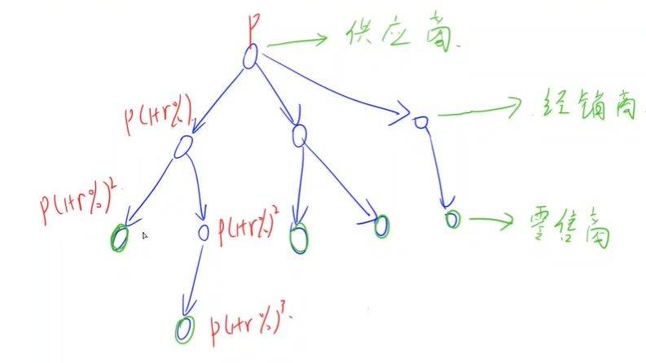

<!-- @import "[TOC]" {cmd="toc" depthFrom=3 depthTo=3 orderedList=false} -->

<!-- code_chunk_output -->

- [供应链总销售额 1079 Total Sales of Supply Chain (25 point(s))](#供应链总销售额-1079-total-sales-of-supply-chain-25-points)
- [供应链最高价格 1090 Highest Price in Supply Chain (25 point(s))](#供应链最高价格-1090-highest-price-in-supply-chain-25-points)
- [供应链最低价格 1106 Lowest Price in Supply Chain (25 point(s))](#供应链最低价格-1106-lowest-price-in-supply-chain-25-points)

<!-- /code_chunk_output -->

### 供应链总销售额 1079 Total Sales of Supply Chain (25 point(s))

<p>供应链是由零售商，经销商和供应商构成的销售网络，每个人都参与将产品从供应商转移到客户的过程。</p>

整个销售网络可以看作一个树形结构，从根部的供应商往下，每个人从上一级供应商中买入商品后，假定买入价格为 $P$，则会以高出买入价 $r\%$ 的价格向下出售。

<p>只有零售商（即叶节点）可以直接将产品销售给顾客。</p>

<p>现在，给定整个销售网络，请你计算所有零售商的总销售额。</p>

<h4>输入格式</h4>

第一行包含三个数，$N$ 表示供应链总成员数（所有成员编号从 $0$ 到 $N-1$，根部供应商编号为 $0$），$P$ 表示根部供应商的<strong>每件产品</strong>的售卖价格，$r$，溢价百分比。

接下来 $N$ 行，每行包含一个成员的信息，格式如下：

$K_i$ $ID[1]$ $ID[2]$ ... $ID[K_i]$

其中第 $i$ 行，$K_i$ 表示从供应商 $i$ 直接进货的成员数，接下来 $K_i$ 个整数是每个进货成员的编号。

如果某一行的 $K_j$ 为 $0$，则表示这是零售商，那么后面只会跟一个数字，表示卖给客户的产品总件数。

<h4>输出格式</h4>

<p>输出总销售额，保留一位小数。</p>

<h4>数据范围</h4>

- $1 \le N \le 10^5$,
- $0 < P \le 1000$,
- $0 < r \le 50$
- 每个零售商手中的产品不超过 $100$ 件。
- 最终答案保证不超过 $10^{10}$。

<h4>输入样例：</h4>

<pre><code>
10 1.80 1.00
3 2 3 5
1 9
1 4
1 7
0 7
2 6 1
1 8
0 9
0 4
0 3
</code></pre>

<h4>输出样例：</h4>

<pre><code>
42.4
</code></pre>

#### 1079 Total Sales of Supply Chain (25 point(s))
A supply chain is a network of retailers（零售商）, distributors（经销商）, and suppliers（供应商）-- everyone involved in moving a product from supplier to customer.

Starting from one root supplier, everyone on the chain buys products from one's supplier in a price P and sell or distribute them in a price that is r% higher than P. Only the retailers will face the customers. It is assumed that each member in the supply chain has exactly one supplier except the root supplier, and there is no supply cycle.

Now given a supply chain, you are supposed to tell the total sales from all the retailers.

#### Input Specification:
Each input file contains one test case. For each case, the first line contains three positive numbers: $N (≤10^5)$, the total number of the members in the supply chain (and hence their ID's are numbered from 0 to N−1, and the root supplier's ID is 0); P, the unit price given by the root supplier; and r, the percentage rate of price increment for each distributor or retailer. Then N lines follow, each describes a distributor or retailer in the following format:

$K_i$ $ID[1]$ $ID[2]$ ... $ID[K_i]$

where in the i-th line, $K_i$ is the total number of distributors or retailers who receive products from supplier i, and is then followed by the ID's of these distributors or retailers. $K_j$ being 0 means that the j-th member is a retailer, then instead the total amount of the product will be given after $K_j$. All the numbers in a line are separated by a space.

#### Output Specification:
For each test case, print in one line the total sales we can expect from all the retailers, accurate up to 1 decimal place. It is guaranteed that the number will not exceed $10^{10}$.



如上，用 `dfs` 是很直观的思路。

**但本题可以用树形DP来做。**

`f(i)` 表示 `i` 到根的距离。

可以用记忆化搜索更好地表示图，无序再写链表等等。

```cpp
// 记忆化搜索
dfs (点 u)
{
    if (f[u] 已存在) return f[u];
    if (u 是 root) retrun 0;
    return f[u] = dfs(p[u]) + 1;  // p[u] 是 u 父节点
}
```

```cpp
#include <iostream>
#include <cstring>
#include <algorithm>
#include <cmath>

using namespace std;

const int N = 100010;

int n;
double P, R;
int p[N], f[N], c[N];

// 记忆化搜索 dfs(i)
int dfs(int u)
{
    if (f[u] != -1) return f[u];

    if (p[u] == -1) return f[u] = 0;
    return f[u] = dfs(p[u]) + 1;
}

int main()
{
    cin >> n >> P >> R;

    memset(p, -1, sizeof p);
    for (int i = 0; i < n; i ++ )
    {
        int k;
        cin >> k;
        for (int j = 0; j < k; j ++ )
        {
            int son;
            cin >> son;
            p[son] = i;
        }

        if (!k) cin >> c[i];
    }

    memset(f, -1, sizeof f);

    double res = 0;
    for (int i = 0; i < n; i ++ )
        if (c[i])
            res += c[i] * P * pow(1 + R / 100, dfs(i));

    printf("%.1lf\n", res);

    return 0;
}
```

### 供应链最高价格 1090 Highest Price in Supply Chain (25 point(s))

<p>供应链是由零售商，经销商和供应商构成的销售网络，每个人都参与将产品从供应商转移到客户的过程。</p>

整个销售网络可以看作一个树形结构，从根部的供应商往下，每个人从上一级供应商中买入商品后，假定买入价格为 $P$，则会以高出买入价 $r\%$ 的价格向下出售。

<p>只有零售商（即叶节点）可以直接将产品销售给顾客。</p>

<p>现在，给定整个销售网络，请你计算零售商能达到的最高销售价格。</p>

<h4>输入格式</h4>

第一行包含三个数，$N$ 表示供应链总成员数（所有成员编号为 $0$ 到 $N-1$）；$P$ 表示根部供应商的产品销售价格；$r$，表示溢价百分比。

第二行包含 $N$ 个数字，第 $i$ 个数字 $S_i$ 是编号为 $i$ 的成员的上级供应商的编号。根部供应商的 $S_{root}$ 为 -1。

<h4>输出格式</h4>

<p>输出零售商可达到的最高销售价格，保留两位小数，以及可达到最高销售价格的零售商的数量。</p>

<h4>数据范围</h4>

- $1 \le N \le 10^5$,
- $0 < P \le 1000$,
- $0 < r \le 50$,
- 最终答案保证不超过 $10^{10}$。

<h4>输入样例：</h4>

<pre><code>
9 1.80 1.00
1 5 4 4 -1 4 5 3 6
</code></pre>

<h4>输出样例：</h4>

<pre><code>
1.85 2
</code></pre>

#### 1090 Highest Price in Supply Chain (25 point(s))
A supply chain is a network of retailers（零售商）, distributors（经销商）, and suppliers（供应商）-- everyone involved in moving a product from supplier to customer.

Starting from one root supplier, everyone on the chain buys products from one's supplier in a price P and sell or distribute them in a price that is r% higher than P. It is assumed that each member in the supply chain has exactly one supplier except the root supplier, and there is no supply cycle.

Now given a supply chain, you are supposed to tell the highest price we can expect from some retailers.

#### Input Specification:
Each input file contains one test case. For each case, The first line contains three positive numbers: $N (≤10^5)$, the total number of the members in the supply chain (and hence they are numbered from 0 to N−1); P, the price given by the root supplier; and r, the percentage rate of price increment for each distributor or retailer. Then the next line contains N numbers, each number $S _i$ is the index of the supplier for the i-th member. $S_{root} for the root supplier is defined to be −1. All the numbers in a line are separated by a space.

#### Output Specification:
For each test case, print in one line the highest price we can expect from some retailers, accurate up to 2 decimal places, and the number of retailers that sell at the highest price. There must be one space between the two numbers. It is guaranteed that the price will not exceed $10^10$.

```cpp
#include <iostream>
#include <cstring>
#include <cmath>

using namespace std;

const int N = 100010;

int n;
double P, R;
int p[N], f[N];

int dfs(int u)
{
    if (f[u] != -1) return f[u];
    if (p[u] == -1) return f[u] = 0;
    return f[u] = dfs(p[u]) + 1;
}

int main()
{
    cin >> n >> P >> R;
    for (int i = 0; i < n; i ++ ) cin >> p[i];

    memset(f, -1, sizeof f);

    int res = 0, cnt = 0;
    for (int i = 0; i < n; i ++ )
        if (dfs(i) > res)
        {
            res = dfs(i);
            cnt = 1;  // 注意这里还需要数量
        }
        else if (dfs(i) == res) cnt ++ ;

    printf("%.2lf %d\n", P * pow(1 + R / 100, res), cnt);

    return 0;
}
```

### 供应链最低价格 1106 Lowest Price in Supply Chain (25 point(s))

<p>供应链是由零售商，经销商和供应商构成的销售网络，每个人都参与将产品从供应商转移到客户的过程。</p>

整个销售网络可以看作一个树形结构，从根部的供应商往下，每个人从上一级供应商中买入商品后，假定买入价格为 $P$，则会以高出买入价 $r\%$ 的价格向下出售。

<p>只有零售商（即叶节点）可以直接将产品销售给顾客。</p>

<p>现在，给定整个销售网络，请你计算零售商能达到的最低销售价格。</p>

<h4>输入格式</h4>

第一行包含三个数，$N$ 表示供应链总成员数（所有成员编号从 $0$ 到 $N-1$，根部供应商编号为 $0$），$P$ 表示根部供应商的<strong>每件产品</strong>的售卖价格，$r$，溢价百分比。

接下来 $N$ 行，每行包含一个成员的信息，格式如下：

$K_i$ $ID[1]$ $ID[2]$ ... $ID[K_i]$

其中第 $i$ 行，$K_i$ 表示从供应商 $i$ 直接进货的成员数，接下来 $K_i$ 个整数是每个进货成员的编号。

如果某一行的 $K_j$ 为 $0$，则表示这是零售商，那么后面只会跟一个数字，表示卖给客户的产品总件数。

<h4>输出格式</h4>

<p>输出零售商可达到的最高销售价格，保留四位小数，以及可达到最高销售价格的零售商的数量。</p>

<h4>数据范围</h4>

- $1 \le N \le 10^5$,
- $0 < P \le 1000$,
- $0 < r \le 50$,
- 最终答案保证不超过 $10^{10}$。

<h4>输入样例：</h4>

<pre><code>
10 1.80 1.00
3 2 3 5
1 9
1 4
1 7
0
2 6 1
1 8
0
0
0
</code></pre>

<h4>输出样例：</h4>

<pre><code>
1.8362 2
</code></pre>

#### 1090 Highest Price in Supply Chain (25 point(s))
A supply chain is a network of retailers（零售商）, distributors（经销商）, and suppliers（供应商）-- everyone involved in moving a product from supplier to customer.

Starting from one root supplier, everyone on the chain buys products from one's supplier in a price P and sell or distribute them in a price that is r% higher than P. It is assumed that each member in the supply chain has exactly one supplier except the root supplier, and there is no supply cycle.

Now given a supply chain, you are supposed to tell the highest price we can expect from some retailers.

#### Input Specification:
Each input file contains one test case. For each case, the first line contains three positive numbers: $N (≤10^5)$, the total number of the members in the supply chain (and hence their ID's are numbered from 0 to N−1, and the root supplier's ID is 0); P, the unit price given by the root supplier; and r, the percentage rate of price increment for each distributor or retailer. Then N lines follow, each describes a distributor or retailer in the following format:

$K_i$ $ID[1]$ $ID[2]$ ... $ID[K_i]$

where in the i-th line, $K_i$ is the total number of distributors or retailers who receive products from supplier i, and is then followed by the ID's of these distributors or retailers. $K_j$ being 0 means that the j-th member is a retailer, then instead the total amount of the product will be given after $K_j$. All the numbers in a line are separated by a space.

#### Output Specification:
For each test case, print in one line the highest price we can expect from some retailers, accurate up to 4 decimal places, and the number of retailers that sell at the highest price. There must be one space between the two numbers. It is guaranteed that the price will not exceed $10^10$.

```cpp
#include <iostream>
#include <cstring>
#include <cmath>

using namespace std;

const int N = 100010;

int n;
double P, R;
int p[N], f[N];
bool is_leaf[N];

int dfs(int u)
{
    if (f[u] != -1) return f[u];
    if (p[u] == -1) return f[u] = 0;
    return f[u] = dfs(p[u]) + 1;
}

int main()
{
    cin >> n >> P >> R;

    memset(p, -1, sizeof p);  // 别忘了初始化父节点标记，用于找根
    for (int i = 0; i < n; i ++ )
    {
        int k;
        cin >> k;
        for (int j = 0; j < k; j ++ )
        {
            int son;
            cin >> son;
            p[son] = i;
        }

        if (!k) is_leaf[i] = true;
    }

    // 记忆化搜索别忘了 memset(f, -1, sizeof f);
    memset(f, -1, sizeof f);

    int res = N, cnt = 0;
    for (int i = 0; i < n; i ++ )
        if (is_leaf[i])
        {
            if (res > dfs(i)) res = dfs(i), cnt = 1;
            else if (res == dfs(i)) cnt ++ ;
        }

    printf("%.4lf %d\n", P * pow(1 + R / 100, res), cnt);

    return 0;
}
```
