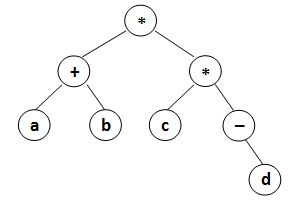
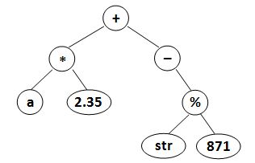

<!-- @import "[TOC]" {cmd="toc" depthFrom=3 depthTo=3 orderedList=false} -->

<!-- code_chunk_output -->

- [堆路径 1155 Heap Paths (30 point(s))](#堆路径-1155-heap-paths-30-points)
- [中缀表达式 1130 Infix Expression (25 point(s))](#中缀表达式-1130-infix-expression-25-points)
- [最低公共祖先 1143 Lowest Common Ancestor (30 point(s))](#最低公共祖先-1143-lowest-common-ancestor-30-points)
- [二叉树中的最低公共祖先 1151 LCA in a Binary Tree (30 point(s))](#二叉树中的最低公共祖先-1151-lca-in-a-binary-tree-30-points)

<!-- /code_chunk_output -->

### 堆路径 1155 Heap Paths (30 point(s))

<p>在计算机科学中，堆是一种的基于树的专用数据结构，它具有堆属性：</p>

如果 $P$ 是 $C$ 的父结点，则在大顶堆中 $P$ 结点的权值大于或等于 $C$ 结点的权值，在小顶堆中 $P$ 结点的权值小于或等于 $C$ 结点的权值。

<p>一种堆的常见实现是二叉堆，它是由完全二叉树来实现的。</p>

<p>可以肯定的是，在大顶/小顶堆中，任何从根到叶子的路径都必须按非递增/非递减顺序排列。</p>

<p>你的任务是检查给定完全二叉树中的每个路径，以判断它是否是堆。</p>

<h4>输入格式</h4>

第一行包含整数 $N$，表示树中结点数量。

第二行包含 $N$ 个 <strong>不同</strong> 的整数，表示给定完全二叉树的层序遍历序列。

<h4>输出格式</h4>

<p>对于给定的树，首先输出所有从根到叶子的路径。</p>

<p>每条路径占一行，数字之间用空格隔开，行首行尾不得有多余空格。</p>

<p>必须以如下顺序输出路径：对于树中的每个结点都必须满足，其右子树中的路径先于其左子树中的路径输出。</p>
<p>最后一行，如果是大顶堆，则输出 <code>Max Heap</code>，如果是小顶堆，则输出 <code>Min Heap</code>，如果不是堆，则输出 <code>Not Heap</code>。</p>

<h4>数据范围</h4>

<p>$1 < N \le 1000$</p>

<h4>输入样例1：</h4>

<pre><code>
8
98 72 86 60 65 12 23 50
</code></pre>

<h4>输出样例1：</h4>

<pre><code>
98 86 23
98 86 12
98 72 65
98 72 60 50
Max Heap
</code></pre>

<h4>输入样例2：</h4>

<pre><code>
8
8 38 25 58 52 82 70 60
</code></pre>

<h4>输出样例2：</h4>

<pre><code>
8 25 70
8 25 82
8 38 52
8 38 58 60
Min Heap
</code></pre>

<h4>输入样例3：</h4>

<pre><code>
8
10 28 15 12 34 9 8 56
</code></pre>

<h4>输出样例3：</h4>

<pre><code>
10 15 8
10 15 9
10 28 34
10 28 12 56
Not Heap
</code></pre>

#### 1155 Heap Paths (30 point(s))
In computer science, a heap is a specialized tree-based data structure that satisfies the heap property: if P is a parent node of C, then the key (the value) of P is either greater than or equal to (in a max heap) or less than or equal to (in a min heap) the key of C. A common implementation of a heap is the binary heap, in which the tree is a complete binary tree. (Quoted from Wikipedia at https://en.wikipedia.org/wiki/Heap_(data_structure))

One thing for sure is that all the keys along any path from the root to a leaf in a max/min heap must be in non-increasing/non-decreasing order.

Your job is to check every path in a given complete binary tree, in order to tell if it is a heap or not.

#### Input Specification:
Each input file contains one test case. For each case, the first line gives a positive integer $N (1<N≤1,000)$, the number of keys in the tree. Then the next line contains N distinct integer keys (all in the range of int), which gives the level order traversal sequence of a complete binary tree.

#### Output Specification:
For each given tree, first print all the paths from the root to the leaves. Each path occupies a line, with all the numbers separated by a space, and no extra space at the beginning or the end of the line. The paths must be printed in the following order: for each node in the tree, all the paths in its right subtree must be printed before those in its left subtree.

Finally print in a line `Max Heap` if it is a max heap, or `Min Heap` for a min heap, or `Not Heap` if it is not a heap at all.

```cpp
#include <iostream>
#include <vector>

using namespace std;

const int N = 1010;

int n;
int p[N];
bool gt, lt;
vector<int> path;

void dfs(int u)
{
    path.push_back(p[u]);

    if (u * 2 > n)  // 已经抵达叶子节点
    {
        printf("%d", path[0]);
        for (int i = 1; i < path.size(); ++ i)
        {
            if (path[i] < path[i-1]) gt = true;
            else if (path[i] > path[i-1]) lt = true;
            printf(" %d", path[i]);
        }
        puts("");
    }

    if (u * 2 + 1 <= n) dfs(u * 2 + 1);
    if (u * 2 <= n) dfs(u * 2);

    path.pop_back();
}

int main()
{
    scanf("%d", &n);
    for (int i = 1; i <= n; ++ i) scanf("%d", &p[i]);
    
    dfs(1);
    
    if (gt && lt) printf("Not Heap");
    else if (gt) printf("Max Heap");
    else printf("Min Heap");
}
```

### 中缀表达式 1130 Infix Expression (25 point(s))

<p>给定一个句法二叉树，请你输出相应的中缀表达式，并利用括号反映运算符的优先级。</p>

<h4>输入格式</h4>

第一行包含整数 $N$ 表示二叉树的总结点个数。

接下来 $N$ 行，每行以下列格式给出一个结点的信息（第 $i$ 行对应于第 $i$ 个结点）：

<pre><code>
data left_child right_child
</code></pre>

其中 <code>data</code> 是一个长度不超过 $10$ 的字符串，<code>left_child</code> 和 <code>right_child</code> 分别是该结点的左右子结点编号。

所有结点编号从 $1$ 到 $N$，NULL 用 -1 表示。

以下两个图分别对应样例 $1$ 和样例 $2$。





<h4>输出格式</h4>

<p>请在一行输出中缀表达式，并利用括号反映运算符的优先级。</p>

<p>注意，不能有多余括号，请任何符号之间不得有空格。</p>

<h4>数据范围</h4>

$1 \le N \le 20$

<h4>输入样例1：</h4>

<pre><code>
8
* 8 7
a -1 -1
* 4 1
+ 2 5
b -1 -1
d -1 -1
- -1 6
c -1 -1
</code></pre>

<h4>输出样例1：</h4>

<pre><code>
(a+b)*(c*(-d))
</code></pre>

<h4>输入样例2：</h4>

<pre><code>
8
2.35 -1 -1
* 6 1
- -1 4
% 7 8
+ 2 3
a -1 -1
str -1 -1
871 -1 -1
</code></pre>

<h4>输出样例2：</h4>

<pre><code>
(a*2.35)+(-(str%871))
</code></pre>

#### 1130 Infix Expression (25 point(s))
Given a syntax tree (binary), you are supposed to output the corresponding infix expression, with parentheses reflecting the precedences of the operators.

#### Input Specification:
Each input file contains one test case. For each case, the first line gives a positive integer N (≤ 20) which is the total number of nodes in the syntax tree. Then N lines follow, each gives the information of a node (the i-th line corresponds to the i-th node) in the format:

```
data left_child right_child
```

where data is a string of no more than 10 characters, left_child and right_child are the indices of this node's left and right children, respectively. The nodes are indexed from 1 to N. The NULL link is represented by −1. The figures 1 and 2 correspond to the samples 1 and 2, respectively.


#### Output Specification:
For each case, print in a line the infix expression, with parentheses reflecting the precedences of the operators. Note that there must be no extra parentheses for the final expression, as is shown by the samples. There must be no space between any symbols.

```cpp
// 本题简化了运算：无脑加括号
#include <iostream>

using namespace std;

const int N = 25;

int n;
int l[N], r[N];  // 左右儿子
string w[N];  // 节点值
bool st[N], is_leaf[N];  // 是否有父节点，是否是叶节点

string dfs(int u)
{
    string left, right;
    if (l[u] != -1)
    {
        left = dfs(l[u]);
        if (!is_leaf[l[u]]) left = "(" + left + ")";  // 不是叶节点，就得左右加括号
    }
    if (r[u] != -1)
    {
        right = dfs(r[u]);
        if (!is_leaf[r[u]]) right = "(" + right + ")";
    }

    return left + w[u] + right;
}

int main()
{
    cin >> n;
    // 经验：初始化时把左右儿子的父节点信息、是否是叶节点都保存下来
    for (int i = 1; i <= n; i ++ )
    {
        cin >> w[i] >> l[i] >> r[i];
        if (l[i]) st[l[i]] = true;
        if (r[i]) st[r[i]] = true;

        if (l[i] == -1 && r[i] == -1) is_leaf[i] = true;
    }

    int root = 1;
    while (st[root]) root ++ ;

    cout << dfs(root) << endl;

    return 0;
}
```

### 最低公共祖先 1143 Lowest Common Ancestor (30 point(s))

<p>树中两个结点 $U$ 和 $V$ 的最低公共祖先（LCA）是指同时具有 $U$ 和 $V$ 作为后代的最深结点。</p>
<p>二叉搜索树 (BST) 递归定义为具有以下属性的二叉树：</p>
<ul>
<li>若它的左子树不空，则左子树上所有结点的值均小于它的根结点的值</li>
<li>若它的右子树不空，则右子树上所有结点的值均大于或等于它的根结点的值</li>
<li>它的左、右子树也分别为二叉搜索树</li>
</ul>
<p>现在给定 BST 中的任意两个结点，请你找出它们的最低公共祖先。</p>
<h4>输入格式</h4>
<p>第一行包含两个整数 $M$ 和 $N$，分别表示询问结点对数以及二叉搜索树中的结点数量。</p>
<p>第二行包含 $N$ 个不同整数，表示该二叉搜索树的前序遍历序列。</p>
<p>接下来 $M$ 行，每行包含两个整数 $U$ 和 $V$，表示一组询问。</p>
<p>所有结点权值均在 <strong>int</strong> 范围内。</p>
<h4>输出格式</h4>
<p>对于每对给定的 $U$ 和 $V$，输出一行结果。</p>
<p>如果 $U$ 和 $V$ 的 LCA 是 $A$，且 $A$ 不是 $U$ 或 $V$，则输出 <code>LCA of U and V is A.</code>。</p>
<p>如果 $U$ 和 $V$ 的 LCA 是 $A$，且 $A$ 是 $U$ 或 $V$ 中的一个，则输出 <code>X is an ancestor of Y.</code>，其中 $X$ 表示 $A$，$Y$ 表示另一个结点。</p>
如果 $U$ 或 $V$ 没有在 BST 中找到，则输出 <code>ERROR: U is not found.</code> 或 <code>ERROR: V is not found.</code> 或 <code>ERROR: U and V are not found.</code>。

<h4>数据范围</h4>

- $1 \le M \le 1000$,
- $1 \le N \le 10000$

<h4>输入样例：</h4>

<pre><code>
6 8
6 3 1 2 5 4 8 7
2 5
8 7
1 9
12 -3
0 8
99 99
</code></pre>

<h4>输出样例：</h4>

<pre><code>
LCA of 2 and 5 is 3.
8 is an ancestor of 7.
ERROR: 9 is not found.
ERROR: 12 and -3 are not found.
ERROR: 0 is not found.
ERROR: 99 and 99 are not found.
</code></pre>

#### 1143 Lowest Common Ancestor (30 point(s))
The lowest common ancestor (LCA) of two nodes U and V in a tree is the deepest node that has both U and V as descendants.

A binary search tree (BST) is recursively defined as a binary tree which has the following properties:

- The left subtree of a node contains only nodes with keys less than the node's key.
- The right subtree of a node contains only nodes with keys greater than or equal to the node's key.
- Both the left and right subtrees must also be binary search trees.

Given any two nodes in a BST, you are supposed to find their LCA.

#### Input Specification:
Each input file contains one test case. For each case, the first line gives two positive integers: M (≤ 1,000), the number of pairs of nodes to be tested; and N (≤ 10,000), the number of keys in the BST, respectively. In the second line, N distinct integers are given as the preorder traversal sequence of the BST. Then M lines follow, each contains a pair of integer keys U and V. All the keys are in the range of int.

#### Output Specification:
For each given pair of U and V, print in a line LCA of U and V is A. if the LCA is found and A is the key. But if A is one of U and V, print X is an ancestor of Y. where X is A and Y is the other node. If U or V is not found in the BST, print in a line ERROR: U is not found. or ERROR: V is not found. or ERROR: U and V are not found. .

```cpp
#include <iostream>
#include <cstring>
#include <unordered_map>
#include <algorithm>

using namespace std;

const int N = 10010;

int m, n;
int in[N], pre[N], seq[N];
unordered_map<int, int> pos;
int p[N], depth[N];  // p 父节点

int build(int il, int ir, int pl, int pr, int d)
{
    int root = pre[pl];  // 前序遍历位置
    int k = root;  // 中序遍历位置，中序遍历序列值和下标相等

    depth[root] = d;

    if (il < k) p[build(il, k - 1, pl + 1, pl + 1 + (k - 1 - il), d + 1)] = root;
    if (k < ir) p[build(k + 1, ir, pl + 1 + (k - 1 - il) + 1, pr, d + 1)] = root;

    return root;
}

int main()
{
    cin >> m >> n;
    for (int i = 0; i < n; i ++ )
    {
        cin >> pre[i];
        seq[i] = pre[i];  // 把每个数值放入 0~n 区间里（离散化）
    }

    sort(seq, seq + n);  // seq 这个区间从小到大存
    for (int i = 0; i < n; i ++ )
    {
        pos[seq[i]] = i;  // 每个数对应点
        in[i] = i;  // 中序遍历结果
    }

    for (int i = 0; i < n; i ++ ) pre[i] = pos[pre[i]];  // 各店前序遍历

    build(0, n - 1, 0, n - 1, 0);

    while (m -- )
    {
        int a, b;
        cin >> a >> b;

        if (pos.count(a) && pos.count(b))
        {
            a = pos[a], b = pos[b];
            int x = a, y = b;

            while (a != b)
                if (depth[a] < depth[b]) b = p[b];  // 每次让较深的那个网上一格
                else a = p[a];

            if (a != x && a != y) printf("LCA of %d and %d is %d.\n", seq[x], seq[y], seq[a]);
            else if (a == x) printf("%d is an ancestor of %d.\n", seq[x], seq[y]);
            else printf("%d is an ancestor of %d.\n", seq[y], seq[x]);
        }
        else if (pos.count(a) == 0 && pos.count(b) == 0)
            printf("ERROR: %d and %d are not found.\n", a, b);
        else if (pos.count(a) == 0)
            printf("ERROR: %d is not found.\n", a);
        else
            printf("ERROR: %d is not found.\n", b);
    }

    return 0;
}
```

### 二叉树中的最低公共祖先 1151 LCA in a Binary Tree (30 point(s))

树中两个结点 $U$ 和 $V$ 的最低公共祖先（LCA）是指同时具有 $U$ 和 $V$ 作为后代的最深结点。

<p>给定二叉树中的任何两个结点，请你找到它们的 LCA。</p>

<h4>输入格式</h4>

第一行包含两个整数 $M$ 和 $N$，分别表示询问结点对数以及二叉树中的结点数量。

接下来两行，每行包含 $N$ 个不同的整数，分别表示二叉树的中序和前序遍历。

<p>保证二叉树可由给定遍历序列唯一确定。</p>

接下来 $M$ 行，每行包含两个整数 $U$ 和 $V$，表示一组询问。

<p>所有结点权值均在 <strong>int</strong> 范围内。</p>

<h4>输出格式</h4>

对于每对给定的 $U$ 和 $V$，输出一行结果。

如果 $U$ 和 $V$ 的 LCA 是 $A$，且 $A$ 不是 $U$ 或 $V$，则输出 <code>LCA of U and V is A.</code>。

如果 $U$ 和 $V$ 的 LCA 是 $A$，且 $A$ 是 $U$ 或 $V$ 中的一个，则输出 <code>X is an ancestor of Y.</code>，其中 $X$ 表示 $A$，$Y$ 表示另一个结点。

如果 $U$ 或 $V$ 没有在二叉树中找到，则输出 <code>ERROR: U is not found.</code> 或 <code>ERROR: V is not found.</code> 或 <code>ERROR: U and V are not found.</code>。

<h4>数据范围</h4>

- $1 \le M \le 1000$,
- $1 \le N \le 10000$

<h4>输入样例：</h4>

<pre><code>
6 8
7 2 3 4 6 5 1 8
5 3 7 2 6 4 8 1
2 6
8 1
7 9
12 -3
0 8
99 99
</code></pre>

<h4>输出样例：</h4>

<pre><code>
LCA of 2 and 6 is 3.
8 is an ancestor of 1.
ERROR: 9 is not found.
ERROR: 12 and -3 are not found.
ERROR: 0 is not found.
ERROR: 99 and 99 are not found.
</code></pre>

#### 1151 LCA in a Binary Tree (30 point(s))
The lowest common ancestor (LCA) of two nodes U and V in a tree is the deepest node that has both U and V as descendants.

Given any two nodes in a binary tree, you are supposed to find their LCA.

#### Input Specification:
Each input file contains one test case. For each case, the first line gives two positive integers: M (≤ 1,000), the number of pairs of nodes to be tested; and N (≤ 10,000), the number of keys in the binary tree, respectively. In each of the following two lines, N distinct integers are given as the inorder and preorder traversal sequences of the binary tree, respectively. It is guaranteed that the binary tree can be uniquely determined by the input sequences. Then M lines follow, each contains a pair of integer keys U and V. All the keys are in the range of int.

#### Output Specification:
For each given pair of U and V, print in a line LCA of U and V is A. if the LCA is found and A is the key. But if A is one of U and V, print X is an ancestor of Y. where X is A and Y is the other node. If U or V is not found in the binary tree, print in a line ERROR: U is not found. or ERROR: V is not found. or ERROR: U and V are not found. .

```cpp
#include <iostream>
#include <cstring>
#include <algorithm>
#include <unordered_map>

using namespace std;

const int N = 10010;

int m, n;
int in[N], pre[N], seq[N];
unordered_map<int, int> pos;
int p[N], depth[N];

int build(int il, int ir, int pl, int pr, int d)
{
    int root = pre[pl];
    int k = root;

    depth[root] = d;

    if (il < k) p[build(il, k - 1, pl + 1, pl + 1 + (k - 1 - il), d + 1)] = root;
    if (k < ir) p[build(k + 1, ir, pl + 1 + (k - 1 - il) + 1, pr, d + 1)] = root;

    return root;
}

int main()
{
    cin >> m >> n;

    for (int i = 0; i < n; i ++ )
    {
        cin >> seq[i];
        pos[seq[i]] = i;
        in[i] = i;  // 中序遍历
    }

    for (int i = 0; i < n; i ++ )
    {
        cin >> pre[i];
        pre[i] = pos[pre[i]];  // 前序遍历
    }

    build(0, n - 1, 0, n - 1, 0);

    while (m -- )
    {
        int a, b;
        cin >> a >> b;
        if (pos.count(a) && pos.count(b))
        {
            a = pos[a], b = pos[b];
            int x = a, y = b;
            while (a != b)
                if (depth[a] > depth[b]) a = p[a];
                else b = p[b];

            if (a != x && a != y) printf("LCA of %d and %d is %d.\n", seq[x], seq[y], seq[a]);
            else if (a == x) printf("%d is an ancestor of %d.\n", seq[x], seq[y]);
            else printf("%d is an ancestor of %d.\n", seq[y], seq[x]);
        }
        else if (pos.count(a) == 0 && pos.count(b) == 0)
            printf("ERROR: %d and %d are not found.\n", a, b);
        else if (pos.count(a) == 0)
            printf("ERROR: %d is not found.\n", a);
        else
            printf("ERROR: %d is not found.\n", b);
    }

    return 0;
}
```
