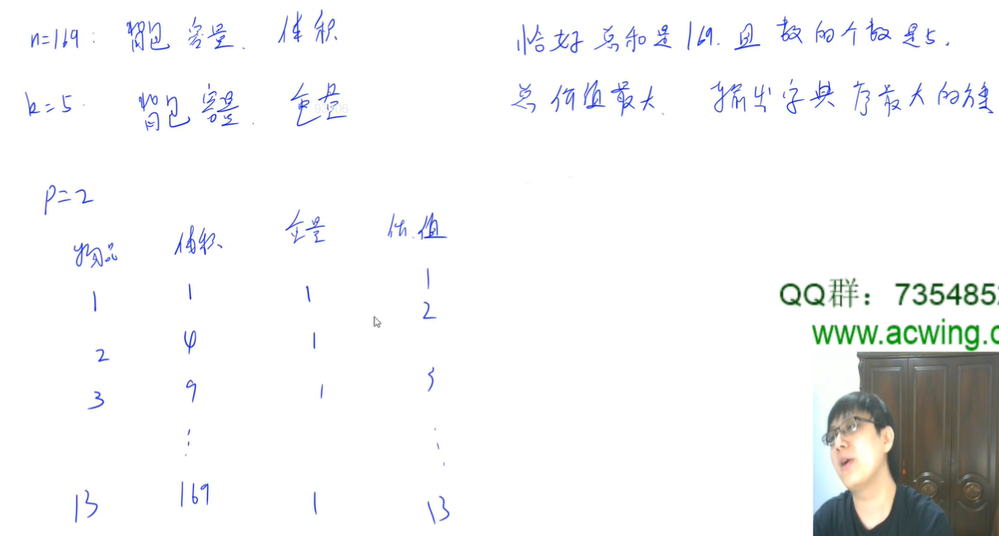
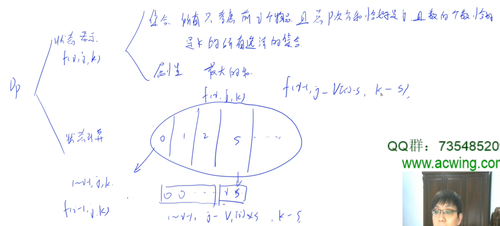

- [1 的个数 1049 Counting Ones (30 point(s))](#1-的个数-1049-counting-ones-30-points)
- [质因子 1059 Prime Factors (25 point(s))](#质因子-1059-prime-factors-25-points)
- [有理数的和 1081 Rational Sum (20 point(s))](#有理数的和-1081-rational-sum-20-points)
- [有理数运算 1088 Rational Arithmetic (20 point(s))](#有理数运算-1088-rational-arithmetic-20-points)
- [连续因子 1096 Consecutive Factors (20 point(s))](#连续因子-1096-consecutive-factors-20-points)
- [整数分解 1103 Integer Factorization (30 point(s))](#整数分解-1103-integer-factorization-30-points)
- [数段之和 1104 Sum of Number Segments (20 point(s))](#数段之和-1104-sum-of-number-segments-20-points)

### 1 的个数 1049 Counting Ones (30 point(s))

给定一个数字 $N$，请你计算 $1 \sim N$ 中一共出现了多少个数字 $1$。

例如，$N = 12$ 时，一共出现了 $5$ 个数字 $1$，分别出现在 $1,10,11,12$ 中。

<h4>输入格式</h4>

包含一个整数 $N$。

<h4>输出格式</h4>

输出一个整数，表示 $1$ 的个数。

<h4>数据范围</h4>

$1 \le N \le 2^{30}$

<h4>输入样例：</h4>

<pre><code>
12
</code></pre>

#### 1049 Counting Ones (30 point(s))
The task is simple: given any positive integer N, you are supposed to count the total number of 1's in the decimal form of the integers from 1 to N. For example, given N being 12, there are five 1's in 1, 10, 11, and 12.

#### Input Specification:
Each input file contains one test case which gives the positive N (≤2^{30}).

#### Output Specification:
For each test case, print the number of 1's in one line.


```cpp
// 分别统计数字 1 在每一位出现多少次
// 上图中就是 1 在 d 这一位出现多少次
#include <iostream>
#include <vector>

using namespace std;

int calc(int n)
{
    vector<int> nums;
    while (n) nums.push_back(n % 10), n /= 10;

    int res = 0;
    for (int i = nums.size() - 1; i >= 0; i -- )
    {
        int d = nums[i];
        int left = 0, right = 0, power = 1;
        for (int j = nums.size() - 1; j > i; j -- ) left = left * 10 + nums[j];
        for (int j = i - 1; j >= 0; j -- )
        {
            right = right * 10 + nums[j];
            power *= 10;
        }

        if (d == 0) res += left * power;
        else if (d == 1) res += left * power + right + 1;
        else res += (left + 1) * power;
    }

    return res;
}

int main()
{
    int n;
    cin >> n;

    cout << calc(n) << endl;

    return 0;
}
```

### 质因子 1059 Prime Factors (25 point(s))

给定一个整数 $N$，找出它的所有质因子，并按如下格式输出：

$N = p_1^{k_1} \times p_2^{k_2} \times ... \times p_m^{k_m}$

<p><strong>注意</strong>: 如果 $N = 1$ 则输出 <code>1=1</code>。

<h4>输入格式</h4>

一个整数 $N$。

<h4>输出格式</h4>

输出时，按 $N = p_1^{k_1} \times p_2^{k_2} \times ... \times p_m^{k_m}$ 的格式输出答案。

其中 $p_i$ 是质因子，应按照递增顺序排列，$k_i$ 是 $p_i$ 的指数，如果 $k_i$ 为 $1$，则<strong>不必</strong>输出。

<h4>数据范围</h4>

$1 \le N \le 2^{31}-1$

<h4>输入样例：</h4>

<pre><code>
97532468
</code></pre>

<h4>输出样例：</h4>

<pre><code>
97532468=2^2*11*17*101*1291
</code></pre>

#### 1059 Prime Factors (25 point(s))
Given any positive integer N, you are supposed to find all of its prime factors, and write them in the format $N = p_1^{k_1} \times p_2^{k_2} \times ... \times p_m^{k_m}$.

#### Input Specification:
Each input file contains one test case which gives a positive integer N in the range of long int.

#### Output Specification:
Factor N in the format $N = p_1^{k_1} \times p_2^{k_2} \times ... \times p_m^{k_m}$ , where $p_i$'s are prime factors of N in increasing order, and the exponent $k_i$ is the number of $p_i$ -- hence when there is only one $p_i$, $k_i$ is 1 and must NOT be printed out.

```cpp
// d 是 n 的约束，则 n / d 一定也是 n 的约数
// 因此枚举到 d 小于等于 n/d 即可，即枚举到 sqrt(n) 就行
// 如果枚举到 sqrt(n) 剩下的数不是 1 ，则剩下的那个数也是个质数
// 否则枚举到 n 对于本题来说时间复杂度就太高
#include <iostream>
using namespace std;

int main()
{
    int n;
    cin >> n;
    bool is_first = true;
    printf("%d=", n);
    if (n == 1) printf("1\n");
    else
    {
        for (int i = 2; i <= n / i; ++ i)  // i * i <= n 容易溢出
        {
            if (n % i == 0)
            {
                int k = 0;
                while (n % i == 0) n /= i, ++ k;

                if (!is_first) printf("*");
                else is_first = false;
                if (k == 1) printf("%d", i);
                else printf("%d^%d", i, k);
            }
        }
        if (n > 1)
        {
            if (!is_first) printf("*");
            printf("%d", n);
        }
    }
}
```

### 有理数的和 1081 Rational Sum (20 point(s))

给定 $N$ 个有理数，格式为 <code>分子/分母</code> ，请你计算它们的和。

<h4>补充</h4>

保证答案中需要出现的所有数字都在 <strong>long long</strong> 范围内，且保证最终答案为非负数。

<h4>输入格式</h4>

第一行包含一个整数 $N$，表示有理数的个数。

第二行包含 $N$ 个有理数 <code>a1/b1 a2/b2 ...</code>，如果有理数为负数，则负号必须出现在分子前面。

<h4>输出格式</h4>

输出所有有理数的和，格式为 <code>整数 分子/分母</code>，其中整数是总和的整数部分，分子 < 分母，并且分子和分母没有公因子。

特别地，如果结果是整数，则只需输出整数部分；否则如果整数部分是 $0$，则只需输出小数部分。

<h4>数据范围</h4>

- $1 \le N \le 100$,
- 所有分子分母取值均在 <strong>long int</strong> 范围内。

<h4>输入样例1：</h4>

<pre><code>
5
2/5 4/15 1/30 -2/60 8/3
</code></pre>

<h4>输出样例1：</h4>

<pre><code>
3 1/3
</code></pre>

<h4>输入样例2：</h4>

<pre><code>
2
4/3 2/3
</code></pre>

<h4>输出样例2：</h4>

<pre><code>
2
</code></pre>

<h4>输入样例3：</h4>

<pre><code>
3
1/3 -1/6 1/8
</code></pre>

<h4>输出样例3：</h4>

<pre><code>
7/24
</code></pre>

#### 1081 Rational Sum (20 point(s))
Given N rational numbers in the form numerator/denominator, you are supposed to calculate their sum.

#### Input Specification:
Each input file contains one test case. Each case starts with a positive integer N (≤100), followed in the next line N rational numbers `a1/b1 a2/b2 ...` where all the numerators and denominators are in the range of long int. If there is a negative number, then the sign must appear in front of the numerator.

#### Output Specification:
For each test case, output the sum in the simplest form integer numerator/denominator where integer is the integer part of the sum, `numerator < denominator`, and the numerator and the denominator have no common factor. You must output only the fractional part if the integer part is 0.

```cpp
#include <iostream>

using namespace std;

typedef long long LL;

LL gcd(LL a, LL b)
{
    return b ? gcd(b, a % b) : a;
}

int main()
{
    int n = 0;
    cin >> n;

    LL a = 0, b = 1;  // 注意，初始的分母应该是 1
    for (int i = 0; i < n; ++ i)
    {
        LL c, d;
        scanf("%lld/%lld", &c, &d);
        LL t = gcd(c, d);
        c /= t, d /= t;
        
        // 加上之前的，分母变成最小公倍数
        t = gcd(b, d);
        a = d / t * a + b / t * c;
        b = b / t * d;
        
        // 简化，防止之后运算溢出
        t = gcd(a, b);
        a /= t;
        b /= t;
    }

    if (b == 1) printf("%lld", a);  // 如果是整数
    else
    {
        if (abs(a) > b) printf("%lld ", a / b), a = a % b;
        printf("%lld/%lld", a, b);
    }
}
```

## 有理数运算 1088 Rational Arithmetic (20 point(s))

<p>给定两个有理数，你的任务是实现基本算术，即计算它们的和，差，积和商。</p>

<h4>输入格式</h4>

<p>共一行，以 <code>a1/b1 a2/b2</code> 的形式给出两个有理数。</p>

<p>分子和分母都在 <strong>long int</strong> 范围内，如果存在负号，则只能出现在分子前面，分母保证为非零数字。</p>

<h4>输出格式</h4>

<p>分别在四行输出两个有理数的和，差，积和商。</p>

<p>每行的格式为 <code>number1 operator number2 = result</code>。</p>

请注意，所有有理数都必须采用最简形式，<code>k a/b</code>，其中 $k$ 是整数部分，而 $a / b$ 是最简分数部分。

<p>如果数字为负，则必须将其包含在一对括号中。</p>

如果除法中除数为 $0$，则输出 <code>Inf</code> 作为结果。

<p>确保所有输出整数都在 <strong>long int</strong> 范围内。</p>

<h4>输入样例1：</h4>

<pre><code>
2/3 -4/2
</code></pre>

<h4>输出样例1：</h4>

<pre><code>
2/3 + (-2) = (-1 1/3)
2/3 - (-2) = 2 2/3
2/3 * (-2) = (-1 1/3)
2/3 / (-2) = (-1/3)
</code></pre>

<h4>输入样例2：</h4>

<pre><code>
5/3 0/6
</code></pre>

<h4>输出样例2：</h4>

<pre><code>
1 2/3 + 0 = 1 2/3
1 2/3 - 0 = 1 2/3
1 2/3 * 0 = 0
1 2/3 / 0 = Inf
</code></pre>

#### 1088 Rational Arithmetic (20 point(s))
For two rational numbers, your task is to implement the basic arithmetics, that is, to calculate their sum, difference, product and quotient.

#### Input Specification:
Each input file contains one test case, which gives in one line the two rational numbers in the format a1/b1 a2/b2. The numerators and the denominators are all in the range of long int. If there is a negative sign, it must appear only in front of the numerator. The denominators are guaranteed to be non-zero numbers.

#### Output Specification:
For each test case, print in 4 lines the sum, difference, product and quotient of the two rational numbers, respectively. The format of each line is `number1 operator number2 = result`. Notice that all the rational numbers must be in their simplest form k a/b, where k is the integer part, and a/b is the simplest fraction part. If the number is negative, it must be included in a pair of parentheses. If the denominator in the division is zero, output Inf as the result. It is guaranteed that all the output integers are in the range of long int.

```cpp
// 我自己写的代码
#include <iostream>
using namespace std;

typedef long long LL;

LL gcd(int a, int b)
{
    return b ? gcd(b, a % b) : a;
}

void show(LL a, LL b)
{
    bool neg = false;

    if (a < 0 && b < 0) a = - a, b = - b;
    if (a < 0) a = - a, neg = true;
    else if (b < 0) b = - b, neg = true;
    
    if (neg) printf("(-");

    if (b == 1) printf("%lld", a);
    else
    {
        if (a > b) printf("%lld ", a / b), a %= b;
        printf("%lld/%lld", a, b);
    }

    if (neg) printf(")");
}

int main()
{
    LL a, b, c, d, t, e, f;
    scanf("%lld/%lld %lld/%lld", &a, &b, &c, &d);
    
    t = gcd(a, b);
    a /= t;
    b /= t;
    
    t = gcd(c, d);
    c /= t;
    d /= t;
    
    // +
    show(a, b);
    printf(" + ");
    show(c, d);
    printf(" = ");
    t = gcd(b, d);
    e = d / t * a + b / t * c;
    f = d / t * b;
    t = gcd(e, f);
    e /= t;
    f /= t;
    show(e, f);
    puts("");
    
    // -
    show(a, b);
    printf(" - ");
    show(c, d);
    printf(" = ");
    t = gcd(b, d);
    e = d / t * a - b / t * c;
    f = d / t * b;
    t = gcd(e, f);
    e /= t;
    f /= t;
    show(e, f);
    puts("");
    
    // *
    show(a, b);
    printf(" * ");
    show(c, d);
    printf(" = ");
    e = a * c;
    f = b * d;
    t = gcd(e, f);
    e /= t;
    f /= t;
    show(e, f);
    puts("");
    
    // /
    show(a, b);
    printf(" / ");
    show(c, d);
    printf(" = ");
    if (c == 0) printf("Inf");
    else
    {
        e = a * d;
        f = b * c;
        t = gcd(e, f);
        e /= t;
        f /= t;
        show(e, f);
    }
    puts("");
}
```

下面是 y 总的代码。

```cpp
#include <iostream>

using namespace std;

typedef long long LL;

LL gcd(LL a, LL b)
{
    return b ? gcd(b, a % b) : a;
}

void print(LL a, LL b)
{
    LL d = gcd(a, b);
    a /= d, b /= d;

    if (b < 0) a *= -1, b *= -1;
    bool is_minus = a < 0;

    if (is_minus) cout << "(";

    if (b == 1) cout << a;
    else
    {
        if (abs(a) >= b) printf("%lld ", a / b), a = abs(a) % b;
        printf("%lld/%lld", a, b);
    }

    if (is_minus) cout << ")";
}

void add(LL a, LL b, LL c, LL d)
{
    print(a, b), cout << " + ", print(c, d), cout << " = ";
    a = a * d + b * c;
    b = b * d;
    print(a, b), cout << endl;
}

void sub(LL a, LL b, LL c, LL d)
{
    print(a, b), cout << " - ", print(c, d), cout << " = ";
    a = a * d - b * c;
    b = b * d;
    print(a, b), cout << endl;
}

void mul(LL a, LL b, LL c, LL d)
{
    print(a, b), cout << " * ", print(c, d), cout << " = ";
    a = a * c;
    b = b * d;
    print(a, b), cout << endl;
}

void div(LL a, LL b, LL c, LL d)
{
    print(a, b), cout << " / ", print(c, d), cout << " = ";
    if (!c) puts("Inf");
    else
    {
        a = a * d;
        b = b * c;
        print(a, b), cout << endl;
    }
}

int main()
{
    LL a, b, c, d;
    scanf("%lld/%lld %lld/%lld", &a, &b, &c, &d);

    add(a, b, c, d);
    sub(a, b, c, d);
    mul(a, b, c, d);
    div(a, b, c, d);

    return 0;
}
```

我的代码在 AcWing 上 AC ，但是在 PAT 上有一道错题。很奇怪。

### 连续因子 1096 Consecutive Factors (20 point(s))

在一个正整数 $N$ 的所有因子中，可能存在几个连续的数字。

例如，$630$ 可以分解为 $3×5×6×7$，其中 $5、6、7$ 是三个连续的数字。

现在给定任意正整数 $N$，请你找到最大连续因子数，并列出连续因子的最小序列。

<h4>输入格式</h4>

一个正整数 $N$。

<h4>输出格式</h4>

<p>第一行输出最大连续因子数。</p>

第二行以 `factor[1]*factor[2]*...*factor[k]` 的格式输出连续因子的最小序列。

因子按升序排序，不包括 $1$。

<h4>数据范围</h4>

$1 < N < 2^{31}$

<h4>输入样例：</h4>

<pre><code>
630
</code></pre>

<h4>输出样例：</h4>

<pre><code>
3
5*6*7
</code></pre>

#### 1096 Consecutive Factors (20 point(s))
Among all the factors of a positive integer N, there may exist several consecutive numbers. For example, 630 can be factored as 3×5×6×7, where 5, 6, and 7 are the three consecutive numbers. Now given any positive N, you are supposed to find the maximum number of consecutive factors, and list the smallest sequence of the consecutive factors.

#### Input Specification:
Each input file contains one test case, which gives the integer $N (1<N<2^{31})$.

#### Output Specification:
For each test case, print in the first line the maximum number of consecutive factors. Then in the second line, print the smallest sequence of the consecutive factors in the format `factor[1]*factor[2]*...*factor[k]`, where the factors are listed in increasing order, and 1 is NOT included.

```cpp
#include <iostream>
#include <vector>

using namespace std;

int main()
{
    int n;
    cin >> n;

    // 最简单枚举就行
    vector<int> res;
    for (int i = 2; i <= n / i; i ++ )
        if (n % i == 0)
        {
            vector<int> seq;
            for (int m = n, j = i; m % j == 0; j ++ )
            {
                seq.push_back(j);
                m /= j;
            }

            if (seq.size() > res.size()) res = seq;
        }

    if (res.empty()) res.push_back(n);

    cout << res.size() << endl;
    cout << res[0];
    for (int i = 1; i < res.size(); i ++ ) cout << '*' << res[i];

    return 0;
}
```

### 整数分解 1103 Integer Factorization (30 point(s))

正整数 $N$ 的 $K-P$ 分解，是将 $N$ 写为 $K$ 个正整数的 $P$ 次幂的和。

请你编写一个程序，给定 $N,K,P$ 的情况下，找到 $N$ 的 $K-P$ 分解。

<h4>输入格式</h4>

共一行，包含三个整数 $N,K,P$。

<h4>输出格式</h4>

如果存在 $N$ 的 $K-P$ 分解，则以如下格式输出：

<pre><code>
N = n[1]^P + ... n[K]^P
</code></pre>

其中，$n[i]$ 是第 $i$ 个因子，所有因子必须按照不升序顺序输出。

<p>注意，答案也许不唯一。</p>

例如，$169$ 的 $5-2$ 分解共有 $9$ 种，如 $12^2+4^2+2^2+2^2+1^2$，$11^2+6^2+2^2+2^2+2^2$ 等等。

<p>你需要输出各因子之和最大的一种解法。</p>

<p>如果仍不能确定唯一解法，则选择因子序列更大的解法。</p>

我们称序列 $\lbrace a_1,a_2,...,a_K \rbrace$ 大于序列 $\lbrace b_1,b_2,...,b_K \rbrace$，当且仅当存在 $1 \le L \le K$，满足当 $i < L$ 时，$a_i = b_i$ 且 $a_L > b_L$。

<p>如果无解，则直接输出 <code>Impossible</code>。</p>

<h4>数据范围</h4>

- $1 \le K \le N \le 400$,
- $2 \le P \le 7$

<h4>输入样例1：</h4>

<pre><code>
169 5 2
</code></pre>

<h4>输出样例1：</h4>

<pre><code>
169 = 6^2 + 6^2 + 6^2 + 6^2 + 5^2
</code></pre>

<h4>输入样例2：</h4>

<pre><code>
169 167 3
</code></pre>

<h4>输出样例2：</h4>

<pre><code>
Impossible
</code></pre>

#### 1103 Integer Factorization (30 point(s))
The K−P factorization of a positive integer N is to write N as the sum of the P-th power of K positive integers. You are supposed to write a program to find the K−P factorization of N for any positive integers N, K and P.

#### Input Specification:
Each input file contains one test case which gives in a line the three positive integers $N (≤400)$, $K (≤N)$ and $P (1<P≤7)$. The numbers in a line are separated by a space.

#### Output Specification:
For each case, if the solution exists, output in the format:
```
N = n[1]^P + ... n[K]^P
```

where `n[i] (i = 1, ..., K)` is the i-th factor. All the factors must be printed in non-increasing order.

Note: the solution may not be unique. For example, the 5-2 factorization of 169 has 9 solutions, such as $12^2+4^2+2^2+2^2+1^2$, $11^2+6^2+2^2+2^2+2^2$, or more. You must output the one with the maximum sum of the factors. If there is a tie, the largest factor sequence must be chosen -- sequence $\lbrace a_1,a_2,...,a_K \rbrace$ is said to be larger than $\lbrace b_1,b_2,...,b_K \rbrace$ if there exists 1≤L≤K such that $a_i = b_i$ for $i<L$ and $a_L > b_L$.

If there is no solution, simple output `Impossible`.



如上，可以看作二维限制完全背包问题。且目标是最大化价值。



`f[i][j][k]` 表示只考虑前 `i` 个物品且总 p 次方和恰好是 `j` 且数的个数恰好是 `k` 的选法带来的最大总和。

```cpp
/*
    f(i, j, k) = max(f(i-1, j, k), f(i-1, j-i^p, k-1) + i, f(i-1, j-i^{2p}, k-2) + 2i, ...)
    上述状态转移表示，我们的可选物件从 i-1 拓展到了 i ，带来的最大价值，是max(不选i, 选1个i, 选2个i, ...)
    f(i, j-i^p, k-1) = max(f(i-1, j-i^p, k-1), f(i-1, j-i^{2p}, k-2) + i, ...)
    上式的出现用于化简 f(i, j, k)
    最终，转移公式为 f(i, j, k) = max(f(i-1, j, k), f(i, j-i^p, k-1) + i)
*/
#include <iostream>
#include <cstring>

using namespace std;

const int N = 410;

int n, k, p;
int f[21][N][N];

int power(int a, int b)
{
    int res = 1;
    for (int i = 0; i < b; i ++ ) res *= a;
    return res;
}

int main()
{
    cin >> n >> k >> p;

    memset(f, -0x3f, sizeof f);
    f[0][0][0] = 0;

    int m;
    for (m = 1; ; m ++ )
    {
        int v = power(m, p);
        if (v > n) break;

        for (int i = 0; i <= n; i ++ )
            for (int j = 0; j <= k; j ++ )
            {
                f[m][i][j] = f[m - 1][i][j];
                
                // 下式中，程序上要求 i >= v && j != 0 这样下标不溢出
                // 数学上，要求 i >= v && j >= 0 才可以达成转移要求
                if (i >= v && j) f[m][i][j] = max(f[m][i][j], f[m][i - v][j - 1] + m);
            }
    }

    m -- ;

    if (f[m][n][k] < 0) puts("Impossible");
    else
    {
        printf("%d = ", n);
        bool is_first = true;
        while (m)
        {
            int v = power(m, p);
            // 动态规划是一棵树，我们现在从叶子往回走
            // 满足 f[m][n - v][k - 1] + m == f[m][n][k] 则说明该是 dp 树的枝干
            // m 从大到小，一方面是因为我们在构建 dp 树时是 m 从大到小
            // 另一方面，是因为题目中要求结果输出最大的字典序，即 m 越大越好
            while (n >= v && k && f[m][n - v][k - 1] + m == f[m][n][k])
            {
                if (is_first) is_first = false;
                else printf(" + ");

                printf("%d^%d", m, p);
                n -= v, k --;
            }

            m -- ;
        }
    }

    return 0;
}
```

**经验：**
- C++ 可以用 `memset(a, -0x3f, sizeof a)` 来初始化负无穷 `int`
  - `-0x3f` 后 `int` 是 `-1044266559` ，二进制四个 `11000001`
  - `0x3f` 后 `int` 是 `1061109567` ，二进制四个 `00111111`

### 数段之和 1104 Sum of Number Segments (20 point(s))

<p>给定一个正数序列，每个非空连续子序列都可被称作一个数段。</p>

例如，给定序列 <code>{ 0.1, 0.2, 0.3, 0.4 }</code>，该序列共包含 $10$ 个不同数段，$(0.1) (0.1, 0.2) (0.1, 0.2, 0.3) (0.1, 0.2, 0.3, 0.4) (0.2) (0.2, 0.3) (0.2, 0.3, 0.4) (0.3) (0.3, 0.4) (0.4)$。

<p>现在给定一个序列，请你求出该序列的所有数段中所有数字的总和。</p>

对于前面的示例，$10$ 个数段的总和为 <code>0.1 + 0.3 + 0.6 + 1.0 + 0.2 + 0.5 + 0.9 + 0.3 + 0.7 + 0.4 = 5.0</code>。

<h4>输入格式</h4>

第一行包含正数 $N$，表示序列中元素的个数。

第二行包含 $N$ 个正数，均不超过 $1.0$，数字之间用空格隔开。

<h4>输出格式</h4>

<p>输出所有数段中所有数字的总和。</p>

<p>结果保留两位小数。</p>

<h4>数据范围</h4>

$1 \le N \le 10^5$,

<h4>输入样例：</h4>

<pre><code>
4
0.1 0.2 0.3 0.4
</code></pre>

<h4>输出样例：</h4>

<pre><code>
5.00
</code></pre>

#### 1104 Sum of Number Segments (20 point(s))
Given a sequence of positive numbers, a segment is defined to be a consecutive subsequence. For example, given the sequence { 0.1, 0.2, 0.3, 0.4 }, we have 10 segments: (0.1) (0.1, 0.2) (0.1, 0.2, 0.3) (0.1, 0.2, 0.3, 0.4) (0.2) (0.2, 0.3) (0.2, 0.3, 0.4) (0.3) (0.3, 0.4) and (0.4).

Now given a sequence, you are supposed to find the sum of all the numbers in all the segments. For the previous example, the sum of all the 10 segments is 0.1 + 0.3 + 0.6 + 1.0 + 0.2 + 0.5 + 0.9 + 0.3 + 0.7 + 0.4 = 5.0.

#### Input Specification:
Each input file contains one test case. For each case, the first line gives a positive integer N, the size of the sequence which is no more than $10^5$. The next line contains N positive numbers in the sequence, each no more than 1.0, separated by a space.

#### Output Specification:
For each test case, print in one line the sum of all the numbers in all the segments, accurate up to 2 decimal places.

```cpp
// 简单合并求和公式后 sum a[i] * (n - i) * (i + 1)
#include <iostream>
using namespace std;

const int N = 1e5 + 10;

double a[N];

int main()
{
    int n;
    scanf("%d", &n);
    
    for (int i = 0; i < n; ++ i) scanf("%lf", &a[i]);
    
    double ans = 0;
    for (int i = 0; i < n; ++ i)
        ans += a[i] * (n - i) * (i + 1);

    printf("%.2lf\n", ans);
}

// 输出：83545541146315.91
// 期望：83545541146314.58
```

如上，我的代码没法 AC 。

哦，不是我的问题。

这题里需要使用 `long double` ，否则精度不够。

```cpp
// 简单合并求和公式后 sum a[i] * (n - i) * (i + 1)
#include <iostream>
using namespace std;

int main()
{
    int n;
    scanf("%d", &n);

    long double ans = 0;
    for (int i = 0; i < n; ++ i)
    {
        long double a;
        scanf("%llf", &a);
        ans += a * (n - i) * (i + 1);
    }

    printf("%.2llf\n", ans);
}
```

**经验：**
- `long double` 用 `%Lf` 或者 `%llf` 输出读入
- 部分数据过不掉，可能是精度不够，考虑开 `long`
- 对于 `int x, y; double z;` ，我们做乘法时 `double r = x * y * z;` 是错的，要把 `double` 放在前面 `double r = z * x * y;` 这样防止整数溢出

看看 y 总的。数学上与我相同，只不过思路更简单：对于包含 `a[i]` 的区间（下标从 1 开始），这个区间的左端点有 `i` 个，右端点有 `n - i + 1` 个，因此总和是 `a[i] * i * (n - i + 1)` 。

```cpp
#include <iostream>

using namespace std;

int main()
{
    int n;
    cin >> n;
    long double res = 0;
    // 注意下标从 1 开始
    for (int i = 1; i <= n; i ++ )
    {
        long double x;
        cin >> x;

        res += x * i * (n - i + 1);
    }

    printf("%.2Lf", res);

    return 0;
}
```

