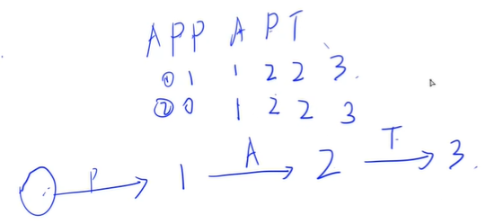

<!-- @import "[TOC]" {cmd="toc" depthFrom=3 depthTo=3 orderedList=false} -->

<!-- code_chunk_output -->

- [最大子序列和 1007 Maximum Subsequence Sum (25 point(s))](#最大子序列和-1007-maximum-subsequence-sum-25-points)
- [最佳彩色带 1045 Favorite Color Stripe (30 point(s))](#最佳彩色带-1045-favorite-color-stripe-30-points)
- [找更多硬币 1068 Find More Coins (30 point(s))](#找更多硬币-1068-find-more-coins-30-points)
- [PAT 计数 1093 Count PAT's (25 point(s))](#pat-计数-1093-count-pats-25-points)
- [快速排序 1101 Quick Sort (25 point(s))](#快速排序-1101-quick-sort-25-points)

<!-- /code_chunk_output -->

### 最大子序列和 1007 Maximum Subsequence Sum (25 point(s))

给定一个包含 $K$ 个整数的序列 $\lbrace N_1,N_2,...,N_K \rbrace$。

连续子序列定义为 $\lbrace N_i,N_{i+1},...,N_j \rbrace$，其中 $1 \le i \le j \le K$。

<p>最大子序列是指序列内各元素之和最大的连续子序列。</p>

例如，给定序列 $\lbrace -2, 11, -4, 13, -5, -2 \rbrace$，它的最大子序列为 $\lbrace 11, -4, 13 \rbrace$，其各元素之和为 $20$。

<p>现在你需要求出最大子序列的各元素之和，并且输出最大子序列的第一个元素和最后一个元素的值。</p>

<h4>输入格式</h4>

第一行包含一个整数 $K$。

第二行包含 $K$ 个整数。

<h4>输出格式</h4>

<p>输出一行三个整数，分别表示最大子序列的各元素之和以及最大子序列的第一个元素和最后一个元素的值。</p>

设最大子序列为 $\lbrace N_i,N_{i+1},...,N_j \rbrace$，如果答案不唯一，则选择 $i$ 更小的解，如果仍不唯一，则选择 $j$ 更小的解。

注意，我们规定，如果所有 $K$ 个数字均为负数，则其最大和定义为 $0$，并且应该输出整个序列的第一个数字和最后一个数字。

<h4>数据范围</h4>

- $1 \le K \le 10000$,
- 序列内元素的绝对值不超过 $10^5$。

<h4>输入样例：</h4>

<pre><code>
10
-10 1 2 3 4 -5 -23 3 7 -21
</code></pre>

<h4>输出样例：</h4>

<pre><code>
10 1 4
</code></pre>

#### 1007 Maximum Subsequence Sum (25 point(s))
Given a sequence of K integers $\lbrace N_1,N_2,...,N_K \rbrace$. A continuous subsequence is defined to be $\lbrace N_i,N_{i+1},...,N_j \rbrace$ where 1≤i≤j≤K. The Maximum Subsequence is the continuous subsequence which has the largest sum of its elements. For example, given sequence { -2, 11, -4, 13, -5, -2 }, its maximum subsequence is { 11, -4, 13 } with the largest sum being 20.

Now you are supposed to find the largest sum, together with the first and the last numbers of the maximum subsequence.

#### Input Specification:
Each input file contains one test case. Each case occupies two lines. The first line contains a positive integer K (≤10000). The second line contains K numbers, separated by a space.

#### Output Specification:
For each test case, output in one line the largest sum, together with the first and the last numbers of the maximum subsequence. The numbers must be separated by one space, but there must be no extra space at the end of a line. In case that the maximum subsequence is not unique, output the one with the smallest indices i and j (as shown by the sample case). If all the K numbers are negative, then its maximum sum is defined to be 0, and you are supposed to output the first and the last numbers of the whole sequence.

`f[i]` 表示以 i 为右端点的区间最大值。

则 `f[i] = max(w[i], f[i-1] + w[i])` ，即以 i 为右端点的区间最大值，要么这个去区间里只有 i （长度为1），要么这个区间里有 i 还有 i-1 （长度大于1），而这就可用递推关系，即 `f[i-1] + w[i]` 。

化简一下：`f[i] = w[i] + max(0, f[i-1])`

再化简一下：`if (f[i-1] < 0) f[i] = w[i]; else f[i] = w[i] + f[i-1]`

**经验：**
- `f[i] = 递推(f[i-1])` 则无需开数组，开一个数 `f` 就行了

```cpp
#include <iostream>

using namespace std;

const int N = 10010;

int n;
int w[N];

int main()
{
    cin >> n;
    for (int i = 1; i <= n; i ++ ) cin >> w[i];

    int res = -1, l, r;
    // 初始为 -1 ，是方便第一个非负数来赋值
    for (int i = 1, f = -1, start; i <= n; i ++ )
    {
        if (f < 0) f = 0, start = i;
        f += w[i];
        if (res < f)
        {
            res = f;
            l = w[start], r = w[i];
        }
    }

    if (res < 0) res = 0, l = w[1], r = w[n];

    cout << res << ' ' << l << ' ' << r << endl;

    return 0;
}
```

### 最佳彩色带 1045 Favorite Color Stripe (30 point(s))

<p>伊娃试图用一条原始色带给自己制作一条喜欢的色带。</p>

<p>她会通过剪掉原始色带中多余的部分，将其余部分拼接起来，从而使得色带中只包含她喜欢的颜色，并且这些颜色按照她喜欢的顺序排列。</p>

据说正常的人眼只能分辨不到 $200$ 种不同的颜色，因此伊娃喜欢的颜色数量是有限的。

<p>原始色带的长度可能会很长，她希望拼剪成的能够使她满意的色带也尽可能的长。</p>

<p>因此，她需要你来帮她确定能够拼剪出的，使得她满意的色带的最大可能长度。</p>

注意，修剪方案可能并不唯一，例如给定颜色为 <code>{2 2 4 1 5 5 6 3 1 1 5 6}</code> 的色带，如果伊娃最喜欢的颜色以她最喜欢的顺序排列为 <code>{2 3 1 5 6}</code>，则她有 $4$ 种可能的最佳解决方案 <code>{2 2 1 1 1 5 6}，{2 2 1 5 5 5 6}，{2 2 1 5 5 6 6}，{2 2 3 1 1 5 6}</code>。

<p>拼剪而成的色带不一定要包含所有她喜欢的颜色，但是一定不能包含她不喜欢的颜色，并且包含的颜色之间的相对顺序应该与她喜欢的顺序保持一致。</p>

<h4>输入格式</h4>

第一行包含整数 $N$，表示涉及到的颜色总数，颜色编号依次为 $1 \sim N$。

第二行首先包含一个整数 $M$，表示她喜欢的颜色数量，接下来会按照她喜欢的排列顺序，依次给出她喜欢的 $M$ 种颜色的编号。

第三行首先包含一个整数 $L$，表示原始色带的长度，然后包含 $L$ 个整数，表示原始色带的具体颜色分布。

<h4>输出格式</h4>

<p>输出一个整数，表示她能够满意的色带的最大长度。</p>

<h4>数据范围</h4>

$1 \le N \le 200$,
$1 \le M \le 200$,
$1 \le L \le 10^4$

<h4>输入样例：</h4>

<pre><code>
6
5 2 3 1 5 6
12 2 2 4 1 5 5 6 3 1 1 5 6
</code></pre>

<h4>输出样例：</h4>

<pre><code>
7
</code></pre>

#### 1045 Favorite Color Stripe (30 point(s))
Eva is trying to make her own color stripe out of a given one. She would like to keep only her favorite colors in her favorite order by cutting off those unwanted pieces and sewing the remaining parts together to form her favorite color stripe.

It is said that a normal human eye can distinguish about less than 200 different colors, so Eva's favorite colors are limited. However the original stripe could be very long, and Eva would like to have the remaining favorite stripe with the maximum length. So she needs your help to find her the best result.

Note that the solution might not be unique, but you only have to tell her the maximum length. For example, given a stripe of colors {2 2 4 1 5 5 6 3 1 1 5 6}. If Eva's favorite colors are given in her favorite order as {2 3 1 5 6}, then she has 4 possible best solutions {2 2 1 1 1 5 6}, {2 2 1 5 5 5 6}, {2 2 1 5 5 6 6}, and {2 2 3 1 1 5 6}.

#### Input Specification:
Each input file contains one test case. For each case, the first line contains a positive integer N (≤200) which is the total number of colors involved (and hence the colors are numbered from 1 to N). Then the next line starts with a positive integer M (≤200) followed by M Eva's favorite color numbers given in her favorite order. Finally the third line starts with a positive integer $L (≤10^4)$ which is the length of the given stripe, followed by L colors on the stripe. All the numbers in a line a separated by a space.

#### Output Specification:
For each test case, simply print in a line the maximum length of Eva's favorite stripe.

`f(i, j)` 表示取 `p[1~i]` 与 `s[1~j]` 的所有公共子序列的集合中的长度最大值。

注：本题中的公共子序列并非一般意义上的公共子序列，`p`中的一个树可以对应`s`中的`0~n`个数。

`f(i, j)` 的状态转移分为四种情况讨论，在以下四种情况中取最大值：
- **不含 pi 与 sj 的：** `f(i-1, j-1)`
- **含 pi 不含 sj 的：** `f(i, j-1)` 注意这里是 `f(i, j-1)` 包含这种情况，并非完全等价
- **不含 pi 含 sj 的：** `f(i-1, j)` 同上
- **含 pi 含 sj的：** `f(i, j-1) + 1` 需要满足题意，必须有 `pi == sj` 时才能转移到 `f(i, j)`

上述中，`f(i-1, j-1)` 是被包含在 `f(i, j-1)` 以及 `f(i-1, j)` 中的，因此只算后三种方案就可以了。

```cpp
#include <iostream>

using namespace std;

const int N = 210, M = 10010;

int n, m, l;
int p[N], s[M];
int f[N][M];

int main()
{
    cin >> n;  // n 没什么用

    cin >> m;
    for (int i = 1; i <= m; i ++ ) cin >> p[i];

    cin >> l;
    for (int i = 1; i <= l; i ++ ) cin >> s[i];

    for (int i = 1; i <= m; i ++ )
        for (int j = 1; j <= l; j ++ )
        {
            f[i][j] = max(f[i - 1][j], f[i][j - 1]);
            if (p[i] == s[j]) f[i][j] = max(f[i][j], f[i][j - 1] + 1);
        }

    cout << f[m][l] << endl;

    return 0;
}
```

### 找更多硬币 1068 Find More Coins (30 point(s))

<p>伊娃喜欢从整个宇宙中收集硬币。</p>

<p>有一天，她去了一家宇宙购物中心购物，结账时可以使用各种硬币付款。</p>

<p>但是，有一个特殊的付款要求：每张帐单，她都必须<strong>准确</strong>的支付所消费金额。</p>

<p>给定她拥有的所有硬币的面额，请你帮她确定对于给定的金额，她能否找到一些硬币来支付。</p>

<h4>输入格式</h4>

<p>第一行包含两个整数 N 和 M，分别表示硬币数量以及需要支付的金额。</p>

<p>第二行包含 N 个整数，表示每个硬币的面额。</p>

<h4>输出格式</h4>

<p>共一行，按照面额升序的顺序，输出用来支付的所有硬币的面额。</p>

<p>如果支付方式不唯一，则输出最小的支付面额序列。</p>

<p>如果无解，则输出 <code>No Solution</code>。</p>

对于两个序列 <code>{A[1], A[2], ...}</code> 和 <code>{B[1], B[2], ...}</code>，如果存在 $k \ge 1$ 使得所有 $i < k$，满足 $A[i] = B[i]$ 成立，并且 $A[k] < B[k]$，则我们称序列 $A$ 小于序列 $B$。

<h4>数据范围</h4>

- $1 \le N \le 10^4$,
- $1 \le M \le 100$,
- 硬币面值不超过 $100$

<h4>输入样例1：</h4>

<pre><code>
8 9
5 9 8 7 2 3 4 1
</code></pre>

<h4>输出样例1：</h4>

<pre><code>
1 3 5
</code></pre>

<h4>输入样例2：</h4>

<pre><code>
4 8
7 2 4 3
</code></pre>

<h4>输出样例2：</h4>

<pre><code>
No Solution
</code></pre>

#### 1068 Find More Coins (30 point(s))
Eva loves to collect coins from all over the universe, including some other planets like Mars. One day she visited a universal shopping mall which could accept all kinds of coins as payments. However, there was a special requirement of the payment: for each bill, she must pay the exact amount. Since she has as many as $10^4$ coins with her, she definitely needs your help. You are supposed to tell her, for any given amount of money, whether or not she can find some coins to pay for it.

#### Input Specification:
Each input file contains one test case. For each case, the first line contains 2 positive numbers: $N (≤10^4)$ (the total number of coins), and M ($≤10^2$, the amount of money Eva has to pay). The second line contains N face values of the coins, which are all positive numbers. All the numbers in a line are separated by a space.

#### Output Specification:
For each test case, print in one line the face values $V_1 \le V_2 \le ... \le V_k$ such that $V_1 + V_2 + ... + V_k = M$. All the numbers must be separated by a space, and there must be no extra space at the end of the line. If such a solution is not unique, output the smallest sequence. If there is no solution, output "No Solution" instead.

Note: sequence `{A[1], A[2], ...}` is said to be "smaller" than sequence `{B[1], B[2], ...}` if there exists k≥1 such that `A[i]=B[i]` for all i<k, and `A[k] < B[k]`.

**思路：**
- 01背包问题简化版
- `f(i, j)` 表示只考虑前 i 个物品，总体积为 j 的选法是否存在
- `f(0, 0)` 为 `true`
- `f(i, j)` 为 `f(i-1, j) | f(i-1, j-a[i])`
- 注意这道要选择字典序最小的合法序列，因此我们的 `a[i]` **排序为从大到小** ，之后回溯 dp 树时，我们就先减去小的数来回溯

```cpp
// 01背包
#include <iostream>
#include <algorithm>

using namespace std;

const int N = 10010, M = 110;

int n, m;
int a[N];
bool f[N][M];

int main()
{
    cin >> n >> m;
    for (int i = 1; i <= n; i ++ ) cin >> a[i];

    sort(a + 1, a + n + 1, greater<int>());

    f[0][0] = true;
    for (int i = 1; i <= n; i ++ )
        for (int j = 0; j <= m; j ++ )
        {
            f[i][j] = f[i - 1][j];
            if (j >= a[i]) f[i][j] |= f[i - 1][j - a[i]];
        }

    if (!f[n][m]) puts("No Solution");
    else
    {
        bool is_first = true;
        while (n)
        {
            if (m >= a[n] && f[n - 1][m - a[n]])
            {
                if (is_first) is_first = false;
                else cout << ' ';
                cout << a[n];
                m -= a[n];
            }

            n -- ;
        }
    }

    return 0;
}
```

**经验：**
- 写 DP 是状态转移记得判断下标是否会溢出
- `sort(a + 1, a + n + 1, greater<int>());` 里用 `greater<int>()` 进行重载，注意括号，原因是**greater和less都重载了操作符()**

### PAT 计数 1093 Count PAT's (25 point(s))

<p>字符串 <code>APPAPT</code> 中共包含两个 <code>PAT</code> 作为子串。</p>

<p>第一个子串由第二，第四和第六个字符组成，第二个子串由第三，第四和第六个字符组成。</p>

<p>现在给定一个字符串，请你求出字符串中包含的 <code>PAT</code> 的数量。</p>

<h4>输入格式</h4>

共一行，包含一个由大写字母 $P,A,T$ 构成的字符串。

<h4>输出格式</h4>

输出字符串中包含的 <code>PAT</code> 的数量。

由于结果可能很大，请你输出对 $1000000007$ 取模后的结果。

<h4>数据范围</h4>

给定字符串的长度不超过 $10^5$。

<h4>输入样例：</h4>

<pre><code>
APPAPT
</code></pre>

<h4>输出样例：</h4>

<pre><code>
2
</code></pre>

#### 1093 Count PAT's (25 point(s))
The string APPAPT contains two PAT's as substrings. The first one is formed by the 2nd, the 4th, and the 6th characters, and the second one is formed by the 3rd, the 4th, and the 6th characters.

Now given any string, you are supposed to tell the number of PAT's contained in the string.

#### Input Specification:
Each input file contains one test case. For each case, there is only one line giving a string of no more than $10^5$ characters containing only P, A, or T.

#### Output Specification:
For each test case, print in one line the number of PAT's contained in the string. Since the result may be a huge number, you only have to output the result moded by `1000000007`.



如上，我们可以用状态机描述匹配过程。这张图和下面的代码并不是对应的，下面的代码中，遇到状态机中相关条件，马上转移状态，而不是在下一位再转移状态。

遇到相应状态，可以考虑是否进行状态转移。

`f(i, j)` 可以表示：只考虑前 `i` 个字母且走到了状态 `j` 的所有路线的数量。

`f(i, j)` 可以来自两个状态的转移：
- `f(i-1, j)` 不用第 `i` 个字母
- `f(i-1, j-1) + f(i-1, j)` 可以进行状态转移，要求符合状态机 `s[i] == p[j]`

```cpp
#include <iostream>
#include <cstring>

using namespace std;

const int N = 100010, MOD = 1e9 + 7;

int n;
char s[N], p[] = " PAT";  // 这里我们用空字符描述起始状态
// 空一位的意义：下面不用判断 j >= 1 才能 f[i-1][j-1] 了，`j==0`时一定不会有`s[i] == p[j]`
int f[N][4];

int main()
{
    cin >> s + 1;
    n = strlen(s + 1);

    f[0][0] = 1;
    for (int i = 1; i <= n; i ++ )
        for (int j = 0; j <= 3; j ++ )
        {
            f[i][j] = f[i - 1][j];
            // 当可以进行状态机状态转移时
            if (s[i] == p[j]) f[i][j] = (f[i][j] + f[i - 1][j - 1]) % MOD;
        }

    cout << f[n][3] << endl;

    return 0;
}
```

### 快速排序 1101 Quick Sort (25 point(s))

<p>在著名的快速排序中，有一个经典的过程叫做划分。</p>

<p>在此过程中，我们通常选取其中一个元素作为分界值。</p>

<p>将小于分界值的元素移到其左侧，将大于分界值的元素移到其右侧。</p>

给定 $N$ 个不同的正整数进行过一次划分后的排列情况。

<p>请你判断，共有多少元素可能是此次划分的分界值。</p>

例如，$N = 5$，各元素排列为 $1,3,2,4,5$，则：

- $1$ 可能是分界值，因为它的左侧没有元素，而右侧的元素都比它大。
- $3$ 一定不是分界值，因为尽管它的左侧的元素都比它小，但是它右侧的 $2$ 也小于它。
- $2$ 一定不是分界值，因为尽管它的右侧的元素都比它大，但是它左侧的 $3$ 也大于它。
- 出于类似判断可知 $4,5$ 也可能是分界值。

因此，在此样例中，共有 $3$ 个可能的分界值。

<h4>输入格式</h4>

第一行包含整数 $N$。

第二行包含 $N$ 个不同的正整数。

<h4>输出格式</h4>

<p>第一行输出可能的分界值数量。</p>

<p>第二行按升序顺序输出所有可能的分界值。</p>

如果分界值数量为 $0$，则在输出分界值数量后，输出一个空行即可。

<h4>数据范围</h4>

- $1 \le N \le 10^5$,
- $1 \le$ 给定元素 $\le 10^9$。

<h4>输入样例：</h4>

<pre><code>
5
1 3 2 4 5
</code></pre>

<h4>输出样例：</h4>

<pre><code>
3
1 4 5
</code></pre>

#### 1101 Quick Sort (25 point(s))
There is a classical process named partition in the famous quick sort algorithm. In this process we typically choose one element as the pivot. Then the elements less than the pivot are moved to its left and those larger than the pivot to its right. Given N distinct positive integers after a run of partition, could you tell how many elements could be the selected pivot for this partition?

For example, given N=5 and the numbers 1, 3, 2, 4, and 5. We have:
- 1 could be the pivot since there is no element to its left and all the elements to its right are larger than it;
- 3 must not be the pivot since although all the elements to its left are smaller, the number 2 to its right is less than it as well;
- 2 must not be the pivot since although all the elements to its right are larger, the number 3 to its left is larger than it as well;
- and for the similar reason, 4 and 5 could also be the pivot.

Hence in total there are 3 pivot candidates.

#### Input Specification:
Each input file contains one test case. For each case, the first line gives a positive integer N ($≤10^5$). Then the next line contains N distinct positive integers no larger than $10^9$. The numbers in a line are separated by spaces.

#### Output Specification:
For each test case, output in the first line the number of pivot candidates. Then in the next line print these candidates in increasing order. There must be exactly 1 space between two adjacent numbers, and no extra space at the end of each line.

```cpp
// 预处理两个数，前 i 个数的最大值和后 i 个数的最小值
// 分解值应该比前面的都大，比后面的都小
#include <iostream>
#include <vector>

using namespace std;

const int N = 100010, INF = 2e9;

int n;
int a[N], l[N], r[N];

int main()
{
    cin >> n;
    for (int i = 1; i <= n; i ++ ) cin >> a[i];
    for (int i = 1; i <= n; i ++ ) l[i] = max(l[i - 1], a[i]);
    r[n + 1] = INF;
    for (int i = n; i; i -- ) r[i] = min(r[i + 1], a[i]);

    vector<int> res;
    for (int i = 1; i <= n; i ++ )
        if (l[i - 1] < a[i] && a[i] < r[i + 1])
            res.push_back(a[i]);

    cout << res.size() << endl;
    if (res.size())
    {
        cout << res[0];
        for (int i = 1; i < res.size(); i ++ ) cout << ' ' << res[i];
    }
    cout << endl;

    return 0;
}
```
