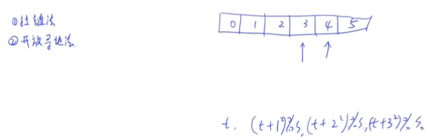
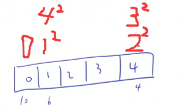

<!-- @import "[TOC]" {cmd="toc" depthFrom=3 depthTo=3 orderedList=false} -->

<!-- code_chunk_output -->

- [哈希 1078 Hashing (25 point(s))](#哈希-1078-hashing-25-points)
- [期终成绩 1137 Final Grading (25 point(s))](#期终成绩-1137-final-grading-25-points)
- [哈希 - 平均查找时间 1145 Hashing - Average Search Time (25 point(s))](#哈希-平均查找时间-1145-hashing-average-search-time-25-points)

<!-- /code_chunk_output -->

### 哈希 1078 Hashing (25 point(s))

<p>将一个由若干个不同正整数构成的整数序列插入到一个哈希表中，然后输出输入数字的位置。</p>

哈希函数定义为 $H(key) = key \% TSize$，其中 $TSize$ 是哈希表的最大大小。

<p>利用只具有正增量的二次探测法来解决冲突。</p>

<p>注意，哈希表的大小最好是素数，如果用户给出的最大大小不是素数，则必须将表大小重新定义为大于用户给出的大小的最小素数。</p>

<h4>输入格式</h4>

第一行包含两个整数 $MSize$ 和 $N$，分别表示用户定义的表的大小以及输入数字的数量。

第二行包含 $N$ 个不同的正整数，数字之间用空格隔开。

<h4>输出格式</h4>

在一行中，输出每个输入数字的相应位置（索引从 $0$ 开始），数字之间用空格隔开，行尾不得有多余空格。

<p>如果无法插入某个数字，则输出 <code>-</code>。</p>

<h4>数据范围</h4>

- $1 \le MSize \le 10^4$,
- $1 \le N \le MSize$,
- 输入数字均在 $[1,10^5]$ 范围内。

<h4>输入样例：</h4>

<pre><code>
4 4
10 6 4 15
</code></pre>

<h4>输出样例：</h4>

<pre><code>
0 1 4 -
</code></pre>

#### 1078 Hashing (25 point(s))
The task of this problem is simple: insert a sequence of distinct positive integers into a hash table, and output the positions of the input numbers. The hash function is defined to be H(key)=key%TSize where TSize is the maximum size of the hash table. Quadratic probing (with positive increments only) is used to solve the collisions.

Note that the table size is better to be prime. If the maximum size given by the user is not prime, you must re-define the table size to be the smallest prime number which is larger than the size given by the user.

#### Input Specification:
Each input file contains one test case. For each case, the first line contains two positive numbers: MSize $(≤10^4)$ and N (≤MSize) which are the user-defined table size and the number of input numbers, respectively. Then N distinct positive integers are given in the next line. All the numbers in a line are separated by a space.

Output Specification:
For each test case, print the corresponding positions (index starts from 0) of the input numbers in one line. All the numbers in a line are separated by a space, and there must be no extra space at the end of the line. In case it is impossible to insert the number, print "-" instead.



哈希常见的方法有两种，拉链法和开放寻址法。这里用的开放寻址法。

Quadratic probing (with positive increments only) 开放寻址法，如下，样例中 15 没有地方可放。



```cpp
#include <iostream>

using namespace std;

const int N = 10010;

int s, n;
int h[N];

bool is_prime(int x)
{
    if (x == 1) return false;

    for (int i = 2; i * i <= x; i ++ )
        if (x % i == 0)
            return false;

    return true;
}

int find(int x)  // find 是开放寻址法核心操作
{
    int t = x % s;

    for (int k = 0; k < s; k ++ )
    {
        int i = (t + k * k) % s;
        if (!h[i]) return i;  // 如果该位置还没有数
    }

    return -1;
}

int main()
{
    cin >> s >> n;

    while (!is_prime(s)) s ++ ;  // 加到质数为止

    for (int i = 0; i < n; i ++ )
    {
        int x;
        cin >> x;
        int t = find(x);

        if (t == -1) printf("-");
        else
        {
            h[t] = x;
            printf("%d", t);
        }

        if (i != n - 1) printf(" ");
    }

    return 0;
}
```

### 期终成绩 1137 Final Grading (25 point(s))

对于在中国大学 MOOC 学习“数据结构”课程的学生，想要获得一张合格证书，必须首先获得不少于 $200$ 分的在线编程作业分，然后总评获得不少于 $60$ 分（满分 $100$）。

总评成绩的计算公式为 $G = (G_{mid-term} \times 40\% +G_{final} \times 60 \%)$，如果 $G_{mid-term} < G_{final}$；否则总评 $G$ 就是 $G_{final}$。

这里 $G_{mid-term}$ 和 $G_{final}$ 分别为学生的期中和期末成绩。

<p>现在的问题是，每次考试都产生一张独立的成绩单。</p>

<p>本题就请你编写程序，把不同的成绩单合为一张。</p>

<h4>输入格式</h4>

输入在第一行给出 $3$ 个整数，分别是 $P$（做了在线编程作业的学生数）、$M$（参加了期中考试的学生数）、$N$（参加了期末考试的学生数）。

<p>接下来有三块输入。</p>

第一块包含 $P$ 个在线编程成绩 $G_p$；

第二块包含 $M$ 个期中考试成绩 $G_{mid-term}$；

第三块包含 $N$ 个期末考试成绩 $G_{final}$。

<p>每个成绩占一行，格式为：<code>学生学号 分数</code>。</p>

其中 <code>学生学号</code> 为不超过 $20$ 个字符的英文字母和数字；<code>分数</code> 是非负整数（编程总分最高为 $900$ 分，期中和期末的最高分为 $100$ 分）。

<h4>输出格式</h4>

<p>打印出获得合格证书的学生名单。</p>

<p>每个学生占一行，格式为：</p>

<code>学生学号</code> $G_p$ $G_{mid-term}$ $G_{final}$ $G$

<p>如果有的成绩不存在（例如某人没参加期中考试），则在相应的位置输出“−1”。</p>

<p>输出顺序为按照总评分数（四舍五入精确到整数）递减。</p>

<p>若有并列，则按学号递增。</p>

题目保证学号没有重复，且至少存在 $1$ 个合格的学生。

<h4>数据范围</h4>

$1 \le P,M,N \le 10000$

<h4>输入样例：</h4>

<pre><code>
6 6 7
01234 880
a1903 199
ydjh2 200
wehu8 300
dx86w 220
missing 400
ydhfu77 99
wehu8 55
ydjh2 98
dx86w 88
a1903 86
01234 39
ydhfu77 88
a1903 66
01234 58
wehu8 84
ydjh2 82
missing 99
dx86w 81
</code></pre>

<h4>输出样例：</h4>

<pre><code>
missing 400 -1 99 99
ydjh2 200 98 82 88
dx86w 220 88 81 84
wehu8 300 55 84 84
</code></pre>

#### 1137 Final Grading (25 point(s))
For a student taking the online course "Data Structures" on China University MOOC (http://www.icourse163.org/), to be qualified for a certificate, he/she must first obtain no less than 200 points from the online programming assignments, and then receive a final grade no less than 60 out of 100. The final grade is calculated by $G = (G_{mid-term} \times 40\% +G_{final} \times 60 \%)$ if $G_{mid-term} > G_{final}$, or $G_{final}$ will be taken as the final grade G. Here $G_{mid−term}$ and $G_{final}$ are the student's scores of the mid-term and the final exams, respectively.

The problem is that different exams have different grading sheets. Your job is to write a program to merge all the grading sheets into one.

#### Input Specification:
Each input file contains one test case. For each case, the first line gives three positive integers: P , the number of students having done the online programming assignments; M, the number of students on the mid-term list; and N, the number of students on the final exam list. All the numbers are no more than 10,000.

Then three blocks follow. The first block contains P online programming scores $G_p$'s; the second one contains M mid-term scores $G_{mid−term}$'s; and the last one contains N final exam scores $G_{final}$'s. Each score occupies a line with the format: StudentID Score, where StudentID is a string of no more than 20 English letters and digits, and Score is a nonnegative integer (the maximum score of the online programming is 900, and that of the mid-term and final exams is 100).

#### Output Specification:
For each case, print the list of students who are qualified for certificates. Each student occupies a line with the format:

<code>StudentID</code> $G_p$ $G_{mid-term}$ $G_{final}$ $G$

If some score does not exist, output "−1" instead. The output must be sorted in descending order of their final grades (G must be rounded up to an integer). If there is a tie, output in ascending order of their StudentID's. It is guaranteed that the StudentID's are all distinct, and there is at least one qullified student.

```cpp
#include <iostream>
#include <cstring>
#include <unordered_map>
#include <algorithm>
#include <vector>
#include <cmath>

using namespace std;

struct Student
{
    string id;
    int p, m, f, s;

    Student(): p(-1), m(-1), f(-1), s(0) {}

    void calc()
    {
        if (f >= m) s = f;
        else s = round(m * 0.4 + f * 0.6);
    }

    bool operator< (const Student& t) const
    {
        // 按照分数降序排
        if (s != t.s) return s > t.s;
        // 否则按照 id 升序
        return id < t.id;
    }
};

int main()
{
    int p, m, n;
    cin >> p >> m >> n;

    unordered_map<string, Student> hash;
    string id;
    int s;
    for (int i = 0; i < p; i ++ )
    {
        cin >> id >> s;
        hash[id].id = id;
        hash[id].p = s;
    }

    for (int i = 0; i < m; i ++ )
    {
        cin >> id >> s;
        hash[id].id = id;
        hash[id].m = s;
    }

    for (int i = 0; i < n; i ++ )
    {
        cin >> id >> s;
        hash[id].id = id;
        hash[id].f = s;
    }

    vector<Student> students;
    for (auto item : hash)
    {
        auto stu = item.second;

        stu.calc();
        // 只输出 qualified 的
        if (stu.p >= 200 && stu.s >= 60)
            students.push_back(stu);
    }

    sort(students.begin(), students.end());

    for (auto s : students)
        cout << s.id << ' ' << s.p << ' ' << s.m << ' ' << s.f << ' ' << s.s << endl;

    return 0;
}
```

### 哈希 - 平均查找时间 1145 Hashing - Average Search Time (25 point(s))

<p>这个问题的任务很简单：</p>

<p>首先将一个由若干个不同正整数构成的整数序列插入到一个哈希表中，然后尝试从表中查找另一个整数键值序列，并输出平均查找时间（查找时间指查找某个值是否在表中所进行的比较操作的次数）。</p>

哈希函数定义为 $H(key) = key \% TSize$，其中 $TSize$ 是哈希表的最大大小。

<p>利用只具有正增量的二次探测法来解决冲突。</p>

<p>注意，哈希表的大小最好是素数，如果用户给出的最大大小不是素数，则必须将表大小重新定义为大于用户给出的大小的最小素数。</p>

<h4>输入格式</h4>

第一行包含三个正整数 $MSize, N, M$，分别表示用户定义的表的大小，插入整数的数量，查找键值的数量。

第二行包含 $N$ 个不同的正整数，表示插入序列。

第三行包含 $M$ 个正整数，表示键值序列。

同行数字之间用空格隔开，两个序列中包含的整数均不超过 $10^5$。

<h4>输出格式</h4>

<p>如果无法插入一些数字，则将其按顺序以如下格式输出，每个数字占一行：</p>

<pre><code>
X cannot be inserted.
</code></pre>

<p>其中 <code>X</code> 表示无法插入的数字。</p>

最后一行输出 $M$ 次查找的平均查找时间，保留一位小数。

<strong>注意：</strong> 如果查找了 $TSize$ 次，每次查找的位置上均有数，但都不等于要查找的数，则认为查找时间是 $TSize + 1$。

<h4>数据范围</h4>

$1 \le MSize,N,M \le 10^4$

<h4>输入样例：</h4>

<pre><code>
4 5 4
10 6 4 15 11
11 4 15 2
</code></pre>

<h4>输出样例：</h4>
<pre><code>
15 cannot be inserted.
2.8
</code></pre>

#### 1145 Hashing - Average Search Time (25 point(s))
The task of this problem is simple: insert a sequence of distinct positive integers into a hash table first. Then try to find another sequence of integer keys from the table and output the average search time (the number of comparisons made to find whether or not the key is in the table). The hash function is defined to be H(key)=key%TSize where TSize is the maximum size of the hash table. Quadratic probing (with positive increments only) is used to solve the collisions.

Note that the table size is better to be prime. If the maximum size given by the user is not prime, you must re-define the table size to be the smallest prime number which is larger than the size given by the user.

#### Input Specification:
Each input file contains one test case. For each case, the first line contains 3 positive numbers: MSize, N, and M, which are the user-defined table size, the number of input numbers, and the number of keys to be found, respectively. All the three numbers are no more than $10^4$. Then N distinct positive integers are given in the next line, followed by M positive integer keys in the next line. All the numbers in a line are separated by a space and are no more than $10^5$.

#### Output Specification:
For each test case, in case it is impossible to insert some number, print in a line X cannot be inserted. where X is the input number. Finally print in a line the average search time for all the M keys, accurate up to 1 decimal place.

```cpp
#include <iostream>

using namespace std;

const int N = 10010;

int s, n, m;
int h[N];

bool is_prime(int x)
{
    if (x == 1) return false;

    for (int i = 2; i * i <= x; i ++ )
        if (x % i == 0)
            return false;

    return true;
}

int find(int x, int &cnt)
{
    int t = x % s;

    cnt = 1;
    for (int k = 0; k < s; k ++, cnt ++ )
    {
        int i = (t + k * k) % s;
        if (!h[i] || h[i] == x) return i;
    }

    return -1;
}

int main()
{
    cin >> s >> n >> m;

    while (!is_prime(s)) s ++ ;

    for (int i = 0; i < n; i ++ )
    {
        int x, count;
        cin >> x;

        int t = find(x, count);
        if (t == -1) printf("%d cannot be inserted.\n", x);
        else h[t] = x;
    }

    int cnt = 0;
    for (int i = 0; i < m; i ++ )
    {
        int x, count;
        cin >> x;
        find(x, count);
        cnt += count;
    }

    printf("%.1lf\n", (double)cnt / m);

    return 0;
}
```
