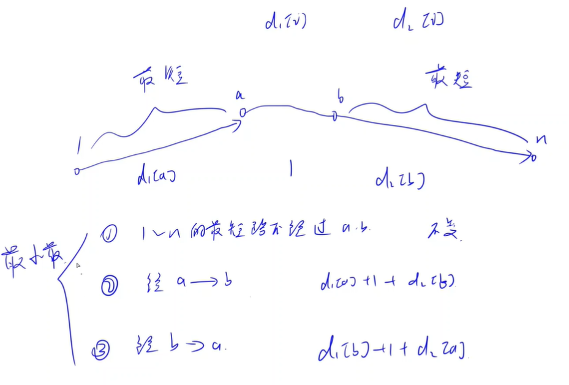
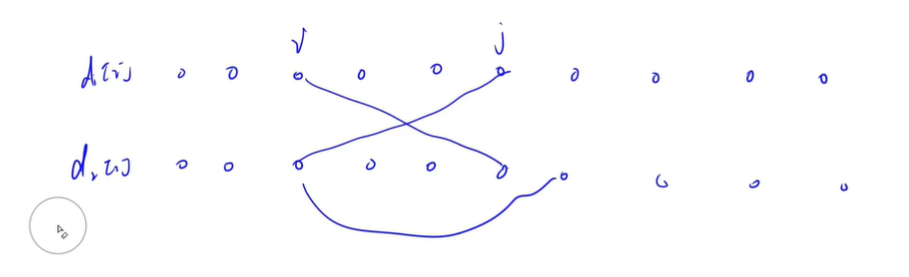
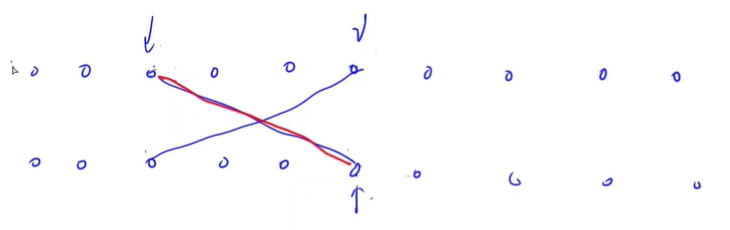

<!-- @import "[TOC]" {cmd="toc" depthFrom=1 depthTo=6 orderedList=false} -->

<!-- code_chunk_output -->

- [计算abc](#计算abc)
- [凑平方（暴力）](#凑平方暴力)
- [最大化最短路](#最大化最短路)

<!-- /code_chunk_output -->

没参加。

### 计算abc

有三个<strong>正整数</strong> $a,b,c$，我们不知道每个数的具体值，但我们知道 $a \le b \le c$。

现在，以<strong>随机顺序</strong>给出 $a+b,a+c,b+c,a+b+c$ 的值，请你求出 $a,b,c$ 的值。

<h4>输入格式</h4>

共一行，包含四个整数 $x_1,x_2,x_3,x_4$，表示以<strong>随机顺序</strong>给出的 $a+b,a+c,b+c,a+b+c$ 的值。

<h4>输出格式</h4>

共一行，三个空格隔开的整数 $a,b,c$。

<h4>数据范围</h4>

前三个测试点满足 $2 \le x_i \le 1000$。<br />
所有测试点满足 $2 \le x_i \le 10^9$。<br />
保证一定有解。

<h4>输入样例1：</h4>

<pre><code>
3 6 5 4
</code></pre>

<h4>输出样例1：</h4>

<pre><code>
1 2 3
</code></pre>

<h4>输入样例2：</h4>

<pre><code>
40 40 40 60
</code></pre>

<h4>输出样例2：</h4>

<pre><code>
20 20 20
</code></pre>

<h4>输入样例3：</h4>

<pre><code>
201 101 101 200
</code></pre>

<h4>输出样例3：</h4>

<pre><code>
1 100 100
</code></pre>

```cpp
#include <iostream>
#include <cstring>
#include <algorithm>
using namespace std;

const int N = 4;
int a[N];

int main()
{
    int n = 4;
    for (int i = 0; i < n; i ++ ) scanf("%d", &a[i]);
    
    sort(a, a + n);
    
    for (int i = 2; i >= 0; i -- ) printf("%d ", a[3] - a[i]);
}
```

### 凑平方（暴力）

给定一个不含前导 $0$ 的正整数 $n$。

你可以对 $n$ 进行删位操作。

每次操作，可以将 $n$ 的任意一位数字删去，但是需要保证每次操作完成后的数字仍然是不含前导 $0$ 的正整数。

如果想要使得 $n$ 可以成为某个正整数的平方，那么最少需要对 $n$ 进行多少次操作？

<h4>输入格式</h4>

第一行包含整数 $T$，表示共有 $T$ 组测试数据。

每组数据占一行，包含一个整数 $n$。

<h4>输出格式</h4>

每组数据输出一行结果，表示最少需要的操作次数，如果不可能使 $n$ 变为某个正整数的平方，则输出 $-1$。

<h4>数据范围</h4>

前三个测试点满足 $1 \le n \le 10000$。<br />
所有测试点满足 $1 \le T \le 10$，$1 \le n \le 2 \times 10^9$。

<h4>输入样例1：</h4>

<pre><code>
1
8314
</code></pre>

<h4>输出样例1：</h4>

<pre><code>
2
</code></pre>

<h4>输入样例2：</h4>

<pre><code>
1
625
</code></pre>

<h4>输出样例2：</h4>

<pre><code>
0
</code></pre>

<h4>输入样例3：</h4>

<pre><code>
1
333
</code></pre>

<h4>输出样例3：</h4>

<pre><code>
-1
</code></pre>

```cpp
// 暴力， n ≤ 2e9
// 则 n 最多有 10 位
// 因此顶多有 2^{10} 种方案
// 因此枚举这 1024 种方案就行
#include <iostream>
#include <cstring>
#include <algorithm>
#include <cmath>  // sqrt

using namespace std;

const int MAXN = 100;

int main()
{
    int T;
    cin >> T;
    while (T --)
    {
        string str;
        cin >> str;
        int n = str.size();

        int res = MAXN;
        for (int i = 0; i < 1 << n; ++ i)
        {
            int x = 0;
            for (int j = 0; j < n; ++ j)
                if (i >> j & 1)
                    x = x * 10 + str[j] - '0';

            int t = sqrt(x);
            if (x && t * t == x) res = min(res, n - (int) to_string(x).size());  // to_string 去掉了前导零的影响
        }

        if (res == MAXN) res = -1;
        cout << res << endl;
    }
}
```

### 最大化最短路

给定一个 $n$ 个点 $m$ 条边的<strong>无向</strong>连通图。

图中所有点的编号为 $1 \sim n$。

<p>图中不含重边和自环。</p>

指定图中的 $k$ 个点为特殊点。

<p>现在，你<strong>必须</strong>选择两个特殊点，并在这两个点之间增加一条边。</p>

<p>所选两点之间允许原本就存在边。</p>

我们希望，在增边操作完成以后，点 $1$ 到点 $n$ 的最短距离尽可能<strong>大</strong>。

<p>输出这个最短距离的最大可能值。</p>

注意，图中所有边（包括新增边）的边长均为 $1$。

<h4>输入格式</h4>

第一行包含三个整数 $n,m,k$。

第二行包含 $k$ 个整数 $a_1,a_2,...,a_k$，表示 $k$ 个特殊点的编号，$a_i$ 之间两两不同。

接下来 $m$ 行，每行包含两个整数 $x,y$，表示点 $x$ 和点 $y$ 之间存在一条边。

<h4>输出格式</h4>

<p>一个整数，表示最短距离的最大可能值。</p>

<h4>数据范围</h4>

前六个测试点满足 $2 \le n \le 100$。

所有测试点满足 $2 \le n \le 2 \times 10^5$，$n-1 \le m \le 2 \times 10^5$，$2 \le k \le n$，$1 \le a_i \le n$，$1 \le x,y \le n$。

<h4>输入样例1：</h4>

<pre><code>
5 5 3
1 3 5
1 2
2 3
3 4
3 5
2 4
</code></pre>

<h4>输出样例1：</h4>

<pre><code>
3
</code></pre>

<h4>输入样例2：</h4>

<pre><code>
5 4 2
2 4
1 2
2 3
3 4
4 5
</code></pre>

<h4>输出样例2：</h4>

<pre><code>
3
</code></pre>

竞赛中等难度题目，重点在分析。

分析第一步，分情况讨论。

题目中要求，必须在特殊点中选择两个点，这两个点之间会新增一条边。优化目标是，新增边后， `1` 到 `n` 的最短路径最大。



从 1 到 n 的最短路径只可能有以下三种情况（如上图）：
- 不经过 `a to b` 这条线
- 经过 `a -> b` ，则距离是 `x[a] + 1 + y[b]`
- 经过 `b -> a` ，则距离是 `x[b] + 1 + y[a]`
- 说明：`x[a]` 为 `1` 到 `a` 的距离，`y[b]` 为 `n` 到 `b` 的距离

如果我们在 `a` 与 `b` 中增加一条边，则最终最短路的距离为以下三者中取最小值：
- 原有最短路长度
- `x[a] + 1 + y[b]`
- `x[b] + 1 + y[a]`

我们没办法改变「原有最短路长度」，因此只能希望 `min(x[a] + 1 + y[b], x[b] + 1 + y[a])` 这个值越大越好。

因此，我们要考虑所有特殊点的两两组合，然后，找出最大的 `min(x[a] + 1 + y[b], x[b] + 1 + y[a])` 的 `a b` 组合。



我们没法直接找 `min(x[a] + 1 + y[b], x[b] + 1 + y[a])` 的最大值，得进行一步推导：
- `x[a] + 1 + y[b] <= x[b] + 1 + y[a]`
- 即 `x[a] - y[a] <= x[b] - y[b]`
- 即，当 `x[a] - y[a] <= x[b] - y[b]` 时， `min(x[a] + 1 + y[b], x[b] + 1 + y[a])` 为 `x[a] + 1 + y[b]`
- 即，我们找 `a, b` 满足 `x[a] - y[a] <= x[b] - y[b]` （这个约束条件也可使我们遍历所有的 `a, b` 组合），使得 `x[a] + 1 + y[b]` 最大



如上，我们将特殊的点按照 `x[i] - y[i]` 升序排序；我们令 `b` 为第一层循环：即首先确定 `b` 的位置（图中为 `i` ） ， `a` 的话，选择选择从起点到 `i` 的最大值即可，因为我们的目标是图中红色的线值最大，即 `y[b] + 1 + x[a]` 。

```cpp
#include <iostream>
#include <cstring>
#include <algorithm>
using namespace std;

const int N = 2e5 + 10, M = 4e5 + 10;
int n, m, k;
int a[N], dist1[N], dist2[N];  // 特殊点，题解中的x[]和y[]
int h[N], e[M], ne[M], idx;
int q[N];  // bfs 用的队列

void add(int a, int b)
{
    e[idx] = b, ne[idx] = h[a], h[a] = idx ++ ;
}

void bfs(int st, int dist[])
{
    int tt = 0, hh = 0;
    q[0] = st;
    
    // 传入参数的 dist 是一个指针
    // 不可以用 sizeof dist
    memset(dist, 0x3f, 4 * N);
    dist[st] = 0;

    while (hh <= tt)
    {
        int t = q[hh ++];
        // printf("t = %d h[t] = %d \n", t, h[t]);
        
        for (int i = h[t]; ~i; i = ne[i])
        {
            int j = e[i];
            if (dist[j] > dist[t] + 1)
            {
                dist[j] = dist[t] + 1;
                // printf("dist[%d] = %d t = %d\n", j, dist[j], tt);
                q[++ tt] = j;
            }
        }
    }
}

int main()
{
    scanf("%d%d%d", &n, &m, &k);
    memset(h, -1, sizeof h);  // 莫忘！
    for (int i = 0; i < k; ++ i)
    {
        scanf("%d", &a[i]);
    }
    for (int i = 0; i < m; ++ i)
    {
        int x, y;
        scanf("%d%d", &x, &y);
        add(x, y);
        add(y, x);
    }

    bfs(1, dist1);
    // printf("==bfs2\n");
    bfs(n, dist2);
    
    // 开始按照题解来，先按照 dist1[i] - dist2[i] 排序
    sort(a, a + k, [&](int a, int b) {
        return dist1[a] - dist2[a] < dist1[b] - dist2[b];
    });
    
    // b 作为最外层循环，找最大的 dist1[a] + 1 + dist2[b]
    int x = dist1[a[0]], res = 0;  // 对于第 b = 第一个点，a 也只能为第 0 个点（这里 x 是题解中红线的左上端点）
    for (int i = 1; i < k; i ++ )
    {
        int t = a[i];  // 这里 dist2[t] 是题解中红线的右下端点
        res = max(res, dist2[t] + 1 + x);
        x = max(dist1[t], x);
    }
    
    // 最后与本来的最短路比较
    res = min(res, dist1[n]);
    
    printf("%d", res);
}
```

**经验：**
- 这里，我们将数组传入函数 `int dist[]` ，不能使用 `memset(dist, 0x3f, sizeof dist);` 因为 `dist` 仅仅是一个指针，而非数组；我们的 `dist` 长度为 `N` ，且为 `int` 类型，因此 `memset(dist, 0x3f, N * 4);`
