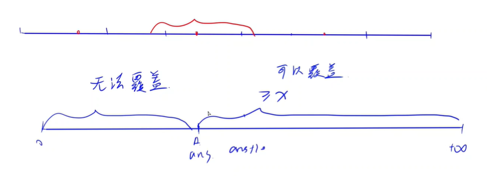

<!-- @import "[TOC]" {cmd="toc" depthFrom=1 depthTo=6 orderedList=false} -->

<!-- code_chunk_output -->

- [最小的商](#最小的商)
- [方格集数量](#方格集数量)
- [无线网络（二分+双指针）](#无线网络二分双指针)

<!-- /code_chunk_output -->

没参加。

### 最小的商

给定一个长度为 $n$ 的整数数组 $a_1,a_2,...,a_n$ 以及一个整数 $k$。

请你找到一个数组元素 $a_i$，要求：

- $k$ 是 $a_i$ 的倍数。
- $k$ 除以 $a_i$ 的商尽可能小。

<p>输出这个最小的商。</p>

<h4>输入格式</h4>

第一行包含整数 $T$，表示共有 $T$ 组测试数据。

每组数据第一行包含两个整数 $n,k$。

第二行包含 $n$ 个整数 $a_1,a_2,...,a_n$。

<h4>输出格式</h4>

<p>每组数据输出一行结果，一个整数，表示最小的商。</p>

<p>保证每组数据一定有解。</p>

<h4>数据范围</h4>

- 前三个测试点满足，$1 \le n,k \le 10$。
- 所有测试点满足，$1 \le T \le 10$，$1 \le n,k \le 100$，$1 \le a_i \le 100$。

<h4>输入样例：</h4>

<pre><code>
2
3 6
2 3 5
6 7
1 2 3 4 5 6
</code></pre>

<h4>输出样例：</h4>

<pre><code>
2
7
</code></pre>

```cpp
#include <iostream>
#include <cstring>
#include <algorithm>
using namespace std;

const int N = 110;
int n, k;
int a[N];

int main()
{
    int T;
    cin >> T;
    while (T -- )
    {
        cin >> n >> k;
        for (int i = 0; i < n; i ++ ) cin >> a[i];
        sort(a, a + n);
        for (int i = n - 1; i >= 0; i -- )
            if (k % a[i] == 0)
            {
                cout << k / a[i] << endl;
                break;
            }
    }
}
```

### 方格集数量

给定一个 $n \times m$ 的方格矩阵。

<p>每个方格要么是黑色，要么是白色。</p>

<p>请你计算，共有多少个非空方格集合满足：</p>

- 集合内的所有方格颜色都相同。
- 集合内的任意两个方格都在同一行或同一列上。

<h4>输入格式</h4>

第一行包含两个整数 $n,m$。

接下来 $n$ 行，每行包含 $m$ 个整数，每个整数要么是 $0$，要么是 $1$，用来表示矩阵中每个方格的颜色，$0$ 表示颜色为白，$1$ 表示颜色为黑。

<h4>输出格式</h4>

<p>一个整数，表示满足条件的非空方格集合数量。</p>

<h4>数据范围</h4>

- 前四个测试点满足 $1 \le n,m \le 10$,
- 所有测试点满足 $1 \le n,m \le 50$。

<h4>输入样例1：</h4>

<pre><code>
1 1
0
</code></pre>

<h4>输出样例1：</h4>

<pre><code>
1
</code></pre>

<h4>输入样例2：</h4>

<pre><code>
2 3
1 0 1
0 1 0
</code></pre>

<h4>输出样例2：</h4>

<pre><code>
8
</code></pre>

```cpp
#include <iostream>
#include <cstring>
#include <algorithm>

using namespace std;

typedef long long LL;

const int N = 55;

int n, m;
int row[N], col[N];

int main()
{
    cin >> n >> m;
    for (int i = 0; i < n; i ++ )
        for (int j = 0; j < m; j ++ )
        {
            int c;
            cin >> c;
            if (c)
            {
                row[i] ++ ;
                col[j] ++ ;
            }
        }

    LL res = 0;
    for (int i = 0; i < n; i ++ )
    {
        res += (1ll << row[i]) - 1;  // 1 这个颜色选或者不选，不包括全不选的情况
        res += (1ll << m - row[i]) - 1;  // 0 这个颜色选或者不选，不包括全不选的情况
    }

    for (int i = 0; i < m; i ++ )
    {
        res += (1ll << col[i]) - 1;
        res += (1ll << n - col[i]) - 1;
    }

    cout << res - n * m << endl;  // 只选某一个格子的情况，会在行和列里选两次，因此要减去

    return 0;
}
```

### 无线网络（二分+双指针）

农夫约翰的 $n$ 头奶牛站在从牛棚到牧场的直线路径上，直线路径可看作一维数轴。

因为他的奶牛喜欢保持电子邮件联系，所以约翰在这条直线路径上安装了 $m$ 个 wifi 基站，以便所有的奶牛都被无线网络覆盖。

<p>所有基站都以相同功率工作。</p>

功率为 $r$ 的基站，如果其所在位置为 $x$，则它可以将数据传输到 $[x−r,x+r]$ 范围内的任何奶牛处。

如果基站的功率为 $0$，则只会覆盖与其位于同一位置的奶牛。

<p>请你确定，在满足所有奶牛都被无线网络覆盖的前提下，基站的最小运行功率。</p>

<h4>输入格式</h4>

第一行包含两个整数 $n,m$，表示奶牛的数量和基站的数量。

第二行包含 $n$ 个整数 $a_1,a_2,...,a_n$，表示每个奶牛的位置坐标。不同奶牛的坐标位置可能相同。所有奶牛的坐标 $a_i$ 是按非严格单调递增顺序给出的。

第三行包含 $m$ 个整数 $b_1,b_2,...,b_m$，表示每个基站的位置坐标，不同基站的坐标位置可能相同。所有基站的坐标 $b_i$ 是按非严格单调递增顺序给出的。

<h4>输出格式</h4>

<p>一个数，表示在满足所有奶牛都被无线网络覆盖的前提下，基站的最小运行功率。答案四舍五入到整数。</p>

<h4>数据范围</h4>

前六个测试点满足，$1 \le n,m \le 10$。

所有测试点满足，$1 \le n,m \le 10^5$，$-10^9 \le a_i,b_i \le 10^9$。

<h4>输入样例1：</h4>

<pre><code>
3 2
-2 2 4
-3 0
</code></pre>

<h4>输出样例1：</h4>

<pre><code>
4
</code></pre>

<h4>输入样例2：</h4>

<pre><code>
5 3
1 5 10 14 17
4 11 15
</code></pre>

<h4>输出样例2：</h4>

<pre><code>
3
</code></pre>

具有二段性，使用二分。



如上是二段性的解释：我们的答案满足，其左边和右边满足不同性质。

问什么什么最小，可以首先想到二分来做。本题二段性在于：
- 左边不可以覆盖所有站点
- 右边可以覆盖所有站点

如何快速判断半径能不能覆盖所有站点？用双指针。对于站点 $x_i$ ，找到左边最靠近自己的基站 $y_j$ 。

```cpp
#include <iostream>
#include <cstring>
#include <algorithm>

using namespace std;

typedef long long LL;

const int N = 100010;

int n, m;
int a[N], b[N];

bool check(int r)
{
    for (int i = 0, j = 0; i < n; i ++ )
    {
        while (j + 1 < m && b[j + 1] <= a[i]) j ++ ;  // 找到左边最近的基站
        if (abs(a[i] - b[j]) > r)  // 左边的基站没覆盖到自己
        {
            if (j + 1 >= m || abs(a[i] - b[j + 1]) > r)  // 且右边的基站没覆盖到自己
                return false;
        }
    }

    return true;
}

int main()
{
    scanf("%d%d", &n, &m);

    for (int i = 0; i < n; i ++ ) scanf("%d", &a[i]);
    for (int i = 0; i < m; i ++ ) scanf("%d", &b[i]);

    int l = 0, r = 2e9;
    while (l < r)
    {
        int mid = (LL)l + r >> 1;  // 经验：小心二分求 mid 时爆 int
        if (check(mid)) r = mid;
        else l = mid + 1;
    }

    printf("%d\n", r);

    return 0;
}
```

其实是道简单题，可以找各个站点最近的基站`dist[i]`，然后 `max(dist)` ，参考[抽风大佬](https://www.acwing.com/activity/content/code/content/1795532/)：
```cpp
#include <stdio.h>
#include <string.h>

const int N = 100005;

int n, m, res;
int a[N], b[N];

int max(const int a, const int b) {
    return a > b ? a : b;
}
int min(const int a, const int b) {
    return a < b ? a : b;
}

int main() {
    scanf("%d%d", &n, &m);
    for (int i = 1; i <= n; ++i) scanf("%d", a + i);
    for (int i = 1; i <= m; ++i) scanf("%d", b + i);
    for (int i = 1, j = 1; i <= n; ++i) {
        while (j <= m && b[j] <= a[i]) ++j;
        if (j == m + 1) {
            res = max(res, a[i] - b[j - 1]);
        } else if (j == 1) {
            res = max(res, b[j] - a[i]);
        } else {
            res = max(res, min(a[i] - b[j - 1], b[j] - a[i]));
        }
    }
    printf("%d\n", res);
    return 0;
}
```
