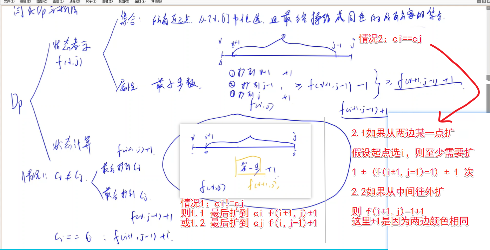

<!-- @import "[TOC]" {cmd="toc" depthFrom=1 depthTo=6 orderedList=false} -->

<!-- code_chunk_output -->

- [水果派（上取整）](#水果派上取整)
- [最小的和（多路归并）](#最小的和多路归并)
- [涂色](#涂色)

<!-- /code_chunk_output -->

没参加。

### 水果派（上取整）
https://www.acwing.com/problem/content/3997/

$$\lceil \frac{a}{c} \rceil = \lfloor \frac{a + c - 1}{c} \rfloor$$

### 最小的和（多路归并）

给定两个长度为 $n$ 的整数序列 $a_1,a_2,...,a_n$ 和 $b_1,b_2,...,b_n$。

现在要对序列 $a$ 进行<strong>恰好</strong> $k_1$ 次操作，对序列 $b$ 进行<strong>恰好</strong> $k_2$ 次操作。

每次操作具体流程为选取序列中的一个元素，并将其加 $1$ 或减 $1$。

要求所有操作进行完毕以后，$\sum\limits_{i=1}^n(a_i-b_i)^2$ 尽可能小。

<h4>输入格式</h4>

第一行包含三个整数 $n,k_1,k_2$。

第二行包含 $n$ 个整数 $a_1,a_2,...,a_n$。

第三行包含 $n$ 个整数 $b_1,b_2,...,b_n$。

<h4>输出格式</h4>

一个整数，表示所有操作进行完毕以后，$\sum\limits_{i=1}^n(a_i-b_i)^2$ 的最小可能值。

<h4>数据范围</h4>

- 前六个测试点满足，$1 \le n \le 5$。
- 所有测试点满足，$1 \le n \le 10^3$，$0 \le k_1+k_2 \le 10^3$，$k_1$ 和 $k_2$ 都是非负整数，$-10^6 \le a_i,b_i \le 10^6$。

<h4>输入样例1：</h4>

```
2 0 0
1 2
2 3
```

<h4>输出样例1：</h4>

```
2
```

<h4>输入样例2：</h4>

```
2 1 0
1 2
2 2
```

<h4>输出样例2：</h4>

```
0
```

<h4>输入样例3：</h4>

```
2 5 7
3 4
14 4
```

<h4>输出样例3：</h4>

```
1
```

```cpp
/*
ai 和 bi 一一对应，因此对 ai 操作(+1/-1)等价于对 bi 操作(-1/+1)
因此构造数组 di = abs(ai - bi) ，对这个数组操作 k = k1 + k2 次就好
操作谁呢？
注意到，对于 x > 0 ，x 初值 x0
将 x = x0 - 1 ，则其平方变化为 x0^2 - (x0-1)^2 = 2 * x0 - 1
再将 x 减 1 ，则平方和减少 2 * (x0 - 1) - 1

减i次获得的收益
d0 2d0 - 1  2(d0-1)-1 2(d0-2)-1
d1 2d1 - 1  2(d1-1)-1 2(d1-2)-1
d2 2d2 - 1  2(d2-1)-1 2(d2-2)-1
d3 2d3 - 1  2(d3-1)-1 2(d3-2)-1
...

如果所有 di 都被减为 0 了
看看 k 还剩多少，如果还剩奇数个，则最后答案为 1 ，否则为 0
*/

#include <iostream>
#include <cstring>
#include <algorithm>

using namespace std;

typedef long long LL;

const int N = 1010;

int n, m, k1, k2;
int a[N], b[N], d[N];

int main()
{
    cin >> n >> k1 >> k2;
    m = k1 + k2;

    for (int i = 0; i < n; i ++ ) cin >> a[i];
    for (int i = 0; i < n; i ++ ) cin >> b[i];
    for (int i = 0; i < n; i ++ ) d[i] = abs(a[i] - b[i]);

    LL res = 0;
    for (int i = 0; i < m; i ++ )
    {
        int t = 0;
        for (int j = 0; j < n; j ++ )  // 数据量少
            if (d[j] > d[t])           // 找最大的数，不用优先队列
                t = j;

        if (!d[t])
        {
            res = (m - i) % 2;
            break;
        }

        d[t] -- ;
    }

    for (int i = 0; i < n; i ++ ) res += (LL)d[i] * d[i];
    cout << res << endl;

    return 0;
}
```

### 涂色

有 $n$ 个砖块排成一排，从左到右编号为 $1 \sim n$。

其中，第 $i$ 个砖块的初始颜色为 $c_i$。

我们规定，如果编号范围 $[i,j]$ 内的所有砖块的颜色都相同，则砖块 $i$ 和 $j$ 属于同一个连通块。

例如，$[3,3,3]$ 有 $1$ 个连通块，$[5,2,4,4]$ 有 $3$ 个连通块。

现在，要对砖块进行涂色操作。

开始操作前，你需要任选一个砖块作为<strong>起始砖块</strong>。

每次操作：

<ol>
<li>任选一种颜色。</li>
<li>将<strong>起始砖块</strong>所在连通块中包含的所有砖块都涂为选定颜色，</li>
</ol>
请问，至少需要多少次操作，才能使所有砖块都具有同一种颜色。

<h4>输入格式</h4>

第一行包含整数 $n$。

第二行包含 $n$ 个整数 $c_1,c_2,...,c_n$。

<h4>输出格式</h4>

一个整数，表示所需要的最少操作次数。

<h4>数据范围</h4>

- 前六个测试点满足，$1 \le n \le 20$。
- 所有测试点满足，$1 \le n \le 5000$，$1 \le c_i \le 5000$。

<h4>输入样例1：</h4>

```
4
5 2 2 1
```

<h4>输出样例1：</h4>

```
2
```

<h4>输入样例2：</h4>

```
8
4 5 2 2 1 3 5 5
```

<h4>输出样例2：</h4>

```
4
```

<h4>输入样例3：</h4>

```
1
4
```

<h4>输出样例3：</h4>

```
0
```

**注意：**
- 选择一个起点后，不能变起点了
- 在下图的讲解中，把每个已有连通块视为一个点



```cpp
#include <iostream>
#include <cstring>
#include <algorithm>

using namespace std;

const int N = 5010;

int n;
int c[N], f[N][N];

int main()
{
    scanf("%d", &n);
    for (int i = 0; i < n; i ++ )
    {
        scanf("%d", &c[i]);
        if (i && c[i] == c[i - 1])  // 这里删除多余点，一个连通块视为一个点，方法很妙
        {
            i -- ;
            n -- ;
        }
    }

    // 经典的区间 DP
    for (int len = 2; len <= n; len ++ )
        for (int l = 0; l + len - 1 < n; l ++ )
        {
            int r = l + len - 1;
            if (c[l] != c[r]) f[l][r] = min(f[l + 1][r], f[l][r - 1]) + 1;
            else f[l][r] = f[l + 1][r - 1] + 1;
        }

    printf("%d\n", f[0][n - 1]);
    return 0;
}
```
