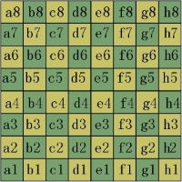

<!-- @import "[TOC]" {cmd="toc" depthFrom=1 depthTo=6 orderedList=false} -->

<!-- code_chunk_output -->

- [异或](#异或)
- [国际象棋](#国际象棋)
- [习题册（数据结构：堆+延迟删除）](#习题册数据结构堆延迟删除)

<!-- /code_chunk_output -->

没参加。

### 异或

给定一个包含 $n$ 个整数的数组。

请你计算，其中最大的元素与最后一项元素的异或结果。

<h4>输入格式</h4>

第一行包含整数 $n$。

第二行包含 $n$ 个整数 $a_1,a_2,...,a_n$。

<h4>输出格式</h4>

一个整数，表示结果。

<h4>数据范围</h4>

所有测试点满足 $1 \le n \le 10$，$1 \le a_i \le 11$。

<h4>输入样例：</h4>

```
4
2 5 3 1
```

<h4>输出样例：</h4>

```
4
```

```cpp
#include <iostream>
using namespace std;

const int N = 11;
int a[N];

int
main()
{
    int n;
    int maxv = -1;
    cin >> n;
    for (int i = 0; i < n; ++ i)
    {
        cin >> a[i];
        if (a[i] > maxv) maxv = a[i];
    }
    
    cout << (maxv ^ a[n - 1]);
}
```

### 国际象棋

在一个 $8 \times 8$ 的国际象棋棋盘上放置着一个车和一个马。

保证这两个棋子之间不能攻击到对方。

现在，要在棋盘的<strong>空格</strong>上放置另一个马，要求放置完毕后，三个棋子两两之间不得攻击到对方。

请问，共有多少种放置方法。

关于国际象棋行棋规则：

- 车：横、竖均可以走，步数不受限制，不能斜走。
- 马：每步棋先横走或竖走一格，然后再往外斜走一格；或者先斜走一格，最后再往外横走或竖走一格（即走“日”字）。可以越子，没有中国象棋中的“蹩马腿”限制。

关于棋盘：$8$ 行从上到下依次编号为 $1 \sim 8$，$8$ 列从左到右依次编号为 $a \sim h$，其中的具体方格可用字母加数字来描述，如下图所示。



<h4>输入格式</h4>

第一行包含一个小写字母（$a \sim h$）和一个数字（$1 \sim 8$），表示车的位置。

第二行包含一个小写字母（$a \sim h$）和一个数字（$1 \sim 8$），表示马的位置。

<h4>输出格式</h4>

一个整数，表示第二个马的放置方法数量。

<h4>数据范围</h4>

所有测试点满足，输入车和马不在同一位置，且不会攻击到对方。

<h4>输入样例1：</h4>

```
a1
b2
```

<h4>输出样例1：</h4>

```
44
```

<h4>输入样例2：</h4>

```
a8
d4
```

<h4>输出样例2：</h4>

```
38
```

```cpp
// 把车和马可达区域置否
// 把车和马的马字型区域置否
#include <iostream>
#include <cstring>
#include <algorithm>

using namespace std;

bool check(int a, int b, int c, int d)
{
    int x = abs(a - c), y = abs(b - d);
    return x == 1 && y == 2 || x == 2 && y == 1;
}

int main()
{
    char s1[3], s2[3];
    int a, b, c, d;
    cin >> s1 >> s2;
    a = s1[0] - 'a', b = s1[1] - '1';
    c = s2[0] - 'a', d = s2[1] - '1';

    int res = 0;
    for (int i = 0; i < 8; i ++ )
        for (int j = 0; j < 8; j ++ )
        {
            if (i == a && j == b || i == c && j == d) continue;  // 格子重复
            if (i == a || j == b) continue;  // 车攻击范围
            if (check(i, j, a, b) || check(i, j, c, d)) continue;  // 马与车 马与马
            res ++ ;
        }

    cout << res << endl;
    return 0;
}
```

### 习题册（数据结构：堆+延迟删除）

某书店出售 $n$ 套习题册。

每套习题册可以用三个整数 $p_i,a_i,b_i$ 来描述，表示该习题册的价格为 $p_i$，前半部分内容考察知识点 $a_i$，后半部分内容考察知识点 $b_i$。

已知，所有 $p_i$ 各不相同，$a_i$ 和 $b_i$ 都是 $1 \sim 3$ 的整数，且 $a_i$ 和 $b_i$ 可能相等。

有 $m$ 个学生前来购买习题册。

这 $m$ 个学生是一个接着一个来的，前一个学生走后，后一个学生才会到店。

每个学生都只想买 $1$ 套习题册。

第 $i$ 个学生希望重点练习知识点 $c_i$，所以在轮到第 $i$ 个学生进行选购时，他只会挑选包含知识点 $c_i$ 的习题册进行购买，如果这样的习题册不止一本，他就会挑选最便宜的那个购买，如果这样的习题册一本都没有，他就会放弃购买，直接走人。

请你计算，每个学生购买习题册花了多少钱。

<h4>输入格式</h4>

第一行包含整数 $n$。

第二行包含 $n$ 个整数 $p_1,p_2,...,p_n$。

第三行包含 $n$ 个整数 $a_1,a_2,...,a_n$。

第四行包含 $n$ 个整数 $b_1,b_2,...,b_n$。

第五行包含整数 $m$。

第六行包含 $m$ 个整数 $c_1,c_2,...,c_m$。

<h4>输出格式</h4>

共一行，输出 $m$ 个整数，第 $i$ 个整数表示第 $i$ 个学生购买习题册的花费，如果该学生什么也没买，则输出 $-1$。

<h4>数据范围</h4>

- 前三个测试点满足，$1 \le n,m \le 10$。
- 所有测试点满足，$1 \le n,m \le 2 \times 10^5$，$1 \le a_i,b_i,c_i \le 3$，$1 \le p_i \le 10^9$。

<h4>输入样例1：</h4>

```
5
300 200 400 500 911
1 2 1 2 3
2 1 3 2 1
6
2 3 1 2 1 1
```

<h4>输出样例1：</h4>

```
200 400 300 500 911 -1
```

<h4>输入样例2：</h4>

```
2
1000000000 1
1 1
1 2
2
2 1
```

<h4>输出样例2：</h4>

```
1 1000000000
```

```cpp
// 建立三个堆对应三个知识点 ci
// 用掉一本练习册需要在两个堆执行删除
// 一个是堆顶，另一个不是堆顶，因此要懒删除

#include <iostream>
#include <cstring>
#include <algorithm>
#include <queue>

#define x first
#define y second

using namespace std;

typedef pair<int, int> PII;

const int N = 200010;

int n, m;
int p[N];
priority_queue<PII, vector<PII>, greater<PII>> h[3];  // 小顶堆
bool st[N];

int main()
{
    scanf("%d", &n);
    for (int i = 0; i < n; i ++ ) scanf("%d", &p[i]);

    for (int j = 0; j < 2; j ++ )
        for (int i = 0; i < n; i ++ )
        {
            int a;
            scanf("%d", &a);
            h[a - 1].push({p[i], i});
        }

    scanf("%d", &m);
    while (m -- )
    {
        int c;
        scanf("%d", &c);
        c -- ;  // 编号从 1 开始

        // 练习册已经被买走，执行懒删除
        while (h[c].size() && st[h[c].top().y]) h[c].pop();
        if (h[c].empty()) printf("-1 ");
        else
        {
            auto t = h[c].top();
            h[c].pop();
            printf("%d ", t.x);
            st[t.y] = true;
        }
    }

    return 0;
}
```
