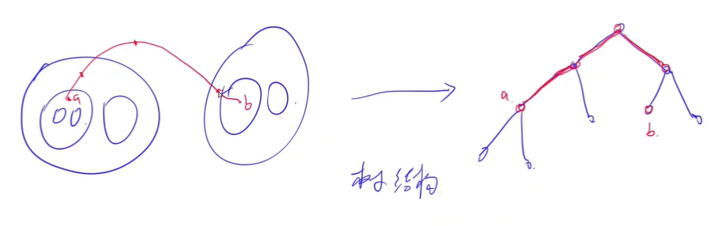

<!-- @import "[TOC]" {cmd="toc" depthFrom=1 depthTo=6 orderedList=false} -->

<!-- code_chunk_output -->

- [4202. 穿过圆（转换为树/树的最近公共祖先/倍增求LCA/）](#4202-穿过圆转换为树树的最近公共祖先倍增求lca)

<!-- /code_chunk_output -->

没参加。

### 4202. 穿过圆（转换为树/树的最近公共祖先/倍增求LCA/）

在一个二维平面上有 $n$ 个点和 $m$ 个圆。

点的编号为 $1 \sim n$。

不存在某个点恰好在某个圆的边上的情况。

任意两个圆之间没有公共点。

现在，请你回答 $k$ 个询问。

每个询问给定两个点 $a_i,b_i$，并请你回答从点 $a_i$ 出发沿任意连续路径到达点 $b_i$，至少需要穿过多少个圆。

<h4>输入格式</h4>

第一行包含三个整数 $n,m,k$。

接下来 $n$ 行，其中第 $i$ 行包含两个整数 $x_i,y_i$，表示点 $i$ 的坐标为 $(x_i,y_i)$。注意，点的位置可以重合。

再接下来 $m$ 行，其中第 $i$ 行包含三个整数 $r_i,c_{x_i},c_{y_i}$，表示第 $i$ 个圆的半径为 $r_i$，圆心坐标为 $(c_{x_i},c_{y_i})$。

最后 $k$ 行，每行包含两个整数 $a_i,b_i$，表示一个询问。注意，$a_i$ 可以等于 $b_i$。

<h4>输出格式</h4>

共 $k$ 行，第 $i$ 行输出第 $i$ 个询问的答案，即最少需要穿过的圆的数量。

<h4>数据范围</h4>

- 前三个测试点满足 $1 \le n,m,k \le 10$。
- 所有测试点满足 $1 \le n,m \le 1000$，$1 \le k \le 10^5$，$-10^9 \le x_i,y_i,c_{x_i},c_{y_i} \le 10^9$，$1 \le r_i \le 10^9$，$1 \le a_i,b_i \le n$。

<h4>输入样例1：</h4>

```
2 1 1
0 0
3 3
2 0 0
1 2
```

<h4>输出样例1：</h4>

```
1
```

<h4>输入样例2：</h4>

```
2 3 1
0 0
4 4
1 0 0
2 0 0
3 0 0
1 2
```

<h4>输出样例2：</h4>

```
3
```

由于圆之间不存在交叉关系，因此可以将本题中的圆用一棵树描述。



**思路一：最近公共祖先/倍增求LCA $O(n^2 + k \log n)$**

预处理任何一点到根节点的距离 `d[i]` ，则 `a` 与 `b` 两点间距离是： `d[a] + d[b] - 2 * d[p]` ，其中 `p` 是 `a` 与 `b` 最近公共祖先。

```cpp

```

上述方法比较通用，可以处理 $10^5$ 个点的情况。

本题的点有 $10^3$ 个，本题可以用压位。

**思路二：bitset $O(n^2 + \frac{nk}{32})$**

假设有且仅有 `cnt` 个圆，这些圆的性质为：
- 点 `a` 在这些圆外时，点 `b` 一定在这些圆内
- 点 `b` 在这些圆内时，点 `a` 一定在这些圆外

因此本题答案就是 `cnt` 。

```cpp

```
