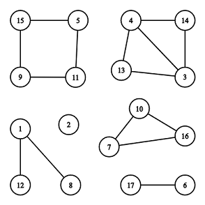

<!-- @import "[TOC]" {cmd="toc" depthFrom=1 depthTo=6 orderedList=false} -->

<!-- code_chunk_output -->

- [4492. 减法操作（数学试除法+发现规律）](#4492-减法操作数学试除法发现规律)
- [4493. 环形连通分量（无向图为环所有点度数为2）](#4493-环形连通分量无向图为环所有点度数为2)

<!-- /code_chunk_output -->

没参加， T2 正好第一眼看上去没啥思路。

### 4492. 减法操作（数学试除法+发现规律）

给定一个整数 $n$，执行如下算法：

<ol>
<li>如果 $n=0$，则结束算法。</li>
<li>找到 $n$ 的最小质因子 $d$。</li>
<li>令 $n$ 减去 $d$ 并跳转步骤 $1$。</li>
</ol>
请你计算，在算法执行的过程中，一共进行了多少次减法操作。

<h4>输入格式</h4>

一个整数 $n$。

<h4>输出格式</h4>

一个整数，表示减法操作的次数。

<h4>数据范围</h4>

- 前三个测试点满足 $2 \le n \le 5$。
- 所有测试点满足 $2 \le n \le 10^{10}$。

<h4>输入样例1：</h4>

```
5
```

<h4>输出样例1：</h4>

```
1
```

<h4>输入样例2：</h4>

```
4
```

<h4>输出样例2：</h4>

```
2
```

```cpp
// 如果 n 是偶数，则需要计算 n/2 次
// 因此分类讨论
// n 是偶数则最小质因子一定是 2
// 否则最小质因子一定是奇数，则找到并减去将 n 变成偶数
#include <iostream>
#include <cstring>
#include <algorithm>

using namespace std;

typedef long long LL;

int main()
{
    LL n;
    cin >> n;

    LL res = 0;
    if (n % 2)
    {
        for (int i = 2; i <= n / i; i ++ )
            if (n % i == 0)
            {
                n -= i;
                res ++ ;
                break;
            }

        if (n % 2) res ++, n = 0;
    }

    res += n / 2;
    cout << res << endl;

    return 0;
}
```

### 4493. 环形连通分量（无向图为环所有点度数为2）

给定一个 $n$ 个点 $m$ 条边组成的无重边无自环的无向图。

请你计算，其包含的所有<a href="https://baike.baidu.com/item/%E8%BF%9E%E9%80%9A%E5%88%86%E9%87%8F/290350?fr=aladdin">连通分量</a>中，有多少个是环形的。

我们认为一个连通分量是环形的，当且仅当它的所有顶点重新排序后，可以满足：

- 第一个顶点通过一条边与第二个顶点相连。
- 第二个顶点通过一条边与第三个顶点相连。
- ...
- 最后一个顶点通过一条边与第一个顶点相连。
- 所有上述提到的边各不相同。
- 连通分量中不包含除上述边以外的任何其他边。

根据定义，任何环形连通分量都至少包含三个顶点。

下面给出一个无向图示例。



上面的无向图，一共包含 $6$ 个连通分量，其中有 $2$ 个连通分量是环形的：$[7,10,16]$ 和 $[5,11,9,15]$。

<h4>输入格式</h4>

第一行包含两个整数 $n,m$。

接下来 $m$ 行，每行包含两个整数 $u_i,v_i$，表示点 $u_i$ 和点 $v_i$ 之间存在一条无向边。

保证输入不存在重边和自环。

<h4>输出格式</h4>

一个整数，表示环形连通分量的数量。

<h4>数据范围</h4>

- 前五个测试点满足 $1 \le n \le 20$，$0 \le m \le 20$。
- 所有测试点满足 $1 \le n \le 2 \times 10^5$，$0 \le m \le 2 \times 10^5$，$1 \le u_i,v_i \le n$，$u_i \neq v_i$。

<h4>输入样例1：</h4>

```
5 4
1 2
3 4
5 4
3 5
```

<h4>输出样例1：</h4>

```
1
```

<h4>输入样例2：</h4>

```
17 15
1 8
1 12
5 11
11 9
9 15
15 5
4 13
3 13
4 3
10 16
7 10
16 7
14 3
14 4
17 6
```

<h4>输出样例2：</h4>

```
2
```

```cpp
// 无向图连通块所有点的度数必然为 2
#include <iostream>
#include <cstring>
#include <algorithm>

using namespace std;

const int N = 200010;

int n, m;
int p[N], d[N];
bool st[N];

int find(int x)
{
    if (p[x] != x) p[x] = find(p[x]);
    return p[x];
}

int main()
{
    scanf("%d%d", &n, &m);
    for (int i = 1; i <= n; i ++ ) p[i] = i;

    while (m -- )
    {
        int a, b;
        scanf("%d%d", &a, &b);
        p[find(a)] = find(b);
        d[a] ++, d[b] ++ ;
    }

    // 判断该连通块是否所有点度是否都为 2
    for (int i = 1; i <= n; i ++ )
        if (d[i] != 2)
            st[find(i)] = true;

    int res = 0;
    for (int i = 1; i <= n; i ++ )
        if (p[i] == i && !st[i])
            res ++ ;

    printf("%d\n", res);
    return 0;
}
```
