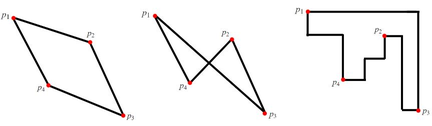

<!-- @import "[TOC]" {cmd="toc" depthFrom=1 depthTo=6 orderedList=false} -->

<!-- code_chunk_output -->

- [4605. 最大周长（几何）](#4605-最大周长几何)

<!-- /code_chunk_output -->

### 4605. 最大周长（几何）

给定二维平面上的 $n$ 个不共线的点，这 $n$ 个点组成的多边形是<a href="https://baike.baidu.com/item/%E5%87%B8%E5%A4%9A%E8%BE%B9%E5%BD%A2/6608474?fr=kg_general">凸多边形</a> 。

这些点按顺时针顺序依次编号为 $1 \sim n$。

我们将两点 $p_1(x_1,y_1)$ 和 $p_2(x_2,y_2)$ 之间的距离定义为它们的曼哈顿距离：$d(p_1,p_2)=|x_1-x_2|+|y_1-y_2|$。

此外，我们将多边形的周长定义为其上所有相邻点对之间的曼哈顿距离之和。

例如，$k$ 个点构成的多边形，其上的点按顺时针顺序依次为 $p_1,p_2,...,p_k$，则多边形的周长为 $d(p_1,p_2)+d(p_2,p_3)+…+d(p_k,p_1)$。

对于每个 $k$（$3 \le k \le n$），请你考虑，从给定的 $n$ 个点中任选 $k$ 个点，构成一个多边形，要求多边形不能是自相交的并且其周长要尽可能长，用 $f(k)$ 来表示周长的最大可能值。

请你计算并输出 $f(3),f(4),...,f(n)$。

注意，多边形不可以自相交，且边必须是直的，例如下图中：



位于中间的多边形无效，因为是自相交多边形；位于右边的多边形无效，因为边不是直的，只有左边的多边形是有效的。

<h4>输入格式</h4>

第一行包含整数 $n$。

接下来 $n$ 行，每行包含两个整数 $x_i,y_i$，表示其中一个点的横纵坐标。

所有点的坐标两两不同，且点是按照顺时针排列给出的。

<h4>输出格式</h4>

共一行，对于每个 $i$（$3 \le i \le n$），输出 $f(i)$。

<h4>数据范围</h4>

前 $5$ 个测试点满足 $3 \le n \le 10$。

所有测试点满足 $3 \le n \le 3 \times 10^5$，$-10^8 \le x_i,y_i \le 10^8$。

<h4>输入样例1：</h4>
<pre><code>4
2 4
4 3
3 0
1 3
</code></pre>

<h4>输出样例1：</h4>
<pre><code>12 14
</code></pre>

<h4>输入样例2：</h4>
<pre><code>3
0 0
0 2
2 0
</code></pre>

<h4>输出样例2：</h4>
<pre><code>8
</code></pre>

```cpp
#include <iostream>
#include <cstring>
#include <algorithm>

using namespace std;

const int N = 300010, INF = 1e9;

int n;
int x[N], y[N];

// 这道题欧氏距离就很难做了（NP-hard？）
// 凸多边形的“周长”是外接矩形
// 因此保留四个点就好
// 三个点怎么办呢？三角形的外接矩形中至少一个点与三角形一个顶点重合
// 这里枚举一个点作为矩形坐上右下四种情况下外接矩形最大“周长”

int main()
{
    scanf("%d", &n);
    int u = -INF, d = INF, l = INF, r = -INF;
    for (int i = 0; i < n; i ++ )
    {
        scanf("%d%d", &x[i], &y[i]);
        u = max(u, y[i]), d = min(d, y[i]);
        l = min(l, x[i]), r = max(r, x[i]);
    }

    int res = 0;
    // 实际上涵盖了四种情况
    for (int i = 0; i < n; i ++ )
        res = max(res, max(u - y[i], y[i] - d) + max(r - x[i], x[i] - l));
    printf("%d ", res * 2);
    for (int i = 4; i <= n; i ++ )
        printf("%d ", 2 * (u - d + r - l));

    return 0;
}
```
