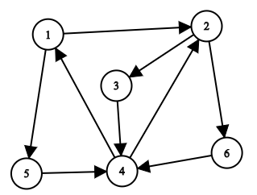

<!-- @import "[TOC]" {cmd="toc" depthFrom=1 depthTo=6 orderedList=false} -->

<!-- code_chunk_output -->

- [最小消耗](#最小消耗)
- [选取石子](#选取石子)
- [更新线路](#更新线路)

<!-- /code_chunk_output -->

### 最小消耗

有 $n$ 个怪兽等待你去消灭。

怪兽共分为两种形态，不妨用 $0$ 和 $1$ 来表示。

消灭一个 $0$ 形态的怪兽需要耗费的法力值为 $a$。

消灭一个 $1$ 形态的怪兽需要耗费的法力值为 $b$。

你还可以使用改造魔法将 $0$ 形态怪兽改造为 $1$ 形态或将 $1$ 形态怪兽改造为 $0$ 形态。

改造一个怪兽需要耗费的法力值为 $c$。

<p>请问，将怪兽全部消灭最少需要耗费多少法力值。</p>

<h4>输入格式</h4>

第一行包含整数 $T$，表示共有 $T$ 组测试数据。

每组数据第一行包含四个整数 $n,a,b,c$。

第二行包含一个长度为 $n$ 的 $01$ 字符串，其中的第 $i$ 个字符表示第 $i$ 个怪兽的初始形态。

<h4>输出格式</h4>

<p>每组数据结果占一行，输出一个整数表示最小消耗。</p>

<h4>数据范围</h4>

前三个测试点满足 $1 \le n \le 20$。<br />
全部测试点满足 $1 \le T \le 10$，$1 \le n,a,b,c \le 1000$。

<h4>输入样例：</h4>

<pre><code>
6
3 1 1 1
100
5 10 100 1
01010
5 10 1 1
11111
5 1 10 1
11111
12 2 1 10
101110110101
2 100 1 10
00
</code></pre>

<h4>输出样例：</h4>

<pre><code
3
52
5
10
16
22
</code></pre>

```cpp
#include <iostream>
#include <cstring>
#include <algorithm>
using namespace std;

const int N = 1e3 + 10;

int T, n, a, b, c;
char mons[N];

int cus0, cus1;

int main()
{
    cin >> T;
    while (T --)
    {
        cin >> n >> a >> b >> c;
        cus0 = a, cus1 = b;
        if (a + c < b)
        {
            cus0 = a;
            cus1 = a + c;
        }
        else if (b + c < a)
        {
            cus0 = b + c;
            cus1 = b;
        }
        
        cin >> mons;
        int ans = 0;
        for (int i = 0; i < n; ++ i)
        {
            if (mons[i] == '0') ans += cus0;
            else ans += cus1;
        }
        cout << ans << endl;
    }
}
```

### 选取石子

给定 $n$ 个石子，编号为 $1 \sim n$。

其中第 $i$ 个石子的价值为 $a_i$。

<p>你需要从中任意挑选若干个石子，并将挑选好的石子按照编号从小到大的顺序排成一排。</p>

选中的石子在排好序后需要满足，对于任意两个<strong>相邻</strong>的石子（不妨设它们的编号为 $x,y$），$x-y=a_x-a_y$ 均成立。

例如，当有 $n=8$ 个石子，石子价值分别为 $[3,4,4,6,6,7,8,9]$ 时，一些合理的选择方案如下：

- 选择 $1,2,4$ 号石子，它们的价值分别为 $3,4,6$。$1$ 号石子与 $2$ 号石子相邻，$2-1=4-3$ 成立。$2$ 号石子与 $4$ 号石子相邻，$4-2=6-4$ 成立。所以方案合理。
- 选择 $7$ 号石子。可以只选择一个石子，此时选取任何石子均为合理方案。

<p>你的选择方案不仅需要合理，而且还要使得选中石子的价值总和尽可能大。</p>

<p>请计算并输出价值总和的最大可能值。</p>

<h4>输入格式</h4>

第一行包含整数 $n$。

第二行包含 $n$ 个整数 $a_1,a_2,&hellip;,a_n$。

<h4>输出格式</h4>

<p>一个整数，表示选中石子的价值总和的最大可能值。</p>

<h4>数据范围</h4>

前三个测试点满足 $1 \le n \le 10$。

全部测试点满足 $1 \le n \le 2 \times 10^5$，$1 \le a_i \le 4 \times 10^5$。

<h4>输入样例1：</h4>

<pre><code>
6
10 7 1 9 10 15
</code></pre>

<h4>输出样例1：</h4>

<pre><code>
26
</code></pre>

<h4>输入样例2：</h4>

<pre><code>
1
400000
</code></pre>

<h4>输出样例2：</h4>

<pre><code>
400000
</code></pre>

<h4>输入样例3：</h4>

<pre><code>
7
8 9 26 11 12 29 14
</code></pre>

<h4>输出样例3：</h4>

<pre><code>
55
</code></pre>

我的代码是错的（TLE）：
```cpp
/*
* 第一反应：应用性质 x - y = a_x - a_y
* 差分？不行。
* 看输入样例，觉得双指针。
*/
#include <iostream>
#include <cstring>
#include <algorithm>

using namespace std;

const int N = 2e5 + 10;
int a[N];

int main()
{
    int n;
    cin >> n;
    for (int i = 0; i < n; i ++ ) scanf("%d", &a[i]);
    
    int ans = 0;
    for (int i = 0; i < n; ++ i)
    {
        int res = a[i];
        int j = i + 1;
        while (j < n)
        {
            int delta = j - i;
            if (a[j] - a[i] == delta) res += a[j];
            j ++;
        }
        ans = max(ans, res);
    }
    
    cout << ans;
}

// 卧槽等一下，感觉应该是动态规划
```

啊！我都优化到这份儿上了还是 TLE ！

让我看看大佬的思路吧！

### 更新线路

给定一个 $n$ 个点 $m$ 条边的<strong>有向强连通</strong>图。

点的编号为 $1 \sim n$，边的长度均为 $1$。

给定一条由点 $s$ 到点 $t$ 的简单路径 $p_1,p_2,...,p_k$，其中 $p_1 = s,p_k = t$。

注意，这条路经<strong>不一定</strong>是从点 $s$ 到点 $t$ 的最短路径。

现在，小明要沿着这条路径从点 $s$ 走到点 $t$。

<p>在他的行进过程中，手机上的导航软件将持续为他导航，持续为他提供最短行进线路建议。</p>

<p>当然，他并不一定会采纳这些建议，因为他一定会沿着之前给定的线路行进。</p>

<p>设想一下，在行进中，导航软件的工作过程。</p>

<p>首先，在点 $s$ 处，导航软件会找到并显示出一条从点 $s$ 到点 $t$ 的最短路径。</p>

<p>如果小明的行进线路恰好与软件推荐线路一致，则软件推荐线路将不会发生任何改变。</p>

但是，如果小明在某一点处，行进线路与软件推荐线路发生了分歧，例如，软件推荐前往点 $v$，小明却前往了点 $w$。

那么，在他到达点 $w$ 后，软件就会实时更新推荐线路，即找到并显示出一条从点 $w$ 到点 $t$ 的最短路径。

导航软件会一直工作到小明到达点 $t$ 为止，在这一过程中，软件的提供线路可能会经过若干次更新。

<p>例如，给定一个有向强连通图，如下所示：</p>



给出的简单路径为 $[1,2,3,4] (s=1, t=4)$。

那么，小明从点 $1$ 出发，导航软件找到并显示出一条从点 $1$ 到点 $4$ 的最短路径，这样的路径只有一条 $[1,5,4]$。

小明并未听从软件的建议，坚持到达了点 $2$，此时软件推荐线路实时更新，提供出一条点 $2$ 到点 $4$ 的最短路径，例如 $[2,6,4]$（注意，软件提供的最短路径也有可能是 $[2,3,4]$）。

小明还是不听软件的建议，坚持到达了点 $3$，此时软件推荐线路再次更新，提供出一条点 $3$ 到点 $4$ 的最短路径，即 $[3,4]$。

最后，小明沿软件提供路线，到达目的地点 $4$，软件完成导航。

总的来看，软件推荐线路发生了两次更新。

值得注意的是，如果软件在第一次更新推荐线路时，给出的最短路径为 $[2,3,4]$，则小明将按照推荐线路走到终点，软件将无需再次更新推荐线路。

<p>也就是说，由于软件在推荐最短路径时具有随机性，所以在整个行进过程中，软件更新推荐线路的次数并不确定。</p>

<p>现在，给定有向图和行进路线，请你求出软件更新推荐线路的最小可能次数和最大可能次数。</p>

<h4>输入格式</h4>

第一行包含两个整数 $n$ 和 $m$。

接下来 $m$ 行，每行包含两个整数 $u,v$，表示存在一条从点 $u$ 到点 $v$ 的有向边。

随后一行包含一个整数 $k$。

最后一行包含 $k$ 个整数 $p_1,p_2,...,p_k$。

<h4>输出格式</h4>

<p>一行，空格隔开的两个整数，表示软件更新推荐路线的最小可能次数和最大可能次数。</p>

<h4>数据范围</h4>

前三个测试点满足 $1 \le n \le 10$。

全部测试点满足 $2 \le n \le m \le 2 \times 10^5$，$1 \le u,v \le n$，$u \neq v$，$2 \le k \le n$，$1 \le p_i \le n$，$p_i$ 两两不同。

保证输入没有重边，但是可能同时存在端点相同方向不同的两条边，例如 $(a,b)$ 和 $(b,a)$。

<h4>输入样例1：</h4>

<pre><code>
6 9
1 5
5 4
1 2
2 3
3 4
4 1
2 6
6 4
4 2
4
1 2 3 4
</code></pre>

<h4>输出样例1：</h4>

<pre><code>
1 2
</code></pre>

<h4>输入样例2：</h4>

<pre><code>
7 7
1 2
2 3
3 4
4 5
5 6
6 7
7 1
7
1 2 3 4 5 6 7
</code></pre>

<h4>输出样例2：</h4>

<pre><code>
0 0
</code></pre>

<h4>输入样例3：</h4>

<pre><code>
8 13
8 7
8 6
7 5
7 4
6 5
6 4
5 3
5 2
4 3
4 2
3 1
2 1
1 8
5
8 7 5 2 1
</code></pre>

<h4>输出样例3：</h4>

<pre><code>
0 3
</code></pre>

```cpp
```