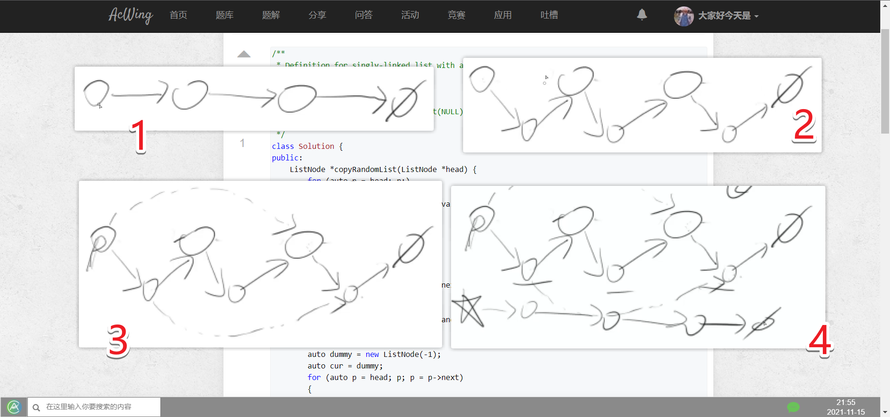

<!-- @import "[TOC]" {cmd="toc" depthFrom=1 depthTo=6 orderedList=false} -->

<!-- code_chunk_output -->

- [66. 两个链表的第一个公共结点](#66-两个链表的第一个公共结点)
- [48. 复杂链表的复刻（不用哈希表可以节省空间）](#48-复杂链表的复刻不用哈希表可以节省空间)
- [49. 二叉搜索树与双向链表](#49-二叉搜索树与双向链表)
- [35. 反转链表](#35-反转链表)
- [36. 合并两个排序的链表](#36-合并两个排序的链表)

<!-- /code_chunk_output -->

### 66. 两个链表的第一个公共结点

输入两个链表，找出它们的第一个公共结点。

当不存在公共节点时，返回空节点。

样例
```
给出两个链表如下所示：
A：        a1 → a2
                   ↘
                     c1 → c2 → c3
                   ↗            
B:     b1 → b2 → b3

输出第一个公共节点c1
```


参考[邓泽军](https://www.acwing.com/solution/content/1773/)：
- 如果有公共结点肯定是在后面重叠，且后面部分都是共同的。
- 方法1：先计算出两个链表的长度，可以让比较长的先走两个链表长度之差的步数，两个再一起走。
- 方法2：不同部分为`a`， 和`b`，公共部分为`c`；`a + c + b = b + c + a`；让两个一起走，a走到头就转向`b`，`b`走到头转向`a`，则在公共部分相遇。

```cpp
/**
 * Definition for singly-linked list.
 * struct ListNode {
 *     int val;
 *     ListNode *next;
 *     ListNode(int x) : val(x), next(NULL) {}
 * };
 */
class Solution {
public:
    ListNode *findFirstCommonNode(ListNode *headA, ListNode *headB) {
        auto p1 = headA, p2 = headB;
        while (p1 != p2)
        {
            if (p1) p1 = p1->next;
            else p1 = headB;
            if (p2) p2 = p2->next;
            else p2 = headA;
        }
        return p1;
    }
};
```

### 48. 复杂链表的复刻（不用哈希表可以节省空间）

请实现一个函数可以复制一个复杂链表。

在复杂链表中，每个结点除了有一个指针指向下一个结点外，还有一个额外的指针指向链表中的任意结点或者`null`。

注意：
- 函数结束后原链表要与输入时保持一致。

**方法一：不用哈希表，好处是节省哈希表所占空间**



如上，我们先把原链表改变，在每个结点后插入一个相同的结点。

然后对于 `random` 指针，每个`原节点->新节点`对中，`新节点->random = 原节点->random->next`即可。

最后我们进行整理，把原结点复原，新节点形成自己的链。

```cpp
/**
 * Definition for singly-linked list with a random pointer.
 * struct ListNode {
 *     int val;
 *     ListNode *next, *random;
 *     ListNode(int x) : val(x), next(NULL), random(NULL) {}
 * };
 */
class Solution {
public:
    ListNode *copyRandomList(ListNode *head) {
        for (auto p = head; p; )
        {
            ListNode *np = new ListNode(p->val);
            auto next = p->next;
            p->next = np;
            np->next = next;
            p = next;
        }
        
        for (auto p = head; p; p = p->next)
        {
            if (p->random)
                p->next->random = p->random->next;
            p = p->next;
        }
        
        auto dummy = new ListNode(-1);
        auto cur = dummy;
        for (auto p = head; p; p = p->next)
        {
            cur->next = p->next;
            cur = cur->next;  // 建立（剥离出）新链表
            p->next = p->next->next;  // 恢复原链表
        }
        return dummy->next;
    }
};
```

**方法二：用哈希表更直观方便**

`hash[源链表节点] = 新链表节点`，遍历源链表，判断每个节点和`random`节点是否在`hash`表中，如果不存在则创建。

```cpp
/**
 * Definition for singly-linked list with a random pointer.
 * struct ListNode {
 *     int val;
 *     ListNode *next, *random;
 *     ListNode(int x) : val(x), next(NULL), random(NULL) {}
 * };
 */
class Solution {
public:
    ListNode *copyRandomList(ListNode *head) {
        unordered_map<ListNode*, ListNode*> hash;
        hash[NULL] = NULL;
        ListNode *dummy = new ListNode(-1);
        auto cur = dummy;
        
        while (head)
        {
            if (!hash.count(head)) hash[head] = new ListNode(head->val);
            if (!hash.count(head->random)) hash[head->random] = new ListNode(head->random->val);
            
            cur->next = hash[head];
            cur->next->random = hash[head->random];
            
            cur = cur->next;
            head = head->next;
        }
        return dummy->next;
    }
};
```

**经验：**
- 建立新链表，为了保证循环操作的一般性，一般用哑节点 `dummy` 作为头节点开始，则新链表的真正头节点即为 `dummy->next`

### 49. 二叉搜索树与双向链表

输入一棵二叉搜索树，将该二叉搜索树转换成一个排序的双向链表。

要求不能创建任何新的结点，只能调整树中结点指针的指向。

注意：
- 需要返回双向链表最左侧的节点。

例如，输入下图中左边的二叉搜索树，则输出右边的排序双向链表。


```cpp
```

### 35. 反转链表

定义一个函数，输入一个链表的头结点，反转该链表并输出反转后链表的头结点。

思考题：
- 请同时实现迭代版本和递归版本。

样例
```
输入:1->2->3->4->5->NULL

输出:5->4->3->2->1->NULL
```

```cpp

```

### 36. 合并两个排序的链表

输入两个递增排序的链表，合并这两个链表并使新链表中的结点仍然是按照递增排序的。

样例
```
输入：1->3->5 , 2->4->5

输出：1->2->3->4->5->5
```

```cpp

```
