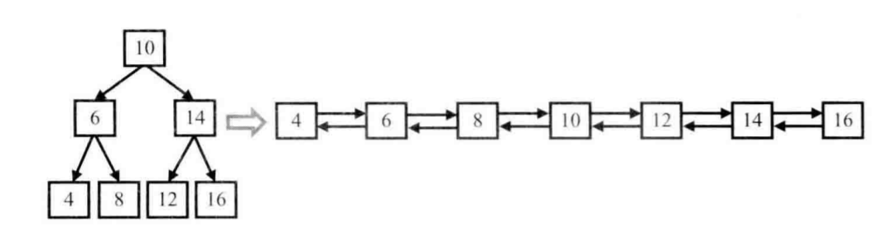

<!-- @import "[TOC]" {cmd="toc" depthFrom=1 depthTo=6 orderedList=false} -->

<!-- code_chunk_output -->

- [66. 两个链表的第一个公共结点](#66-两个链表的第一个公共结点)
- [48. 复杂链表的复刻](#48-复杂链表的复刻)
- [49. 二叉搜索树与双向链表](#49-二叉搜索树与双向链表)
- [35. 反转链表](#35-反转链表)
- [36. 合并两个排序的链表](#36-合并两个排序的链表)

<!-- /code_chunk_output -->

### 66. 两个链表的第一个公共结点

输入两个链表，找出它们的第一个公共结点。

当不存在公共节点时，返回空节点。

样例
```
给出两个链表如下所示：
A：        a1 → a2
                   ↘
                     c1 → c2 → c3
                   ↗            
B:     b1 → b2 → b3

输出第一个公共节点c1
```

```cpp

```

### 48. 复杂链表的复刻

请实现一个函数可以复制一个复杂链表。

在复杂链表中，每个结点除了有一个指针指向下一个结点外，还有一个额外的指针指向链表中的任意结点或者`null`。

注意：
- 函数结束后原链表要与输入时保持一致。

```cpp

```

### 49. 二叉搜索树与双向链表

输入一棵二叉搜索树，将该二叉搜索树转换成一个排序的双向链表。

要求不能创建任何新的结点，只能调整树中结点指针的指向。

注意：
- 需要返回双向链表最左侧的节点。

例如，输入下图中左边的二叉搜索树，则输出右边的排序双向链表。



```cpp
```

### 35. 反转链表

定义一个函数，输入一个链表的头结点，反转该链表并输出反转后链表的头结点。

思考题：
- 请同时实现迭代版本和递归版本。

样例
```
输入:1->2->3->4->5->NULL

输出:5->4->3->2->1->NULL
```

```cpp

```

### 36. 合并两个排序的链表

输入两个递增排序的链表，合并这两个链表并使新链表中的结点仍然是按照递增排序的。

样例
```
输入：1->3->5 , 2->4->5

输出：1->2->3->4->5->5
```

```cpp

```
