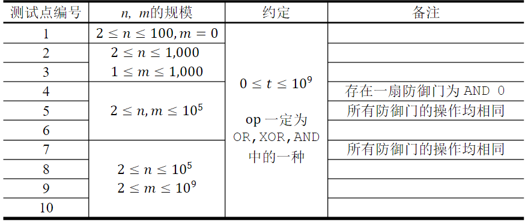
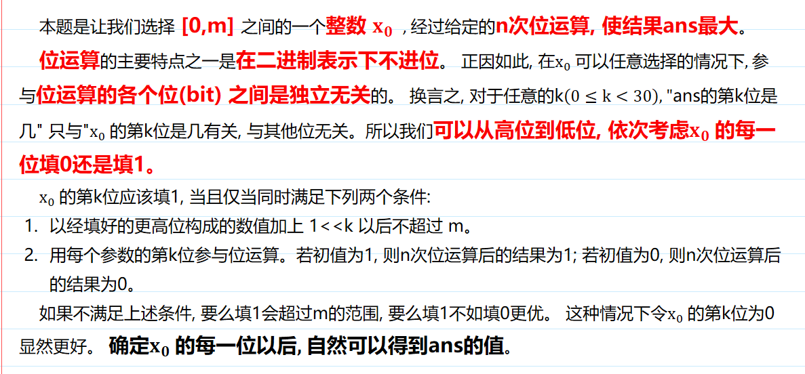

# 位运算

<!-- @import "[TOC]" {cmd="toc" depthFrom=3 depthTo=6 orderedList=false} -->

<!-- code_chunk_output -->

- [a^b](#ab)
- [64位整数乘法](#64位整数乘法)
- [最短Hamilton路径](#最短hamilton路径)
- [起床困难综合症](#起床困难综合症)

<!-- /code_chunk_output -->

### a^b

求 a 的 b 次方对 p 取模的值。

**输入格式**

三个整数 a,b,p ,在同一行用空格隔开。

**输出格式**

输出一个整数，表示`a^b mod p`的值。

**数据范围**

$0≤a,b≤10^9$
$1≤p≤10^9$

**输入样例：**
```
3 2 7
```
**输出样例：**
```
2
```

```cpp
#include <iostream>
#include <cstring>
#include <algorithm>
using namespace std;

typedef long long LL;

LL qmi(int a, int b, int p)
{
    LL rts = 1 % p;
    while (b)
    {
        if (b & 1) rts = rts * (LL) a % p;
        a = a * (LL) a % p;
        b >>= 1;
    }
    return rts;
}

int main()
{
    int a, b, p;
    cin >> a >> b >> p;
    printf("%lld\n", qmi(a, b, p));
    return 0;
}
```

### 64位整数乘法

求 a 乘 b 对 p 取模的值。

**输入格式**

第一行输入整数a，第二行输入整数b，第三行输入整数p。

**输出格式**

输出一个整数，表示`a*b mod p`的值。

**数据范围**

$1≤a,b,p≤10^{18}$

**输入样例：**
```
3
4
5
```

**输出样例：**
```
2
```

```cpp
#include <iostream>
#include <cstring>
#include <algorithm>

typedef unsigned long long ULL;

using namespace std;

int main()
{
    ULL a, b, p;
    cin >> a >> b >> p;
    ULL res = 0;
    while (a)
    {
        // 分解为 (2^0 + 2^1 + 2^2 + ...) * b
        if (a & 1) res = (res + b) % p;
        b = (b + b) % p;
        a >>= 1;
    }
    printf("%lld", res);
    return 0;
}
```

### 最短Hamilton路径

见 [../算法基础课/ybase16.md#例题最短hamilton路径](../算法基础课/ybase16.md#例题最短hamilton路径)

### 起床困难综合症

$21$ 世纪，许多人得了一种奇怪的病：起床困难综合症，其临床表现为：起床难，起床后精神不佳。

作为一名青春阳光好少年，atm 一直坚持与起床困难综合症作斗争。

<p>通过研究相关文献，他找到了该病的发病原因： 在深邃的太平洋海底中，出现了一条名为 drd 的巨龙，它掌握着睡眠之精髓，能随意延长大家的睡眠时间。 </p>

<p>正是由于 drd 的活动，起床困难综合症愈演愈烈， 以惊人的速度在世界上传播。</p>

<p>为了彻底消灭这种病，atm 决定前往海底，消灭这条恶龙。</p>

<p>历经千辛万苦，atm 终于来到了 drd 所在的地方，准备与其展开艰苦卓绝的战斗。</p>

<p>drd 有着十分特殊的技能，他的防御战线能够使用一定的运算来改变他受到的伤害。</p>

具体说来，drd 的防御战线由 $n$ 扇防御门组成。

每扇防御门包括一个运算 $op$ 和一个参数 $t$，其中运算一定是 $OR,XOR,AND$ 中的一种，参数则一定为非负整数。

如果还未通过防御门时攻击力为 $x$，则其通过这扇防御门后攻击力将变为 $x\ op\ t$。

最终 drd 受到的伤害为对方初始攻击力 $x$ 依次经过所有 $n$ 扇防御门后转变得到的攻击力。

由于 atm 水平有限，他的初始攻击力只能为 $0$ 到 $m$ 之间的一个整数（即他的初始攻击力只能在 $0, 1, … , m$ 中任选，但在通过防御门之后的攻击力不受 $m$ 的限制）。

<p>为了节省体力，他希望通过选择合适的初始攻击力使得他的攻击能让 drd 受到最大的伤害，请你帮他计算一下，他的一次攻击最多能使 drd 受到多少伤害。</p>

<h4>输入格式</h4>

第 $1$ 行包含 $2$ 个整数，依次为 $n, m$，表示 drd 有 $n$ 扇防御门，atm 的初始攻击力为 $0$ 到 $m$ 之间的整数。

接下来 $n$ 行，依次表示每一扇防御门。每行包括一个字符串 $op$ 和一个非负整数 $t$，两者由一个空格隔开，且 $op$ 在前，$t$ 在后，$op$ 表示该防御门所对应的操作，$t$ 表示对应的参数。

<h4>输出格式</h4>

<p>输出一个整数，表示 atm 的一次攻击最多使 drd 受到多少伤害。</p>

<h4>数据范围</h4>



<h4>输入样例：</h4>

<pre><code>
3 10
AND 5
OR 6
XOR 7
</code></pre>

<h4>输出样例：</h4>

<pre><code>
1
</code></pre>

<h4>样例解释</h4>

atm可以选择的初始攻击力为 $0,1, … ,10$。

假设初始攻击力为 $4$，最终攻击力经过了如下计算

<pre><code>
4 AND 5 = 4

4 OR 6 = 6

6 XOR 7 = 1
</code></pre>

类似的，我们可以计算出初始攻击力为 $1,3,5,7,9$ 时最终攻击力为 $0$，初始攻击力为 $0,2,4,6,8,10$ 时最终攻击力为 $1$，因此 atm 的一次攻击最多使 drd 受到的伤害值为 $1$。

<h4>运算解释</h4>

在本题中，选手需要先将数字变换为二进制后再进行计算。如果操作的两个数二进制长度不同，则在前补 $0$ 至相同长度。

- OR 为按位或运算，处理两个长度相同的二进制数，两个相应的二进制位中只要有一个为 $1$，则该位的结果值为 $1$，否则为 $0$。
- XOR 为按位异或运算，对等长二进制模式或二进制数的每一位执行逻辑异或操作。如果两个相应的二进制位不同（相异），则该位的结果值为 $1$，否则该位为 $0$。
- AND 为按位与运算，处理两个长度相同的二进制数，两个相应的二进制位都为 $1$，该位的结果值才为 $1$，否则为 $0$。

例如，我们将十进制数 $5$ 与十进制数 $3$ 分别进行 $OR、XOR$ 与 $AND$ 运算，可以得到如下结果：

<pre><code>
    0101 (十进制 5)             0101 (十进制 5)             0101 (十进制 5)             
 OR 0011 (十进制 3)         XOR 0011 (十进制 3)         AND 0011 (十进制 3)             
  = 0111 (十进制 7)           = 0110 (十进制 6)           = 0001 (十进制 1)             
</code></pre>

**分析：**
- 要转换为二进制来操作，而且每个运算都是位运算，因此单独看各个位就行
- 转换为二进制，并不是说把 `3` 转化为 `0b11` ，而是转换为 `0b000...00011`
- 每一位经历题目给定的一套运算只可能有4种结果
  - `1` 变成 `0`
  - `1` 变成 `1`
  - `0` 变成 `0`
  - `0` 变成 `1`
- 对于运算后变成 `1` 的位，我们保留其原来的值，因为我们希望运算后的数越大越好
- 但是，要注意如果其原来值是 `1` ，则需要检查一下，如果我保留这个位为 1 了，那最后这个数会超出 m 这个阈值吗？

```cpp
#include <iostream>
#include <cstring>
#include <algorithm>
#include <bitset>
#include <string>
using namespace std;

int main()
{
    int n, m;
    cin >> n >> m;

    bitset<40> zeros, ones;
    zeros.reset();  // 全为 0
    ones.set();     // 全为 1

    // 读入运算
    while (n -- )
    {
        string s;
        int x;
        cin >> s >> x;
        if (s[0] == 'A') ones &= x, zeros &= x;
        else if (s[0] == 'O') ones |= x, zeros |= x;
        else ones ^= x, zeros ^= x;
    }

    // 保留各位
    int ans = 0;
    for (int i = 0; i < 31; ++ i)
    {
        // 如果原来是 0 ，转换后是 1
        if (zeros[i] == 1) ans += (1 << i);
        // 如果原来是 1 ，转换后是 1
        // 则要检查一下，把 1 保留了，会不会 ans 比 m 大？
        else if (ones[i] == 1 && m >= (1 << i) + ans) ans += (1 << i);
    }
    
    cout << ans;
}
```

**分析：**
- 本题思想我已掌握，但是这个代码能过我还是想不明白的，为什么不是`从高位到低位`？
- 我更喜欢[Bug-Free](https://www.acwing.com/solution/content/26764/)的分析，如下



```cpp
#include<iostream>

using namespace std;
const int N = 1e5 + 10;
pair<string, int> a[N];
int n, m;

int calc(int bit, int now) {// 代表现在运算的是二进制的第几位， now有两种情况，需要运算过后返回
    for (int i = 0; i < n; i++) {
        int x = a[i].second >> bit & 1;// 首先取出第i次运算中的第几位进行二进制运算
        if (a[i].first == "OR") {
            now |= x;
        } else if (a[i].first == "XOR") {
            now ^= x;
        } else {
            now &= x;
        }
    }
    return now;// 现在返回的就是运算过后的二进制位
}

int main() {
    cin >> n >> m;
    for (int i = 0; i < n; i++) {
        cin >> a[i].first >> a[i].second;
    }
    int ans = 0, v = 0;
    for (int i = 29; i >= 0; i--) {// m最多有29个二进制位，直接从高位到低位枚举每一位
        int r1 = calc(i, 0);// 查看填0之后是否变化
        int r2 = calc(i, 1);// 查看填1之后是否变化， 如果没有变化，加上该位后又小于m，就可以填1
        // 这里仅有四种情况 分别为0 0， 0 1， 1 0， 1 1
        // 仅有0 1 是满足可以填一的一个条件的，其他情况运算过后这一位都相反了，填0，后面运算还可能填1
        if (v + (1 << i) <= m && r2 > r1) {
            v += (1 << i), ans += r2 << i;// 满足填1的条件，直接填1
        } else {
            ans += r1 << i;// 不能填1，直接填0
        }
    }
    cout << ans << endl;// 最后的答案
    return 0;
}
```
