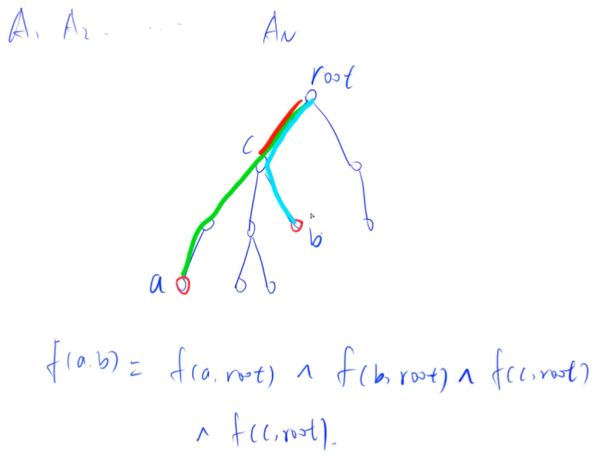

# Trie字典树

<!-- @import "[TOC]" {cmd="toc" depthFrom=3 depthTo=6 orderedList=false} -->

<!-- code_chunk_output -->

- [前缀统计](#前缀统计)
- [最大异或对](#最大异或对)
- [最长异或值路径](#最长异或值路径)

<!-- /code_chunk_output -->

### 前缀统计

给定 $N$ 个字符串 $S_1,S_2 ... S_N$，接下来进行 $M$ 次询问，每次询问给定一个字符串 $T$，求 $S_1 \sim S_N$ 中有多少个字符串是 $T$ 的前缀。

输入字符串的总长度不超过 $10^6$，仅包含小写字母。

<h4>输入格式</h4>

第一行输入两个整数 $N，M$。

接下来 $N$ 行每行输入一个字符串 $S_i$。

接下来 $M$ 行每行一个字符串 $T$ 用以询问。

<h4>输出格式</h4>

<p>对于每个询问，输出一个整数表示答案。</p>

<p>每个答案占一行。</p>

<h4>输入样例：</h4>

<pre><code>
3 2
ab
bc
abc
abc
efg
</code></pre>

<h4>输出样例：</h4>

<pre><code>
2
0
</code></pre>

```cpp
#include <iostream>
#include <cstring>
#include <algorithm>
using namespace std;

const int N = 1e6 + 10;

int son[N][26];
int cnt[N];
int idx;

void insert(char str[])
{
    int p = 0;
    for (int i = 0; str[i]; ++ i)
    {
        int u = str[i] - 'a';
        if (!son[p][u]) son[p][u] = ++ idx;
        p = son[p][u];
    }
    cnt[p] ++;
}

int query(char str[])
{
    int p = 0, res = 0;
    for (int i = 0; str[i]; ++ i)
    {
        int u = str[i] - 'a';
        if (!son[p][u]) break;
        p = son[p][u];
        res += cnt[p];
    }
    return res;
}

int main()
{
    int n, m;
    cin >> n >> m;
    char x[N];
    for (int i = 0; i < n; i ++ )
    {
        scanf("%s", x);
        insert(x);
    }
    
    for (int i = 0; i < m; ++ i)
    {
        scanf("%s", x);
        printf("%d\n", query(x));
    }
}
```

### 最大异或对
- 在给定的 $N$ 个整数 $A_1，A_2 …… A_N$ 中选出两个进行 xor（异或）运算，得到的结果最大是多少？

输入格式
- 第一行输入一个整数 N。
- 第二行输入 N 个整数 A1～AN。

输出格式
- 输出一个整数表示答案。

数据范围
- $1≤N≤10^5$
- $0≤A_i<2^{31}$

输入样例：
```
3
1 2 3
```

输出样例：
```
3
```

```cpp
#include <iostream>
#include <cstring>
#include <algorithm>
using namespace std;

const int N = 1e5 + 10;
const int M = N * 30;

int a[N];
int son[M][2];
int cnt[M];
int idx;

void insert (int x)
{
    int p = 0;
    for (int i = 30; ~i; -- i)
    {
        int u = x >> i & 1;
        if (!son[p][u]) son[p][u] = ++ idx;
        p = son[p][u];
    }
    cnt[p] ++;
}

int query (int x)
{
    int p = 0, res = 0;
    for (int i = 30; ~i; -- i)
    {
        int u = x >> i & 1;
        if (son[p][!u])
        {
            p = son[p][!u];
            res += 1 << i;
        }
        else p = son[p][u];
    }
    return res;
}

int main()
{
    int n = 0;
    scanf("%d", &n);
    for (int i = 0; i < n; i ++ )
    {
        scanf("%d", &a[i]);
        insert(a[i]);
    }
    int res = 0;
    for (int i = 0; i < n; i ++ )
    {
        res = max(res, query(a[i]));
    }
    printf("%d", res);
}
```

### 最长异或值路径

<p>给定一个树，树上的边都具有权值。</p>

<p>树中一条路径的异或长度被定义为路径上所有边的权值的异或和：</p>


$⊕$ 为异或符号。

给定上述的具有 $n$ 个节点的树，你能找到异或长度最大的路径吗？

<h4>输入格式</h4>

第一行包含整数 $n$，表示树的节点数目。

接下来 $n-1$ 行，每行包括三个整数 $u，v，w$，表示节点 $u$ 和节点 $v$ 之间有一条边权重为 $w$。

<h4>输出格式</h4>

<p>输出一个整数，表示异或长度最大的路径的最大异或和。</p>

<h4>数据范围</h4>

- $1 \le n \le 100000$
- $0 \le u,v < n$
- $0 \le w < 2^{31}$

<h4>输入样例：</h4>

<pre><code>
4
0 1 3
1 2 4
1 3 6
</code></pre>

<h4>输出样例：</h4>

<pre><code>
7
</code></pre>

<h4>样例解释</h4>

样例中最长异或值路径应为 <code>0-&gt;1-&gt;2</code>，值为 $7 (=3 ⊕ 4)$

**分析：**



```cpp

```