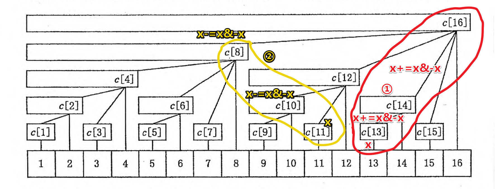

# 树状数组

<!-- @import "[TOC]" {cmd="toc" depthFrom=3 depthTo=6 orderedList=false} -->

<!-- code_chunk_output -->

- [本质就是一种巧妙的分桶方法](#本质就是一种巧妙的分桶方法)
  - [更新](#更新)
  - [查询](#查询)

<!-- /code_chunk_output -->

### 本质就是一种巧妙的分桶方法



如上，本质上，树状数组把下标为 1~n 的信息分成了 n 个不同层次的桶，可以在 $log_2 N$ 的时间内更新前缀或查询前缀和。

看上图举例。

#### 更新

更新如①，我想把前 13 个数加上 y ；首先把 13 这个桶加 y ；然后把把 `13+=13&-13` （就是把 13 的 lowbit 取出来加上）也就是 14 加 y ；接着把更高层次的桶 16 加 y 。

对应代码如下。

```cpp
void add(int x, int y) {
    for (; x <= N; x += x & -x) c[x] += y;
}
```

结合查询，就会明白这样再查询大于等于 13 的下标的前缀和时，都会是加上了 y 的。

#### 查询

如上面的 ② ，如果想查询 11 的前缀和，首先把 11 那个桶的东西拿进来；然后把 10 （`11 -= 11&-11`）桶里的东西加上；最后是 8 的。

代码如下：

```cpp
int ask(int x) {
    int ans = 0;
    for (; x; x -= x & -x) ans += c[x];
    return ans;
}
```
