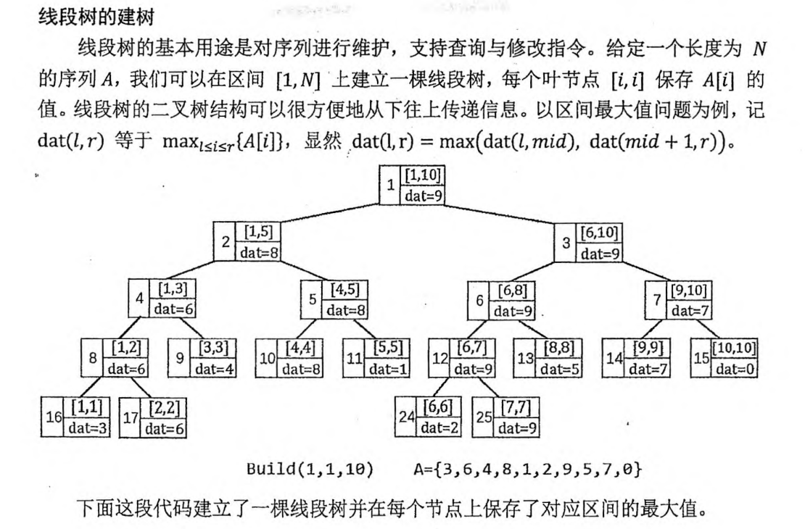
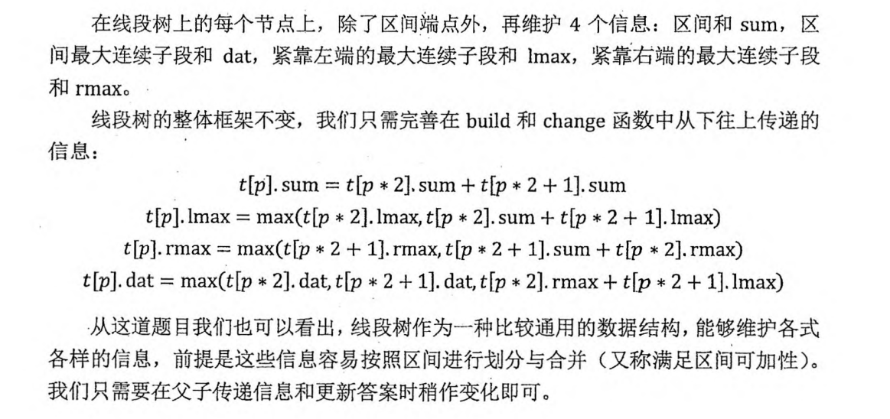

# 线段树

<!-- @import "[TOC]" {cmd="toc" depthFrom=3 depthTo=6 orderedList=false} -->

<!-- code_chunk_output -->

- [线段树：放在区间上进行信息统计](#线段树放在区间上进行信息统计)
  - [线段树的建树](#线段树的建树)
  - [线段树的单点修改](#线段树的单点修改)
  - [线段树的区间修改](#线段树的区间修改)
- [245. 你能回答这些问题吗（线段树最大子列和）](#245-你能回答这些问题吗线段树最大子列和)

<!-- /code_chunk_output -->

### 线段树：放在区间上进行信息统计



涉及到建树、更新单个节点值、查询。注意到下标从 1 开始，用 `p*2 p*2+1` 分别表示左右儿子。

下面以维护区间最大值为例。

#### 线段树的建树

```cpp
struct SegmentTree {
    int l, r;
    int dat;
} t[SIZE * 4];

// 以维护区间最大值为例
void build(int p, int l, int r) {
    t[p].l = l, t[p].r = r;  // 叶节点 p 代表区间 [l, r]
    if (l == r) { t[p].dat = a[l]; return ; }  // 叶节点
    int mid = (l + r) / 2;
    build(p * 2, l, mid);
    build(p * 2 + 1, mid + 1, r);
    // 先更新完子节点，再从下往上更新 dat
    t[p].dat = max(t[p * 2].dat, t[p * 2 + 1].dat);
}

build(1, 1, n);  // 调用入口
```

#### 线段树的单点修改

单线修改是一条形如 `C x v` 的指令，表示把 `A[x]` 的值修改为 `v` 。

在线段树中，根节点（编号为 1 的节点）是执行各种指令的入口。我们需要从根结点出发，递归找到代表区间 `[x, x]` 的叶节点，然后从下往上更新 `[x, x]` 以及它的所有祖先节点上保存信息。时间复杂度为 $O(\log N)$ 。

```cpp
// 以维护区间最大值为例
void change(int p, int x, int v) {
    if (t[p].l == t[p].r) { t[p].dat = v; return ; }  // 找到叶节点
    int mid = (t[p].l + t[p].r) / 2;
    if (x <= mid) change(p * 2, x, v);
    else change(p * 2 + 1, x, v);
    // 先更新完子节点，再从下往上更新 dat
    t[p].dat = max(t[p * 2].dat, t[p * 2 + 1].dat);
}

change(1, x, v);
```

#### 线段树的区间修改

```cpp
// 以查询区间最大值为例
ing ask(int p, int l, int r) {
    if (l <= t[p].l && r >= r[p].r)
        return t[p].dat;  // 完全包含
    int mid = (t[p].l + t[p].r) / 2;
    int val = -(1<<30);  // 负无穷
    // 左子节点有重复
    if (l <= mid) val = max(val, ask(p * 2, l, r));
    // 右子节点有重复
    if (r > mid) val = max(val, ask(p * 2 + 1, l, r));
    return val;
}
```

### 245. 你能回答这些问题吗（线段树最大子列和）

给定长度为 $N$ 的数列 $A$，以及 $M$ 条指令，每条指令可能是以下两种之一：

- <code>1 x y</code>，查询区间 $[x,y]$ 中的最大连续子段和，即 $\max\limits_{x \le l \le r \le y}${$\sum\limits^r_{i=l} A[i]$}。
- <code>2 x y</code>，把 $A[x]$ 改成 $y$。

对于每个查询指令，输出一个整数表示答案。

<h4>输入格式</h4>

第一行两个整数 $N,M$。

第二行 $N$ 个整数 $A[i]$。

接下来 $M$ 行每行 $3$ 个整数 $k,x,y$，$k=1$ 表示查询（此时如果 $x>y$，请交换 $x,y$），$k=2$ 表示修改。

<h4>输出格式</h4>

对于每个查询指令输出一个整数表示答案。

每个答案占一行。

<h4>数据范围</h4>

- $N \le 500000, M \le 100000$,
- $-1000 \le A[i] \le 1000$

<h4>输入样例：</h4>

```
5 3
1 2 -3 4 5
1 2 3
2 2 -1
1 3 2
```

<h4>输出样例：</h4>

```
2
-1
```



```cpp
#include <iostream>
#include <cstring>
#include <algorithm>
using namespace std;

const int N = 5e5 + 10;

int n, m;
int a[N];

struct TreeNode
{
    int l, r;
    // 区间合，左连续，右连续，最大连续区间和
    int sum, lmax, rmax, dat;
} tr[N * 4];

// 根据子节点的值更新父节点
void pushup(TreeNode &f, TreeNode &l, TreeNode &r)
{
    f.sum = l.sum + r.sum;
    f.lmax = max(l.lmax, l.sum + r.lmax);
    f.rmax = max(r.rmax, r.sum + l.rmax);
    f.dat = max({l.dat, r.dat, l.rmax + r.lmax});
}

void build(int u, int l, int r)
{
    if (l == r)
    {
        tr[u] = {l, l, a[l], a[l], a[l], a[l]};
        return ;
    }
    tr[u].l = l; tr[u].r = r;
    int mid = l + r >> 1;
    build(u * 2, l, mid);
    build(u * 2 + 1, mid + 1, r);
    pushup(tr[u], tr[u * 2], tr[u * 2 + 1]);
}

TreeNode query(int u, int l, int r)  // 为什么要返回 TreeNode ? 见 else 中逻辑
{
    if (tr[u].l >= l && tr[u].r <= r) return tr[u];
    int mid = tr[u].l + tr[u].r >> 1;
    if (r <= mid) return query(u * 2, l, r);
    else if (l > mid) return query(u * 2 + 1, l, r);
    else
    {   // 处理两个子树区间和，需要建立临时节点来 pushup
        TreeNode lt = query(u * 2, l, r);
        TreeNode rt = query(u * 2 + 1, l, r);
        TreeNode tmp;
        pushup(tmp, lt, rt);
        return tmp;
    }
}

void modify(int u, int x, int y)
{   // 把 x 改成 y
    if (tr[u].l == x && tr[u].r == x)
    {
        tr[u] = {x, x, y, y, y, y};
        return ;
    }
    int mid = tr[u].l + tr[u].r >> 1;
    if (x <= mid) modify(u * 2, x, y);
    else if (x > mid) modify(u * 2 + 1, x, y);
    pushup(tr[u], tr[u * 2], tr[u * 2 + 1]);
}

int main()
{
    scanf("%d%d", &n, &m);
    for (int i = 1; i <= n; ++ i) scanf("%d", &a[i]);
    
    build(1, 1, n);
    
    while (m -- )
    {
        int op, x, y;
        scanf("%d%d%d", &op, &x, &y);
        if (op == 1)
        {
            if (x > y) swap(x, y);
            printf("%d\n", query(1, x, y).dat);
        }
        else
        {
            modify(1, x, y);
        }
    }
}
```
