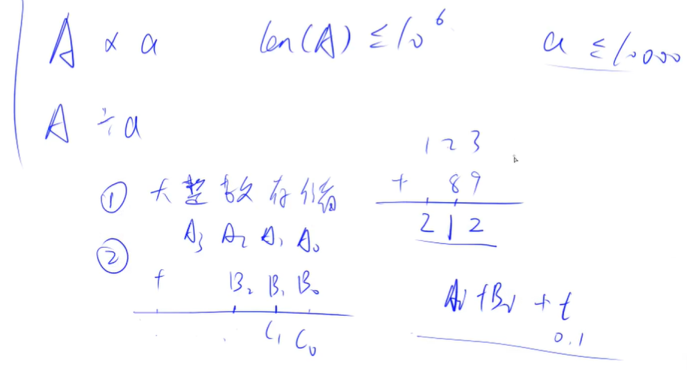
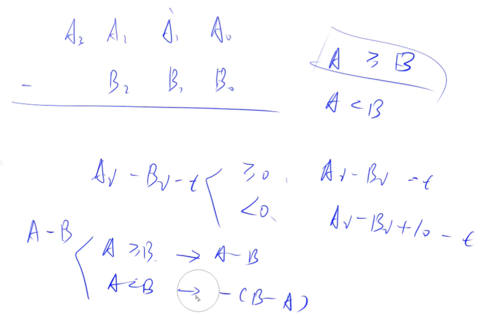
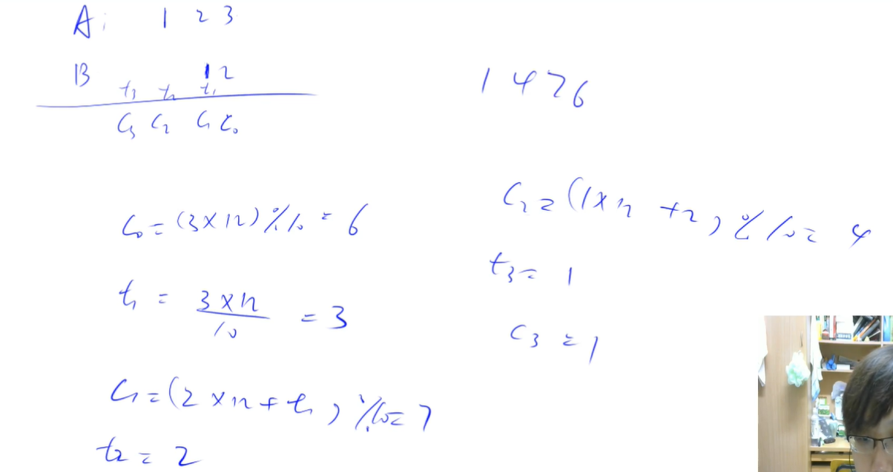
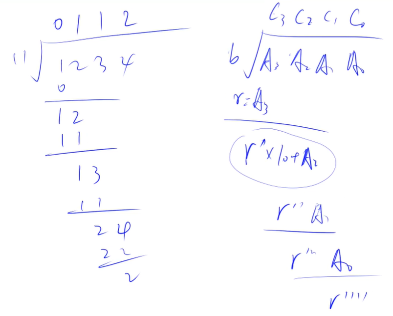

<!-- @import "[TOC]" {cmd="toc" depthFrom=1 depthTo=4 orderedList=false} -->

<!-- code_chunk_output -->

- [高精度](#高精度)
  - [高精度加法与模板](#高精度加法与模板)
  - [高精度减法与模板](#高精度减法与模板)
  - [高精度乘法与模板](#高精度乘法与模板)
  - [高精度除法与模板](#高精度除法与模板)

<!-- /code_chunk_output -->

### 高精度
适用于 C++ ，因为 java 或者 python 这种语言里都用数据结构对类型进行了封装。

对于数字 `123456789` ，应该放在数组中存储，注意是反过来的： `a[9] = {9,8,7,6,5,4,3,2,1}` 。

#### 高精度加法与模板


如上，正常加法就行。

```cpp
#include <iostream>
#include <vector>

using namespace std;

vector<int> add(vector<int> &A, vector<int> &B)
{
    vector<int> C;
    
    int t = 0;
    for (int i = 0; i < A.size() || i < B.size(); i ++)
    {
        if (i < A.size()) t += A[i];
        if (i < B.size()) t += B[i];
        C.push_back(t % 10);
        t /= 10;
    }
    
    if (t) C.push_back(t); // 别忘了最高位可能进1
    
    return C;
}

int main()
{
    string a, b;
    cin >> a >> b;
    
    vector<int> A, B;
    for (int i = a.size() - 1; i >= 0; i--) A.push_back(a[i] - '0');
    for (int i = b.size() - 1; i >= 0; i--) B.push_back(b[i] - '0');
    
    vector<int> C = add(A, B);
    for (int i = C.size() - 1; i >= 0; i --) printf("%d", C[i]);
    return 0;
}
```

经验：
- 用 `string` 接收，取出用 `.size()` 或者 `auto a: str`
- `a - '0'`是将数字字符串转为数值
- 定义 `vector<int> add(vector<int> &A, ...)`加上引用，是为了提高效率

#### 高精度减法与模板


很显然

```cpp
#include <iostream>
#include <vector>

using namespace std;

bool cmp(const vector<int> &A, const vector<int> &B)
{
    if (A.size() > B.size()) return true;
    if (A.size() < B.size()) return false;
    for (int i = A.size() - 1; i >= 0; i --)
        if (A[i] > B[i]) return true;
        else if (A[i] < B[i]) return false;
    return true;
}

vector<int> sub(const vector<int> &A, const vector<int> &B)
{
    vector<int> C;
    
    int t = 0;
    for (int i = 0; i < A.size(); i ++)  // 这个 for 心里就结合小学减法过程算就行
    {
        t += A[i];
        t -= B[i];
        C.push_back((t + 10) % 10);
        if (t >= 0) t = 0;
        else t = - 1;
    }
    
    while (C.size() > 1) if (C.back() == 0) C.pop_back(); else break;  // 把 0001 变为 1
    return C;
}

int main()
{
    string a, b;
    cin >> a >> b;
    vector<int> A, B;
    for (int i = a.size() - 1; i >= 0; i --) A.push_back(a[i] - '0');
    for (int i = b.size() - 1; i >= 0; i --) B.push_back(b[i] - '0');

    if (cmp(A, B))
    {
        auto C = sub(A, B);
        for (int i = C.size() - 1; i >= 0; i --) printf("%d", C[i]);
    } else {
        auto C = sub(B, A);
        printf("-");
        for (int i = C.size() - 1; i >= 0; i --) printf("%d", C[i]);
    }

    return 0;
}
```

经验：
- `t` 用来表示借位，别想复杂了
- 这道题里有很多前提条件，比如所有参与运算的数都是正整数
- 我这里的做法，细节处比如对于 `t` 的使用与y总不太一样，但是道理相通的
- 别忘了“扫尾”，比如把 `001` 变为 `1`

#### 高精度乘法与模板
这里是大数乘上小数。



还是用式子思考，同样是把乘法，拆成几个加法；计算过程与小学略有不同。

从小的位数开始累积起。

```cpp
#include <iostream>
#include <vector>
using namespace std;

vector<int> mul(const vector<int> A, const int b)
{
    vector<int> C;
    int t = 0;
    for (int i = 0; i < A.size() || t; i ++)
    {
        if (i < A.size()) t += A[i] * b;
        C.push_back(t % 10);
        t /= 10;
    }
    
    while (C.size() > 1) if (C.back() == 0) C.pop_back(); else break;

    return C;
}

int main()
{
    string a;
    int b;
    cin >> a >> b;
    
    vector<int> A;
    for (int i = a.size() - 1; i >= 0; i --) A.push_back(a[i] - '0');
    
    auto C = mul(A, b);
    for (int i = C.size() - 1; i >= 0; i --) printf("%d", C[i]);

    return 0;
}
```

#### 高精度除法与模板



其实除法是很简单的思路。

```cpp
#include <iostream>
#include <vector>
#include <algorithm>  // 要用到 reverse

using namespace std;

vector<int> div(const vector<int> A, const int b, int &r)
{
    vector<int> C;
    r = 0;
    for (int i = A.size() - 1; i >= 0; i --)
    {
        r = r * 10 + A[i];
        C.push_back(r / b);  // r / b 一定是个位数，思考除法过程可得
        r %= b;
    }
    
    reverse(C.begin(), C.end());  // 注意除法从大位做起

    while (C.size() > 1 && C.back() == 0) C.pop_back();
    
    return C;
}

int main()
{
    string a;
    int b;
    cin >> a >> b;

    vector<int> A;
    for (int i = a.size() - 1; i >= 0; i --) A.push_back(a[i] - '0');

    int r;
    auto C = div(A, b, r);
    for (int i = C.size() - 1; i >= 0; i --) printf("%d", C[i]);
    cout << endl << r << endl;
}
```
