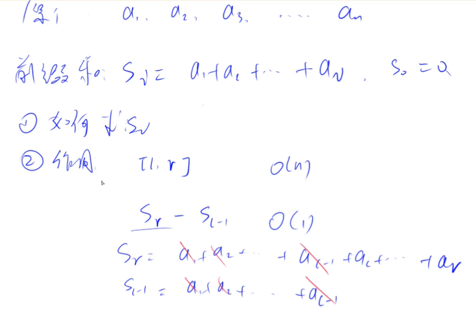

<!-- @import "[TOC]" {cmd="toc" depthFrom=1 depthTo=4 orderedList=false} -->

<!-- code_chunk_output -->

- [高精度](#高精度)
  - [高精度加法与模板](#高精度加法与模板)
  - [高精度减法与模板](#高精度减法与模板)
  - [高精度乘法与模板](#高精度乘法与模板)
  - [高精度除法与模板](#高精度除法与模板)
- [前缀和](#前缀和)
  - [前缀和思想（模板）](#前缀和思想模板)
  - [前缀和（一维求s[i]）](#前缀和一维求si)
  - [子矩阵的和（二维求s[i][j]）](#子矩阵的和二维求sij)
- [差分（与前缀和互为逆运算）](#差分与前缀和互为逆运算)

<!-- /code_chunk_output -->

### 高精度
适用于 C++ ，因为 java 或者 python 这种语言里都用数据结构对类型进行了封装。

对于数字 `123456789` ，应该放在数组中存储，注意是反过来的： `a[9] = {9,8,7,6,5,4,3,2,1}` 。

#### 高精度加法与模板


如上，正常加法就行。

```cpp
#include <iostream>
#include <vector>

using namespace std;

vector<int> add(vector<int> &A, vector<int> &B)
{
    vector<int> C;
    
    int t = 0;
    for (int i = 0; i < A.size() || i < B.size(); i ++)
    {
        if (i < A.size()) t += A[i];
        if (i < B.size()) t += B[i];
        C.push_back(t % 10);
        t /= 10;
    }
    
    if (t) C.push_back(t); // 别忘了最高位可能进1
    
    return C;
}

int main()
{
    string a, b;
    cin >> a >> b;
    
    vector<int> A, B;
    for (int i = a.size() - 1; i >= 0; i--) A.push_back(a[i] - '0');
    for (int i = b.size() - 1; i >= 0; i--) B.push_back(b[i] - '0');
    
    vector<int> C = add(A, B);
    for (int i = C.size() - 1; i >= 0; i --) printf("%d", C[i]);
    return 0;
}
```

经验：
- 用 `string` 接收，取出用 `.size()` 或者 `auto a: str`
- `a - '0'`是将数字字符串转为数值
- 定义 `vector<int> add(vector<int> &A, ...)`加上引用，是为了提高效率

#### 高精度减法与模板


很显然

```cpp
#include <iostream>
#include <vector>

using namespace std;

bool cmp(const vector<int> &A, const vector<int> &B)
{
    if (A.size() > B.size()) return true;
    if (A.size() < B.size()) return false;
    for (int i = A.size() - 1; i >= 0; i --)
        if (A[i] > B[i]) return true;
        else if (A[i] < B[i]) return false;
    return true;
}

vector<int> sub(const vector<int> &A, const vector<int> &B)
{
    vector<int> C;
    
    int t = 0;
    for (int i = 0; i < A.size(); i ++)  // 这个 for 心里就结合小学减法过程算就行
    {
        t += A[i];
        t -= B[i];
        C.push_back((t + 10) % 10);
        if (t >= 0) t = 0;
        else t = - 1;
    }
    
    while (C.size() > 1) if (C.back() == 0) C.pop_back(); else break;  // 把 0001 变为 1
    return C;
}

int main()
{
    string a, b;
    cin >> a >> b;
    vector<int> A, B;
    for (int i = a.size() - 1; i >= 0; i --) A.push_back(a[i] - '0');
    for (int i = b.size() - 1; i >= 0; i --) B.push_back(b[i] - '0');

    if (cmp(A, B))
    {
        auto C = sub(A, B);
        for (int i = C.size() - 1; i >= 0; i --) printf("%d", C[i]);
    } else {
        auto C = sub(B, A);
        printf("-");
        for (int i = C.size() - 1; i >= 0; i --) printf("%d", C[i]);
    }

    return 0;
}
```

经验：
- `t` 用来表示借位，别想复杂了
- 这道题里有很多前提条件，比如所有参与运算的数都是正整数
- 我这里的做法，细节处比如对于 `t` 的使用与y总不太一样，但是道理相通的
- 别忘了“扫尾”，比如把 `001` 变为 `1`

#### 高精度乘法与模板
这里是大数乘上小数。


还是用式子思考，同样是把乘法，拆成几个加法；计算过程与小学略有不同。

从小的位数开始累积起。

```cpp
#include <iostream>
#include <vector>
using namespace std;

vector<int> mul(const vector<int> A, const int b)
{
    vector<int> C;
    int t = 0;
    for (int i = 0; i < A.size() || t; i ++)
    {
        if (i < A.size()) t += A[i] * b;
        C.push_back(t % 10);
        t /= 10;
    }
    
    while (C.size() > 1) if (C.back() == 0) C.pop_back(); else break;

    return C;
}

int main()
{
    string a;
    int b;
    cin >> a >> b;
    
    vector<int> A;
    for (int i = a.size() - 1; i >= 0; i --) A.push_back(a[i] - '0');
    
    auto C = mul(A, b);
    for (int i = C.size() - 1; i >= 0; i --) printf("%d", C[i]);

    return 0;
}
```

#### 高精度除法与模板


其实除法是很简单的思路。

```cpp
#include <iostream>
#include <vector>
#include <algorithm>  // 要用到 reverse

using namespace std;

vector<int> div(const vector<int> A, const int b, int &r)
{
    vector<int> C;
    r = 0;
    for (int i = A.size() - 1; i >= 0; i --)
    {
        r = r * 10 + A[i];
        C.push_back(r / b);  // r / b 一定是个位数，思考除法过程可得
        r %= b;
    }
    
    reverse(C.begin(), C.end());  // 注意除法从大位做起

    while (C.size() > 1 && C.back() == 0) C.pop_back();
    
    return C;
}

int main()
{
    string a;
    int b;
    cin >> a >> b;

    vector<int> A;
    for (int i = a.size() - 1; i >= 0; i --) A.push_back(a[i] - '0');

    int r;
    auto C = div(A, b, r);
    for (int i = C.size() - 1; i >= 0; i --) printf("%d", C[i]);
    cout << endl << r << endl;
}
```

### 前缀和



如上，前缀和的作用可以是求数组里 `[l, r]` 这些连续序列的和。

一般，我们将 `S_0` 定义为 0 。

#### 前缀和思想（模板）
前缀和算是一种思想，而非模板。应该记得融入这种思想。

#### 前缀和（一维求s[i]）
- 输入一个长度为 n 的整数序列。
- 接下来再输入 m 个询问，每个询问输入一对 l,r。
- 对于每个询问，输出原序列中从第 l 个数到第 r 个数的和。

输入格式
- 第一行包含两个整数 n 和 m。
- 第二行包含 n 个整数，表示整数数列。
- 接下来 m 行，每行包含两个整数 l 和 r，表示一个询问的区间范围。

输出格式
- 共 m 行，每行输出一个询问的结果。

```cpp
#include <iostream>

using namespace std;

const int N = 1e5 + 10;

int a[N], s[N];

int main()
{
    int n, m;
    cin >> n >> m;
    for (int i = 0; i < n; i ++) scanf("%d", &a[i]);
    
    s[0] = 0;
    for (int i = 0; i < n; i ++) s[i + 1] = s[i] + a[i];
    
    int l, r;
    while (m -- )
    {
        scanf("%d%d", &l, &r);
        printf("%d\n", s[r] - s[l-1]);
    }
    
    return 0;
}
```

注意我上面是 `s[i + 1] = s[i] + a[i];` ，`s[i]` 表示前 i 个数的和。此外，`s[0]=0`不用声明， c++ 中数组默认值为 0 。

此外，也可以在代码中加入 `ios::sync_with_stdio(false)` 来提高 `cin` 速度，但是可能不能使用 `scanf` 了。比赛中可能会干扰文件操作。

#### 子矩阵的和（二维求s[i][j]）
- 输入一个 n 行 m 列的整数矩阵，再输入 q 个询问，每个询问包含四个整数 x1,y1,x2,y2，表示一个子矩阵的左上角坐标和右下角坐标。
 -对于每个询问输出子矩阵中所有数的和。

输入格式
- 第一行包含三个整数 n，m，q。
- 接下来 n 行，每行包含 m 个整数，表示整数矩阵。
- 接下来 q 行，每行包含四个整数 x1,y1,x2,y2，表示一组询问。

输出格式
- 共 q 行，每行输出一个询问的结果。

**同样，用小学数学就可以算：**
- 计算前缀和时，用两个小矩形加起来，减去重叠部分面积，再加上新元素 `a[i][j]`
- 计算子矩阵时，也是同样的思想，大矩阵减去两个小矩阵，补上被重复减去的部分的面积
- 注意 c++ 中数组默认值为 0

```cpp
#include <iostream>
using namespace std;

const int N = 1e3 + 10;
int n, m, q;
int a[N][N], s[N][N];

int main()
{
    scanf("%d%d%d", &n, &m, &q);
    for (int i = 0; i < n; i ++)
        for (int j = 0; j < m; j++)
            scanf("%d", &a[i][j]);

    for (int i = 1; i <= n; i ++)
        for (int j = 1; j <= m; j ++)
            s[i][j] = s[i - 1][j] + s[i][j - 1] - s[i - 1][j - 1] + a[i - 1][j - 1];
    
    while (q --)
    {
        int x1, y1, x2, y2;
        scanf("%d%d%d%d", &x1, &y1, &x2, &y2);
        printf("%d\n", s[x2][y2] - s[x1 - 1][y2] - s[x2][y1 - 1] + s[x1 - 1][y1 - 1]);
    }

    return 0;
}
```

注意，这里
```cpp
for (int i = 1; i <= n; i ++)
        for (int j = 1; j <= m; j ++)
            s[i][j] = s[i - 1][j] + s[i][j - 1] - s[i - 1][j - 1] + a[i - 1][j - 1];
```
我也可以写成：
```cpp
for (int i = 0; i < n; i ++)
        for (int j = 0; j < m; j ++)
            s[i + 1][j + 1] = s[i][j + 1] + s[i + 1][j] - s[i][j] + a[i][j];
```

都一个意思，因为对于`s,a`我们的下标意义不同，一个是数学上的（从1计数），一个是程序上的（从0计数）。

### 差分（与前缀和互为逆运算）

有 `a1, a2, ... , an`，构造 `b1, b2, ..., bn` 使得 `an = b1 + ... + bn` 。则 `{ai}` 是 `{bi}` 的前缀和， `{bi}` 是 `{ai}` 的差分。

构造方法可以是：`b1 = a1, b2 = a2 - a1, b3 = a3 - a2` 。

