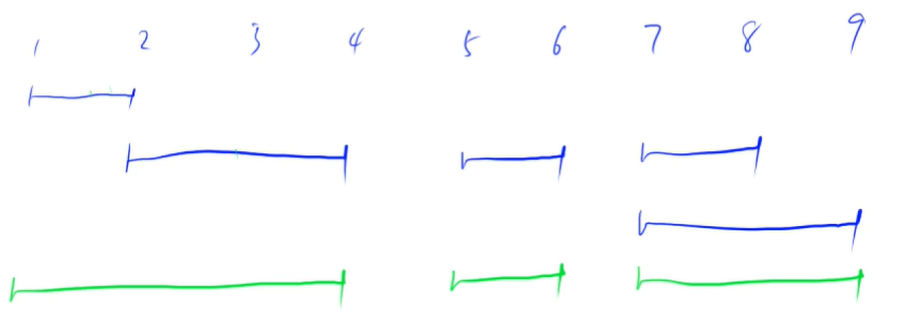

<!-- @import "[TOC]" {cmd="toc" depthFrom=1 depthTo=4 orderedList=false} -->

<!-- code_chunk_output -->

- [双指针算法](#双指针算法)
  - [最长连续不重复子序列](#最长连续不重复子序列)
  - [数组元素的目标和](#数组元素的目标和)
  - [判断子序列](#判断子序列)
- [位运算](#位运算)
  - [n的二进制中第k位是几（k从0计）](#n的二进制中第k位是几k从0计)
  - [lowbit(x)返回x的最右一位1开头的数](#lowbitx返回x的最右一位1开头的数)
  - [二进制中1的个数](#二进制中1的个数)
- [离散化](#离散化)
  - [离散化模板](#离散化模板)
  - [区间和（细节狂魔）](#区间和细节狂魔)
  - [unique的自己实现](#unique的自己实现)
- [区间合并](#区间合并)
  - [区间和并模板](#区间和并模板)

<!-- /code_chunk_output -->

### 双指针算法

双指针算法通用模板：
```cpp
for (i = 0, j = 0; i < n; i ++)
{
    while (j < i && check(i, j)) j ++;
    // 具体逻辑...
}
```

双指针算法都核心思想在哪里？将 `for { for {} }` 的朴素算法优化到 O(n) 。这其中运用了某些单调的性质。

#### 最长连续不重复子序列


注意，`j`永远不需要向左移动，因为双指针的“单调性”。

反证法：
- 如果`黄j,黄i`中没有重复元素的话，则说明`黄j,蓝i`中也没有重复元素
- 而我们之前求得的是，对于`蓝i`，`蓝j,蓝i`构成的才是最长连续不重复子序列
- 则矛盾

这里的“单调性”指：是否有重复元素。

```cpp
#include <iostream>
using namespace std;

const int N = 1e5 + 10;

int n;
int a[N], s[N];

int main()
{
    cin >> n;
    for (int i = 0; i < n; i ++) scanf("%d", &a[i]);
    
    int i = 0, j = 0, res = 0;
    for ( ; i < n; i ++)
    {
        s[a[i]] ++;
        while (s[a[i]] > 1)
        {
            s[a[j]] --;
            j ++;
        }
        res = max(res, i - j + 1);
    }
    
    cout << res;
    return 0;
}
```

看例题我可以解释得更清楚：
- `s[a[i]]` 可以理解为一个字典：`key`是`a[i]`，`value`代表`a[i]`在双指针序列出现的次数
- 对于序列 `1 2 3 3 3 4`，当`i`指到第二个`3`时，`j`不跑到第一个`3`，`i`是不会向后走的。这（`while (s[a[i]] > 1)`）从根本上杜绝了双指针中重复序列的产生
- 再多说一嘴，因为 `a[i]` 要经过从 `0` 到 `i` 的所有数，因此`while (s[a[i]] > 1)`从根本上杜绝了双指针中（`j到i`）重复序列的产生

#### 数组元素的目标和
- 给定两个升序排序的有序数组 A 和 B，以及一个目标值 x。
- 数组下标从 0 开始。
- 请你求出满足 A[i]+B[j]=x 的数对 (i,j)。
- 数据保证有唯一解。

输入格式
- 第一行包含三个整数 n,m,x，分别表示 A 的长度，B 的长度以及目标值 x。
- 第二行包含 n 个整数，表示数组 A。
- 第三行包含 m 个整数，表示数组 B。

输出格式
- 共一行，包含两个整数 i 和 j。


**分析：**
- 本题的单调性：对于 i ，寻找一个最小 j ，使得有 A[i] + B[j] >= x
- 因此，如果找到了这样的关系，则再向后移动 i 时， j 一定是向前移动的（至少不会后移）
- 因为 A[i] 增大，而 x 不变，所以 B[j] 只能选择减小

```cpp
#include <iostream>
using namespace std;

const int N = 1e5 + 10;
int n, m, x;
int a[N], b[N];

int main()
{
    cin >> n >> m >> x;
    for (int i = 0; i < n; i ++) scanf("%d", &a[i]);
    for (int i = 0; i < m; i ++) scanf("%d", &b[i]);

    int i = 0, j = m - 1;
    for ( ; i < n; i ++)
    {
        while (j >= 0 && a[i] + b[j] > x) j --;
        if (a[i] + b[j] == x) break;
    }

    printf("%d %d", i, j);
    return 0;
}
```

**经验：**
- 双指针就是先像暴力搜索
- 然后思考，那个地方存在单调性？怎么用双指针优化？
- 双指针有点类似剪枝，举例，对于本题，当 i = 5，j = 8 时，执行 i++
  - 此时有没有可能出现 i = 6，j = 8 后 `A[i] + B[j] < x` ？不可能，因为我们的操作 i 方向总是增加总和的。
  - 有没有可能出现 `A[6] + B[9] == x` 而我们此时 j = 8（错过了解）？不可能，因为之前 `A[5] + B[9] > x`，所以我们才大胆 `j --` 减少总和的。而 `A[6] > A[5]` ，因此不可能有 `A[5之后的数] + B[9] == x`
- 对于 i ，我们寻找的是使 `A[i] + B[j] <= x` 成立的最小 j ；而对于 j ，我们实际上也实现了寻找使 `A[i] + B[j] <= x` 成立的最大 i
- 因此无论是 i++ 还是 j-- 都是可以放心的

#### 判断子序列
- 给定一个长度为 n 的整数序列 a1,a2,…,an 以及一个长度为 m 的整数序列 b1,b2,…,bm。
- 请你判断 a 序列是否为 b 序列的子序列。
- 子序列指序列的一部分项按原有次序排列而得的序列，例如序列 {a1,a3,a5} 是序列 {a1,a2,a3,a4,a5} 的一个子序列。

输入格式
- 第一行包含两个整数 n,m。
- 第二行包含 n 个整数，表示 a1,a2,…,an。
- 第三行包含 m 个整数，表示 b1,b2,…,bm。

输出格式
- 如果 a 序列是 b 序列的子序列，输出一行 Yes。
- 否则，输出 No。

```cpp
#include <iostream>
using namespace std;

const int N = 1e5 + 10;
int n, m;
int a[N], b[N];

int main()
{
    cin >> n >> m;
    for (int i = 0; i < n; i ++) scanf("%d", &a[i]);
    for (int i = 0; i < m; i ++) scanf("%d", &b[i]);
    
    int i = 0, j = 0;
    while (j < m)
    {
        if (a[i] == b[j]) i ++;
        j ++;
    }

    if (i == n)
    {
        printf("Yes");
        return 0;
    }

    printf("No");
    return 0;
}
```


**证明：**
- 如果存在匹配，则双指针算法一定能找到其中一组
- 因此，双指针可以用于判断是否是子序列

### 位运算
#### n的二进制中第k位是几（k从0计）
- 先把第 k 位移到最后一位（右移`k`）
- 看一下个位是多数（`&1`）

```cpp
n >> k & 1;
```

#### lowbit(x)返回x的最右一位1开头的数
实际上就是 `x&-x` ，对于`110100`返回`100`。

C++ 中负数是补码，补码是取反加一：`-x = ~x + 1`


#### 二进制中1的个数
- 给定一个长度为 n 的数列，请你求出数列中每个数的二进制表示中 1 的个数。

输入格式
- 第一行包含整数 n。
- 第二行包含 n 个整数，表示整个数列。

输出格式
- 共一行，包含 n 个整数，其中的第 i 个数表示数列中的第 i 个数的二进制表示中 1 的个数。

```cpp
#include <iostream>
using namespace std;

int lowbit(int x)
{
    return x & (~x + 1);
}

int main()
{
    int n, a, res;
    cin >> n;
    while (n --)
    {
        scanf("%d", &a);
        res = 0;
        while (a)
        {
            a -= lowbit(a);
            res ++;
        }
        printf("%d ", res);
    }
    
    return 0;
}
```

### 离散化
离散化：把数组映射成正整数。


离散化存在问题：
- a 中可能有重复元素（需要去重）
- 如何算出 a 离散化的值

#### 离散化模板
```cpp
#include <iostream>
#include <alogrithm>
using namespace std;

vector<int> alls;  // 存储所有待离散化的值
sort(alls.begin(), alls.end());
alls.erase(unique(alls.begin(), alls.end()), alls.end());  // 去掉重复元素

// 二分法求出 x 对应的离散化的值
int find(int x)
{
    int l = 0, r = alls.size() - 1;
    while (l < r)
    {
        int mid = l + r >> 1;
        if (alls[mid] >= x) r = mid;
        else l = mid + 1;
    }
    return r + 1;  // 映射到 1, 2, ...,n
}
```

#### 区间和（细节狂魔）
- 假定有一个无限长的数轴，数轴上每个坐标上的数都是 0。
- 现在，我们首先进行 n 次操作，每次操作将某一位置 x 上的数加 c。
- 接下来，进行 m 次询问，每个询问包含两个整数 l 和 r，你需要求出在区间 [l,r] 之间的所有数的和。

输入格式
- 第一行包含两个整数 n 和 m。
- 接下来 n 行，每行包含两个整数 x 和 c。
- 再接下来 m 行，每行包含两个整数 l 和 r。

输出格式
- 共 m 行，每行输出一个询问中所求的区间内数字和。


**分析：**
- 如果数组长度小（不是无限长的数轴），可以用前缀和做；
- 离散化使用特点：数组很大，但是用到的内容很少（很稀疏）

```cpp
#include <iostream>
#include <vector>
#include <algorithm>
using namespace std;

typedef pair<int, int> PII;

const int N = 3e5 + 10;  // 因为最多有 1e5 个操作和 1e5 个查询（一个查询两个值）

int n, m;
vector<int> alls;
vector<PII> add, query;
int a[N];

// 离散化后，x对应的坐标
int find(int x)
{
    int l = 0, r = alls.size() - 1, mid;
    while (l < r)
    {
        mid = l + r >> 1;
        if (alls[mid] >= x) r = mid;
        else l = mid + 1;
    }
    return l + 1;  // 这里！离散化后下表从 1 开始，而非 0
}

int main()
{
    cin >> n >> m;
    for (int i = 0; i < n; i ++)
    {
        int x, c;
        scanf("%d%d", &x, &c);
        add.push_back({x, c});
        alls.push_back(x);
    }
    
    for (int i = 0; i < m; i ++)
    {
        int l, r;
        scanf("%d%d", &l, &r);
        query.push_back({l, r});
        alls.push_back(l);
        alls.push_back(r);
    }
    
    // 对所有出现过的数离散化
    sort(alls.begin(), alls.end());  // 排序
    alls.erase(unique(alls.begin(), alls.end()), alls.end());  // 去重
    
    // 处理插入
    for (auto item: add)
    {
        int x = item.first;
        int c = item.second;
        x = find(x);
        a[x] += c;
    }
    
    // 转换为前缀和
    for (int i = 1; i <= alls.size(); i ++) a[i] += a[i - 1];  // 注意这里下标为数学意义的下标

    // 处理查询
    for (auto item: query)
    {
        int l = item.first, r = item.second;
        l = find(l), r = find(r);  // 别忘了离散化查找
        printf("%d\n", a[r] - a[l - 1]);
    }
    
    return 0;
}
```

**经验：**
- 离散化思路很好想到，但是有很多细节需要注意，比如上述 find 的返回下表从 1 开始
- 比如别忘了转为离散化坐标
- 这题还有很多 `unique, pair, vector.erase` 的知识点，很好

#### unique的自己实现
前提：数组已经排好序。我们用双指针来做。

```cpp
// 手写 unique
vector<int>::iterator unique(vector<int> &a)
{
    // a 必须是已经排好序的
    int j = 0;
    for (int i = 0; i < a.size(); i ++)
        if (!i || a[i - 1] != a[i])  // i等于0，或这个元素没出现过
            a[j ++] = a[i];
    // a[0] ~ a[j - 1] 是 a 中的不重复元素
    return a.begin() + j;
}
```

### 区间合并


把所有有交集的区间合并。


步骤：
- 按区间左端点排序
- 从端点st扫描到端点ed，一共有三种关系
- 三种关系分别处理

#### 区间和并模板
- 给定 n 个区间 [li,ri]，要求合并所有有交集的区间。
- 注意如果在端点处相交，也算有交集。
- 输出合并完成后的区间个数。
- 例如：[1,3] 和 [2,6] 可以合并为一个区间 [1,6]。

输入格式
- 第一行包含整数 n。
- 接下来 n 行，每行包含两个整数 l 和 r。

输出格式
- 共一行，包含一个整数，表示合并区间完成后的区间个数。

```cpp
#include <iostream>
#include <vector>
#include <algorithm>
using namespace std;

typedef pair<int, int> PII;

vector<PII> segs;

const int N = 1e5 + 10;
int n, l, r;

int merge(vector<PII> &segs)
{
    vector<PII> res;
    
    sort(segs.begin(), segs.end());
    
    int st = -2e9, ed = -2e9;
    for (auto seg: segs)
        if (ed < seg.first)  // 如果出现第三种情况
        {
            if (st != -2e9) res.push_back({st, ed});  // 把之前的区间记录下来
            st = seg.first, ed = seg.second;  // 新开一块区间
        }
        else ed = max(ed, seg.second);

    if (st != -2e9) res.push_back({st, ed});  // 把最后一块区间保存下来
    return res.size();
}

int main()
{
    cin >> n;
    for (int i = 0; i < n; i ++) scanf("%d%d", &l, &r), segs.push_back({l, r});
    
    int res = merge(segs);
    
    printf("%d", res);
    return 0;
}
```
