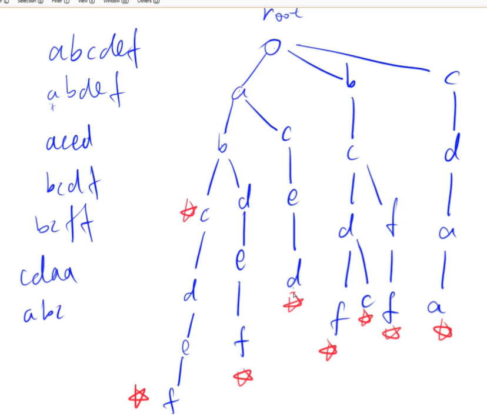
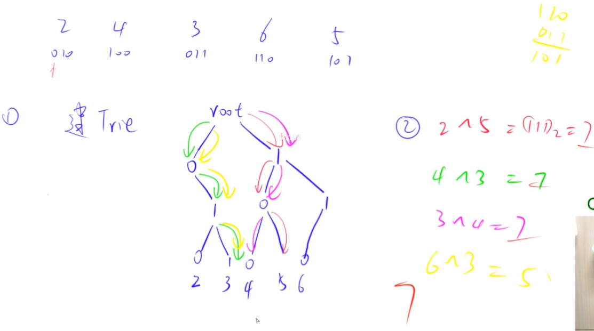

<!-- @import "[TOC]" {cmd="toc" depthFrom=1 depthTo=4 orderedList=false} -->

<!-- code_chunk_output -->

- [字典树Tire树](#字典树tire树)
  - [模板：Trie字符串统计](#模板trie字符串统计)
  - [模板：最大异或对](#模板最大异或对)
- [并查集](#并查集)

<!-- /code_chunk_output -->

### 字典树Tire树
Tire树：高效存储和查找字符串集合。



注意根节点为空，结尾要打上标记。

也已根据这个快速查找。

#### 模板：Trie字符串统计
- 维护一个字符串集合，支持两种操作：
  - I x 向集合中插入一个字符串 x；
  - Q x 询问一个字符串在集合中出现了多少次。
- 共有 N 个操作，输入的字符串总长度不超过 105，字符串仅包含小写英文字母。

输入格式
- 第一行包含整数 N，表示操作数。
- 接下来 N 行，每行包含一个操作指令，指令为 I x 或 Q x 中的一种。

输出格式
- 对于每个询问指令 Q x，都要输出一个整数作为结果，表示 x 在集合中出现的次数。
- 每个结果占一行。

```cpp
#include <iostream>
using namespace std;

const int N = 1e5 + 10;

int son[N][26];  // son[i][j] 总第i（从0计数）个字符是 j ，保存在位置 son[i][j] 中
int cnt[N];  // 总第i个字符作为结尾的单词出现次数
int idx;  // 相当于指针，保存未出现过的字符串中字符在内存中的位置（即Tire树中的位置）

void insert(char str[])
{
    int p = 0;
    for (int i = 0; str[i]; i ++ )  // cpp 中字符串最后一个值是 `\0`
    {
        int u = str[i] - 'a';  // 把小写字母映射为 0~25
        if (!son[p][u]) son[p][u] = ++ idx;  // 这个字符串遍历到这里，以前从未出现过
        p = son[p][u];
    }
    cnt[p] ++;
}

int query(char str[])
{
    int p = 0;
    for (int i = 0; str[i]; i ++)
    {
        int u = str[i] - 'a';
        if (!son[p][u]) return 0;
        p = son[p][u];
    }
    return cnt[p];
}

int main()
{
    char str[N];
    int n;
    scanf("%d", &n);
    
    while (n --) {
        char op[2];
        scanf("%s%s", op, str);
        if (op[0] == 'I') insert(str);
        else printf("%d\n", query(str));
    }
    
    return 0;
}
```

**经验：**
- cpp 中字符串最后一个值是 `\0`，因此 for 可以用 `for (int i; str[i]; i++)`
- `scanf("%s%s", op, str);` 其中 `op` 和 `str` 是字符串首值指针

#### 模板：最大异或对
- 在给定的 $N$ 个整数 $A_1，A_2 …… A_N$ 中选出两个进行 xor（异或）运算，得到的结果最大是多少？

输入格式
- 第一行输入一个整数 N。
- 第二行输入 N 个整数 A1～AN。

输出格式
- 输出一个整数表示答案。

**思路：**
- 还是先想暴力，然后考虑怎么优化
- 对于数字 101 ，我们倾向于找其反码 010
- 从高位开始找，为什么从高位？因为我们要找`最大`异或值，就是说对于`0100`，`1000`肯定比`0011`要好。



```cpp
#include <iostream>
#include <algorithm>  // max
using namespace std;

const int N = 1e5 + 10;
const int M = 3e6 + 1e5 + 10; // 有 31 位长度，且有1e5个数，树的大小 3e6 + 1e5

int n;
int son[M][2], idx;
int a[N];

void insert(int x)
{
    int p = 0;
    for (int i = 30; ~i; i --)  // ~i 即 i>=0 ，i=-1是11...111，取反就是 00...000
    {
        int &s = son[p][x >> i & 1];  // x >> i & 1 把第i位取出来  &s 引用调用
        if (!s) s = ++ idx;  // 创建新节点
        p = s;
    }
}

int query(int x)
{
    int res = 0, p = 0;
    for (int i = 30; ~i; i --)
    {
        int s = x >> i & 1;
        if (son[p][!s])
        {
            res += 1 << i;
            p = son[p][!s];
        }
        else p = son[p][s];
    }
    
    return res;
}

int main()
{
    cin >> n;
    for (int i = 0; i < n; i ++)
    {
        scanf("%d", &a[i]);
        insert(a[i]);
    }
    
    int res = 0;
    for (int i = 0; i < n; i ++) res = max(res, query(a[i]));
    
    cout << res;
    
    return 0;
}
```

### 并查集