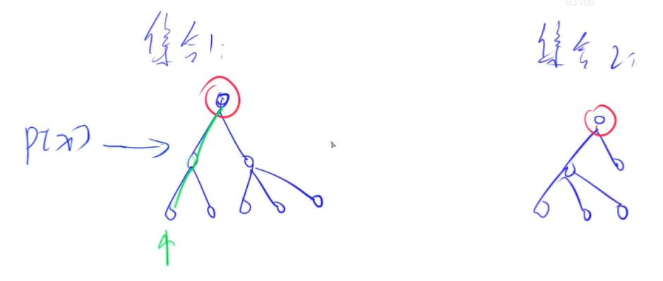
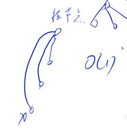

<!-- @import "[TOC]" {cmd="toc" depthFrom=1 depthTo=4 orderedList=false} -->

<!-- code_chunk_output -->

- [字典树Tire树](#字典树tire树)
  - [模板：Trie字符串统计](#模板trie字符串统计)
  - [模板：最大异或对](#模板最大异或对)
- [并查集](#并查集)
  - [模板：合并集合](#模板合并集合)
  - [动态维护集合大小信息：连通块中点的数量](#动态维护集合大小信息连通块中点的数量)
  - [另一道例题：食物链](#另一道例题食物链)

<!-- /code_chunk_output -->

### 字典树Tire树
Tire树：高效存储和查找字符串集合。


注意根节点为空，结尾要打上标记。

也已根据这个快速查找。

#### 模板：Trie字符串统计
- 维护一个字符串集合，支持两种操作：
  - I x 向集合中插入一个字符串 x；
  - Q x 询问一个字符串在集合中出现了多少次。
- 共有 N 个操作，输入的字符串总长度不超过 105，字符串仅包含小写英文字母。

输入格式
- 第一行包含整数 N，表示操作数。
- 接下来 N 行，每行包含一个操作指令，指令为 I x 或 Q x 中的一种。

输出格式
- 对于每个询问指令 Q x，都要输出一个整数作为结果，表示 x 在集合中出现的次数。
- 每个结果占一行。

```cpp
#include <iostream>
using namespace std;

const int N = 1e5 + 10;

int son[N][26];  // son[i][j] 总第i（从0计数）个字符是 j ，保存在位置 son[i][j] 中
int cnt[N];  // 总第i个字符作为结尾的单词出现次数
int idx;  // 相当于指针，保存未出现过的字符串中字符在内存中的位置（即Tire树中的位置）

void insert(char str[])
{
    int p = 0;
    for (int i = 0; str[i]; i ++ )  // cpp 中字符串最后一个值是 `\0`
    {
        int u = str[i] - 'a';  // 把小写字母映射为 0~25
        if (!son[p][u]) son[p][u] = ++ idx;  // 这个字符串遍历到这里，以前从未出现过
        p = son[p][u];
    }
    cnt[p] ++;
}

int query(char str[])
{
    int p = 0;
    for (int i = 0; str[i]; i ++)
    {
        int u = str[i] - 'a';
        if (!son[p][u]) return 0;
        p = son[p][u];
    }
    return cnt[p];
}

int main()
{
    char str[N];
    int n;
    scanf("%d", &n);
    
    while (n --) {
        char op[2];
        scanf("%s%s", op, str);
        if (op[0] == 'I') insert(str);
        else printf("%d\n", query(str));
    }
    
    return 0;
}
```

**经验：**
- cpp 中字符串最后一个值是 `\0`，因此 for 可以用 `for (int i; str[i]; i++)`
- `scanf("%s%s", op, str);` 其中 `op` 和 `str` 是字符串首值指针

#### 模板：最大异或对
- 在给定的 $N$ 个整数 $A_1，A_2 …… A_N$ 中选出两个进行 xor（异或）运算，得到的结果最大是多少？

输入格式
- 第一行输入一个整数 N。
- 第二行输入 N 个整数 A1～AN。

输出格式
- 输出一个整数表示答案。

**思路：**
- 还是先想暴力，然后考虑怎么优化
- 对于数字 101 ，我们倾向于找其反码 010
- 从高位开始找，为什么从高位？因为我们要找`最大`异或值，就是说对于`0100`，`1000`肯定比`0011`要好。


```cpp
#include <iostream>
#include <algorithm>  // max
using namespace std;

const int N = 1e5 + 10;
const int M = 3e6 + 1e5 + 10; // 有 31 位长度，且有1e5个数，树的大小 3e6 + 1e5

int n;
int son[M][2], idx;
int a[N];

void insert(int x)
{
    int p = 0;
    for (int i = 30; ~i; i --)  // ~i 即 i>=0 ，i=-1是11...111，取反就是 00...000
    {
        int &s = son[p][x >> i & 1];  // x >> i & 1 把第i位取出来  &s 引用调用
        if (!s) s = ++ idx;  // 创建新节点
        p = s;
    }
}

int query(int x)
{
    int res = 0, p = 0;
    for (int i = 30; ~i; i --)
    {
        int s = x >> i & 1;
        if (son[p][!s])
        {
            res += 1 << i;
            p = son[p][!s];
        }
        else p = son[p][s];
    }
    
    return res;
}

int main()
{
    cin >> n;
    for (int i = 0; i < n; i ++)
    {
        scanf("%d", &a[i]);
        insert(a[i]);
    }
    
    int res = 0;
    for (int i = 0; i < n; i ++) res = max(res, query(a[i]));
    
    cout << res;
    
    return 0;
}
```

### 并查集
- 将两个集合合并
- 询问两个元素是否在一个集合当中

并查集可以在近乎 O(1) 的时间内快速完成上述两个操作。



基本原理：
- 用树的形式维护某一个集合
- 根节点的编号就是当前集合的编号
- 对于每一个点，都存储其父节点是谁
- 当想求某一个点属于谁时，通过其父节点找到根节点

对于点 `x` ，其父节点为 `p[x]` ：
- 如何判断是否为树根？`if (p[x] == x)`
- 如何求 `x` 的集合编号？`while (p[x] != x) x = p[x];`
- 如何合并两个集合？`px` 是 `x` 的集合编号， `py` 是 `y` 的集合编号，`p[x] = py`

对于 **如何求 `x` 的集合编号？** 还可以进行很 **牛逼的优化** 。
- 路径压缩：我们在找根节点的过程中，经过哪些点，直接把这些点的父节点变为根节点
- 按秩合并：y总没有讲，因为没啥用。合并时总是将高度小的树根指向高度大的树根，秩就是树的高度，按秩合并防止树越来越高，导致查找效率降低。



路径压缩如图。

#### 模板：合并集合
- 一共有 n 个数，编号是 1∼n，最开始每个数各自在一个集合中。
- 现在要进行 m 个操作，操作共有两种：
  - M a b，将编号为 a 和 b 的两个数所在的集合合并，如果两个数已经在同一个集合中，则忽略这个操作；
  - Q a b，询问编号为 a 和 b 的两个数是否在同一个集合中；

输入格式
- 第一行输入整数 n 和 m。
- 接下来 m 行，每行包含一个操作指令，指令为 M a b 或 Q a b 中的一种。

输出格式
- 对于每个询问指令 Q a b，都要输出一个结果，如果 a 和 b 在同一集合内，则输出 Yes，否则输出 No。
- 每个结果占一行。

```cpp
#include <iostream>

using namespace std;

const int N = 1e5 + 10;
int n, m;
int p[N];

int find(int x)
{
    if (x != p[x]) p[x] = find(p[x]);  // 路径压缩
    return p[x];
}

int main()
{
    scanf("%d%d", &n, &m);
    for (int i = 1; i <= n; i ++) p[i] = i;
    
    while (m --)
    {
        char op[2];
        int a, b;
        scanf("%s%d%d", op, &a, &b);
        
        if (op[0] == 'M') p[find(a)] = find(b);
        else
        {
            if (find(a) == find(b)) puts("Yes");
            else puts("No");
        }
    }
    
    return 0;
}
```

**经验：为什么写成`char op[2]`读字符？**
- 因为`char op; scanf("%c", op);`会读入空格、回车
- 如果`char op[2]; scanf("%s", op);`则不会读入空格、回车

#### 动态维护集合大小信息：连通块中点的数量

- 给定一个包含 n 个点（编号为 1∼n）的无向图，初始时图中没有边。
- 现在要进行 m 个操作，操作共有三种：
  - C a b，在点 a 和点 b 之间连一条边，a 和 b 可能相等；
  - Q1 a b，询问点 a 和点 b 是否在同一个连通块中，a 和 b 可能相等；
  - Q2 a，询问点 a 所在连通块中点的数量；

输入格式
- 第一行输入整数 n 和 m。
- 接下来 m 行，每行包含一个操作指令，指令为 C a b，Q1 a b 或 Q2 a 中的一种。

输出格式
- 对于每个询问指令 Q1 a b，如果 a 和 b 在同一个连通块中，则输出 Yes，否则输出 No。
- 对于每个询问指令 Q2 a，输出一个整数表示点 a 所在连通块中点的数量
- 每个结果占一行。

**思路：**
- 与并查集一样
- 动态维护 `size[]` ，并且仅对根节点的 `size[]` 进行维护

```cpp
#include <iostream>
using namespace std;

const int N = 1e5 + 10;

int n, m;
int p[N], s[N];

int find(int x)
{
    if (x != p[x]) p[x] = find(p[x]);
    return p[x];
}

int main()
{
    scanf("%d%d", &n, &m);
    for (int i = 1; i <= n; i ++)
    {
        p[i] = i;
        s[i] = 1;
    }
    
    char op[3];
    int a, b;
    
    while (m --)
    {
        scanf("%s", op);
        if (op[0] == 'C')
        {
            scanf("%d%d", &a, &b);
            if (find(a) != find(b))
            {
                s[find(b)] += s[find(a)];  // 注意，在合并前先把 s 加起来
                p[find(a)] = find(b);
            }
        }
        else if (op[1] == '1')
        {
            scanf("%d%d", &a, &b);
            if (find(a) != find(b)) puts("No");
            else puts("Yes");
        }
        else if (op[1] == '2')
        {
            scanf("%d", &a);
            printf("%d\n", s[find(a)]);
        }
    }

    return 0;
}
```

#### 另一道例题：食物链

- 动物王国中有三类动物 A,B,C，这三类动物的食物链构成了有趣的环形。
- A 吃 B，B 吃 C，C 吃 A。
- 现有 N 个动物，以 1∼N 编号。
- 每个动物都是 A,B,C 中的一种，但是我们并不知道它到底是哪一种。
- 有人用两种说法对这 N 个动物所构成的食物链关系进行描述：
- 第一种说法是 1 X Y，表示 X 和 Y 是同类。
- 第二种说法是 2 X Y，表示 X 吃 Y。
- 此人对 N 个动物，用上述两种说法，一句接一句地说出 K 句话，这 K 句话有的是真的，有的是假的。
- 当一句话满足下列三条之一时，这句话就是假话，否则就是真话。
  - 当前的话与前面的某些真的话冲突，就是假话；
  - 当前的话中 X 或 Y 比 N 大，就是假话；
  - 当前的话表示 X 吃 X，就是假话。
- 你的任务是根据给定的 N 和 K 句话，输出假话的总数。

输入格式
- 第一行是两个整数 N 和 K，以一个空格分隔。
- 以下 K 行每行是三个正整数 D，X，Y，两数之间用一个空格隔开，其中 D 表示说法的种类。
- 若 D=1，则表示 X 和 Y 是同类。
- 若 D=2，则表示 X 吃 Y。

输出格式
- 只有一个整数，表示假话的数目。


**思路：**
- 可以发现规律，用与根节点的距离，表示吃的关系
  - 与根节点的距离模3余1，则吃根节点
  - 与根节点的距离模3余2，则被吃根节点
  - 与根节点的距离模3余0，则与根节点同类

**分析**

!食物链2
!食物链3

